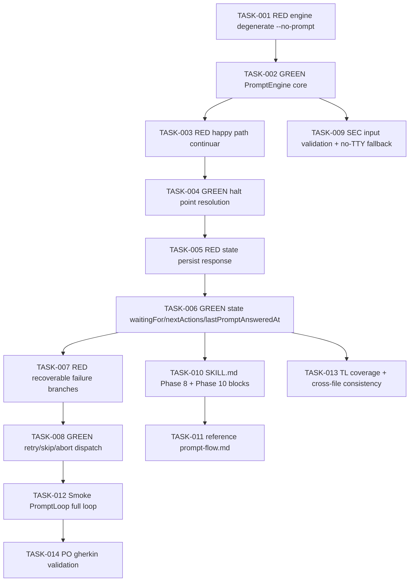

# Task Breakdown -- story-0039-0007

## Header

| Field | Value |
|-------|-------|
| Story ID | story-0039-0007 |
| Epic ID | 0039 |
| Date | 2026-04-15 |
| Author | x-story-plan (multi-agent) |
| Template Version | 1.0.0 |
| Schema | v1 (planningSchemaVersion absent -> FALLBACK_MISSING_FIELD) |

## Summary

| Metric | Value |
|--------|-------|
| Total Tasks | 14 |
| Parallelizable Tasks | 5 |
| Estimated Effort | M |
| Mode | multi-agent |
| Agents Participating | Architect, QA, Security, Tech Lead, PO |

## Dependency Graph

## Tasks Table

| Task ID | Source Agent | Type | TDD Phase | TPP Level | Layer | Components | Parallel | Depends On | Effort | DoD |
|---------|-------------|------|-----------|-----------|-------|-----------|----------|-----------|--------|-----|
| TASK-001 | QA | test | RED | nil | application | PromptEngineTest (--no-prompt degenerate) | yes | — | S | Test fails with NoClassDefFoundError; asserts `--no-prompt` returns default (continue/exit) without invoking AskUserQuestion; asserts waitingFor persisted and exit 0 with textual instruction |
| TASK-002 | merged(ARCH,QA) | implementation | GREEN | constant | application | PromptEngine (java/src/main/java/dev/iadev/release/prompt/PromptEngine.java) | no | TASK-001 | M | Class exists with `resolve(HaltPoint, StateFile, boolean noPrompt): PromptResult`; constructor injects StatePort + ClockPort + AskUserQuestionPort; method <=25 lines; class <=250 lines; zero framework imports; TASK-001 tests green |
| TASK-003 | QA | test | RED | scalar | application | PromptEngineTest (happy path APPROVAL_GATE continuar) | yes | TASK-002 | S | Test red: operator chooses "PR mergeado" -> returns CONTINUE_RESUME_AND_TAG; lastPromptAnsweredAt updated in state mock |
| TASK-004 | merged(ARCH,QA) | implementation | GREEN | scalar | application | PromptEngine.resolveHaltPoint + HaltPoint enum | no | TASK-003 | S | Enum `HaltPoint{APPROVAL_GATE, BACKMERGE_MERGE, RECOVERABLE_FAILURE}` with `options()` returning fixed 3-tuple per story §3.1; TASK-003 green |
| TASK-005 | QA | test | RED | collection | application | PromptEngineTest (persist response + timestamp) | yes | TASK-004 | S | Test red: after each response `waitingFor` and `nextActions` persisted, `lastPromptAnsweredAt` populated with ClockPort.now(); asserts NO silent v1 state upgrade |
| TASK-006 | merged(ARCH,QA) | implementation | GREEN | collection | application | PromptEngine.persistResponse + StateFilePort.update | no | TASK-005 | M | Writes waitingFor={PR_MERGE,BACKMERGE_MERGE,USER_CONFIRMATION}, nextActions (labels per §5.2), lastPromptAnsweredAt (ISO-8601 UTC); uses port (no direct fs); TASK-005 green |
| TASK-007 | QA | test | RED | conditional | application | PromptEngineTest (recoverable failure retry/skip/abort) | yes | TASK-006 | S | Retry re-invokes action; Skip advances; Abort returns exit 2 with PROMPT_USER_ABORT; state preserved on abort |
| TASK-008 | merged(ARCH,QA) | implementation | GREEN | conditional | application | PromptEngine.handleRecoverableFailure | no | TASK-007 | S | Dispatch branch for USER_CONFIRMATION; maps "Retry"->RETRY, "Skip"->SKIP, "Abort"->ABORT(exit=2,code=PROMPT_USER_ABORT); TASK-007 green; method <=25 lines |
| TASK-009 | SEC | security | VERIFY | N/A | application | PromptEngine input hardening | yes | TASK-002 | XS | Unexpected AskUserQuestion responses rejected -> exit 1 PROMPT_INVALID_RESPONSE (never silent default); non-TTY environments without `--no-prompt` fall through to textual instruction (no hang); no user-controlled input logged (OWASP A03, A09); no AskUserQuestion invocation when `--no-prompt` set (RULE-004) |
| TASK-010 | ARCH | architecture | N/A | N/A | config | SKILL.md Phase 8 + Phase 10 interactive blocks (java/src/main/resources/targets/claude/skills/core/x-release/SKILL.md) | no | TASK-006 | L | Phase 8 APPROVAL_GATE documents AskUserQuestion with the 3 options from §3.1; Phase 10 BACK-MERGE-DEVELOP documents identical options against backmerge PR; `--no-prompt` listed in Parameters; `--continue-after-merge` precedence noted; RULE-001 respected (edit generator, not .claude/) |
| TASK-011 | ARCH | architecture | N/A | N/A | config | references/prompt-flow.md | yes | TASK-010 | S | Doc covers 3 halt points + options; waitingFor->nextActions mapping table matches §5.2 verbatim; sequence diagram mirrors §6.1 |
| TASK-012 | QA | test | VERIFY | iteration | cross-cutting | PromptLoopSmokeTest (java/src/test/java/dev/iadev/smoke/PromptLoopSmokeTest.java) | no | TASK-008 | M | Simulates: prompt -> "Sair" -> exit 0 -> reinvoke -> prompt -> "Continuar" -> finalize; mocks AskUserQuestionPort; asserts state file consistent at each step; asserts no orphan state after final step |
| TASK-013 | TL | quality-gate | VERIFY | N/A | cross-cutting | coverage + cross-file consistency | yes | TASK-006 | XS | PromptEngine line >=95%, branch >=90% (Rule 05); all methods <=25 lines; all port fields final (constructor injection per Rule 03); error codes follow existing `PROMPT_*` naming; RULE-001 verified (no direct .claude/ edits) |
| TASK-014 | PO | validation | VERIFY | N/A | cross-cutting | gherkin coverage | yes | TASK-012 | XS | Each of 5 Gherkin scenarios in Section 7 (degenerate, happy, boundary, retry, abort) has at least one executable test asserting expected outcome + state side-effect |

## Escalation Notes

| Task ID | Reason | Recommended Action |
|---------|--------|--------------------|
| TASK-010 | SKILL.md is a generator resource (RULE-001); changes ripple to `.claude/` via regen | Run `mvn process-resources` + GoldenFileRegenerator after edit per RULE-008 batching (goldens regenerated in story-0039-0015 only) |
| TASK-009 | Non-TTY detection is environment-specific; must not hang CI | Use System.console()==null probe; in non-TTY default to textual-instruction path identical to `--no-prompt` |
| TASK-006 | State schema v2 is a dependency from story-0039-0002 | If story-0039-0002 not yet merged at implementation time, block; DO NOT reintroduce v1 state shape (RULE-003) |
| TASK-012 | Smoke test must fully mock AskUserQuestionPort | Use test double; never exercise real prompt UI in CI |
