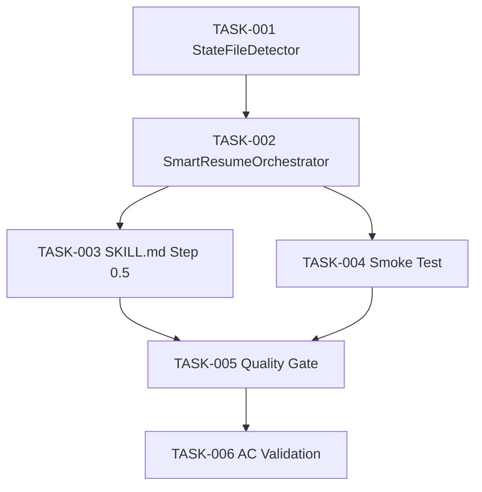

# Task Breakdown -- story-0039-0008

## Header

| Field | Value |
|-------|-------|
| Story ID | story-0039-0008 |
| Epic ID | 0039 |
| Date | 2026-04-15 |
| Author | x-story-plan (multi-agent) |
| Template Version | 1.0.0 |
| Schema Version | v1 (legacy) |

## Summary

| Metric | Value |
|--------|-------|
| Total Tasks | 6 |
| Parallelizable Tasks | 2 (TASK-005, TASK-006 after impl done) |
| Estimated Effort | M (combined S+M+M+S+S+S) |
| Mode | multi-agent |
| Agents Participating | Architect, QA, Security, Tech Lead, PO |

## Dependency Graph

## Tasks Table

| Task ID | Source Agent | Type | TDD Phase | TPP Level | Layer | Components | Parallel | Depends On | Estimated Effort | DoD |
|---------|-------------|------|-----------|-----------|-------|-----------|----------|-----------|-----------------|-----|
| TASK-001 | merged(ARCH,QA,SEC) | implementation | RED→GREEN | nil→scalar | domain | StateFileDetector, StateFileDetectorTest | no | — | S | Lists `plans/release-state-*.json`; calculates age from `lastPhaseCompletedAt`; handles missing file → empty Optional; handles COMPLETED state → filtered out; path normalization prevents traversal (SEC-CWE-22); no mutable global state; method length ≤ 25 lines; ≥ 95% line coverage |
| TASK-002 | merged(ARCH,QA,SEC,TL) | implementation | RED→GREEN | scalar→conditional | application | SmartResumeOrchestrator, SmartResumeOrchestratorTest | no | TASK-001 | M | Decides prompt vs auto-detect; filters "Iniciar nova" when no new commits since base tag; `--no-prompt` routes to legacy STATE_CONFLICT; RESUME_USER_ABORT emitted on user abort choice; all 3 options functional; input validation on state file fields (SEC); error codes documented; depends only on inbound port + domain model (no adapter import); ≥ 95% line, ≥ 90% branch coverage |
| TASK-003 | ARCH | documentation | N/A | N/A | config | x-release/SKILL.md | no | TASK-002 | M | Step 0.5 documents detection and prompt flow; STATE_CONFLICT removed from happy path; STATE_CONFLICT preserved under `--no-prompt`; RESUME_USER_ABORT added to error code catalog; 3-option prompt block matches story §5.2 display format; `grep -n "Step 0.5"` returns 1 match |
| TASK-004 | QA | test (smoke) | VERIFY | iteration | test | SmartResumeSmokeTest | no | TASK-002 | S | Creates state fixture with phase=APPROVAL_PENDING; simulates user choosing "Retomar"; verifies continuation from RESUME_AND_TAG phase; smoke test uses real filesystem fixture; test naming `methodUnderTest_scenario_expectedBehavior`; no weak assertions (asserts specific phase transition + final state) |
| TASK-005 | TL | quality-gate | VERIFY | N/A | cross-cutting | — | yes | TASK-003, TASK-004 | S | Method length ≤ 25 lines in all new classes; class length ≤ 250 lines; no circular imports; Domain layer has zero adapter/framework imports (architecture rule); coverage report shows ≥ 95% line + ≥ 90% branch for `dev.iadev.release.resume` package; cross-file consistency with sibling orchestrators in same module verified |
| TASK-006 | PO | validation | VERIFY | N/A | cross-cutting | — | yes | TASK-005 | S | All 6 Gherkin scenarios in story §7 have at least one mapped test; "Iniciar nova" filtered when no new commits verified via unit test; --no-prompt behavior preserved (STATE_CONFLICT exit=1); RESUME_USER_ABORT exit=2; display format matches §5.2 exactly |

## Escalation Notes

| Task ID | Reason | Recommended Action |
|---------|--------|--------------------|
| — | No escalations | — |

## Consolidation Notes

- **AUGMENT (Rule 2):** SEC criteria injected into TASK-001 (path traversal) and TASK-002 (state field input validation). No standalone SEC-NNN task retained because security coverage is absorbed into unit tests of TASK-001/TASK-002; the remaining SEC verification responsibility is covered by TASK-005 (TL quality gate).
- **PAIR (Rule 3):** TASK-001 and TASK-002 each encapsulate a RED→GREEN pair within the task (test file + impl file are delivered as one atomic unit in v1 flow).
- **MERGE (Rule 1):** ARCH's StateFileDetector proposal merged with QA's domain unit test proposal and SEC's path normalization concern → TASK-001.
