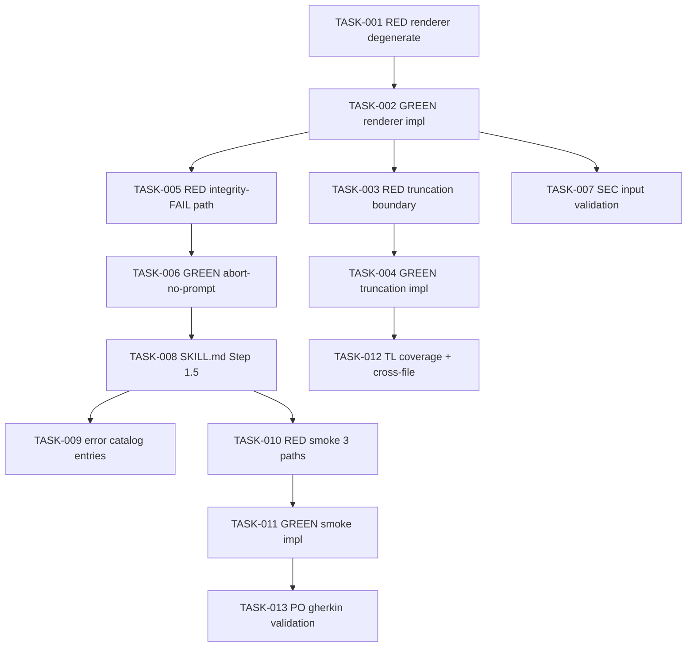

# Task Breakdown -- story-0039-0009

## Header

| Field | Value |
|-------|-------|
| Story ID | story-0039-0009 |
| Epic ID | 0039 |
| Date | 2026-04-15 |
| Author | x-story-plan (multi-agent) |
| Template Version | 1.0.0 |
| Schema | v1 (planningSchemaVersion absent -> FALLBACK_MISSING_FIELD) |

## Summary

| Metric | Value |
|--------|-------|
| Total Tasks | 13 |
| Parallelizable Tasks | 5 |
| Estimated Effort | M |
| Mode | multi-agent |
| Agents Participating | Architect, QA, Security, Tech Lead, PO |

## Dependency Graph

## Tasks Table

| Task ID | Source Agent | Type | TDD Phase | TPP Level | Layer | Components | Parallel | Depends On | Effort | DoD |
|---------|-------------|------|-----------|-----------|-------|-----------|----------|-----------|--------|-----|
| TASK-001 | QA | test | RED | nil | application | PreflightDashboardRendererTest | yes | — | S | Test class exists with degenerate input (null dashboard data -> IAE); fails with NoClassDefFoundError |
| TASK-002 | merged(ARCH,QA) | implementation | GREEN | constant | application | PreflightDashboardRenderer | no | TASK-001 | M | Renders 5 sections (Version, Commits, CHANGELOG preview, Integrity, Plan) from DashboardData record; all TASK-001 tests green; method <=25 lines; line width <=80 col per DoR Local |
| TASK-003 | QA | test | RED | scalar | application | PreflightDashboardRendererTest | yes | TASK-002 | XS | Truncation test: 50-line CHANGELOG renders first N lines + `(X linhas omitidas)` indicator when N<total |
| TASK-004 | merged(ARCH,QA) | implementation | GREEN | collection | application | PreflightDashboardRenderer | no | TASK-003 | S | Truncation honors `--preflight-changelog-lines` (default 10); indicator shown only when truncated; TASK-003 tests green |
| TASK-005 | QA | test | RED | conditional | application | PreflightDashboardRendererTest | yes | TASK-002 | S | Integrity FAIL path test: dashboard renders with FAIL markers AND abort signal returned (no prompt call) |
| TASK-006 | merged(ARCH,QA) | implementation | GREEN | conditional | application | PreflightDashboard (orchestrator) | no | TASK-005 | S | When IntegrityReport.status=FAIL -> render + return PREFLIGHT_INTEGRITY_FAIL without invoking AskUserQuestion; TASK-005 tests green |
| TASK-007 | SEC | security | VERIFY | N/A | application | PreflightDashboardRenderer | yes | TASK-002 | XS | `--preflight-changelog-lines` bounded [1..500] to prevent memory exhaustion; version string escaped in terminal output (no ANSI injection); OWASP A03 Input Validation, A05 Hardening |
| TASK-008 | ARCH | architecture | N/A | N/A | config | SKILL.md Step 1.5 PRE-FLIGHT | no | TASK-006 | M | Step 1.5 block between DETERMINE and VALIDATE-DEEP; documents 3 options (Prosseguir / Editar versão / Abortar); lists `--no-preflight` and `--preflight-changelog-lines <N>` flags; AskUserQuestion payload shown |
| TASK-009 | ARCH | architecture | N/A | N/A | config | error-catalog | yes | TASK-008 | XS | PREFLIGHT_INTEGRITY_FAIL entry (exit 1, no prompt); PREFLIGHT_EDIT_VERSION entry (exit 1, instruct rerun `--version X.Y.Z`) |
| TASK-010 | QA | test | RED | iteration | test | PreflightDashboardSmokeTest | yes | TASK-008 | S | Smoke test class exists with 4 scenarios: prosseguir, editar (exit 1), abortar (exit 0), --no-preflight bypass; all RED |
| TASK-011 | merged(QA,ARCH) | implementation | GREEN | iteration | test | PreflightDashboardSmokeTest + wiring | no | TASK-010 | M | All 4 smoke scenarios green; --no-preflight short-circuits to VALIDATE-DEEP with zero dashboard I/O; exit codes match story §5.3 matrix |
| TASK-012 | TL | quality-gate | VERIFY | N/A | cross-cutting | coverage + cross-file consistency | yes | TASK-004 | XS | Line coverage >=95%, branch >=90% on `release.preflight` package; renderer follows same constructor-injection pattern as S01 VersionDetector; no `System.out` (propagates via return types) |
| TASK-013 | PO | validation | VERIFY | N/A | cross-cutting | acceptance criteria | no | TASK-011 | XS | All 6 Gherkin scenarios from §7 map to a passing test; DoD Local checklist (§4) all green; dashboard fits 80 col; truncation indicator matches `(N linhas omitidas)` format |

## Escalation Notes

| Task ID | Reason | Recommended Action |
|---------|--------|--------------------|
| TASK-008 | SKILL.md edit requires resource regeneration (RULE-001) — the canonical source is under `java/src/main/resources/targets/claude/skills/core/x-release/SKILL.md`; generated `.claude/` mirror is output | Edit source only; run `mvn process-resources` + `GoldenFileRegenerator` before commit |
| TASK-007 | Terminal rendering path — validate against ANSI escape injection even though CHANGELOG is internal (defense-in-depth) | Strip `\x1b` (ESC) + control chars from CHANGELOG body before rendering |
