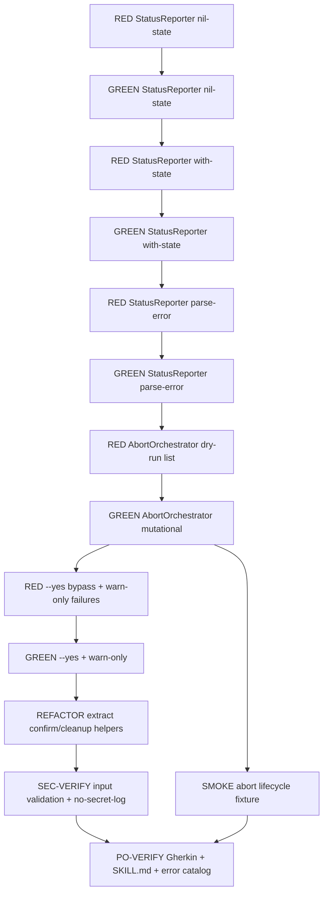

# Task Breakdown — story-0039-0010

## Header

| Field | Value |
|-------|-------|
| Story ID | story-0039-0010 |
| Epic ID | 0039 |
| Date | 2026-04-15 |
| Author | x-story-plan (multi-agent, v1 schema) |
| Template Version | 1.0.0 |

## Summary

| Metric | Value |
|--------|-------|
| Total Tasks | 14 |
| Parallelizable Tasks | 6 |
| Estimated Effort | M (aggregate) |
| Mode | multi-agent |
| Agents Participating | Architect, QA, Security, Tech Lead, PO |

## Dependency Graph

## Tasks Table

| Task ID | Source Agent | Type | TDD Phase | TPP Level | Layer | Components | Parallel | Depends On | Estimated Effort | DoD |
|---------|-------------|------|-----------|-----------|-------|-----------|----------|-----------|-----------------|-----|
| TASK-001 | QA | test | RED | nil | application | StatusReporterTest | no | — | XS | Failing test: no state file → "Nenhuma release em andamento", exit 0 |
| TASK-002 | merged(ARCH,QA) | implementation | GREEN | nil | application | StatusReporter | no | TASK-001 | S | StatusReporter.report() handles absent state file; exit code 0; no mutations |
| TASK-003 | QA | test | RED | constant | application | StatusReporterTest | no | TASK-002 | XS | Failing test: state v2 with PR #297 → output includes version, phase, PR URL, nextActions |
| TASK-004 | merged(ARCH,QA) | implementation | GREEN | constant | application | StatusReporter | no | TASK-003 | S | Reads state file, renders version/phase/PR/lastAction/nextActions per §5.3 |
| TASK-005 | QA | test | RED | scalar | application | StatusReporterTest | no | TASK-004 | XS | Failing test: corrupted JSON → exit 1 with STATUS_PARSE_FAILED |
| TASK-006 | merged(ARCH,QA,SEC) | implementation | GREEN | scalar | application | StatusReporter | no | TASK-005 | S | Handles malformed JSON; emits STATUS_PARSE_FAILED; no stack trace to stdout (SEC-aug) |
| TASK-007 | QA | test | RED | collection | application | AbortOrchestratorIT | no | TASK-006 | S | Failing IT: abort lists PR+branches+state before touching anything; cancel 1st confirm → exit 2 ABORT_USER_CANCELLED; no resource touched |
| TASK-008 | merged(ARCH,QA,SEC,PO) | implementation | GREEN | collection | application | AbortOrchestrator | no | TASK-007 | M | Dry-run enumerate; double AskUserQuestion; gh pr close; git branch -D + push --delete; rm state; cancel on either prompt → exit 2; state file path canonicalized (SEC-aug); no credentials/tokens in logs (SEC-aug) |
| TASK-009 | QA | test | RED | conditional | application | AbortOrchestratorIT | no | TASK-008 | S | Failing IT: --yes/--force bypass confirmations with "FORCE MODE" warn; gh fail → ABORT_PR_CLOSE_FAILED warn-only, exit 0; branch fail → ABORT_BRANCH_DELETE_FAILED warn-only |
| TASK-010 | merged(ARCH,QA) | implementation | GREEN | conditional | application | AbortOrchestrator | no | TASK-009 | S | --yes alias --force skips prompts, logs FORCE MODE; try/catch per cleanup step (warn-only); proceeds even on individual failures |
| TASK-011 | TL | refactor | REFACTOR | N/A | application | StatusReporter, AbortOrchestrator | no | TASK-010 | S | Extract confirm helper and cleanup helper; methods ≤25 lines; classes ≤250 lines; no code duplication |
| TASK-012 | SEC | security | VERIFY | N/A | application | StatusReporter, AbortOrchestrator | no | TASK-011 | XS | Verify: CLI flag parsing rejects unknown combos; state path canonicalized (rejects traversal); no secrets/tokens written to logs; error messages do not expose internal paths (Rule 06 + J6, J7) |
| TASK-013 | QA | test | N/A | iteration | test | AbortLifecycleSmokeTest | yes (with TASK-009..011) | TASK-008 | M | Smoke fixture: state + PR mock + local/remote branches; /x-release --abort --yes cleans everything; assertions on gh CLI invocation log and filesystem |
| TASK-014 | merged(TL,PO) | quality-gate | VERIFY | N/A | cross-cutting | SKILL.md, CHANGELOG | no | TASK-012, TASK-013 | M | SKILL.md x-release documents --status/--abort/--yes/--force in Triggers/Parameters; error catalog lists STATUS_PARSE_FAILED, ABORT_NO_RELEASE, ABORT_USER_CANCELLED, ABORT_PR_CLOSE_FAILED, ABORT_BRANCH_DELETE_FAILED; all 8 Gherkin scenarios mapped to tests; coverage ≥95% line / ≥90% branch |

## Escalation Notes

| Task ID | Reason | Recommended Action |
|---------|--------|--------------------|
| TASK-008 | Interactive AskUserQuestion inside headless test | Use pluggable `ConfirmationPort` in application layer; test fakes return yes/no deterministically |
| TASK-013 | Smoke uses real gh CLI | Stub gh via PATH override or use `GH_PATH` env; do not call live GitHub |
| TASK-014 | Touches source-of-truth SKILL.md under `java/src/main/resources/targets/claude/skills/core/x-release/` | After edit, run `mvn process-resources` before any golden regen (Rule 08 / EPIC-0036 note) |
