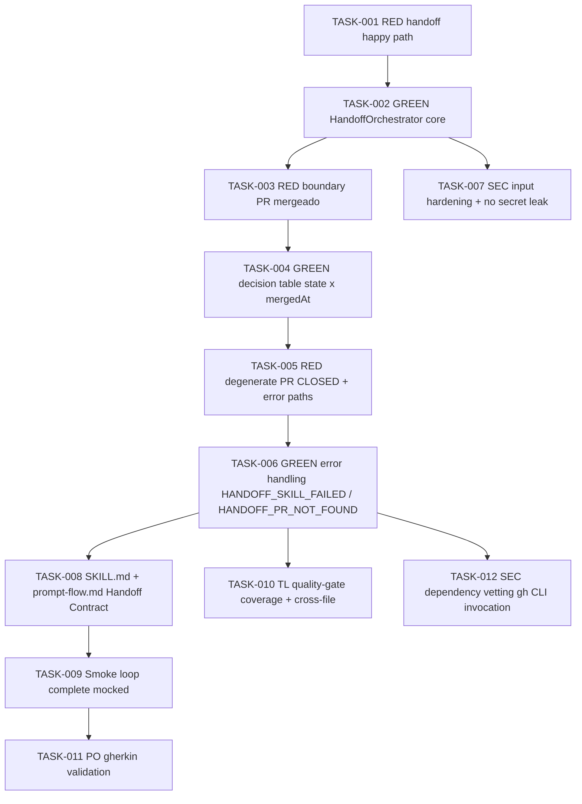

# Task Breakdown -- story-0039-0011

## Header

| Field | Value |
|-------|-------|
| Story ID | story-0039-0011 |
| Epic ID | 0039 |
| Date | 2026-04-15 |
| Author | x-story-plan (multi-agent) |
| Template Version | 1.0.0 |
| Schema | v1 (planningSchemaVersion absent -> FALLBACK_MISSING_FIELD) |

## Summary

| Metric | Value |
|--------|-------|
| Total Tasks | 12 |
| Parallelizable Tasks | 5 |
| Estimated Effort | M |
| Mode | multi-agent |
| Agents Participating | Architect, QA, Security, Tech Lead, PO |

## Dependency Graph

## Tasks Table

| Task ID | Source Agent | Type | TDD Phase | TPP Level | Layer | Components | Parallel | Depends On | Effort | DoD |
|---------|-------------|------|-----------|-----------|-------|-----------|----------|-----------|--------|-----|
| TASK-001 | QA | test | RED | nil | application | HandoffOrchestratorTest (happy path) | yes | — | S | Test red with NoClassDefFoundError; asserts invoke(PR#297, state=OPEN) triggers SkillInvokerPort.invoke("x-pr-fix-comments","297"); asserts post-return gh pr view called once; asserts PromptResult returned with options derived from refreshed state |
| TASK-002 | merged(ARCH,QA) | implementation | GREEN | constant | application | HandoffOrchestrator (java/src/main/java/dev/iadev/release/handoff/HandoffOrchestrator.java) | no | TASK-001 | M | Class exists at target path with `handoff(int prNumber, StateFile state): HandoffResult`; constructor injects SkillInvokerPort + GhCliPort + PromptEnginePort; method <=25 lines; class <=250 lines; zero framework/adapter imports; TASK-001 green |
| TASK-003 | QA | test | RED | scalar | application | HandoffOrchestratorTest (boundary PR mergeado durante handoff) | yes | TASK-002 | S | Test red: scenario where gh pr view returns state=MERGED + mergedAt=timestamp after fix-comments; asserts main option becomes "Continuar release" (CONTINUE_RESUME_AND_TAG) |
| TASK-004 | merged(ARCH,QA) | implementation | GREEN | scalar | application | HandoffOrchestrator.resolveOptions + PrState value object | no | TASK-003 | S | PrState record{state: enum OPEN/CLOSED/MERGED, mergedAt: Optional<Instant>, reviewDecision: enum}; resolveOptions(PrState) returns fixed option set per Section 5.3 decision table; TASK-003 green |
| TASK-005 | QA | test | RED | collection | application | HandoffOrchestratorTest (degenerate PR CLOSED + error paths) | yes | TASK-004 | S | Three red tests: (a) state=CLOSED+mergedAt=null -> options "Reabrir / Iniciar novo / Abortar"; (b) SkillInvoker throws -> HANDOFF_SKILL_FAILED warn + retry/continue/abort options; (c) gh pr view returns 404 -> exit 1 HANDOFF_PR_NOT_FOUND |
| TASK-006 | merged(ARCH,QA) | implementation | GREEN | conditional | application | HandoffOrchestrator.handleErrors + error code constants | no | TASK-005 | M | HANDOFF_SKILL_FAILED (warn-only, no exit); HANDOFF_PR_NOT_FOUND (exit 1); uses Result<HandoffOutcome, HandoffError> (no null returns); error messages carry prNumber context; TASK-005 green; method <=25 lines |
| TASK-007 | SEC | security | VERIFY | N/A | application | HandoffOrchestrator input hardening | yes | TASK-002 | XS | prNumber validated as positive integer (rejects negative, zero, non-numeric) -> IllegalArgumentException with prNumber context; exception messages expose NO internal paths/stack traces (Rule 06 / OWASP A04); no PR body content logged (OWASP A09); gh command arguments passed as separate args (never concatenated string -> CWE-78); no hardcoded tokens (OWASP A05) |
| TASK-008 | ARCH | architecture | N/A | N/A | config | SKILL.md + references/prompt-flow.md (java/src/main/resources/targets/claude/skills/core/x-release/SKILL.md, .../references/prompt-flow.md) | no | TASK-006 | L | Phase 8 APPROVAL_GATE in SKILL.md documents handoff sequence (5 steps from Section 3.1); prompt-flow.md adds "Handoff Contract" section: input={skill:"x-pr-fix-comments",args:"<PR#>"}, output=gh pr view JSON contract from Section 5.2; re-prompt decision table from Section 5.3 copied verbatim; RULE-001 respected (edit generator, not .claude/); RULE-004 respected (--no-prompt fallback documented) |
| TASK-009 | QA | test | VERIFY | iteration | cross-cutting | HandoffLoopSmokeTest (java/src/test/java/dev/iadev/smoke/HandoffLoopSmokeTest.java) | no | TASK-008 | M | Simulates: prompt -> "Rodar fix-comments" -> mock SkillInvoker returns success -> mock gh pr view returns MERGED -> prompt re-renders with "Continuar release" -> finalize; mocks SkillInvokerPort + GhCliPort; asserts state file consistent at each step; asserts no orphan state after final step; uses --no-prompt mode for CI determinism |
| TASK-010 | TL | quality-gate | VERIFY | N/A | cross-cutting | coverage + cross-file consistency | yes | TASK-006 | XS | HandoffOrchestrator line >=95%, branch >=90% (Rule 05); all methods <=25 lines; all port fields final (constructor injection per Rule 03); error codes follow existing `HANDOFF_*` naming convention; no train-wreck calls across ports; RULE-001 verified (no direct .claude/ edits) |
| TASK-011 | PO | validation | VERIFY | N/A | cross-cutting | gherkin coverage | yes | TASK-009 | XS | Each of 5 Gherkin scenarios in Section 7 (happy, boundary, degenerate, skill error, PR not found) has at least one executable test asserting expected outcome + state side-effect; amended criteria (if any) covered; metric tracking hook noted for "80% handoff-rate" success metric |
| TASK-012 | SEC | security | VERIFY | N/A | adapter.outbound | gh CLI invocation hardening | yes | TASK-006 | XS | gh CLI invocation uses ProcessBuilder with explicit argv (never shell string concat) -> OWASP A03 CWE-78; timeout applied (configurable, default 30s) to prevent resource exhaustion; stderr captured and sanitized before logging (no token leak); ProcessBuilder.inheritIO() forbidden (no env leak) |

## Escalation Notes

| Task ID | Reason | Recommended Action |
|---------|--------|--------------------|
| TASK-008 | SKILL.md is source of truth under java/src/main/resources/targets/claude/ (RULE-001); .claude/ is generated output and MUST NOT be edited | Edit generator source; regenerate via `ia-dev-env generate` |
| TASK-009 | Smoke test requires mocked SkillInvokerPort to avoid invoking real sibling skill in CI | Use in-process fake implementation; document in test Javadoc |
