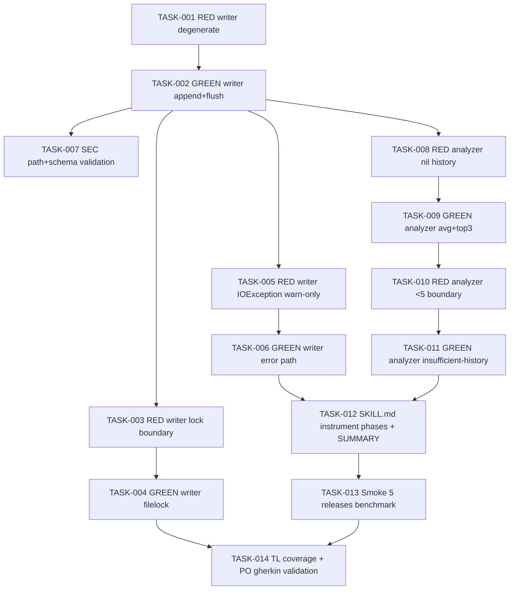

# Task Breakdown -- story-0039-0012

## Header

| Field | Value |
|-------|-------|
| Story ID | story-0039-0012 |
| Epic ID | 0039 |
| Date | 2026-04-15 |
| Author | x-story-plan (multi-agent) |
| Template Version | 1.0.0 |
| Schema | v1 (planningSchemaVersion absent -> FALLBACK_MISSING_FIELD) |

## Summary

| Metric | Value |
|--------|-------|
| Total Tasks | 14 |
| Parallelizable Tasks | 6 |
| Estimated Effort | M |
| Mode | multi-agent |
| Agents Participating | Architect, QA, Security, Tech Lead, PO |

## Dependency Graph

## Tasks Table

| Task ID | Source Agent | Type | TDD Phase | TPP Level | Layer | Components | Parallel | Depends On | Effort | DoD |
|---------|-------------|------|-----------|-----------|-------|-----------|----------|-----------|--------|-----|
| TASK-001 | QA | test | RED | nil | adapter.outbound | TelemetryWriterIT | yes | — | S | IT class exists; asserts degenerate case (--telemetry off -> zero file writes); fails with NoClassDefFoundError / missing class |
| TASK-002 | merged(ARCH,QA) | implementation | GREEN | constant | adapter.outbound | TelemetryWriter (port + file adapter) | no | TASK-001 | M | Port `TelemetrySink` in `domain.port`; file adapter `TelemetryWriter` in `adapter.outbound.telemetry`; append+flush semantics via FileChannel; TASK-001 test green; method <=25 lines; no `System.out` |
| TASK-003 | QA | test | RED | scalar | adapter.outbound | TelemetryWriterIT | yes | TASK-002 | S | Concurrency test: 2 threads append 100 lines each; asserts 200 well-formed JSONL lines, no partial writes; fails without lock |
| TASK-004 | merged(ARCH,QA) | implementation | GREEN | collection | adapter.outbound | TelemetryWriter | no | TASK-003 | S | `java.nio.channels.FileLock` around write+flush; TASK-003 passes under parallel load; lock released in finally |
| TASK-005 | QA | test | RED | conditional | adapter.outbound | TelemetryWriterIT | yes | TASK-002 | XS | Simulate permission-denied IOException; asserts `TELEMETRY_WRITE_FAILED` warn logged AND method returns normally (no throw); release flow continues |
| TASK-006 | merged(ARCH,QA) | implementation | GREEN | conditional | adapter.outbound | TelemetryWriter | no | TASK-005 | XS | IOException caught, logged via SLF4J with code `TELEMETRY_WRITE_FAILED`, method returns; TASK-005 passes; no exceptions propagate upward |
| TASK-007 | SEC | security | VERIFY | N/A | adapter.outbound | TelemetryWriter | yes | TASK-002 | XS | OWASP A03/A08: `releaseVersion` + `phase` escaped before JSON serialization (use Jackson not concat); JSONL path fixed to `plans/release-metrics.jsonl` (no user-controlled path traversal); file permissions 0644 (owner-write only); no `Math.random()` for any identifier |
| TASK-008 | QA | test | RED | nil | domain | BenchmarkAnalyzerTest | yes | TASK-002 | S | Test class exists; degenerate input (empty JSONL -> empty result); null-safe; fails with NoClassDefFoundError |
| TASK-009 | merged(ARCH,QA) | implementation | GREEN | collection | domain | BenchmarkAnalyzer + PhaseMetric value object | no | TASK-008 | M | Pure domain class (zero framework imports); reads last N release records from a `Stream<PhaseMetric>` input (DIP — no File I/O in domain); computes per-phase avg; returns top-3 by `durationSec` desc with `(delta_pct, mean_sec)` pair; TASK-008 test green |
| TASK-010 | QA | test | RED | scalar | domain | BenchmarkAnalyzerTest | yes | TASK-009 | XS | Boundary test: <5 historical releases -> returns `InsufficientHistory` sentinel (Option/Result pattern, no null); fails without branch |
| TASK-011 | merged(ARCH,QA) | implementation | GREEN | conditional | domain | BenchmarkAnalyzer | no | TASK-010 | XS | `if (count < 5) return InsufficientHistory.INSTANCE`; TASK-010 passes; no magic number (constant `MIN_HISTORY = 5`) |
| TASK-012 | ARCH | architecture | N/A | N/A | config | SKILL.md x-release (phase wrapper + SUMMARY integration) | no | TASK-006, TASK-011 | L | Each phase block wrapped with `emit_telemetry PHASE_NAME start` / `emit_telemetry PHASE_NAME end outcome`; Phase 13 SUMMARY calls BenchmarkAnalyzer via `mvn exec` or java cli; `--telemetry off` flag parsed at entry; when off, wrapper is no-op; source edited at `java/src/main/resources/targets/claude/skills/core/x-release/SKILL.md` (RULE-001) |
| TASK-013 | QA | test | RED+GREEN | iteration | test | TelemetryBenchmarkSmokeTest | yes | TASK-012 | M | Smoke seeds 5 historical JSONL entries then runs 1 synthetic release; asserts SUMMARY output contains "Top-3 fases mais lentas" with `+N%`/`-N%` deltas; asserts JSONL grew by exactly (num_phases) lines; asserts `outcome` values match {SUCCESS, FAILED, SKIPPED} |
| TASK-014 | merged(TL,PO) | quality-gate+validation | VERIFY | N/A | cross-cutting | coverage + acceptance | no | TASK-004, TASK-013 | XS | Line coverage >=95%, branch >=90% on `release.telemetry` package (domain + adapter); all 6 Gherkin scenarios from §7 map to a passing test (telemetry off, happy path, 5-release boundary, <5 boundary, write-fail warn-only, SKIPPED outcome); JSONL schema matches §5.1 field table exactly; DoD Local checklist (§4) all green |

## Escalation Notes

| Task ID | Reason | Recommended Action |
|---------|--------|--------------------|
| TASK-002 | Hexagonal split needed — keep domain pure, push file I/O to outbound adapter | Define `TelemetrySink` port in `domain.port`; implement `FileTelemetryWriter` in `adapter.outbound.telemetry`; SKILL.md wires the adapter |
| TASK-009 | Benchmark analysis belongs in DOMAIN (pure computation) despite consuming JSONL — reader adapter provides `Stream<PhaseMetric>`, domain computes | Do NOT let domain touch `java.nio.file.*`; adapter reads file, domain takes stream |
| TASK-012 | SKILL.md edit requires resource regeneration (RULE-001) — canonical source under `java/src/main/resources/targets/claude/skills/core/x-release/SKILL.md`; generated `.claude/` mirror is output | Edit source only; run `mvn process-resources` + `GoldenFileRegenerator` before commit |
| TASK-007 | Hotfix flow (`releaseType=hotfix`) consumed by S14 — ensure enum serializes as lowercase string matching §5.1 | Jackson `@JsonProperty` or explicit enum-to-string mapping; smoke test both release and hotfix values |
