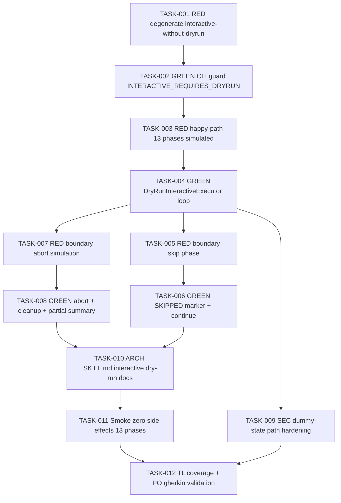

# Task Breakdown -- story-0039-0013

## Header

| Field | Value |
|-------|-------|
| Story ID | story-0039-0013 |
| Epic ID | 0039 |
| Date | 2026-04-15 |
| Author | x-story-plan (multi-agent) |
| Template Version | 1.0.0 |
| Schema | v1 (planningSchemaVersion absent -> FALLBACK_MISSING_FIELD) |

## Summary

| Metric | Value |
|--------|-------|
| Total Tasks | 12 |
| Parallelizable Tasks | 5 |
| Estimated Effort | M |
| Mode | multi-agent |
| Agents Participating | Architect, QA, Security, Tech Lead, PO |

## Dependency Graph

## Tasks Table

| Task ID | Source Agent | Type | TDD Phase | TPP Level | Layer | Components | Parallel | Depends On | Effort | DoD |
|---------|-------------|------|-----------|-----------|-------|-----------|----------|-----------|--------|-----|
| TASK-001 | QA | test | RED | nil | adapter.inbound | ReleaseCommandTest (interactive flag guard) | yes | — | XS | Test class exists; asserts `/x-release --interactive` (without `--dry-run`) exits 1 with code `INTERACTIVE_REQUIRES_DRYRUN`; fails with NoSuchMethodError / missing guard |
| TASK-002 | merged(ARCH,QA) | implementation | GREEN | constant | adapter.inbound | ReleaseCommand (picocli option validator) | no | TASK-001 | XS | `--interactive` option declared as dependent on `--dry-run`; validation at `call()` entry returns exit code 1 with code `INTERACTIVE_REQUIRES_DRYRUN` logged via SLF4J; TASK-001 green; method <=25 lines; no `System.err.println` |
| TASK-003 | QA | test | RED | constant | application | DryRunInteractiveExecutorTest (happy path) | yes | TASK-002 | S | Test mocks prompt responder to reply "continuar" 13 times; asserts all 13 phases recorded as SIMULATED; asserts zero invocations on mocked Git/Maven/GitHub ports; fails with NoClassDefFoundError |
| TASK-004 | merged(ARCH,QA) | implementation | GREEN | iteration | application | DryRunInteractiveExecutor (use case) | no | TASK-003 | M | Pure application class in `dev.iadev.release.dryrun`; constructor-injects `PromptPort`, `DryRunStatePort`, `PhaseCatalogPort`; loops through catalog of 13 phases; emits AskUserQuestion-style prompt per phase with command preview; writes dummy state to `/tmp/release-state-dryrun-<timestamp>.json` at start, deletes in `finally`; NEVER calls real Git/Maven/GitHub (enforced by port abstraction — DIP); TASK-003 green; method decomposition <=25 lines each |
| TASK-005 | QA | test | RED | scalar | application | DryRunInteractiveExecutorTest (skip boundary) | yes | TASK-004 | XS | Test: prompt responder replies "pular fase" at phase index 3 (VALIDATED); asserts phase 3 recorded as SKIPPED; asserts phase 4 (BRANCHED) still simulated afterwards; asserts simulation continues to phase 13 |
| TASK-006 | merged(ARCH,QA) | implementation | GREEN | conditional | application | DryRunInteractiveExecutor (skip branch) | no | TASK-005 | XS | Switch on prompt response adds `PULAR_FASE -> mark SKIPPED + continue`; TASK-005 green; enum `DryRunPhaseOutcome {SIMULATED, SKIPPED, ABORTED}` extracted; no boolean flag parameters |
| TASK-007 | QA | test | RED | conditional | application | DryRunInteractiveExecutorTest (abort boundary) | yes | TASK-004 | XS | Test: prompt responder replies "abortar" at phase 6 (PR_OPENED); asserts phases 1-5 marked SIMULATED, 6 ABORTED, 7-13 NOT_REACHED; asserts `/tmp/release-state-dryrun-*.json` deleted; asserts exit code 0 |
| TASK-008 | merged(ARCH,QA) | implementation | GREEN | conditional | application | DryRunInteractiveExecutor (abort branch + cleanup) | no | TASK-007 | XS | Abort branch breaks loop; partial summary emitted via `DryRunSummaryFormatter`; dummy-state cleanup in `finally` covers both normal and abort paths; TASK-007 green; summary uses `NOT_REACHED` enum value (no null, no sentinel string) |
| TASK-009 | SEC | security | VERIFY | N/A | application | DryRunInteractiveExecutor + DryRunStateWriter | yes | TASK-004 | XS | OWASP A01/A03: dummy-state filename uses `Files.createTempFile("release-state-dryrun-", ".json")` (NOT string concat on user input — CWE-22 / Rule 6 defensive path) with POSIX perms 0600; timestamp comes from `Clock` port (no `System.currentTimeMillis` direct); no JSON concatenation — Jackson only (CWE-89 analog for JSON injection); cleanup in `finally` guarantees file removal even on exception; audit log entry: `"DryRun simulation completed: phases_simulated=N, phases_skipped=M, side_effects=0"` |
| TASK-010 | ARCH | architecture | N/A | N/A | config | SKILL.md x-release (interactive dry-run section) | no | TASK-006, TASK-008 | S | Source edited at `java/src/main/resources/targets/claude/skills/core/x-release/SKILL.md` (RULE-001); section "Interactive Dry-Run Mode" documents `--dry-run --interactive`; Triggers table adds example row; error catalog adds `INTERACTIVE_REQUIRES_DRYRUN` with exit=1; sample output block matches §5.2 of story; no direct edits under `.claude/` |
| TASK-011 | QA | test | RED+GREEN | iteration | test | DryRunInteractiveSmokeTest | yes | TASK-010 | M | Smoke spawns ReleaseCommand via picocli test harness with `--dry-run --interactive`; mocks 13 "continuar" responses via test double; asserts Git/Maven/GitHub mocks received ZERO invocations; asserts `git log` shows no new commits; asserts no new branches created; asserts summary line "MODO DRY-RUN — nenhum efeito colateral foi aplicado" present; asserts `/tmp/release-state-dryrun-*.json` absent post-run |
| TASK-012 | merged(TL,PO) | quality-gate+validation | VERIFY | N/A | cross-cutting | coverage + acceptance | no | TASK-009, TASK-011 | XS | Line coverage >=95%, branch >=90% on `dev.iadev.release.dryrun` package; all 5 Gherkin scenarios from §7 map 1-to-1 to a passing test (degenerate interactive-without-dryrun, happy-path 13 phases, skip boundary, abort boundary, zero side effects acceptance); error code `INTERACTIVE_REQUIRES_DRYRUN` present in catalog and matches §5.3 table; DoD Local §4 checklist green; cross-file consistency: command-guard + executor + SKILL.md use same error code string |

## Escalation Notes

| Task ID | Reason | Recommended Action |
|---------|--------|--------------------|
| TASK-004 | Executor MUST live in application layer (orchestrates ports) — domain stays pure (no filesystem/time) | Declare `PromptPort`, `DryRunStatePort`, `PhaseCatalogPort`, `Clock` as inbound interfaces; adapter.outbound provides `/tmp` writer; domain only contributes `DryRunPhaseOutcome` enum and `DryRunSummary` value object |
| TASK-009 | CWE-22 risk if filename concatenates externally-supplied timestamp or operator input | Use `Files.createTempFile` (atomic + unique) with explicit PosixFilePermissions 0600; reject any attempt to override base path via arg |
| TASK-010 | SKILL.md edit requires resource regeneration (RULE-001) — canonical source under `java/src/main/resources/targets/claude/skills/core/x-release/SKILL.md`; generated `.claude/` mirror is output | Edit source only; run `mvn process-resources` + `GoldenFileRegenerator` before commit; TASK-010 is NOT allowed to touch `.claude/skills/x-release/SKILL.md` directly |
| TASK-011 | RULE-004: prompts must have non-interactive equivalent for CI — smoke must not depend on real TTY | Use fake `PromptPort` that scripts 13 "continuar" answers; document `--no-prompt` equivalence in SKILL.md section added by TASK-010 |
