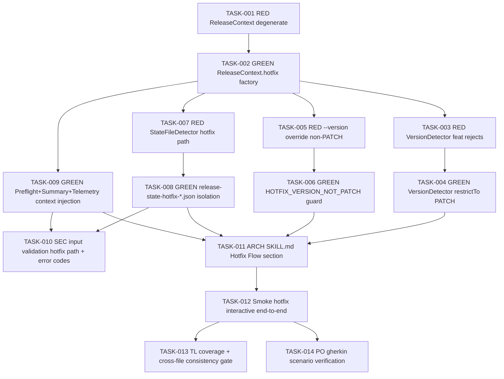

# Task Breakdown -- story-0039-0014

## Header

| Field | Value |
|-------|-------|
| Story ID | story-0039-0014 |
| Epic ID | 0039 |
| Date | 2026-04-15 |
| Author | x-story-plan (multi-agent) |
| Template Version | 1.0.0 |
| Schema | v1 (planningSchemaVersion absent -> FALLBACK_MISSING_FIELD) |

## Summary

| Metric | Value |
|--------|-------|
| Total Tasks | 14 |
| Parallelizable Tasks | 6 |
| Estimated Effort | L |
| Mode | multi-agent |
| Agents Participating | Architect, QA, Security, Tech Lead, PO |

## Dependency Graph

## Tasks Table

| Task ID | Source Agent | Type | TDD Phase | TPP Level | Layer | Components | Parallel | Depends On | Effort | DoD |
|---------|-------------|------|-----------|-----------|-------|-----------|----------|-----------|--------|-----|
| TASK-001 | QA | test | RED | nil | domain | ReleaseContextTest | yes | — | S | Test class exists; degenerate `ReleaseContext.release()` vs `ReleaseContext.hotfix()` factories fail with NoSuchMethodError; null-safe builder probes; fails before TASK-002 lands |
| TASK-002 | merged(ARCH,QA) | implementation | GREEN | constant | domain | ReleaseContext (record) + HotfixContext factory | no | TASK-001 | M | Immutable record `ReleaseContext(BumpRestriction restrictBumpTo, String baseBranch, boolean hotfix)`; static factories `release()` = (ANY, "develop", false) and `hotfix()` = (PATCH_ONLY, "main", true); zero framework imports; method <=25 lines; enum `BumpRestriction { ANY, PATCH_ONLY }`; TASK-001 green |
| TASK-003 | QA | test | RED | scalar | application | VersionDetectorTest | yes | TASK-002 | S | Parametrized test: given commits `[feat: x, fix: y]` + `ReleaseContext.hotfix()`, detector throws `HotfixInvalidCommitsException` with code `HOTFIX_INVALID_COMMITS`; fails before TASK-004 |
| TASK-004 | merged(ARCH,QA) | implementation | GREEN | conditional | application | VersionDetector | no | TASK-003 | M | `detectVersion(commits, ReleaseContext ctx)` inspects `ctx.restrictBumpTo`; when PATCH_ONLY, any Conventional Commit with `feat`/`feat!`/`BREAKING CHANGE` triggers `HOTFIX_INVALID_COMMITS` (exit 1); only `fix`/`perf` accepted; pure function, no I/O in detector; TASK-003 green |
| TASK-005 | QA | test | RED | scalar | application | VersionDetectorTest | yes | TASK-002 | XS | `--version 3.2.0` with current 3.1.0 + `ReleaseContext.hotfix()` -> `HOTFIX_VERSION_NOT_PATCH`; PATCH `3.1.1` accepted; fails before TASK-006 |
| TASK-006 | merged(ARCH,QA) | implementation | GREEN | conditional | application | VersionDetector | no | TASK-005 | XS | `validateOverride(current, requested, ctx)`: when PATCH_ONLY, only PATCH bumps accepted (same MAJOR.MINOR, PATCH+1); else `HOTFIX_VERSION_NOT_PATCH`; TASK-005 green; no string concat in exception message (use formatted constants) |
| TASK-007 | QA | test | RED | scalar | adapter.outbound | StateFileDetectorTest | yes | TASK-002 | S | Given existing `plans/release-state-3.2.0.json` and new hotfix `3.1.1`, detector resolves separate path `plans/release-state-hotfix-3.1.1.json` and does NOT touch the release-normal state; fails before TASK-008 |
| TASK-008 | merged(ARCH,QA) | implementation | GREEN | conditional | adapter.outbound | StateFileDetector | no | TASK-007 | S | `resolveStatePath(version, ctx)`: when `ctx.hotfix`, path = `plans/release-state-hotfix-<version>.json`; else `plans/release-state-<version>.json`; schema identical (reuses v2 schema from S02 with `hotfix: true` field); no duplicate `releaseType` field; TASK-007 green |
| TASK-009 | merged(ARCH,TL) | implementation | GREEN | collection | application | PreflightDashboardRenderer + SummaryRenderer + TelemetryWriter | no | TASK-002 | L | All three accept `ReleaseContext` param; PreflightDashboard renders banner `"modo HOTFIX, base=main, bump=PATCH"` when `ctx.hotfix`; SummaryRenderer mermaid shows `hotfix/<version>` branch from `main` with back-merge arrow to develop when `ctx.hotfix`; TelemetryWriter JSONL emits `releaseType: "hotfix"` when `ctx.hotfix` else `"release"` (derived from flag, not new field); each renderer method <=25 lines; no Boolean parameter — pass full context |
| TASK-010 | SEC | security | VERIFY | N/A | cross-cutting | VersionDetector + StateFileDetector | yes | TASK-008, TASK-009 | XS | OWASP A03 Injection: version string validated against `^\d+\.\d+\.\d+$` before use in file paths (prevents traversal via `../`); A05 Misconfiguration: hotfix state path uses hardcoded `plans/` prefix (no user-controlled directory); A09 Logging: error codes `HOTFIX_INVALID_COMMITS` / `HOTFIX_VERSION_NOT_PATCH` never leak internal stack traces to operator stdout; SLF4J WARN only; no `Math.random()`; immutable `ReleaseContext` record prevents tamper |
| TASK-011 | ARCH | architecture | N/A | N/A | config | SKILL.md x-release (Hotfix Flow section + error catalog) | no | TASK-004, TASK-006, TASK-008, TASK-009 | M | New `## Hotfix Flow` section in `java/src/main/resources/targets/claude/skills/core/x-release/SKILL.md` (RULE-001 source of truth) documenting: `--hotfix` flag semantics, PATCH-only auto-detect, separate state file naming, base=main, back-merge to develop, SUMMARY variant, telemetry `releaseType`; error catalog appends `HOTFIX_INVALID_COMMITS` + `HOTFIX_VERSION_NOT_PATCH` with remediation; mvn process-resources regenerates .claude mirror |
| TASK-012 | QA | test | VERIFY | N/A | adapter.inbound | HotfixInteractiveSmokeTest | no | TASK-011 | M | Fixture git repo: tag v3.1.0 + 2 fix commits; invokes `/x-release --hotfix` flow simulated (non-interactive driver); asserts: (1) state file `release-state-hotfix-3.1.1.json` created (separate from any `release-state-*.json`); (2) pre-flight stdout contains `"modo HOTFIX, base=main"`; (3) telemetry JSONL lines include `"releaseType":"hotfix"`; (4) SUMMARY mermaid block contains `hotfix/3.1.1`; (5) back-merge PR to develop simulated; (6) feat commit injected -> `HOTFIX_INVALID_COMMITS` exit 1 |
| TASK-013 | TL | quality-gate | VERIFY | N/A | cross-cutting | Coverage report + cross-file consistency audit | yes | TASK-012 | S | `mvn verify` reports >=95% line, >=90% branch on `dev.iadev.release` packages touched; cross-file consistency: all 5 adapted components (VersionDetector, StateFileDetector, PreflightDashboardRenderer, SummaryRenderer, TelemetryWriter) accept `ReleaseContext` uniformly (no Boolean flag leaks); method length <=25; class length <=250; zero `System.out`; `ArchUnit` or equivalent import-guard asserts domain has zero framework imports |
| TASK-014 | PO | validation | VERIFY | N/A | adapter.inbound | Acceptance criteria traceability | yes | TASK-012 | XS | Each of the 6 Gherkin scenarios in story §7 maps 1:1 to a verified assertion in TASK-012 smoke or dedicated unit test; traceability matrix appended to planning-report; DoD Local checklist (story §4) all checked |

## Escalation Notes

| Task ID | Reason | Recommended Action |
|---------|--------|--------------------|
| TASK-009 | Touches 3 distinct adapters in a single task (per story §3.1 adaptations) | Keep together: all 3 share the same context-injection refactor pattern; splitting risks coupling issues. Budget L effort. |
| TASK-011 | SKILL.md is a mirrored artifact (source-of-truth in `targets/claude/`) | Edit ONLY `java/src/main/resources/targets/claude/...`; run `mvn process-resources` before verifying `.claude/` mirror |
