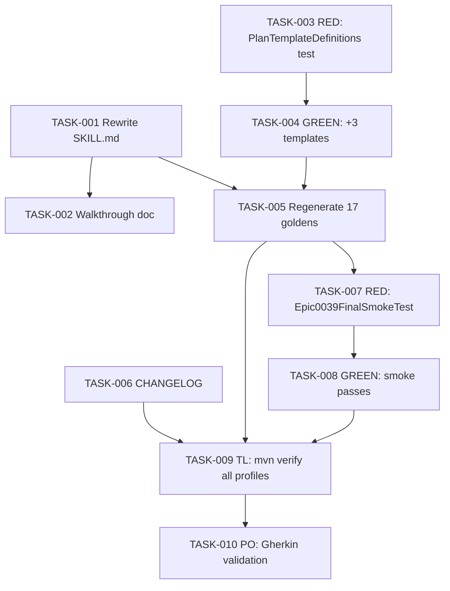

# Task Breakdown -- story-0039-0015

## Header

| Field | Value |
|-------|-------|
| Story ID | story-0039-0015 |
| Epic ID | 0039 |
| Date | 2026-04-15 |
| Author | x-story-plan (multi-agent, v1 schema) |
| Template Version | 1.0.0 |

## Summary

| Metric | Value |
|--------|-------|
| Total Tasks | 10 |
| Parallelizable Tasks | 4 (TASK-001, TASK-002, TASK-003, TASK-006) |
| Estimated Effort | L (aggregate) |
| Mode | multi-agent |
| Agents Participating | Architect, QA, Security, Tech Lead, PO |

## Dependency Graph

## Tasks Table

| Task ID | Source Agent | Type | TDD Phase | TPP Level | Layer | Components | Parallel | Depends On | Estimated Effort | DoD |
|---------|-------------|------|-----------|-----------|-------|-----------|----------|-----------|-----------------|-----|
| TASK-001 | ARCH | implementation | GREEN | N/A | doc | `x-release/SKILL.md` | yes | — | L | Reflects 100% of new defaults (auto-detect, smart resume, Step 0.5, Step 1.5, Phase 13, telemetry); no TODOs/placeholders; triggers updated; error catalog consolidated |
| TASK-002 | ARCH | implementation | GREEN | N/A | doc | `x-release/references/interactive-flow-walkthrough.md` | yes | TASK-001 | M | Normal release walkthrough end-to-end; hotfix walkthrough end-to-end; covers prompts/responses/output |
| TASK-003 | QA | test | RED | constant | application | `PlanTemplateDefinitionsTest.java` | yes | — | S | Failing unit test asserting `TEMPLATE_COUNT == 18` and 3 new entries (`_TEMPLATE-EPIC.md`, `_TEMPLATE-STORY.md`, `_TEMPLATE-IMPLEMENTATION-MAP.md`) with correct mandatory sections |
| TASK-004 | merged(ARCH,SEC,TL) | implementation | GREEN | constant | application | `PlanTemplateDefinitions.java` | no | TASK-003 | S | `TEMPLATE_COUNT=18`; 3 entries added with mandatory sections per Section 5.1 data contract; unit test green; no hardcoded paths; method length <=25 lines |
| TASK-005 | ARCH | implementation | VERIFY | N/A | test | 17 golden profiles under `src/test/resources/golden/**` | no | TASK-001, TASK-004 | M | `mvn process-resources` + `GoldenFileRegenerator` run once; 17 profiles regenerated; byte-for-byte diff reviewed; changes only in expected locations (SKILL.md + 3 new templates under `.claude/templates/`) |
| TASK-006 | ARCH | implementation | GREEN | N/A | doc | `CHANGELOG.md` | yes | — | S | `[Unreleased]` section populated per Section 5.2 data contract; Added/Changed/Removed cover 15 stories + breaking state schema change; Keep a Changelog format preserved |
| TASK-007 | QA | test | RED | scalar | test | `Epic0039FinalSmokeTest.java` | no | TASK-005 | S | Failing smoke test generating dummy skill `x-release` in a profile and comparing byte-for-byte to expected output |
| TASK-008 | QA | test | GREEN | scalar | test | `Epic0039FinalSmokeTest.java` | no | TASK-007 | S | Smoke test passes: dummy profile generation matches expected output byte-for-byte |
| TASK-009 | TL | quality-gate | VERIFY | N/A | cross-cutting | `mvn verify` across 17 profiles | no | TASK-005, TASK-008, TASK-006 | S | All 17 profiles green; PipelineSmokeTest and GoldenFileCoverageTest pass; zero regressions in existing tests |
| TASK-010 | PO | validation | VERIFY | N/A | cross-cutting | story-0039-0015 acceptance criteria | no | TASK-009 | S | All 5 Gherkin scenarios validated: SKILL feature grep, 17 goldens regen, mvn verify, CHANGELOG coverage, walkthrough release+hotfix |

## Escalation Notes

| Task ID | Reason | Recommended Action |
|---------|--------|--------------------|
| TASK-005 | Golden diff may reveal unexpected changes in profiles | Review diff manually; if surprise changes appear, root-cause before committing |
| TASK-009 | `mvn verify` across 17 profiles is time-intensive | Budget adequate CI time; consider parallel profile execution if available |

> Security note: this is a doc + regen story with no new runtime surface, user input, auth, crypto, or persistence. SEC agent found no security-sensitive components requiring augmentation. Retained SEC verification tasks are therefore N/A.
