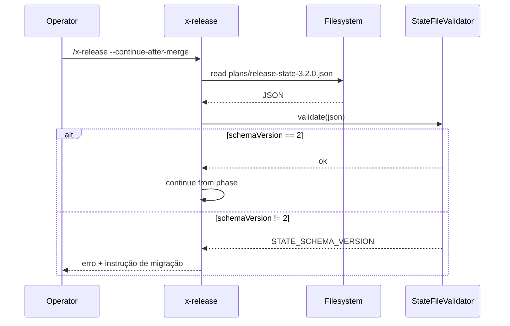

# História: State file schema v2 (breaking change)

**ID:** story-0039-0002
**Chave Jira:** —
**Status:** Concluida

## 1. Dependências

| Blocked By | Blocks |
| :--- | :--- |
| — | story-0039-0007, story-0039-0008, story-0039-0010, story-0039-0012 |

## 2. Regras Transversais Aplicáveis

| ID | Título |
| :--- | :--- |
| RULE-001 | Source-of-truth: gerador, não output |
| RULE-003 | Schema evolution explícito |
| RULE-008 | Golden regen consolidado |

## 3. Descrição

Como **release manager**, eu quero que o state file (`plans/release-state-<X.Y.Z>.json`) suporte campos para prompts interativos, telemetria e smart resume, garantindo que stories downstream (S07, S08, S10, S12) tenham a base de persistência necessária.

A story bumpa `schemaVersion` de 1 para 2. Por decisão explícita do épico (RULE-003), v1 → v2 é breaking — qualquer state file v1 detectado em runtime é rejeitado com erro acionável (não há upgrade silencioso). Os novos campos são todos opcionais durante leitura, exceto `schemaVersion`.

### 3.1 Novos campos do schema v2

- `nextActions[]`: array de `{label: String, command: String}` — ações sugeridas no próximo prompt
- `waitingFor`: enum `{NONE, PR_REVIEW, PR_MERGE, BACKMERGE_REVIEW, BACKMERGE_MERGE, USER_CONFIRMATION}` — estado do halt atual
- `phaseDurations`: map `{phaseName: durationSec}` — duração agregada por fase
- `lastPromptAnsweredAt`: timestamp ISO-8601 da última interação do operador
- `githubReleaseUrl`: URL do GitHub Release (preenchido por S06)

### 3.2 Migração e validação

- Leitura: rejeitar `schemaVersion != 2` com `STATE_SCHEMA_VERSION` + instrução `"State file v<N> não é mais suportado. Aborte a release ativa via /x-release --abort e inicie nova."`
- Escrita: sempre serializa com `schemaVersion: 2`
- Backward compatibility: nenhuma — v1 é considerado morto após release com S02 mergeada

### 3.3 Atualizações em testes e docs

- `ReleaseStateFileSchemaTest`: novos cenários cobrindo os 5 campos novos, ordem alfabética dos campos, validação de enum `waitingFor`
- `references/state-file-schema.md`: seção "Schema v2 Fields" com tabela tipo/origem/quando-preenchido
- Exemplo JSON no doc atualizado para v2

## 3.5 Entrega de Valor

- **Valor Principal:** habilita persistência de contexto interativo entre invocações; sem isso, S07/S08/S10/S12 não conseguem recuperar estado
- **Métrica de Sucesso:** state file gerado em release real contém todos os 5 campos novos quando aplicáveis; `ReleaseStateFileSchemaTest` valida 100% dos campos
- **Impacto no Negócio:** infra base que destrava 4 stories de UX e observability

## 4. Definições de Qualidade Locais

### DoR Local

- [ ] Campos novos validados com Tech Lead (nomes, tipos, enums)
- [ ] Decisão "no silent upgrade" ratificada
- [ ] Mensagem de migração revisada para clareza ao operador

### DoD Local

- [ ] `schemaVersion: 2` aceito; `1` rejeitado com mensagem clara
- [ ] 5 campos novos serializados/desserializados corretamente
- [ ] `references/state-file-schema.md` atualizado
- [ ] `ReleaseStateFileSchemaTest` cobre v2 e rejeição de v1
- [ ] Pelo menos 1 teste smoke valida criação + leitura roundtrip

## 5. Contratos de Dados

### 5.1 State File Schema v2 (canonical example)

```json
{
  "schemaVersion": 2,
  "version": "3.2.0",
  "phase": "APPROVAL_PENDING",
  "branch": "release/3.2.0",
  "baseBranch": "develop",
  "hotfix": false,
  "dryRun": false,
  "signedTag": false,
  "interactive": true,
  "startedAt": "2026-04-13T08:00:00Z",
  "lastPhaseCompletedAt": "2026-04-13T08:12:34Z",
  "phasesCompleted": ["INITIALIZED", "DETERMINED", "VALIDATED", "BRANCHED", "UPDATED", "CHANGELOG_DONE", "COMMITTED", "PR_OPENED"],
  "targetVersion": "3.2.0",
  "previousVersion": "3.1.0",
  "bumpType": "minor",
  "prNumber": 297,
  "prUrl": "https://github.com/owner/repo/pull/297",
  "prTitle": "Release v3.2.0",
  "changelogEntry": "## [3.2.0] - 2026-04-13\n...",
  "tagMessage": "Release v3.2.0",
  "nextActions": [
    {"label": "PR mergeado — continuar", "command": "/x-release --continue-after-merge"},
    {"label": "Rodar fix-pr-comments", "command": "/x-pr-fix-comments 297"}
  ],
  "waitingFor": "PR_MERGE",
  "phaseDurations": {
    "VALIDATED": 142,
    "BRANCHED": 3,
    "UPDATED": 1,
    "CHANGELOG_DONE": 8,
    "COMMITTED": 2,
    "PR_OPENED": 12
  },
  "lastPromptAnsweredAt": "2026-04-13T08:12:35Z",
  "githubReleaseUrl": null
}
```

### 5.2 Field Reference (novos)

| Campo | Tipo | Sempre presente | Set em fase | Descrição |
| :--- | :--- | :--- | :--- | :--- |
| `nextActions` | `Array<{label, command}>` | Não | qualquer halt | Lista de ações sugeridas no próximo prompt |
| `waitingFor` | `enum` | Não | qualquer halt | Tipo de espera (`NONE` quando ativo) |
| `phaseDurations` | `Map<String,Long>` | Não | atualizado a cada fase | Duração em segundos por nome de fase |
| `lastPromptAnsweredAt` | `String (ISO-8601)` | Não | após cada prompt | Telemetria de tempo humano |
| `githubReleaseUrl` | `String\|null` | Não | PUBLISH (S06) | URL do GitHub Release criado |

### 5.3 Error Codes

| Exit | Code | Condição |
| :--- | :--- | :--- |
| 1 | `STATE_SCHEMA_VERSION` | `schemaVersion != 2` (inclui v1) |
| 1 | `STATE_INVALID_ENUM` | `waitingFor` com valor desconhecido |
| 1 | `STATE_INVALID_ACTION` | `nextActions[].command` malformado (não começa com `/`) |

## 6. Diagramas

### 6.1 Leitura de state file



## 7. Critérios de Aceite (Gherkin)

```gherkin
Cenario: State file v1 é rejeitado (degenerate)
  DADO um state file existente com schemaVersion=1
  QUANDO eu rodo /x-release --continue-after-merge
  ENTÃO o exit code é 1
  E a saída contém STATE_SCHEMA_VERSION
  E sugere /x-release --abort para limpar

Cenario: State file v2 é lido com sucesso (happy path)
  DADO um state file v2 válido com phase=APPROVAL_PENDING
  QUANDO eu rodo /x-release --continue-after-merge
  ENTÃO a leitura sucede e a fase atual é APPROVAL_PENDING

Cenario: Roundtrip de campo nextActions (boundary)
  DADO um state v2 com 2 entradas em nextActions
  QUANDO eu serializo e re-desserializo
  ENTÃO ambas entradas estão preservadas com label e command

Cenario: Enum waitingFor inválido (error)
  DADO um state v2 com waitingFor="UNKNOWN_VALUE"
  QUANDO eu valido
  ENTÃO STATE_INVALID_ENUM é emitido

Cenario: phaseDurations vazio é aceito (boundary at-min)
  DADO um state v2 com phaseDurations={}
  QUANDO eu valido
  ENTÃO a validação passa sem erro

Cenario: Comando malformado em nextActions (error path)
  DADO um state v2 com nextActions[0].command="git push"
  QUANDO eu valido
  ENTÃO STATE_INVALID_ACTION é emitido
```

### 7.1 TPP Ordering

Degenerate (rejeição v1) → happy path (leitura v2) → boundary (roundtrip, vazio) → error (enum inválido, command malformado).

### 7.2 Mandatory Categories

- [x] Degenerate: rejeição de v1
- [x] Happy path: leitura v2 OK
- [x] Error: enum inválido, command malformado
- [x] Boundary: phaseDurations vazio, roundtrip de array

## 8. Tasks

### TASK-0039-0002-001: Definir POJOs/records do schema v2

- **Layer:** Domain
- **Test Type:** Unit
- **Size:** S
- **Dependencies:** —
- **Branch:** `feat/task-0039-0002-001-schema-v2-records`
- **Testability:** Domain + UnitTest
- **Files:**
  - `java/src/main/java/dev/iadev/release/state/ReleaseState.java`
  - `java/src/main/java/dev/iadev/release/state/NextAction.java`
  - `java/src/main/java/dev/iadev/release/state/WaitingFor.java`
- **Acceptance Criteria:**
  - [ ] Records imutáveis com Jackson annotations
  - [ ] Enum `WaitingFor` com 6 valores listados em 3.1

### TASK-0039-0002-002: Implementar `StateFileValidator` v2

- **Layer:** Domain
- **Test Type:** Unit
- **Size:** M
- **Dependencies:** TASK-0039-0002-001
- **Branch:** `feat/task-0039-0002-002-state-file-validator`
- **Testability:** Domain + UnitTest
- **Files:**
  - `java/src/main/java/dev/iadev/release/state/StateFileValidator.java`
  - `java/src/test/java/dev/iadev/release/state/StateFileValidatorTest.java`
- **Acceptance Criteria:**
  - [ ] Rejeita schemaVersion≠2 com `STATE_SCHEMA_VERSION`
  - [ ] Valida enum `waitingFor`
  - [ ] Valida formato de `nextActions[].command` (regex `^/[a-z\-]+`)

### TASK-0039-0002-003: Atualizar `references/state-file-schema.md`

- **Layer:** Doc
- **Test Type:** Verification
- **Size:** M
- **Dependencies:** TASK-0039-0002-001
- **Branch:** `feat/task-0039-0002-003-schema-doc-v2`
- **Testability:** Config + VerificationTest
- **Files:**
  - `java/src/main/resources/targets/claude/skills/core/x-release/references/state-file-schema.md`
  - `java/src/test/java/dev/iadev/application/assembler/ReleaseStateFileSchemaTest.java` (atualizar)
- **Acceptance Criteria:**
  - [ ] Doc inclui seção "Schema v2 Fields" com tabela
  - [ ] Exemplo JSON é v2 e parseável
  - [ ] Test existente atualizado para validar campos v2

### TASK-0039-0002-004: Smoke roundtrip serialize/deserialize

- **Layer:** Test
- **Test Type:** Smoke
- **Size:** S
- **Dependencies:** TASK-0039-0002-002
- **Branch:** `feat/task-0039-0002-004-smoke-roundtrip`
- **Testability:** Migration + Smoke
- **Files:**
  - `java/src/test/java/dev/iadev/smoke/StateFileRoundtripSmokeTest.java`
- **Acceptance Criteria:**
  - [ ] Serializa state v2 completo, lê de volta, asserta igualdade campo a campo
