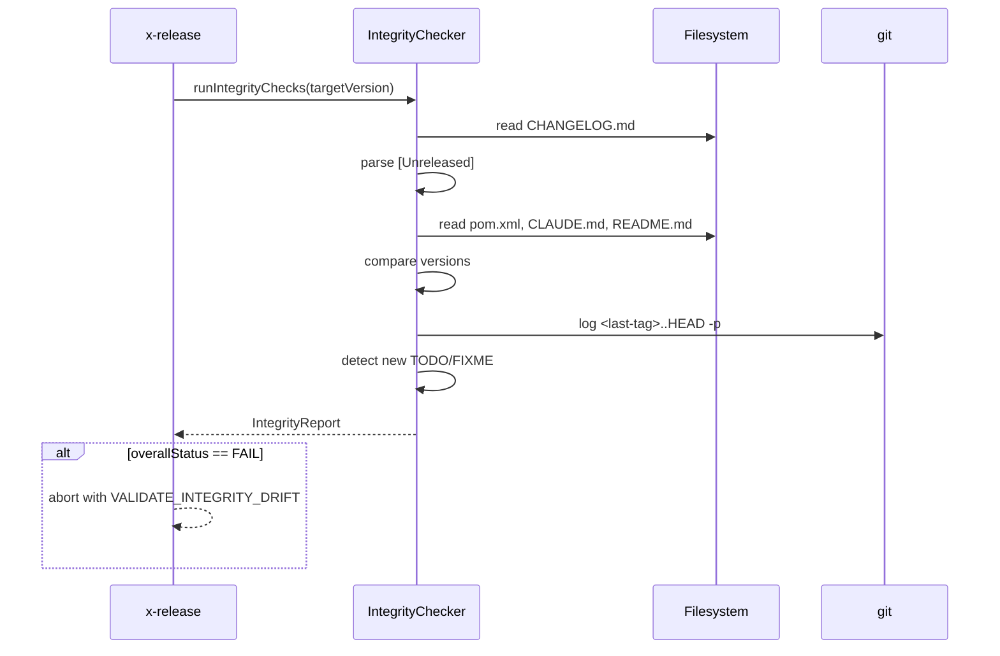

# História: Pre-commit integrity checks em VALIDATE-DEEP

**ID:** story-0039-0003
**Chave Jira:** —
**Status:** Pendente

## 1. Dependências

| Blocked By | Blocks |
| :--- | :--- |
| — | story-0039-0009 |

## 2. Regras Transversais Aplicáveis

| ID | Título |
| :--- | :--- |
| RULE-001 | Source-of-truth: gerador, não output |
| RULE-005 | Preservação de codes existentes |

## 3. Descrição

Como **release manager**, eu quero que VALIDATE-DEEP detecte divergências cross-file de versão e CHANGELOG vazio antes de criar a branch de release, garantindo que erros bobos sejam pegos cedo.

Hoje VALIDATE-DEEP roda 8 checks (build, coverage, golden, hardcoded version, etc.) mas não verifica consistência semântica entre arquivos. Esta story adiciona uma sub-fase nova de "integrity checks" que valida que `pom.xml`, `CLAUDE.md`, badges em READMEs e o `[Unreleased]` do CHANGELOG estão coerentes antes de qualquer mutação.

### 3.1 Checks novos

- **CHANGELOG `[Unreleased]` não-vazio**: precisa ter ao menos uma entrada em Added/Changed/Fixed/etc.
- **Versão alinhada cross-file**: `pom.xml` `<version>` bate com qualquer string `vX.Y.Z`/`X.Y.Z` em `CLAUDE.md`, `README.md` (badges), `package.json` (se existir)
- **Sem TODO/FIXME novos na janela de commits**: `git log <last-tag>..HEAD -p` não introduz `TODO|FIXME|HACK|XXX` novos em arquivos `.java/.md/.peb`

### 3.2 Output

- Cada check tem nome legível, status (PASS/FAIL/WARN), e lista de arquivos divergentes
- Falhas agrupadas sob código único `VALIDATE_INTEGRITY_DRIFT`
- Saída JSON opcional via `--integrity-report <path>` para CI parsers

### 3.3 Posicionamento na fase

- Roda como sub-check 9 dentro de VALIDATE-DEEP, após os 8 existentes
- Falha aborta a fase com exit 1
- Skipável via `--skip-integrity` (não recomendado; warn loud)

## 3.5 Entrega de Valor

- **Valor Principal:** captura erros estruturais (CHANGELOG vazio, versão divergente em README) antes de mutar branches/PRs
- **Métrica de Sucesso:** zero releases com `[Unreleased]` vazio chegando ao PR; redução de PRs com correção pós-criação
- **Impacto no Negócio:** menos retrabalho de release manager; menos PRs "fix changelog" no histórico

## 4. Definições de Qualidade Locais

### DoR Local

- [ ] Lista de arquivos a comparar para versão alinhada definida (pom, CLAUDE.md, README.md)
- [ ] Regex de TODO/FIXME validada (não pega comentários documentados como `TODO(future)`)
- [ ] Decisão sobre se TODO em test files conta (decisão: não conta)

### DoD Local

- [ ] Sub-check 9 integra-se em VALIDATE-DEEP sem quebrar codes 1-8
- [ ] `VALIDATE_INTEGRITY_DRIFT` emitido com lista de arquivos
- [ ] `--skip-integrity` documentado e funcional
- [ ] Testes parametrizados cobrem cada tipo de drift
- [ ] Pelo menos 1 teste smoke valida integration com VALIDATE-DEEP completa

## 5. Contratos de Dados

### 5.1 Input

| Campo | Tipo | M/O | Validações | Exemplo |
| :--- | :--- | :--- | :--- | :--- |
| `--skip-integrity` | `boolean` | O | flag | `--skip-integrity` |
| `--integrity-report <path>` | `String` | O | path gravável | `--integrity-report target/integrity.json` |

### 5.2 Output (JSON report quando flag presente)

```json
{
  "checks": [
    {"name": "changelog_unreleased_non_empty", "status": "PASS"},
    {"name": "version_alignment", "status": "FAIL", "files": ["README.md:42", "CLAUDE.md:8"]},
    {"name": "no_new_todos", "status": "WARN", "files": ["src/Foo.java:120"]}
  ],
  "overallStatus": "FAIL",
  "errorCode": "VALIDATE_INTEGRITY_DRIFT"
}
```

### 5.3 Error Codes

| Exit | Code | Condição |
| :--- | :--- | :--- |
| 1 | `VALIDATE_INTEGRITY_DRIFT` | qualquer check FAIL (WARN não aborta) |

## 6. Diagramas

### 6.1 Fluxo de integridade dentro de VALIDATE-DEEP



## 7. Critérios de Aceite (Gherkin)

```gherkin
Cenario: CHANGELOG [Unreleased] vazio (degenerate)
  DADO um CHANGELOG.md com seção [Unreleased] sem entradas
  QUANDO eu rodo /x-release
  ENTÃO VALIDATE-DEEP aborta com VALIDATE_INTEGRITY_DRIFT
  E o report lista changelog_unreleased_non_empty=FAIL

Cenario: Todos os checks passam (happy path)
  DADO um repo com CHANGELOG válido, versões alinhadas, sem TODOs novos
  QUANDO eu rodo /x-release
  ENTÃO VALIDATE-DEEP completa sem aborto

Cenario: Versão divergente entre pom.xml e README badge (error)
  DADO pom.xml com 3.1.0-SNAPSHOT
  E README.md com badge "version-3.0.0"
  QUANDO eu rodo /x-release
  ENTÃO VALIDATE-DEEP aborta com VALIDATE_INTEGRITY_DRIFT
  E o report aponta README.md como divergente

Cenario: TODO novo introduzido — apenas WARN (boundary)
  DADO um TODO novo num arquivo .java desde a última tag
  QUANDO eu rodo /x-release
  ENTÃO o check no_new_todos retorna WARN
  E VALIDATE-DEEP não aborta

Cenario: --skip-integrity bypassa o check (boundary)
  DADO um CHANGELOG vazio
  QUANDO eu rodo /x-release --skip-integrity
  ENTÃO VALIDATE-DEEP completa com aviso "integrity checks skipped"
```

### 7.1 TPP Ordering

Degenerate (changelog vazio) → happy → error (versão divergente) → boundary (TODO=WARN) → boundary (skip flag).

### 7.2 Mandatory Categories

- [x] Degenerate: changelog vazio
- [x] Happy path: tudo OK
- [x] Error: versão divergente
- [x] Boundary: WARN level, skip flag

## 8. Tasks

### TASK-0039-0003-001: `IntegrityChecker` core (pure)

- **Layer:** Domain
- **Test Type:** Unit
- **Size:** M
- **Dependencies:** —
- **Branch:** `feat/task-0039-0003-001-integrity-checker`
- **Testability:** Domain + UnitTest
- **Files:**
  - `java/src/main/java/dev/iadev/release/integrity/IntegrityChecker.java`
  - `java/src/main/java/dev/iadev/release/integrity/IntegrityReport.java`
  - `java/src/test/java/dev/iadev/release/integrity/IntegrityCheckerTest.java`
- **Acceptance Criteria:**
  - [ ] 3 checks implementados como funções puras
  - [ ] Report consolida resultados com status agregado

### TASK-0039-0003-002: Adapter para leitura de CHANGELOG/pom/README

- **Layer:** Adapter
- **Test Type:** Integration
- **Size:** M
- **Dependencies:** TASK-0039-0003-001
- **Branch:** `feat/task-0039-0003-002-integrity-fs-adapter`
- **Testability:** Port + Adapter + IT
- **Files:**
  - `java/src/main/java/dev/iadev/release/integrity/RepoFileReader.java`
  - `java/src/test/java/dev/iadev/release/integrity/RepoFileReaderIT.java`
- **Acceptance Criteria:**
  - [ ] Lê arquivos com encoding UTF-8
  - [ ] Trata arquivos ausentes graciosamente

### TASK-0039-0003-003: Integrar em SKILL.md (sub-check 9)

- **Layer:** Doc
- **Test Type:** Verification
- **Size:** M
- **Dependencies:** TASK-0039-0003-001
- **Branch:** `feat/task-0039-0003-003-skill-integrity-section`
- **Testability:** Config + VerificationTest
- **Files:**
  - `java/src/main/resources/targets/claude/skills/core/x-release/SKILL.md`
- **Acceptance Criteria:**
  - [ ] Seção "Sub-check 9 — Integrity" adicionada
  - [ ] `VALIDATE_INTEGRITY_DRIFT` registrado no error catalog
  - [ ] Flag `--skip-integrity` documentada

### TASK-0039-0003-004: Smoke E2E integration test

- **Layer:** Test
- **Test Type:** Smoke
- **Size:** S
- **Dependencies:** TASK-0039-0003-002, TASK-0039-0003-003
- **Branch:** `feat/task-0039-0003-004-smoke-integrity`
- **Testability:** Migration + Smoke
- **Files:**
  - `java/src/test/java/dev/iadev/smoke/IntegrityCheckSmokeTest.java`
- **Acceptance Criteria:**
  - [ ] Repo fixture com drift cumulativo dispara `VALIDATE_INTEGRITY_DRIFT`
  - [ ] Repo fixture limpo passa

### 8.1 Detailed Tasks (generated by x-story-plan)

| # | Task ID | Description | Type | TDD Phase | Layer | Depends On | Effort |
|---|---------|-------------|------|-----------|-------|-----------|--------|
| 1 | TASK-001 | RED: changelog `[Unreleased]` empty → FAIL | test | RED | domain | — | S |
| 2 | TASK-002 | GREEN: `IntegrityChecker#checkChangelogUnreleased` | implementation | GREEN | domain | TASK-001 | S |
| 3 | TASK-003 | RED: pom vs README badge version divergence → FAIL | test | RED | domain | TASK-002 | S |
| 4 | TASK-004 | GREEN: `checkVersionAlignment` (regex-only, no XML parser) | implementation | GREEN | domain | TASK-003 | M |
| 5 | TASK-005 | RED: new TODO in diff → WARN (not FAIL) | test | RED | domain | TASK-004 | S |
| 6 | TASK-006 | GREEN: `checkNoNewTodos` with negative-lookahead on `TODO(` | implementation | GREEN | domain | TASK-005 | S |
| 7 | TASK-007 | REFACTOR: `IntegrityReport` aggregator + JSON serialization | refactor | REFACTOR | domain | TASK-006 | S |
| 8 | TASK-008 | `RepoFileReader` adapter + IT (UTF-8, missing-file, path-traversal guard) | test+implementation | RED→GREEN | adapter.outbound | TASK-007 | M |
| 9 | TASK-009 | SKILL.md source edit: sub-check 9 section + `VALIDATE_INTEGRITY_DRIFT` error catalog + `--skip-integrity` docs | documentation | GREEN | config | TASK-007 | S |
| 10 | TASK-010 | SEC VERIFY: XXE absent, path-traversal rejected, no content leaks in logs | security | VERIFY | cross-cutting | TASK-008, TASK-009 | S |
| 11 | TASK-011 | QG VERIFY: coverage ≥95/90, method ≤25 LOC, class ≤250 LOC, uniform error handling | quality-gate | VERIFY | cross-cutting | TASK-010 | S |
| 12 | TASK-012 | SMOKE: cumulative drift fixture aborts; clean fixture passes; `--skip-integrity` bypass | validation | VERIFY | test | TASK-008, TASK-009, TASK-011 | S |

> Generated by `/x-story-plan` on 2026-04-15. See `plans/epic-0039/plans/tasks-story-0039-0003.md` for full breakdown with DoD and consolidation notes.
