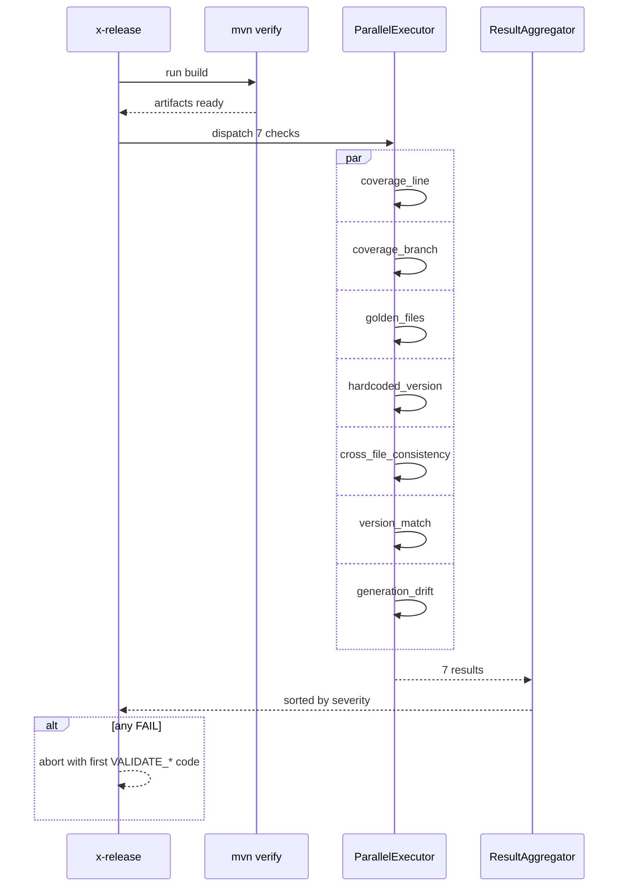

# História: Paralelização de VALIDATE-DEEP

**ID:** story-0039-0004
**Chave Jira:** —
**Status:** Pendente

## 1. Dependências

| Blocked By | Blocks |
| :--- | :--- |
| — | — |

## 2. Regras Transversais Aplicáveis

| ID | Título |
| :--- | :--- |
| RULE-001 | Source-of-truth: gerador, não output |
| RULE-005 | Preservação de codes existentes |

## 3. Descrição

Como **release manager**, eu quero que VALIDATE-DEEP execute seus 8+ checks em paralelo, garantindo redução ≥40% no wall-clock e mantendo todos os `VALIDATE_*` codes atuais.

A fase hoje executa serialmente: build (~3 min), coverage parsing, golden tests, hardcoded version search, cross-file consistency, version match, generation drift. Muitos não dependem entre si — paralelizar entrega ganho real sem alterar semântica.

### 3.1 Estratégia de paralelização

- Identificar checks independentes: 8 dos 9 (build prepara artefatos para coverage parsing → mantém ordem)
- Executar via shell `&` + `wait` ou Java parallel streams + `CompletableFuture`
- Captura de exit codes individuais; agregador consolida
- Output ordenado por severidade na saída (FAIL primeiro, depois WARN)
- Codes preservados (RULE-005): `VALIDATE_BUILD_FAILED`, `VALIDATE_COVERAGE_LINE/BRANCH`, `VALIDATE_GOLDEN_DRIFT`, etc.

### 3.2 Constraints

- Build (`mvn verify`) PRECEDE coverage parsing (depende do `target/site/jacoco/`)
- Demais 7 checks rodam em paralelo após build
- Limite de paralelismo: `min(CPU_COUNT, 4)` por padrão; flag `--max-parallel N` para override

### 3.3 Telemetria

- Logar tempo de cada check no formato `[VALIDATE-DEEP] check-name: 12.3s`
- Phase summary inclui ganho efetivo: `"Wall-clock paralelo: 95s vs sequencial estimado: 187s (-49%)"`

## 3.5 Entrega de Valor

- **Valor Principal:** corta ~50% do tempo da fase mais lenta do release
- **Métrica de Sucesso:** wall-clock VALIDATE-DEEP ≥40% menor em benchmark documentado
- **Impacto no Negócio:** release end-to-end mais rápido; menos espera entre comandos

## 4. Definições de Qualidade Locais

### DoR Local

- [ ] Decisão sobre limite de paralelismo (default `min(CPU,4)`)
- [ ] Estratégia de captura de exit codes definida (subshells + `wait $PID`)
- [ ] Benchmark baseline medido (tempo atual sequencial)

### DoD Local

- [ ] 7 checks rodam em paralelo após build
- [ ] Todos os `VALIDATE_*` codes existentes preservados
- [ ] Saída ordenada por severidade (FAIL → WARN → PASS)
- [ ] `--max-parallel N` funcional
- [ ] Benchmark documentado em PR mostrando ≥40% redução
- [ ] Smoke test confirma que falha em qualquer check ainda aborta a fase

## 5. Contratos de Dados

### 5.1 Input

| Campo | Tipo | M/O | Validações | Exemplo |
| :--- | :--- | :--- | :--- | :--- |
| `--max-parallel <N>` | `Integer` | O | 1-16 | `--max-parallel 4` |

### 5.2 Output (logs estruturados)

```
[VALIDATE-DEEP] starting parallel checks (N=7, max=4)
[VALIDATE-DEEP] coverage_line: 8.2s PASS
[VALIDATE-DEEP] golden_files: 24.1s PASS
[VALIDATE-DEEP] hardcoded_version: 1.3s PASS
...
[VALIDATE-DEEP] all checks complete in 28.4s (sequential estimate: 64.1s, -56%)
```

### 5.3 Error Codes (preservados)

| Exit | Code | Origem |
| :--- | :--- | :--- |
| 1 | `VALIDATE_BUILD_FAILED` | check 4 |
| 1 | `VALIDATE_COVERAGE_LINE` | check 5a |
| 1 | `VALIDATE_COVERAGE_BRANCH` | check 5b |
| 1 | `VALIDATE_GOLDEN_DRIFT` | check 6 |
| 1 | `VALIDATE_HARDCODED_VERSION` | check 7 |
| 1 | `VALIDATE_VERSION_MISMATCH` | check 8 |
| 1 | `VALIDATE_GENERATION_DRIFT` | check 9 |

## 6. Diagramas

### 6.1 Execução paralela



## 7. Critérios de Aceite (Gherkin)

```gherkin
Cenario: Build falha (degenerate)
  DADO um repo onde mvn verify falha
  QUANDO eu rodo /x-release
  ENTÃO VALIDATE-DEEP aborta com VALIDATE_BUILD_FAILED
  E nenhum check paralelo é executado

Cenario: Todos os checks passam (happy path)
  DADO um repo limpo e válido
  QUANDO eu rodo /x-release
  ENTÃO os 7 checks paralelos completam com PASS
  E o wall-clock é menor que o tempo somado dos checks

Cenario: Múltiplas falhas em paralelo (boundary)
  DADO golden_files FAIL e hardcoded_version FAIL
  QUANDO eu rodo /x-release
  ENTÃO ambas falhas aparecem na saída
  E aborta com o primeiro código alfabético: VALIDATE_GOLDEN_DRIFT

Cenario: --max-parallel=1 força sequencial (boundary at-min)
  QUANDO eu rodo /x-release --max-parallel 1
  ENTÃO os checks executam serialmente
  E o resultado final é o mesmo do modo paralelo

Cenario: Benchmark de redução de tempo (acceptance)
  DADO baseline sequencial medido em 187s
  QUANDO eu rodo /x-release com paralelismo padrão
  ENTÃO o wall-clock é ≤ 113s (≥40% redução)
```

### 7.1 TPP Ordering

Degenerate (build falha) → happy → boundary (multiplas falhas, --max-parallel=1) → acceptance benchmark.

### 7.2 Mandatory Categories

- [x] Degenerate: build falha
- [x] Happy path: paralelismo padrão
- [x] Error: múltiplas falhas
- [x] Boundary: --max-parallel=1, benchmark

## 8. Tasks

### TASK-0039-0004-001: `ParallelCheckExecutor` core

- **Layer:** Application
- **Test Type:** Unit
- **Size:** M
- **Dependencies:** —
- **Branch:** `feat/task-0039-0004-001-parallel-executor`
- **Testability:** UseCase + AT
- **Files:**
  - `java/src/main/java/dev/iadev/release/validate/ParallelCheckExecutor.java`
  - `java/src/test/java/dev/iadev/release/validate/ParallelCheckExecutorTest.java`
- **Acceptance Criteria:**
  - [ ] Despacha N tasks em pool de tamanho `min(CPU,4)`
  - [ ] Captura exit code + duração de cada
  - [ ] Aggregator ordena por severidade

### TASK-0039-0004-002: Reescrever VALIDATE-DEEP em SKILL.md (shell parallel)

- **Layer:** Doc
- **Test Type:** Verification
- **Size:** L
- **Dependencies:** TASK-0039-0004-001
- **Branch:** `feat/task-0039-0004-002-skill-parallel-validate`
- **Testability:** Config + VerificationTest
- **Files:**
  - `java/src/main/resources/targets/claude/skills/core/x-release/SKILL.md`
- **Acceptance Criteria:**
  - [ ] Bloco bash usa `&` + `wait` para os 7 checks
  - [ ] Captura e ordena failures
  - [ ] Documenta `--max-parallel`

### TASK-0039-0004-003: Benchmark + assertion automatizada

- **Layer:** Test
- **Test Type:** Performance
- **Size:** M
- **Dependencies:** TASK-0039-0004-002
- **Branch:** `feat/task-0039-0004-003-benchmark`
- **Testability:** UseCase + AT
- **Files:**
  - `java/src/test/java/dev/iadev/release/validate/ValidateDeepBenchmarkTest.java`
- **Acceptance Criteria:**
  - [ ] Mede tempo sequencial vs paralelo num fixture
  - [ ] Asserta redução ≥ 40%

### TASK-0039-0004-004: Smoke — falha simulada em check paralelo

- **Layer:** Test
- **Test Type:** Smoke
- **Size:** S
- **Dependencies:** TASK-0039-0004-002
- **Branch:** `feat/task-0039-0004-004-smoke-parallel-fail`
- **Testability:** Migration + Smoke
- **Files:**
  - `java/src/test/java/dev/iadev/smoke/ValidateDeepParallelSmokeTest.java`
- **Acceptance Criteria:**
  - [ ] Force fail no golden check; valida abort com `VALIDATE_GOLDEN_DRIFT`
