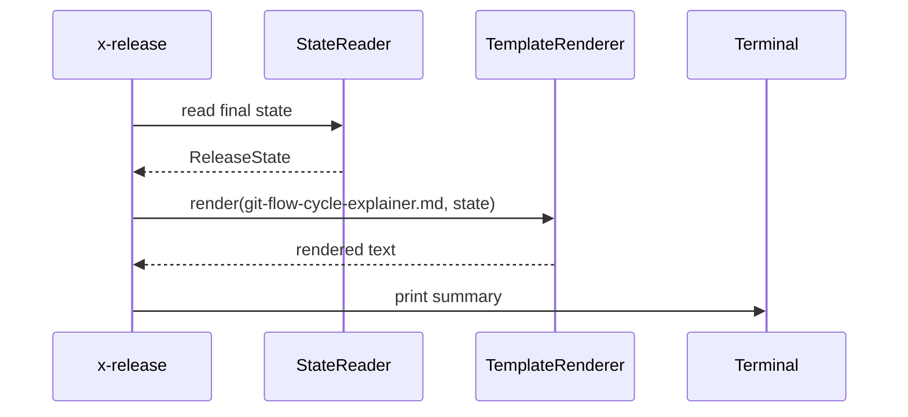

# História: Phase SUMMARY com diagrama Git Flow

**ID:** story-0039-0005
**Chave Jira:** —
**Status:** Concluída

## 1. Dependências

| Blocked By | Blocks |
| :--- | :--- |
| — | story-0039-0014 |

## 2. Regras Transversais Aplicáveis

| ID | Título |
| :--- | :--- |
| RULE-001 | Source-of-truth: gerador, não output |

## 3. Descrição

Como **release manager**, eu quero que `/x-release` finalize com um summary visual mostrando o ciclo Git Flow completo e versões reais, garantindo que o operador entenda por que main/develop legitimamente divergem (pergunta recorrente).

Hoje a skill exit silenciosa após CLEANUP. Operadores frequentemente perguntam "por que develop tem 3 commits a mais que main?". Esta story adiciona Phase 13 SUMMARY que renderiza diagrama ASCII Git Flow adaptativo (com versões reais lidas do state file) + explicação contextual da divergência. Read-only.

### 3.1 Conteúdo do summary

- Diagrama ASCII com 3 últimas tags + versão atual + próximo SNAPSHOT
- PR numbers reais do state file (release PR + back-merge PR)
- Bloco "Por que main e develop divergem" com explicação adaptada
- Lista de artefatos criados (tag, GitHub Release URL se aplicável, PRs)

### 3.2 Template-driven

- Template em `references/git-flow-cycle-explainer.md` com placeholders `{{LAST_TAG}}`, `{{NEW_TAG}}`, `{{NEXT_SNAPSHOT}}`, `{{RELEASE_PR}}`, `{{BACKMERGE_PR}}`, `{{GITHUB_RELEASE_URL}}`
- Renderização lê state file e substitui

### 3.3 Posicionamento

- Phase 13 sempre (mesmo após CLEANUP); read-only, sem efeitos colaterais
- Skipável via `--no-summary` para CI (output verboso)

## 3.5 Entrega de Valor

- **Valor Principal:** elimina a pergunta "por que main difere de develop?" — operador entende ciclo ao final
- **Métrica de Sucesso:** zero perguntas pós-release sobre divergência main/develop em equipes que usam a skill
- **Impacto no Negócio:** reduz overhead cognitivo; menos suporte de tech leads explicando Git Flow

## 4. Definições de Qualidade Locais

### DoR Local

- [ ] Template `git-flow-cycle-explainer.md` aprovado com Tech Lead
- [ ] Lista exata de placeholders fechada
- [ ] Decisão sobre `--no-summary` ratificada

### DoD Local

- [ ] Phase 13 SUMMARY adicionada à fase list de SKILL.md
- [ ] Template renderizado com versões reais
- [ ] `--no-summary` funcional
- [ ] Diagrama ASCII visualmente correto em terminal 80 colunas
- [ ] Smoke valida render correto após release fictício

## 5. Contratos de Dados

### 5.1 Input (state file fields consumidos)

| Campo | Origem | Exemplo |
| :--- | :--- | :--- |
| `version` | state | `3.2.0` |
| `previousVersion` | state (S01) | `3.1.0` |
| `prNumber` | state | `297` |
| `githubReleaseUrl` | state (S06) | `https://...` |

### 5.2 Output (template renderizado)

```
=== RELEASE v3.2.0 COMPLETED ===

main:     v3.0.0 ──── v3.1.0 ──────── v3.2.0 ──
                                          ↑
                                 (PR #297 merged)
                                          │
release:                          release/3.2.0
                                          │   ↓ back-merge
develop:  ──●──●──●──●──●──●──●──●──●──●──●──●──
            3.1.0-SNAPSHOT          3.3.0-SNAPSHOT

Por que main e develop divergem:
  main = última release publicada (v3.2.0)
  develop = próxima release em desenvolvimento (3.3.0-SNAPSHOT)
  ...

Artefatos criados:
- Tag: v3.2.0
- GitHub Release: https://github.com/owner/repo/releases/tag/v3.2.0
- PRs: #297 (release), #298 (back-merge)
```

### 5.3 Error Codes

| Exit | Code | Condição |
| :--- | :--- | :--- |
| — | — | Phase 13 não emite codes (read-only) |

## 6. Diagramas

### 6.1 Render flow



## 7. Critérios de Aceite (Gherkin)

```gherkin
Cenario: SUMMARY exibido após CLEANUP (happy path)
  DADO uma release v3.2.0 que completou todas as fases
  QUANDO Phase 13 SUMMARY executa
  ENTÃO o terminal exibe diagrama ASCII com v3.1.0, v3.2.0, 3.3.0-SNAPSHOT
  E o bloco "Por que main e develop divergem" é exibido

Cenario: --no-summary suprime output (boundary)
  DADO release v3.2.0 completa
  QUANDO eu rodo /x-release --continue-after-merge --no-summary
  ENTÃO o output não contém o diagrama ASCII

Cenario: GitHub Release URL ausente — bloco omitido (degenerate)
  DADO release sem GitHub Release criado
  QUANDO Phase 13 executa
  ENTÃO o summary não menciona "GitHub Release"

Cenario: Diagrama cabe em 80 colunas (boundary)
  DADO uma release qualquer
  QUANDO eu renderizo o summary
  ENTÃO nenhuma linha excede 80 caracteres

Cenario: State file corrompido — render gracioso (error)
  DADO state file com campos faltando
  QUANDO Phase 13 tenta render
  ENTÃO exibe summary parcial com placeholders "—" para campos ausentes
  E não falha
```

### 7.1 TPP Ordering

Happy → boundary (--no-summary, 80 col) → degenerate (URL ausente) → error (state corrompido).

### 7.2 Mandatory Categories

- [x] Degenerate: URL ausente
- [x] Happy path: render completo
- [x] Error: state corrompido
- [x] Boundary: --no-summary, 80 col limit

## 8. Tasks

### TASK-0039-0005-001: Template `git-flow-cycle-explainer.md`

- **Layer:** Doc
- **Test Type:** Verification
- **Size:** M
- **Dependencies:** —
- **Branch:** `feat/task-0039-0005-001-cycle-explainer-template`
- **Testability:** Config + VerificationTest
- **Files:**
  - `java/src/main/resources/targets/claude/skills/core/x-release/references/git-flow-cycle-explainer.md`
- **Acceptance Criteria:**
  - [ ] Template com 6 placeholders: LAST_TAG, NEW_TAG, NEXT_SNAPSHOT, RELEASE_PR, BACKMERGE_PR, GITHUB_RELEASE_URL
  - [ ] ASCII art cabe em 80 col

### TASK-0039-0005-002: `SummaryRenderer`

- **Layer:** Application
- **Test Type:** Unit
- **Size:** M
- **Dependencies:** TASK-0039-0005-001
- **Branch:** `feat/task-0039-0005-002-summary-renderer`
- **Testability:** UseCase + AT
- **Files:**
  - `java/src/main/java/dev/iadev/release/summary/SummaryRenderer.java`
  - `java/src/test/java/dev/iadev/release/summary/SummaryRendererTest.java`
- **Acceptance Criteria:**
  - [ ] Substitui placeholders por valores do state
  - [ ] Omite blocos quando campos ausentes (graceful)

### TASK-0039-0005-003: SKILL.md — Phase 13 SUMMARY

- **Layer:** Doc
- **Test Type:** Verification
- **Size:** S
- **Dependencies:** TASK-0039-0005-001
- **Branch:** `feat/task-0039-0005-003-skill-phase-13`
- **Testability:** Config + VerificationTest
- **Files:**
  - `java/src/main/resources/targets/claude/skills/core/x-release/SKILL.md`
- **Acceptance Criteria:**
  - [ ] Phase 13 documentada na fase list
  - [ ] `--no-summary` flag listado

### TASK-0039-0005-004: Smoke — render full cycle

- **Layer:** Test
- **Test Type:** Smoke
- **Size:** S
- **Dependencies:** TASK-0039-0005-002
- **Branch:** `feat/task-0039-0005-004-smoke-summary-render`
- **Testability:** Migration + Smoke
- **Files:**
  - `java/src/test/java/dev/iadev/smoke/SummaryRenderSmokeTest.java`
- **Acceptance Criteria:**
  - [ ] State file completo → render contém todas as 6 substituições
