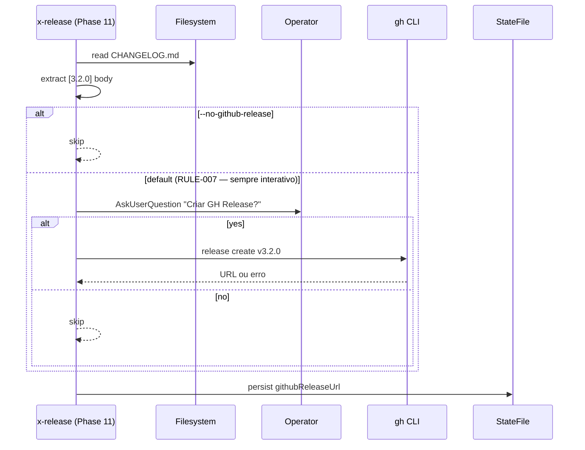

# História: GitHub Release automático com confirmação

**ID:** story-0039-0006
**Chave Jira:** —
**Status:** Pendente

## 1. Dependências

| Blocked By | Blocks |
| :--- | :--- |
| — | — |

## 2. Regras Transversais Aplicáveis

| ID | Título |
| :--- | :--- |
| RULE-001 | Source-of-truth: gerador, não output |
| RULE-004 | Prompts têm equivalente não-interativo |
| RULE-007 | Confirmação obrigatória para GitHub Release |

## 3. Descrição

Como **release manager**, eu quero que após o push da tag, a skill pergunte se desejo criar um GitHub Release automaticamente, garantindo que release notes fiquem visíveis no GitHub sem precisar criar manualmente.

Hoje a tag é pushed mas nenhum GitHub Release é criado. Operadores que querem release notes públicas precisam ir no GitHub e criar manualmente. Esta story automatiza a criação com body extraído da seção `[X.Y.Z]` do CHANGELOG, sempre com confirmação explícita (RULE-007), e flag `--no-github-release` para CI.

### 3.1 Fluxo

- Posicionado em Phase 11 PUBLISH, após `git push origin v<X.Y.Z>` bem-sucedido
- Extrai body do CHANGELOG: tudo entre `## [<version>]` e o próximo `## [`
- AskUserQuestion: "Criar GitHub Release v3.2.0? (Y/n)"
  - Y: `gh release create v3.2.0 --notes "<extracted_body>" --title "v3.2.0"`
  - n: pula sem erro
- Persiste `githubReleaseUrl` no state file (consumido por S05 Phase SUMMARY)

### 3.2 Modo não-interativo

- `--no-github-release`: pula sem perguntar (uso típico em CI)
- Não existe modo "auto-create sem prompt": RULE-007 é estrita — quando a criação está habilitada, a confirmação é SEMPRE obrigatória. Para automação total em CI, use `--no-github-release` e crie o GitHub Release num step subsequente do pipeline com auditoria explícita

### 3.3 Edge cases

- CHANGELOG sem entry para a versão → exibe warning, oferece criar com body genérico ou pular
- `gh release create` falha (auth, rate limit) → warn-only (não aborta o fluxo; tag já está publicada)

## 3.5 Entrega de Valor

- **Valor Principal:** release notes públicas no GitHub sem passo manual
- **Métrica de Sucesso:** ≥80% das releases pós-implementação têm GitHub Release populado
- **Impacto no Negócio:** stakeholders externos (consumidores da CLI, contributors) descobrem novidades direto no GitHub Releases tab

## 4. Definições de Qualidade Locais

### DoR Local

- [ ] `gh` CLI presente como dependência (já está, RULE-001)
- [ ] Conformidade com RULE-007 ratificada (sem modo auto-create silencioso)
- [ ] Comportamento em rate-limit definido (warn-only)

### DoD Local

- [ ] Phase 11 PUBLISH SEMPRE pergunta quando habilitada (RULE-007)
- [ ] `--no-github-release` desliga a etapa sem prompt
- [ ] CHANGELOG body extraído corretamente (entre fences `[X.Y.Z]` e `[próximo]`)
- [ ] `githubReleaseUrl` salvo no state
- [ ] Falha em `gh release create` é warn-only
- [ ] Smoke test cria release num repo fixture

## 5. Contratos de Dados

### 5.1 Input (CLI flags)

| Campo | Tipo | M/O | Validações | Exemplo |
| :--- | :--- | :--- | :--- | :--- |
| `--no-github-release` | flag | O | desliga a etapa em CI | `--no-github-release` |

### 5.2 Output

| Campo | Tipo | Sempre presente | Descrição |
| :--- | :--- | :--- | :--- |
| `githubReleaseUrl` | `String\|null` | Não | URL retornada por `gh release create` |

### 5.3 Error Codes

| Exit | Code | Condição |
| :--- | :--- | :--- |
| — | `PUBLISH_GH_RELEASE_FAILED` | warn-only; não aborta release |
| 1 | `PUBLISH_UNKNOWN_FLAG` | flag desconhecida em PUBLISH (defensivo) |

## 6. Diagramas

### 6.1 Fluxo de criação



## 7. Critérios de Aceite (Gherkin)

```gherkin
Cenario: --no-github-release pula etapa (degenerate)
  DADO uma release v3.2.0 chegando em PUBLISH
  QUANDO eu rodo /x-release --continue-after-merge --no-github-release
  ENTÃO a tag é pushed
  E nenhum GitHub Release é criado
  E o state tem githubReleaseUrl=null

Cenario: Modo interativo cria após confirmação Y (happy path)
  DADO PUBLISH chegando interativo
  QUANDO o operador responde "Y" ao prompt
  ENTÃO gh release create é invocado
  E githubReleaseUrl é salvo no state

Cenario: Operador responde "n" no prompt (boundary)
  DADO PUBLISH chegando interativo
  QUANDO o operador responde "n"
  ENTÃO nenhum GitHub Release é criado
  E githubReleaseUrl=null
  E a fase continua normalmente

Cenario: gh CLI falha — warn-only (error)
  DADO gh CLI retorna erro de auth
  QUANDO PUBLISH chega
  ENTÃO o warning PUBLISH_GH_RELEASE_FAILED é exibido
  E a fase NÃO aborta
  E githubReleaseUrl=null

Cenario: CHANGELOG sem entry para a versão (degenerate)
  DADO CHANGELOG.md sem seção [3.2.0]
  QUANDO PUBLISH chega
  ENTÃO o operador é avisado e oferecido criar com body genérico ou pular
```

### 7.1 TPP Ordering

Degenerate (skip via --no-github-release, sem entry) → happy (Y) → boundary (n no prompt) → error (gh fail).

### 7.2 Mandatory Categories

- [x] Degenerate: --no-github-release
- [x] Happy path: confirmação Y
- [x] Error: gh falha, mutex
- [x] Boundary: operador responde "n" no prompt

## 8. Tasks

### TASK-0039-0006-001: `ChangelogBodyExtractor` (pure)

- **Layer:** Domain
- **Test Type:** Unit
- **Size:** S
- **Dependencies:** —
- **Branch:** `feat/task-0039-0006-001-changelog-extractor`
- **Testability:** Domain + UnitTest
- **Files:**
  - `java/src/main/java/dev/iadev/release/changelog/ChangelogBodyExtractor.java`
  - `java/src/test/java/dev/iadev/release/changelog/ChangelogBodyExtractorTest.java`
- **Acceptance Criteria:**
  - [ ] Extrai conteúdo entre `## [X.Y.Z]` e próximo `## [`
  - [ ] Retorna `Optional.empty()` se versão não existe

### TASK-0039-0006-002: SKILL.md — bloco GitHub Release em Phase 11

- **Layer:** Doc
- **Test Type:** Verification
- **Size:** M
- **Dependencies:** TASK-0039-0006-001
- **Branch:** `feat/task-0039-0006-002-skill-gh-release`
- **Testability:** Config + VerificationTest
- **Files:**
  - `java/src/main/resources/targets/claude/skills/core/x-release/SKILL.md`
- **Acceptance Criteria:**
  - [ ] Bloco bash com 3 paths (skip/auto/interactive)
  - [ ] Flags mutex documentados
  - [ ] `PUBLISH_GH_RELEASE_FAILED` no error catalog (warn-only)

### TASK-0039-0006-003: Smoke — release create num repo fixture

- **Layer:** Test
- **Test Type:** Smoke
- **Size:** M
- **Dependencies:** TASK-0039-0006-002
- **Branch:** `feat/task-0039-0006-003-smoke-gh-release`
- **Testability:** Migration + Smoke
- **Files:**
  - `java/src/test/java/dev/iadev/smoke/GithubReleaseSmokeTest.java`
- **Acceptance Criteria:**
  - [ ] Mock de `gh release create`; valida invocação correta
  - [ ] State persiste URL retornada
