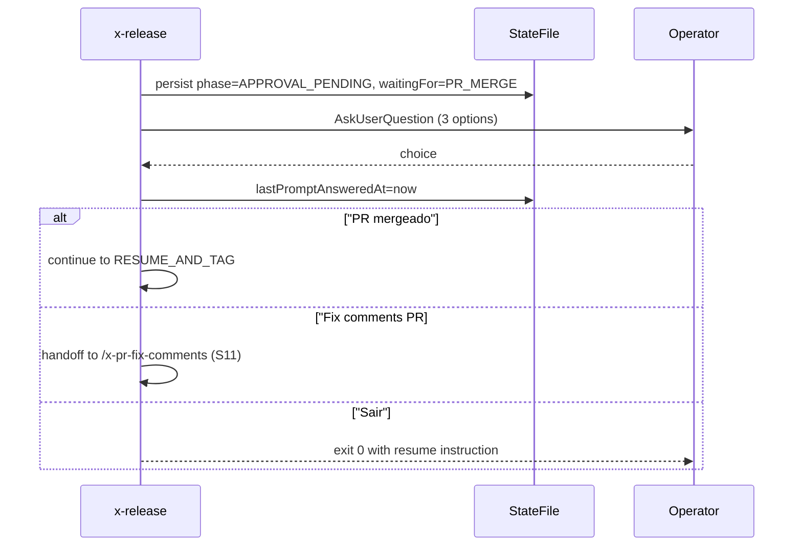

# História: Engine de prompts interativos em pontos de pausa

**ID:** story-0039-0007
**Chave Jira:** —
**Status:** Pendente

## 1. Dependências

| Blocked By | Blocks |
| :--- | :--- |
| story-0039-0002 | story-0039-0011, story-0039-0013, story-0039-0014 |

## 2. Regras Transversais Aplicáveis

| ID | Título |
| :--- | :--- |
| RULE-001 | Source-of-truth: gerador, não output |
| RULE-003 | Schema evolution explícito |
| RULE-004 | Prompts têm equivalente não-interativo |

## 3. Descrição

Como **release manager**, eu quero que `/x-release` apresente prompts acionáveis em cada ponto de pausa (APPROVAL_GATE, BACK-MERGE-DEVELOP, falhas recuperáveis), garantindo que eu nunca precise lembrar comandos manuais entre fases.

A skill hoje sai com instruções textuais ("rode `--continue-after-merge`") em pontos de halt. Operadores frequentemente esquecem ou erram comandos. Esta story introduz uma engine baseada em `AskUserQuestion` que persiste opções no state file (`nextActions`/`waitingFor`) e retoma de forma natural.

### 3.1 Pontos de pausa cobertos

- **Phase 8 APPROVAL_GATE** (após release PR criado): "PR mergeado — continuar" / "Rodar /x-pr-fix-comments PR#" / "Sair e retomar depois"
- **Phase 10 BACK-MERGE-DEVELOP** (após back-merge PR criado): mesmas 3 opções com PR de back-merge
- **Falhas recuperáveis** (ex.: push rejeitado por race condition): "Tentar novamente" / "Pular esta etapa" / "Abortar"

### 3.2 Modos não-interativos

- `--no-prompt` (RULE-004): nunca chama `AskUserQuestion`; em halts, persiste state e exit 0 com instrução textual (comportamento atual)
- `--continue-after-merge` continua válido e tem precedência (já era o caminho não-interativo)

### 3.3 Persistência das respostas

- Cada resposta atualiza `nextActions` (próximas opções) e `waitingFor` (estado de halt) no state file v2 (S02)
- `lastPromptAnsweredAt` registra timestamp de cada interação (alimenta telemetria S12)

## 3.5 Entrega de Valor

- **Valor Principal:** elimina necessidade de decorar/colar comandos entre pausas; reduz erros de operador
- **Métrica de Sucesso:** zero releases pós-implementação com state file órfão por 24h+ (todos resumidos via prompt)
- **Impacto no Negócio:** UX consistente; novos operadores conseguem rodar release sem decorar fluxo

## 4. Definições de Qualidade Locais

### DoR Local

- [ ] story-0039-0002 (state v2) mergeada
- [ ] Lista exata de pontos de pausa fechada
- [ ] Decisão sobre comportamento em ambiente non-TTY ratificada (`--no-prompt`)

### DoD Local

- [ ] AskUserQuestion invocado nos 3 pontos cobertos
- [ ] `--no-prompt` desliga prompts e mantém comportamento atual
- [ ] `nextActions` e `waitingFor` populados a cada halt
- [ ] `lastPromptAnsweredAt` atualizado a cada resposta
- [ ] Smoke valida loop interativo completo (mock de respostas)

## 5. Contratos de Dados

### 5.1 Input (CLI flags)

| Campo | Tipo | M/O | Validações | Exemplo |
| :--- | :--- | :--- | :--- | :--- |
| `--no-prompt` | flag | O | desliga AskUserQuestion | `--no-prompt` |

### 5.2 State updates por halt point

| Halt point | `waitingFor` | `nextActions` (labels) |
| :--- | :--- | :--- |
| APPROVAL_GATE | `PR_MERGE` | "PR mergeado", "Fix comments PR#", "Sair" |
| BACK-MERGE-DEVELOP | `BACKMERGE_MERGE` | mesmas 3 opções |
| Recoverable failure | `USER_CONFIRMATION` | "Retry", "Skip", "Abort" |

### 5.3 Error Codes

| Exit | Code | Condição |
| :--- | :--- | :--- |
| 1 | `PROMPT_INVALID_RESPONSE` | usuário fornece input inesperado (não deveria acontecer com AskUserQuestion) |
| 2 | `PROMPT_USER_ABORT` | usuário escolhe "Abortar" em halt recuperável |

## 6. Diagramas

### 6.1 Loop interativo APPROVAL_GATE



## 7. Critérios de Aceite (Gherkin)

```gherkin
Cenario: --no-prompt mantém comportamento atual (degenerate)
  DADO PR criado e Phase 8 atingida
  QUANDO eu rodo /x-release --no-prompt
  ENTÃO o skill exit 0 com instrução textual
  E waitingFor=PR_MERGE persiste

Cenario: Operador escolhe "PR mergeado — continuar" (happy path)
  DADO Phase 8 atingida em modo interativo
  E PR foi mergeado externamente
  QUANDO o operador escolhe "PR mergeado — continuar"
  ENTÃO RESUME_AND_TAG inicia
  E lastPromptAnsweredAt é atualizado

Cenario: Operador escolhe "Sair e retomar depois" (boundary)
  QUANDO operador escolhe "Sair"
  ENTÃO exit 0 com state preservado
  E waitingFor=PR_MERGE permanece para próxima invocação

Cenario: Halt recuperável após push rejeitado (error)
  DADO push rejeitado por race condition
  QUANDO operador escolhe "Retry"
  ENTÃO push é re-tentado
  E em sucesso continua o fluxo

Cenario: Operador escolhe "Abortar" em halt (error path)
  QUANDO operador escolhe "Abortar"
  ENTÃO exit 2 com PROMPT_USER_ABORT
  E state preservado para inspeção
```

### 7.1 TPP Ordering

Degenerate (--no-prompt) → happy → boundary (sair) → error (retry, abort).

### 7.2 Mandatory Categories

- [x] Degenerate: --no-prompt bypassa
- [x] Happy path: continuar normal
- [x] Error: abort, retry
- [x] Boundary: sair e retomar

## 8. Tasks

### TASK-0039-0007-001: `PromptEngine` core

- **Layer:** Application
- **Test Type:** Unit
- **Size:** M
- **Dependencies:** —
- **Branch:** `feat/task-0039-0007-001-prompt-engine`
- **Testability:** UseCase + AT
- **Files:**
  - `java/src/main/java/dev/iadev/release/prompt/PromptEngine.java`
  - `java/src/test/java/dev/iadev/release/prompt/PromptEngineTest.java`
- **Acceptance Criteria:**
  - [ ] Resolve halt point → set de opções
  - [ ] Persiste resposta + timestamp no state
  - [ ] Modo `--no-prompt` retorna default (continuar/exit)

### TASK-0039-0007-002: SKILL.md — bloco interactive em Phase 8 e Phase 10

- **Layer:** Doc
- **Test Type:** Verification
- **Size:** L
- **Dependencies:** TASK-0039-0007-001
- **Branch:** `feat/task-0039-0007-002-skill-prompts`
- **Testability:** Config + VerificationTest
- **Files:**
  - `java/src/main/resources/targets/claude/skills/core/x-release/SKILL.md`
- **Acceptance Criteria:**
  - [ ] Phase 8 e Phase 10 documentam AskUserQuestion + opções
  - [ ] `--no-prompt` listado nos parâmetros

### TASK-0039-0007-003: Reference doc — `prompt-flow.md`

- **Layer:** Doc
- **Test Type:** Verification
- **Size:** S
- **Dependencies:** TASK-0039-0007-002
- **Branch:** `feat/task-0039-0007-003-prompt-flow-doc`
- **Testability:** Config + VerificationTest
- **Files:**
  - `java/src/main/resources/targets/claude/skills/core/x-release/references/prompt-flow.md`
- **Acceptance Criteria:**
  - [ ] Doc cobre 3 halt points + suas opções
  - [ ] Tabela de waitingFor → nextActions

### TASK-0039-0007-004: Smoke — loop interativo completo (mock)

- **Layer:** Test
- **Test Type:** Smoke
- **Size:** M
- **Dependencies:** TASK-0039-0007-001
- **Branch:** `feat/task-0039-0007-004-smoke-prompt-loop`
- **Testability:** Migration + Smoke
- **Files:**
  - `java/src/test/java/dev/iadev/smoke/PromptLoopSmokeTest.java`
- **Acceptance Criteria:**
  - [ ] Simula fluxo: prompt → "Sair" → reinvoca → prompt → "Continuar" → finaliza
  - [ ] State file consistente em cada passo
