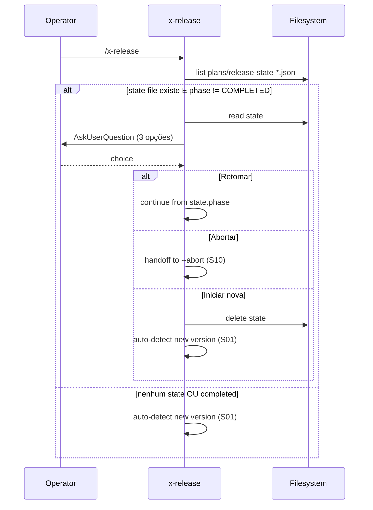

# História: Smart Resume de state files

**ID:** story-0039-0008
**Chave Jira:** —
**Status:** Pendente

## 1. Dependências

| Blocked By | Blocks |
| :--- | :--- |
| story-0039-0001, story-0039-0002 | story-0039-0014 |

## 2. Regras Transversais Aplicáveis

| ID | Título |
| :--- | :--- |
| RULE-001 | Source-of-truth: gerador, não output |
| RULE-009 | Smart Resume substitui STATE_CONFLICT |

## 3. Descrição

Como **release manager**, eu quero que `/x-release` (sem argumentos) detecte state files existentes e ofereça retomar via prompt acionável, em vez de abortar com `STATE_CONFLICT`.

Hoje, se um state file existe (release em andamento), invocar `/x-release X.Y.Z` aborta com `STATE_CONFLICT`. Operadores precisam decifrar o estado, lembrar de `--continue-after-merge` ou apagar o file. Esta story substitui o aborto por prompt: "Retomar release 3.1.0 (fase APPROVAL_PENDING, parada há 2h)?" com 3 opções: retomar / abortar / iniciar novo.

### 3.1 Detecção e prompt

- Ao iniciar (qualquer modo), procurar `plans/release-state-*.json`
- Se encontrado E `phase != COMPLETED`: ler state, calcular tempo desde `lastPhaseCompletedAt`, exibir AskUserQuestion
- Opções:
  - **"Retomar"**: equivale a `--continue-after-merge` (state file dita o caminho)
  - **"Abortar release atual"**: handoff para `--abort` (S10) com double confirm
  - **"Iniciar nova release"**: pede confirmação adicional ("Isso vai sobrescrever o state. Continuar?"); se sim, apaga state e segue auto-detect (S01)

### 3.2 Integração com auto-detect (S01)

- "Iniciar nova release" só aparece como opção quando há commits versionáveis novos desde a tag base do state file ativo
- Caso contrário, oferece apenas "Retomar" / "Abortar"

### 3.3 Comportamento não-interativo

- `--no-prompt` + state file existente → comportamento atual (`STATE_CONFLICT`) preservado para CI
- `--continue-after-merge` ainda funciona como atalho explícito sem prompt

## 3.5 Entrega de Valor

- **Valor Principal:** elimina friction de retomar releases interrompidas; um único comando resolve
- **Métrica de Sucesso:** zero state files órfãos por mais de 24h em equipes que usam a skill (smart resume detecta e oferece resolução)
- **Impacto no Negócio:** menos confusão sobre "qual comando rodar agora?"; menos cleanup manual

## 4. Definições de Qualidade Locais

### DoR Local

- [ ] story-0039-0001 e 0002 mergeadas
- [ ] Decisão sobre threshold de "parada há X tempo" (apenas display, não muda lógica)
- [ ] Comportamento "Iniciar nova" com state ativo ratificado

### DoD Local

- [ ] Smart resume substitui `STATE_CONFLICT` em modo interativo
- [ ] `--no-prompt` preserva `STATE_CONFLICT` para CI
- [ ] 3 opções funcionais e testadas
- [ ] Display de "parada há X" calculado de `lastPhaseCompletedAt`
- [ ] Smoke valida fluxo completo de detect → resume

## 5. Contratos de Dados

### 5.1 State file fields consumidos

| Campo | Origem | Uso |
| :--- | :--- | :--- |
| `phase` | state | filtro phase != COMPLETED |
| `lastPhaseCompletedAt` | state | display "parada há X" |
| `version` | state | display da versão em curso |
| `previousVersion` | state | comparar com tag atual para "Iniciar nova" |

### 5.2 Display do prompt (exemplo)

```
Release em andamento detectada:
  Versão: 3.2.0 (de v3.1.0)
  Fase: APPROVAL_PENDING
  Parada há: 2h 14min

O que deseja fazer?
  [1] Retomar de APPROVAL_PENDING
  [2] Abortar release 3.2.0 (cleanup completo)
  [3] Iniciar nova release (descarta state atual)
```

### 5.3 Error Codes

| Exit | Code | Condição |
| :--- | :--- | :--- |
| 1 | `STATE_CONFLICT` | apenas em `--no-prompt` ou non-TTY |
| 2 | `RESUME_USER_ABORT` | usuário escolhe "Abortar" |

## 6. Diagramas

### 6.1 Decisão de smart resume



## 7. Critérios de Aceite (Gherkin)

```gherkin
Cenario: Sem state file (degenerate)
  DADO nenhum plans/release-state-*.json
  QUANDO eu rodo /x-release
  ENTÃO segue para auto-detect normalmente

Cenario: State file presente — escolhe Retomar (happy path)
  DADO state file v2 com phase=APPROVAL_PENDING
  QUANDO eu rodo /x-release
  E escolho "Retomar"
  ENTÃO continua de RESUME_AND_TAG

Cenario: State file presente — escolhe Iniciar nova (boundary)
  DADO state com previousVersion=v3.1.0 e há novos commits desde v3.1.0
  QUANDO escolho "Iniciar nova" e confirmo
  ENTÃO state antigo é apagado
  E auto-detect calcula nova versão

Cenario: Não há novos commits para iniciar nova (boundary)
  DADO state ativo e zero commits novos desde tag base
  QUANDO o prompt é exibido
  ENTÃO opção "Iniciar nova" não aparece (apenas Retomar/Abortar)

Cenario: --no-prompt com state existente (error path)
  DADO state ativo
  QUANDO eu rodo /x-release --no-prompt
  ENTÃO exit 1 com STATE_CONFLICT (comportamento legado)

Cenario: State file COMPLETED é ignorado (boundary)
  DADO state com phase=COMPLETED de release anterior
  QUANDO rodo /x-release
  ENTÃO segue para auto-detect (state ignorado/limpo)
```

### 7.1 TPP Ordering

Degenerate (sem state) → happy → boundary (iniciar nova, sem novos commits, COMPLETED) → error (--no-prompt).

### 7.2 Mandatory Categories

- [x] Degenerate: sem state
- [x] Happy path: retomar
- [x] Error: --no-prompt aborta legado
- [x] Boundary: iniciar nova, sem commits novos, COMPLETED ignorado

## 8. Tasks

### TASK-0039-0008-001: `StateFileDetector` + age calc (pure)

- **Layer:** Domain
- **Test Type:** Unit
- **Size:** S
- **Dependencies:** —
- **Branch:** `feat/task-0039-0008-001-state-detector`
- **Testability:** Domain + UnitTest
- **Files:**
  - `java/src/main/java/dev/iadev/release/resume/StateFileDetector.java`
  - `java/src/test/java/dev/iadev/release/resume/StateFileDetectorTest.java`
- **Acceptance Criteria:**
  - [ ] Lista state files em `plans/`
  - [ ] Calcula "parada há X" de `lastPhaseCompletedAt`

### TASK-0039-0008-002: `SmartResumeOrchestrator`

- **Layer:** Application
- **Test Type:** Unit
- **Size:** M
- **Dependencies:** TASK-0039-0008-001
- **Branch:** `feat/task-0039-0008-002-smart-resume-orchestrator`
- **Testability:** UseCase + AT
- **Files:**
  - `java/src/main/java/dev/iadev/release/resume/SmartResumeOrchestrator.java`
  - `java/src/test/java/dev/iadev/release/resume/SmartResumeOrchestratorTest.java`
- **Acceptance Criteria:**
  - [ ] Decide entre prompt vs auto-detect
  - [ ] Filtra opção "Iniciar nova" quando sem commits novos
  - [ ] `--no-prompt` rota legado

### TASK-0039-0008-003: SKILL.md — Step 0.5 Smart Resume

- **Layer:** Doc
- **Test Type:** Verification
- **Size:** M
- **Dependencies:** TASK-0039-0008-002
- **Branch:** `feat/task-0039-0008-003-skill-smart-resume`
- **Testability:** Config + VerificationTest
- **Files:**
  - `java/src/main/resources/targets/claude/skills/core/x-release/SKILL.md`
- **Acceptance Criteria:**
  - [ ] Step 0.5 documenta detecção e prompt
  - [ ] STATE_CONFLICT removido do happy path; preservado em --no-prompt
  - [ ] RESUME_USER_ABORT no error catalog

### TASK-0039-0008-004: Smoke — fluxo Detect → Retomar

- **Layer:** Test
- **Test Type:** Smoke
- **Size:** S
- **Dependencies:** TASK-0039-0008-002
- **Branch:** `feat/task-0039-0008-004-smoke-resume`
- **Testability:** Migration + Smoke
- **Files:**
  - `java/src/test/java/dev/iadev/smoke/SmartResumeSmokeTest.java`
- **Acceptance Criteria:**
  - [ ] Cria state fixture, simula prompt "Retomar", valida continuação

### 8.1 Detailed Tasks (generated by x-story-plan)

| # | Task ID | Description | Type | TDD Phase | Layer | Depends On | Effort |
|---|---------|-------------|------|-----------|-------|-----------|--------|
| 1 | TASK-001 | StateFileDetector + age calc with path traversal guard | implementation | RED→GREEN | domain | — | S |
| 2 | TASK-002 | SmartResumeOrchestrator with prompt/no-prompt routing + new-commits filter | implementation | RED→GREEN | application | TASK-001 | M |
| 3 | TASK-003 | SKILL.md Step 0.5 Smart Resume + error code catalog | documentation | N/A | config | TASK-002 | M |
| 4 | TASK-004 | Smoke test detect → retomar → continue flow | test (smoke) | VERIFY | test | TASK-002 | S |
| 5 | TASK-005 | Quality gate: coverage, layering, method/class size | quality-gate | VERIFY | cross-cutting | TASK-003, TASK-004 | S |
| 6 | TASK-006 | PO validation: 6 Gherkin scenarios mapped to tests | validation | VERIFY | cross-cutting | TASK-005 | S |

> Generated by `/x-story-plan` on 2026-04-15. See `plans/epic-0039/plans/tasks-story-0039-0008.md` for full breakdown.
