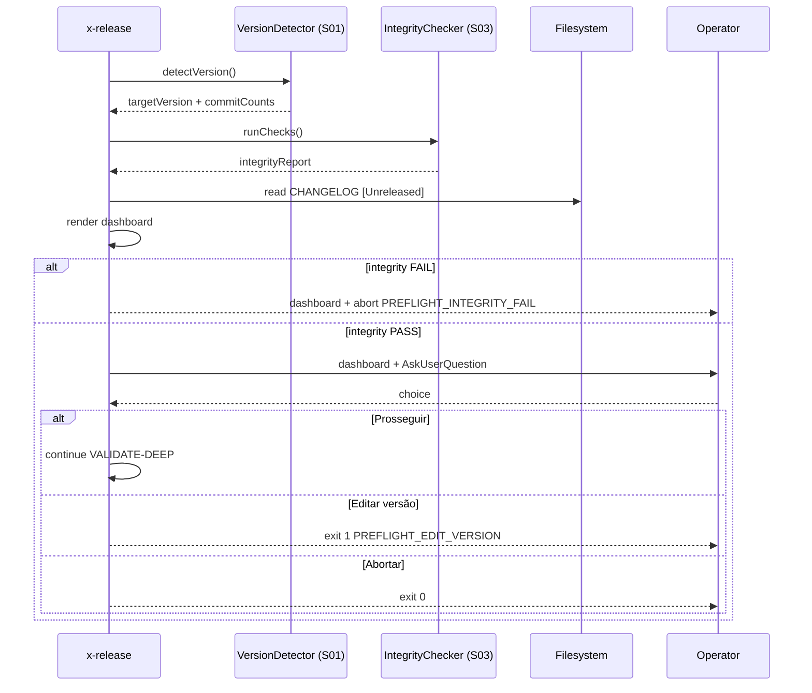

# História: Pre-flight dashboard antes do release

**ID:** story-0039-0009
**Chave Jira:** —
**Status:** Concluída

## 1. Dependências

| Blocked By | Blocks |
| :--- | :--- |
| story-0039-0001, story-0039-0003 | story-0039-0013, story-0039-0014 |

## 2. Regras Transversais Aplicáveis

| ID | Título |
| :--- | :--- |
| RULE-001 | Source-of-truth: gerador, não output |
| RULE-002 | Conventional Commits para auto-versão |
| RULE-004 | Prompts têm equivalente não-interativo |

## 3. Descrição

Como **release manager**, eu quero ver um painel resumo com versão, contagem de commits, preview do CHANGELOG, branches/PRs a serem criados e resultado de integrity checks ANTES da skill cortar a branch de release, garantindo que erros sejam pegos antes de qualquer mutação.

A combinação de auto-version (S01) + integrity (S03) gera todas as informações necessárias para esse painel. O dashboard agrega tudo em uma única tela e pede confirmação única ("Prosseguir? sim/editar versão/abortar"). Reduz drasticamente o cognitive load.

### 3.1 Conteúdo do dashboard

```
=== PRE-FLIGHT — release v3.2.0 ===

Versão detectada:    3.2.0 (MINOR — auto)
Última tag:          v3.1.0 (12 dias atrás)
Commits desde tag:   14 (7 feat, 2 fix, 0 breaking, 5 ignored)

CHANGELOG preview ([3.2.0]):
  ### Added
  - EPIC-0036: ...
  - EPIC-0037: ...
  ### Fixed
  - fix: corrige X
  (10 linhas omitidas)

Integrity checks: ✓ PASS
  ✓ changelog_unreleased_non_empty
  ✓ version_alignment
  ✓ no_new_todos

Plano de execução:
  1. Criar branch release/3.2.0 from develop
  2. Bump pom.xml → 3.2.0
  3. CHANGELOG: [Unreleased] → [3.2.0]
  4. Commit + push
  5. PR release/3.2.0 → main
```

### 3.2 Prompt único

- AskUserQuestion: "Prosseguir com release v3.2.0?"
- Opções:
  - **"Sim, prosseguir"**: continua VALIDATE-DEEP → BRANCHED → ...
  - **"Editar versão (--version)"**: aborta com instrução para reinvocar com `--version X.Y.Z`
  - **"Abortar"**: exit 0 sem efeitos colaterais

### 3.3 Integração com fases existentes

- Posicionado entre Step 1 DETERMINE e Step 2 VALIDATE-DEEP
- Reusa output de S01 (versão detectada) e roda S03 integrity checks como parte da preview
- Bypassável via `--no-preflight` para CI

## 3.5 Entrega de Valor

- **Valor Principal:** confirma intenção do release num único painel; pega 80% dos erros antes de tocar branches
- **Métrica de Sucesso:** ≥ 50% dos releases pós-implementação cancelados no preflight são por motivos válidos (versão errada, changelog vazio) — NÃO por friction
- **Impacto no Negócio:** reduz PRs "fix" pós-release; menos retrabalho

## 4. Definições de Qualidade Locais

### DoR Local

- [ ] S01 e S03 mergeadas
- [ ] Layout do dashboard validado com Tech Lead (caber em 80 col)
- [ ] Decisão sobre quantas linhas do CHANGELOG mostrar (default: 10)

### DoD Local

- [ ] Dashboard renderiza com dados reais
- [ ] Preview do CHANGELOG limitado a N linhas com indicador de "X linhas omitidas"
- [ ] 3 opções funcionais
- [ ] `--no-preflight` funcional
- [ ] Smoke valida render + prompt + cada path (sim/editar/abortar)

## 5. Contratos de Dados

### 5.1 Input (CLI flags)

| Campo | Tipo | M/O | Exemplo |
| :--- | :--- | :--- | :--- |
| `--no-preflight` | flag | O | `--no-preflight` |
| `--preflight-changelog-lines <N>` | Integer | O | `--preflight-changelog-lines 20` |

### 5.2 Output (dashboard fields)

| Campo | Origem | Sempre presente |
| :--- | :--- | :--- |
| `targetVersion` | S01 | Sim |
| `previousVersion` | S01 | Não (null em primeira release) |
| `lastTagAge` | calculado | Sim |
| `commitCounts` | S01 | Sim |
| `changelogPreview` | extraído do `[Unreleased]` | Sim (pode estar truncado) |
| `integrityResults` | S03 | Sim |
| `executionPlan` | enumerado fixo | Sim |

### 5.3 Error Codes

| Exit | Code | Condição |
| :--- | :--- | :--- |
| 0 | — | "Abortar" no prompt (exit limpo) |
| 1 | `PREFLIGHT_INTEGRITY_FAIL` | integrity FAIL, dashboard exibe e aborta sem prompt |
| 1 | `PREFLIGHT_EDIT_VERSION` | "Editar versão" — exit com instrução |

## 6. Diagramas

### 6.1 Pre-flight flow



## 7. Critérios de Aceite (Gherkin)

```gherkin
Cenario: Integrity FAIL — dashboard aborta sem prompt (degenerate)
  DADO CHANGELOG [Unreleased] vazio
  QUANDO eu rodo /x-release
  ENTÃO o dashboard exibe integrity FAIL
  E aborta com PREFLIGHT_INTEGRITY_FAIL sem perguntar

Cenario: Operador prossegue (happy path)
  DADO integrity PASS e versão auto-detectada
  QUANDO operador escolhe "Prosseguir"
  ENTÃO VALIDATE-DEEP inicia

Cenario: Operador escolhe editar versão (boundary)
  QUANDO operador escolhe "Editar versão"
  ENTÃO exit 1 com PREFLIGHT_EDIT_VERSION
  E mensagem instrui rerun com --version X.Y.Z

Cenario: Operador aborta no preflight (boundary)
  QUANDO operador escolhe "Abortar"
  ENTÃO exit 0 sem mutação de branch ou state

Cenario: --no-preflight bypassa (boundary)
  QUANDO eu rodo /x-release --no-preflight
  ENTÃO o dashboard não é renderizado
  E vai direto para VALIDATE-DEEP

Cenario: Preview com changelog longo é truncado (boundary at-max)
  DADO [Unreleased] com 50 linhas
  QUANDO o dashboard renderiza
  ENTÃO mostra primeiras 10 linhas + "(40 linhas omitidas)"
```

### 7.1 TPP Ordering

Degenerate (integrity FAIL) → happy → boundary (editar, abortar, --no-preflight, truncate).

### 7.2 Mandatory Categories

- [x] Degenerate: integrity FAIL
- [x] Happy path: prosseguir
- [x] Error: editar (exit 1)
- [x] Boundary: --no-preflight, truncate, abortar limpo

## 8. Tasks

### TASK-0039-0009-001: `PreflightDashboardRenderer`

- **Layer:** Application
- **Test Type:** Unit
- **Size:** M
- **Dependencies:** —
- **Branch:** `feat/task-0039-0009-001-preflight-renderer`
- **Testability:** UseCase + AT
- **Files:**
  - `java/src/main/java/dev/iadev/release/preflight/PreflightDashboardRenderer.java`
  - `java/src/test/java/dev/iadev/release/preflight/PreflightDashboardRendererTest.java`
- **Acceptance Criteria:**
  - [ ] Compõe seção Versão + Commits + CHANGELOG + Integrity + Plano
  - [ ] Trunca CHANGELOG se > N linhas

### TASK-0039-0009-002: SKILL.md — Step 1.5 Pre-flight

- **Layer:** Doc
- **Test Type:** Verification
- **Size:** M
- **Dependencies:** TASK-0039-0009-001
- **Branch:** `feat/task-0039-0009-002-skill-preflight`
- **Testability:** Config + VerificationTest
- **Files:**
  - `java/src/main/resources/targets/claude/skills/core/x-release/SKILL.md`
- **Acceptance Criteria:**
  - [ ] Step 1.5 documenta dashboard + 3 opções
  - [ ] Flags `--no-preflight`, `--preflight-changelog-lines` listadas

### TASK-0039-0009-003: Smoke — fluxos do prompt

- **Layer:** Test
- **Test Type:** Smoke
- **Size:** M
- **Dependencies:** TASK-0039-0009-001
- **Branch:** `feat/task-0039-0009-003-smoke-preflight`
- **Testability:** Migration + Smoke
- **Files:**
  - `java/src/test/java/dev/iadev/smoke/PreflightDashboardSmokeTest.java`
- **Acceptance Criteria:**
  - [ ] Cobre os 3 paths: prosseguir / editar / abortar
  - [ ] Cenário com integrity FAIL valida exit code
