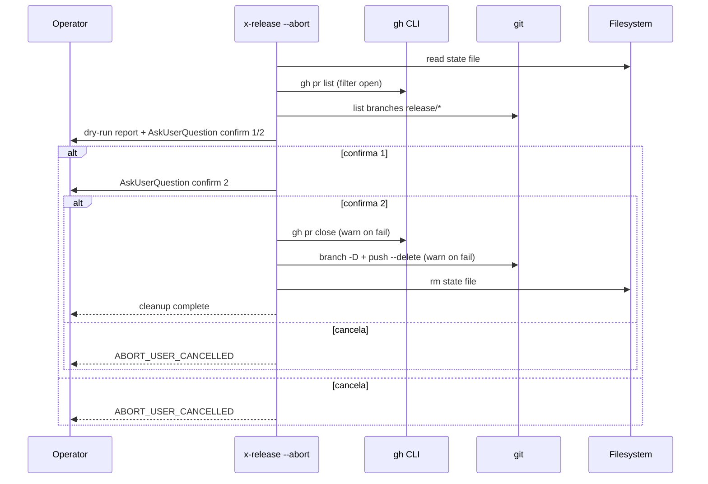

# História: Operational commands `--status` e `--abort`

**ID:** story-0039-0010
**Chave Jira:** —
**Status:** Concluída

## 1. Dependências

| Blocked By | Blocks |
| :--- | :--- |
| story-0039-0002 | — |

## 2. Regras Transversais Aplicáveis

| ID | Título |
| :--- | :--- |
| RULE-001 | Source-of-truth: gerador, não output |
| RULE-010 | Cleanup seguro com double-confirm |

## 3. Descrição

Como **release manager**, eu quero comandos `/x-release --status` e `/x-release --abort` para inspecionar e limpar releases em andamento, garantindo visibilidade do estado e cleanup seguro de releases abandonadas.

Hoje não há comando para "ver o que está acontecendo" sem parsear o JSON manualmente. Tampouco há cleanup seguro — operadores que abandonam releases removem state file na mão, mas branches/PRs ficam órfãos. Esta story formaliza ambas operações.

### 3.1 `--status` (read-only)

- Sem state file: imprime "Nenhuma release em andamento" (exit 0)
- Com state file: imprime fase, versão, PRs abertos (com URLs), `nextActions` sugeridas, tempo desde última atividade
- Não modifica nada — funciona em qualquer lugar (incluindo branches arbitrárias)

### 3.2 `--abort` (cleanup seguro)

- Lista recursos a destruir: state file, branch local `release/*`, branch remota `release/*`, PRs abertos
- AskUserQuestion: "Confirmar abortar release v3.2.0? Os recursos acima serão removidos permanentemente."
- Após confirmação 1: AskUserQuestion adicional "Tem certeza absoluta? Esta operação é IRREVERSÍVEL."
- Só após dupla confirmação executa: `gh pr close`, `git branch -D`, `git push --delete`, `rm state file`
- Falha em fechar PR ou deletar branch é warn-only (não bloqueia outras etapas)

### 3.3 Bypass não-interativo

- `--abort --yes` (alias `--force`): pula AMBAS confirmações (perigoso; loga warning "FORCE MODE"). `--force` é alias estrito de `--yes` — comportamento idêntico
- `--no-prompt` em `--abort`: equivalente a `--yes`
- `--status` não tem prompts (sempre read-only)

## 3.5 Entrega de Valor

- **Valor Principal:** `--status` dá visibilidade instantânea; `--abort` cleanup seguro elimina recursos órfãos
- **Métrica de Sucesso:** zero releases abandonadas com PR/branch órfãos pós-implementação; operadores usam `--status` antes de cada decisão
- **Impacto no Negócio:** reduz tempo de troubleshooting; menos cleanup manual de tech leads

## 4. Definições de Qualidade Locais

### DoR Local

- [ ] story-0039-0002 mergeada
- [ ] Decisão sobre `--force` ratificada (sim, mas warn)
- [ ] Lista exata de recursos a limpar fechada

### DoD Local

- [ ] `--status` funciona com e sem state file
- [ ] `--abort` exige dupla confirmação em modo interativo
- [ ] `--abort --yes` pula confirmações com warning
- [ ] Falhas de cleanup são warn-only
- [ ] Smoke valida cleanup completo num fixture

## 5. Contratos de Dados

### 5.1 Input (CLI flags)

| Campo | Tipo | M/O | Exemplo |
| :--- | :--- | :--- | :--- |
| `--status` | flag | O | `--status` |
| `--abort` | flag | O | `--abort` |
| `--yes` (com `--abort`) | flag | O | `--abort --yes` |
| `--force` (alias de `--yes`) | flag | O | `--abort --force` |

### 5.2 Output `--status` (sem state)

```
Nenhuma release em andamento.
```

### 5.3 Output `--status` (com state)

```
Release em andamento:
  Versão:        3.2.0 (de v3.1.0)
  Fase:          APPROVAL_PENDING
  Branch:        release/3.2.0
  PR release:    #297 (https://github.com/owner/repo/pull/297) — OPEN
  Última ação:   2h 14min atrás (waitingFor=PR_MERGE)
  Próximas ações sugeridas:
    - PR mergeado — continuar (/x-release --continue-after-merge)
    - Rodar fix-pr-comments (/x-pr-fix-comments 297)
```

### 5.4 Output `--abort` (dry-run da limpeza)

```
=== ABORT release v3.2.0 ===

Os seguintes recursos serão REMOVIDOS:

  PR aberto:        #297 (será fechado via gh pr close)
  Branch local:     release/3.2.0
  Branch remota:    origin/release/3.2.0
  State file:       plans/release-state-3.2.0.json

Esta operação é IRREVERSÍVEL.

Confirmar? [sim/não]
```

### 5.5 Error Codes

| Exit | Code | Condição |
| :--- | :--- | :--- |
| 0 | — | `--status` sem state ou `--abort` confirmado e bem-sucedido |
| 1 | `STATUS_PARSE_FAILED` | state file presente mas corrompido |
| 1 | `ABORT_NO_RELEASE` | `--abort` sem state file |
| 2 | `ABORT_USER_CANCELLED` | usuário cancela em uma das confirmações |
| — | `ABORT_PR_CLOSE_FAILED` | warn-only |
| — | `ABORT_BRANCH_DELETE_FAILED` | warn-only |

## 6. Diagramas

### 6.1 Fluxo `--abort`



## 7. Critérios de Aceite (Gherkin)

```gherkin
Cenario: --status sem state (degenerate)
  DADO nenhum state file
  QUANDO eu rodo /x-release --status
  ENTÃO exit 0 com "Nenhuma release em andamento"

Cenario: --status com state válido (happy path)
  DADO state v2 com phase=APPROVAL_PENDING e PR #297
  QUANDO eu rodo /x-release --status
  ENTÃO o output exibe versão, fase, PR URL, nextActions

Cenario: --abort com dupla confirmação (happy path)
  DADO state ativo
  QUANDO eu rodo /x-release --abort e confirmo ambas
  ENTÃO PR fechado, branches deletadas, state removido
  E exit 0

Cenario: --abort cancelado na primeira confirmação (boundary)
  QUANDO eu cancelo o primeiro prompt
  ENTÃO exit 2 com ABORT_USER_CANCELLED
  E nenhum recurso é tocado

Cenario: --abort sem state (error)
  QUANDO eu rodo /x-release --abort sem state
  ENTÃO exit 1 com ABORT_NO_RELEASE

Cenario: --abort com gh CLI offline (error path warn-only)
  DADO gh CLI falha em pr close
  QUANDO --abort executa
  ENTÃO ABORT_PR_CLOSE_FAILED é warn
  E branches e state são removidos mesmo assim
  E exit 0

Cenario: --abort --yes pula confirmações (boundary)
  QUANDO --abort --yes
  ENTÃO sem prompts, executa cleanup direto
  E warning "FORCE MODE" no log

Cenario: --status com state corrompido (error)
  DADO state file com JSON inválido
  QUANDO --status
  ENTÃO exit 1 com STATUS_PARSE_FAILED
```

### 7.1 TPP Ordering

Degenerate (sem state) → happy (status, abort confirmado) → boundary (cancela 1, --yes) → error (sem state em abort, gh fail, parse fail).

### 7.2 Mandatory Categories

- [x] Degenerate: --status sem state
- [x] Happy path: --status com state, --abort confirmado
- [x] Error: ABORT_NO_RELEASE, STATUS_PARSE_FAILED, gh fail
- [x] Boundary: cancelamento, --yes

## 8. Tasks

### TASK-0039-0010-001: `StatusReporter` (read-only)

- **Layer:** Application
- **Test Type:** Unit
- **Size:** S
- **Dependencies:** —
- **Branch:** `feat/task-0039-0010-001-status-reporter`
- **Testability:** UseCase + AT
- **Files:**
  - `java/src/main/java/dev/iadev/release/status/StatusReporter.java`
  - `java/src/test/java/dev/iadev/release/status/StatusReporterTest.java`
- **Acceptance Criteria:**
  - [ ] Render correto com e sem state
  - [ ] Cálculo de "última ação há X"

### TASK-0039-0010-002: `AbortOrchestrator` (mutational)

- **Layer:** Application
- **Test Type:** Integration
- **Size:** M
- **Dependencies:** —
- **Branch:** `feat/task-0039-0010-002-abort-orchestrator`
- **Testability:** UseCase + AT
- **Files:**
  - `java/src/main/java/dev/iadev/release/abort/AbortOrchestrator.java`
  - `java/src/test/java/dev/iadev/release/abort/AbortOrchestratorIT.java`
- **Acceptance Criteria:**
  - [ ] Lista recursos antes de tocar nada
  - [ ] Falhas individuais são warn-only
  - [ ] `--yes` pula confirmações com log

### TASK-0039-0010-003: SKILL.md — `--status` e `--abort`

- **Layer:** Doc
- **Test Type:** Verification
- **Size:** M
- **Dependencies:** TASK-0039-0010-001, TASK-0039-0010-002
- **Branch:** `feat/task-0039-0010-003-skill-status-abort`
- **Testability:** Config + VerificationTest
- **Files:**
  - `java/src/main/resources/targets/claude/skills/core/x-release/SKILL.md`
- **Acceptance Criteria:**
  - [ ] Sub-comandos documentados em Triggers/Parameters
  - [ ] Error catalog atualizado

### TASK-0039-0010-004: Smoke — abort lifecycle

- **Layer:** Test
- **Test Type:** Smoke
- **Size:** M
- **Dependencies:** TASK-0039-0010-002
- **Branch:** `feat/task-0039-0010-004-smoke-abort`
- **Testability:** Migration + Smoke
- **Files:**
  - `java/src/test/java/dev/iadev/smoke/AbortLifecycleSmokeTest.java`
- **Acceptance Criteria:**
  - [ ] Fixture com state + PR mock + branches; abort cleanup completa

### 8.1 Detailed Tasks (generated by x-story-plan)

| # | Task ID | Description | Type | TDD Phase | Layer | Depends On | Effort |
|---|---------|-------------|------|-----------|-------|-----------|--------|
| 1 | TASK-001 | RED test: status without state | test | RED | application | — | XS |
| 2 | TASK-002 | GREEN StatusReporter nil-state | implementation | GREEN | application | TASK-001 | S |
| 3 | TASK-003 | RED test: status with valid state v2 | test | RED | application | TASK-002 | XS |
| 4 | TASK-004 | GREEN StatusReporter render | implementation | GREEN | application | TASK-003 | S |
| 5 | TASK-005 | RED test: status parse failure | test | RED | application | TASK-004 | XS |
| 6 | TASK-006 | GREEN STATUS_PARSE_FAILED handling | implementation | GREEN | application | TASK-005 | S |
| 7 | TASK-007 | RED IT: abort dry-run + cancel 1st | test | RED | application | TASK-006 | S |
| 8 | TASK-008 | GREEN AbortOrchestrator + ConfirmationPort | implementation | GREEN | application | TASK-007 | M |
| 9 | TASK-009 | RED IT: --yes bypass + warn-only cleanup | test | RED | application | TASK-008 | S |
| 10 | TASK-010 | GREEN --yes/--force + warn-only handling | implementation | GREEN | application | TASK-009 | S |
| 11 | TASK-011 | REFACTOR extract confirm/cleanup helpers | refactor | REFACTOR | application | TASK-010 | S |
| 12 | TASK-012 | SEC VERIFY: path canon + no-secret-log + error hygiene | security | VERIFY | application | TASK-011 | XS |
| 13 | TASK-013 | SMOKE abort lifecycle fixture | test | N/A | test | TASK-008 | M |
| 14 | TASK-014 | TL+PO VERIFY: SKILL.md + error catalog + Gherkin coverage + coverage thresholds | quality-gate | VERIFY | cross-cutting | TASK-012, TASK-013 | M |

> Generated by `/x-story-plan` on 2026-04-15. See `plans/epic-0039/plans/tasks-story-0039-0010.md` for full breakdown.
