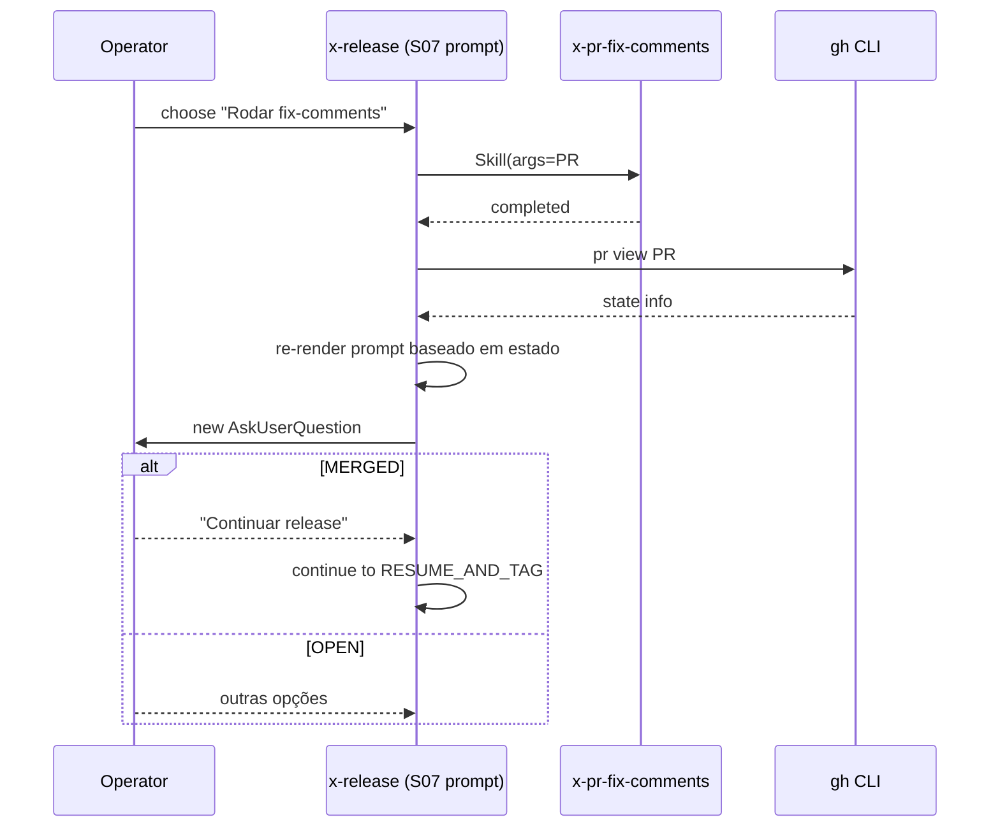

# História: Handoff integrado com `/x-pr-fix-comments`

**ID:** story-0039-0011
**Chave Jira:** —
**Status:** Concluida

## 1. Dependências

| Blocked By | Blocks |
| :--- | :--- |
| story-0039-0007 | — |

## 2. Regras Transversais Aplicáveis

| ID | Título |
| :--- | :--- |
| RULE-001 | Source-of-truth: gerador, não output |
| RULE-004 | Prompts têm equivalente não-interativo |

## 3. Descrição

Como **release manager**, eu quero que ao escolher "Rodar /x-pr-fix-comments" no prompt da S07, a skill invoque automaticamente a outra skill com o PR number e, ao retornar, re-verifique o estado do PR e re-ofereça opções, garantindo um loop fluido entre fix-comments e continue-release.

A engine de prompts (S07) já oferece a opção. Esta story implementa o handoff: invocação via Skill tool, espera pelo retorno, re-leitura do PR via `gh pr view`, novo prompt baseado no novo estado.

### 3.1 Handoff sequence

1. Operador escolhe "Rodar /x-pr-fix-comments PR#"
2. x-release invoca `/x-pr-fix-comments <PR#>` via Skill tool
3. Aguarda retorno (skill é síncrona neste fluxo)
4. Após retorno: `gh pr view <PR#> --json state,mergedAt,reviewDecision`
5. Re-render do prompt da S07 com estado atualizado:
   - Se `state == MERGED`: opção principal vira "Continuar release"
   - Se ainda OPEN com novos commits: oferece nova rodada de fix-comments ou wait
   - Se aprovado mas não mergeado: instrução para mergear

### 3.2 Documentação do contrato

- Novo `references/prompt-flow.md` (já criado em S07): adiciona seção "Handoff Contract" descrevendo input/output esperados de cada skill no loop

### 3.3 Edge cases

- `/x-pr-fix-comments` retorna erro: prompt mostra erro e oferece "Tentar de novo / Continuar mesmo assim / Abortar"
- PR fechado sem merge durante o handoff: oferece "Reabrir / Iniciar novo release / Abortar"

## 3.5 Entrega de Valor

- **Valor Principal:** loop fix-comments → continue release sem sair da skill ou copiar comandos
- **Métrica de Sucesso:** ≥ 80% das interações de fix-comments durante release rodadas via handoff (vs invocação manual separada)
- **Impacto no Negócio:** UX coesa; menos context switching para o operador

## 4. Definições de Qualidade Locais

### DoR Local

- [ ] story-0039-0007 mergeada
- [ ] Contrato de retorno de `/x-pr-fix-comments` validado
- [ ] Comportamento em PR fechado durante handoff ratificado

### DoD Local

- [ ] Handoff invoca skill via Skill tool corretamente
- [ ] Pós-retorno, `gh pr view` é re-executado
- [ ] Prompt re-renderizado com novo estado
- [ ] Edge cases (erro, PR fechado) cobertos
- [ ] Smoke valida loop completo (mock de Skill tool)

## 5. Contratos de Dados

### 5.1 Skill tool invocation (input)

```json
{
  "skill": "x-pr-fix-comments",
  "args": "297"
}
```

### 5.2 PR re-check (gh pr view output esperado)

| Campo | Tipo | Descrição |
| :--- | :--- | :--- |
| `state` | enum `OPEN/CLOSED/MERGED` | estado do PR |
| `mergedAt` | ISO-8601 ou null | timestamp do merge |
| `reviewDecision` | enum `APPROVED/CHANGES_REQUESTED/REVIEW_REQUIRED/null` | decisão de review |

### 5.3 Re-prompt logic (decision table)

| state | mergedAt | Opção principal exibida |
| :--- | :--- | :--- |
| OPEN | null | "Rodar fix-comments novamente" |
| OPEN | null + reviewDecision=APPROVED | "Mergear no GitHub e voltar" |
| MERGED | timestamp | "Continuar release" |
| CLOSED | null | "Reabrir / Iniciar novo / Abortar" |

### 5.4 Error Codes

| Exit | Code | Condição |
| :--- | :--- | :--- |
| — | `HANDOFF_SKILL_FAILED` | warn-only; oferece retry |
| 1 | `HANDOFF_PR_NOT_FOUND` | PR removido durante handoff |

## 6. Diagramas

### 6.1 Loop handoff



## 7. Critérios de Aceite (Gherkin)

```gherkin
Cenario: Handoff básico (happy path)
  DADO Phase 8 atingida e PR #297 OPEN
  QUANDO operador escolhe "Rodar fix-comments"
  ENTÃO x-pr-fix-comments é invocado com 297
  E após retorno, gh pr view é executado
  E novo prompt é exibido com estado atualizado

Cenario: PR mergeado durante handoff (boundary)
  DADO operador roda fix-comments e mergeia PR no GitHub
  QUANDO retorna ao prompt
  ENTÃO opção principal vira "Continuar release"

Cenario: PR fechado durante handoff (degenerate)
  DADO operador fecha PR no GitHub durante fix-comments
  QUANDO retorna
  ENTÃO opções "Reabrir / Iniciar novo / Abortar" são exibidas

Cenario: x-pr-fix-comments retorna erro (error path)
  DADO Skill tool retorna erro
  QUANDO retorno é processado
  ENTÃO HANDOFF_SKILL_FAILED é warn
  E prompt oferece "Tentar de novo / Continuar / Abortar"

Cenario: PR removido (error)
  DADO PR #297 deletado
  QUANDO gh pr view falha com 404
  ENTÃO exit 1 com HANDOFF_PR_NOT_FOUND
```

### 7.1 TPP Ordering

Happy → boundary (mergeado) → degenerate (fechado) → error (skill fail, PR not found).

### 7.2 Mandatory Categories

- [x] Degenerate: PR fechado
- [x] Happy path: handoff básico
- [x] Error: skill fail, PR not found
- [x] Boundary: PR mergeado durante handoff

## 8. Tasks

### TASK-0039-0011-001: `HandoffOrchestrator`

- **Layer:** Application
- **Test Type:** Unit
- **Size:** M
- **Dependencies:** —
- **Branch:** `feat/task-0039-0011-001-handoff-orchestrator`
- **Testability:** UseCase + AT
- **Files:**
  - `java/src/main/java/dev/iadev/release/handoff/HandoffOrchestrator.java`
  - `java/src/test/java/dev/iadev/release/handoff/HandoffOrchestratorTest.java`
- **Acceptance Criteria:**
  - [x] Decision table state×mergedAt → option set
  - [x] Tratamento de erros (skill fail, 404)

### TASK-0039-0011-002: SKILL.md — handoff documentation

- **Layer:** Doc
- **Test Type:** Verification
- **Size:** M
- **Dependencies:** TASK-0039-0011-001
- **Branch:** `feat/task-0039-0011-002-skill-handoff-doc`
- **Testability:** Config + VerificationTest
- **Files:**
  - `java/src/main/resources/targets/claude/skills/core/x-release/SKILL.md`
  - `java/src/main/resources/targets/claude/skills/core/x-release/references/prompt-flow.md` (atualizar)
- **Acceptance Criteria:**
  - [x] Seção Handoff Contract em prompt-flow.md
  - [x] Step 8 referencia handoff explicitamente

### TASK-0039-0011-003: Smoke — loop completo (mocked)

- **Layer:** Test
- **Test Type:** Smoke
- **Size:** M
- **Dependencies:** TASK-0039-0011-001
- **Branch:** `feat/task-0039-0011-003-smoke-handoff`
- **Testability:** Migration + Smoke
- **Files:**
  - `java/src/test/java/dev/iadev/smoke/HandoffLoopSmokeTest.java`
- **Acceptance Criteria:**
  - [x] Mock: prompt → handoff → mergeado → continue → tag
