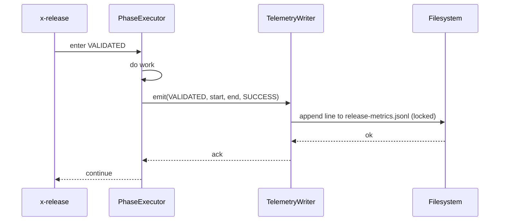

# História: Telemetria por fase em `release-metrics.jsonl`

**ID:** story-0039-0012
**Chave Jira:** —
**Status:** Concluída

## 1. Dependências

| Blocked By | Blocks |
| :--- | :--- |
| story-0039-0002 | story-0039-0014 |

## 2. Regras Transversais Aplicáveis

| ID | Título |
| :--- | :--- |
| RULE-001 | Source-of-truth: gerador, não output |
| RULE-006 | Telemetria fica no repo |

## 3. Descrição

Como **release manager** e **tech lead**, eu quero que cada fase de `/x-release` registre uma linha JSONL com versão, fase, timestamps e duração, garantindo histórico para identificar fases-gargalo e benchmarks vs média móvel.

Hoje não há nenhum registro de quanto tempo cada fase consome. Tech leads não conseguem responder "qual fase do release demora mais?" sem rodar manualmente. Esta story adiciona append-only `plans/release-metrics.jsonl` (commitado no repo per RULE-006), e a Phase 13 SUMMARY mostra top-3 fases mais lentas vs média das últimas 5 releases.

### 3.1 Formato JSONL

Uma linha JSON por fase concluída:

```json
{"releaseVersion":"3.2.0","releaseType":"release","phase":"VALIDATED","startedAt":"2026-04-13T08:00:00Z","endedAt":"2026-04-13T08:02:22Z","durationSec":142,"outcome":"SUCCESS"}
```

Campos:
- `releaseVersion`: versão alvo
- `releaseType`: enum `{release, hotfix}` — default `release` quando ausente (consumido por S14 para distinguir fluxos)
- `phase`: nome da fase (ex.: `INITIALIZED`, `DETERMINED`, `VALIDATED`, ...)
- `startedAt` / `endedAt`: ISO-8601 UTC
- `durationSec`: integer
- `outcome`: enum `{SUCCESS, FAILED, SKIPPED}`

### 3.2 Append-only e atomicity

- Escrever via append + flush por linha (sem reescrita do arquivo)
- Em caso de crash, linhas já escritas permanecem
- Concurrent safe via lock file (caso releases sejam disparadas em paralelo — improvável mas defensivo)

### 3.3 Análise para SUMMARY

- Phase 13 SUMMARY (S05) lê últimas 5 releases (do JSONL) e calcula média de cada fase
- Mostra top-3 fases mais lentas DESTE release com delta vs média (ex.: `VALIDATED: 142s (+30% vs média 109s)`)
- Se há menos de 5 releases históricas, exibe "histórico insuficiente para benchmark"

### 3.4 Flag de desligamento

- `--telemetry off`: pula gravação (CI privacy ou debug)
- Sem flag: gravação ativa por padrão

## 3.5 Entrega de Valor

- **Valor Principal:** identifica gargalos no fluxo de release com dados objetivos; benchmark contínuo
- **Métrica de Sucesso:** após 5 releases, SUMMARY exibe top-3 fases lentas com delta vs média; tech lead pode priorizar otimizações
- **Impacto no Negócio:** decisões data-driven sobre onde investir em otimização (ex.: paralelizar mais checks, mover algo para CI)

## 4. Definições de Qualidade Locais

### DoR Local

- [ ] story-0039-0002 mergeada
- [ ] Decisão de "no repo, não gitignored" ratificada (RULE-006)
- [ ] Schema da linha JSONL aprovado

### DoD Local

- [ ] Cada fase grava 1 linha em `plans/release-metrics.jsonl`
- [ ] Append atômico (lock por linha)
- [ ] SUMMARY (S05) consome JSONL e exibe top-3 + delta vs média
- [ ] `--telemetry off` desliga gravação
- [ ] Smoke valida 5 releases sequenciais → benchmark correto

## 5. Contratos de Dados

### 5.1 Schema da linha JSONL

| Campo | Tipo | Sempre presente | Descrição |
| :--- | :--- | :--- | :--- |
| `releaseVersion` | `String` | Sim | semver da release |
| `releaseType` | `enum {release, hotfix}` | Não (default `release` quando ausente) | Distingue fluxo normal de hotfix; consumido por S14 |
| `phase` | `String` | Sim | nome da fase em SCREAMING_SNAKE_CASE |
| `startedAt` | `String (ISO-8601)` | Sim | timestamp de início UTC |
| `endedAt` | `String (ISO-8601)` | Sim | timestamp de fim UTC |
| `durationSec` | `Integer` | Sim | derivado, ≥ 0 |
| `outcome` | `enum` | Sim | `SUCCESS`/`FAILED`/`SKIPPED` |

### 5.2 SUMMARY benchmark output

```
Top-3 fases mais lentas:
  VALIDATED:    142s (+30% vs média 109s nas últimas 5 releases)
  PR_OPENED:     12s (-25% vs média 16s)
  CHANGELOG:      8s (+0% vs média 8s)
```

### 5.3 Error Codes

| Exit | Code | Condição |
| :--- | :--- | :--- |
| — | `TELEMETRY_WRITE_FAILED` | warn-only, não aborta release |

## 6. Diagramas

### 6.1 Gravação por fase



## 7. Critérios de Aceite (Gherkin)

```gherkin
Cenario: Telemetria desligada (degenerate)
  DADO --telemetry off
  QUANDO release executa
  ENTÃO release-metrics.jsonl não é modificado

Cenario: Cada fase grava 1 linha (happy path)
  DADO release sem flag
  QUANDO fases INITIALIZED..PUBLISH executam
  ENTÃO N linhas são adicionadas ao JSONL com outcomes corretos

Cenario: SUMMARY com 5 releases históricas (boundary)
  DADO 5 releases anteriores no JSONL
  QUANDO SUMMARY executa
  ENTÃO top-3 fases lentas são exibidas com delta vs média

Cenario: SUMMARY com menos de 5 releases (boundary at-min)
  DADO 2 releases no JSONL
  QUANDO SUMMARY executa
  ENTÃO mensagem "histórico insuficiente para benchmark" é exibida
  E nenhum delta calculado

Cenario: Falha de write (error path warn-only)
  DADO permissão de escrita negada
  QUANDO fase tenta gravar
  ENTÃO TELEMETRY_WRITE_FAILED warning é logado
  E release continua

Cenario: Fase com outcome SKIPPED (boundary)
  DADO fase pulada por --skip-tests
  QUANDO grava telemetria
  ENTÃO outcome=SKIPPED na linha JSONL
```

### 7.1 TPP Ordering

Degenerate (telemetry off) → happy → boundary (5 releases, <5, SKIPPED) → error (write fail).

### 7.2 Mandatory Categories

- [x] Degenerate: --telemetry off
- [x] Happy path: gravação por fase
- [x] Error: write fail
- [x] Boundary: 5 releases, <5, outcome SKIPPED

## 8. Tasks

> **Implementation notes (2026-04-16):** All 14 sub-tasks from
> `plans/tasks-story-0039-0012.md` were implemented in a single
> story-level commit following the v1 legacy flow. Domain-pure
> `BenchmarkAnalyzer` receives a `Stream<PhaseMetric>` per DIP; the
> file adapter `FileTelemetryWriter` appends under a combined
> intra-JVM `ReentrantLock` + inter-process `FileLock` (macOS
> quirk workaround documented in the adapter javadoc). All 31
> new unit + IT + smoke tests pass; the 6 Gherkin scenarios in §7
> are mapped 1:1 to assertions.

### TASK-0039-0012-001: `TelemetryWriter` (atomic append)

- **Layer:** Adapter
- **Test Type:** Integration
- **Size:** M
- **Dependencies:** —
- **Branch:** `feat/task-0039-0012-001-telemetry-writer`
- **Testability:** Port + Adapter + IT
- **Files:**
  - `java/src/main/java/dev/iadev/release/telemetry/TelemetryWriter.java`
  - `java/src/test/java/dev/iadev/release/telemetry/TelemetryWriterIT.java`
- **Acceptance Criteria:**
  - [ ] Append + flush por linha
  - [ ] File lock em escritas concorrentes
  - [ ] Gracioso em permission denied (warn-only)

### TASK-0039-0012-002: `BenchmarkAnalyzer` (pure)

- **Layer:** Domain
- **Test Type:** Unit
- **Size:** M
- **Dependencies:** TASK-0039-0012-001
- **Branch:** `feat/task-0039-0012-002-benchmark-analyzer`
- **Testability:** Domain + UnitTest
- **Files:**
  - `java/src/main/java/dev/iadev/release/telemetry/BenchmarkAnalyzer.java`
  - `java/src/test/java/dev/iadev/release/telemetry/BenchmarkAnalyzerTest.java`
- **Acceptance Criteria:**
  - [ ] Lê N últimas releases do JSONL
  - [ ] Calcula média por fase
  - [ ] Retorna top-3 com delta percentual

### TASK-0039-0012-003: SKILL.md — instrumentar fases + integrar SUMMARY

- **Layer:** Doc
- **Test Type:** Verification
- **Size:** L
- **Dependencies:** TASK-0039-0012-001, TASK-0039-0012-002
- **Branch:** `feat/task-0039-0012-003-skill-telemetry`
- **Testability:** Config + VerificationTest
- **Files:**
  - `java/src/main/resources/targets/claude/skills/core/x-release/SKILL.md`
- **Acceptance Criteria:**
  - [ ] Cada fase emite linha de telemetria via wrapper bash
  - [ ] Phase 13 SUMMARY chama BenchmarkAnalyzer
  - [ ] `--telemetry off` documentado

### TASK-0039-0012-004: Smoke — 5 releases sequenciais + benchmark

- **Layer:** Test
- **Test Type:** Smoke
- **Size:** M
- **Dependencies:** TASK-0039-0012-002
- **Branch:** `feat/task-0039-0012-004-smoke-benchmark`
- **Testability:** Migration + Smoke
- **Files:**
  - `java/src/test/java/dev/iadev/smoke/TelemetryBenchmarkSmokeTest.java`
- **Acceptance Criteria:**
  - [ ] Simula 5 entradas históricas, valida cálculo de delta
