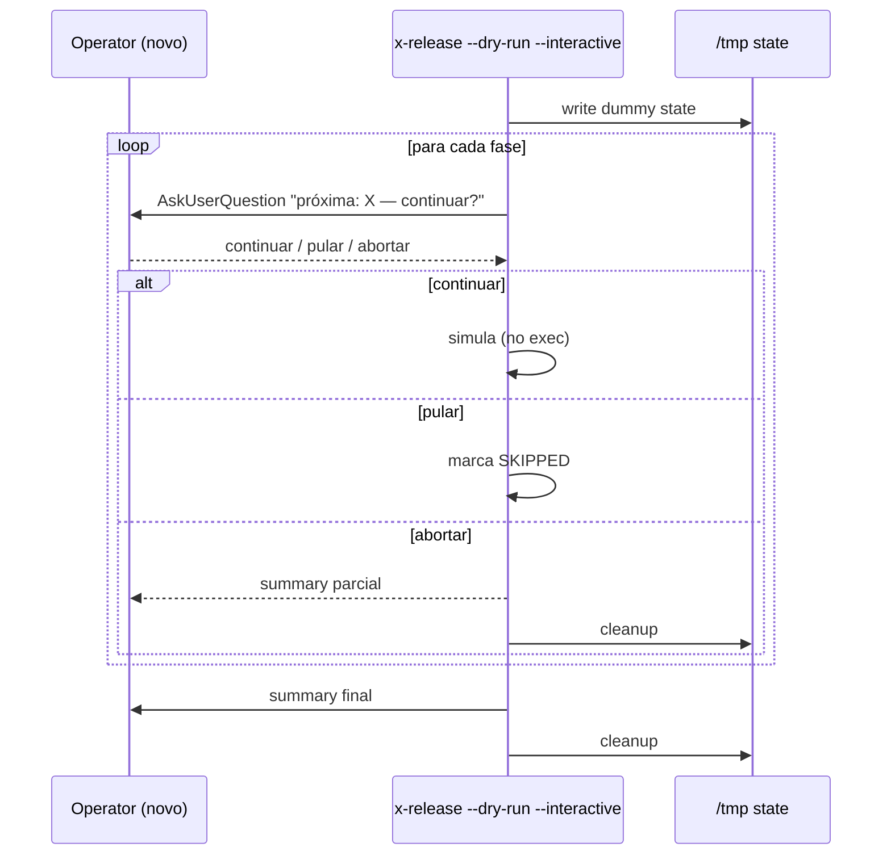

# História: Interactive dry-run para onboarding

**ID:** story-0039-0013
**Chave Jira:** —
**Status:** Pendente

## 1. Dependências

| Blocked By | Blocks |
| :--- | :--- |
| story-0039-0007, story-0039-0009 | — |

## 2. Regras Transversais Aplicáveis

| ID | Título |
| :--- | :--- |
| RULE-001 | Source-of-truth: gerador, não output |
| RULE-004 | Prompts têm equivalente não-interativo |

## 3. Descrição

Como **novo operador** ou **release manager validando alterações na skill**, eu quero rodar `/x-release --dry-run --interactive` e ser pausado em cada fase com prompt "próximo passo seria X — continuar simulação?", garantindo que aprendo o fluxo sem efeitos colaterais.

`--dry-run` já existe (não modifica state real). Esta story adiciona a sub-modalidade `--interactive` que pausa em CADA fase (não só nos halts naturais), exibindo os comandos que seriam executados, sem executá-los. Útil para onboarding de novos operadores e para validar mudanças na skill antes de uma release real.

### 3.1 Comportamento

- `--dry-run` sozinho: mantém comportamento atual (simula tudo de uma vez, output verboso)
- `--dry-run --interactive`: pausa antes de cada fase com:
  ```
  === FASE PRÓXIMA: VALIDATED ===
  Comandos que seriam executados:
    - mvn clean verify
    - parse coverage report
    - golden file tests
    - ...
  
  Continuar simulação? [continuar / pular fase / abortar simulação]
  ```
- Sem efeitos colaterais reais (nenhum git/mvn/gh é invocado)
- State file dummy escrito em `/tmp/release-state-dryrun-<timestamp>.json`, descartado ao final

### 3.2 Opções por prompt

- **Continuar**: avança para próxima fase
- **Pular fase**: marca como SKIPPED na simulação e continua
- **Abortar simulação**: exit 0 com summary de fases simuladas

### 3.3 Output final

- Resumo de quais fases foram simuladas, puladas, qual a fase atingida
- Indicação clara: "MODO DRY-RUN — nenhum efeito colateral foi aplicado"

## 3.5 Entrega de Valor

- **Valor Principal:** novos operadores aprendem a skill com confidence; tech leads validam mudanças antes de release real
- **Métrica de Sucesso:** novos operadores completam dry-run interativo antes da primeira release real; reduz erros operacionais em primeiras releases
- **Impacto no Negócio:** acelera onboarding; reduz risco em ciclos críticos

## 4. Definições de Qualidade Locais

### DoR Local

- [ ] story-0039-0007 (prompts) e 0009 (preflight) mergeadas
- [ ] Decisão sobre escrita de state dummy em /tmp ratificada
- [ ] Lista exata de comandos exibidos por fase fechada

### DoD Local

- [ ] `--dry-run --interactive` pausa em cada fase
- [ ] Nenhum efeito colateral (validado por test que captura git/mvn/gh calls)
- [ ] State dummy em /tmp criado e limpo
- [ ] Summary final claro
- [ ] Smoke valida 13 fases simuladas sem side effects

## 5. Contratos de Dados

### 5.1 Input

| Campo | Tipo | M/O | Validações | Exemplo |
| :--- | :--- | :--- | :--- | :--- |
| `--dry-run` | flag | O | já existente | `--dry-run` |
| `--interactive` (combinado com `--dry-run`) | flag | O | requer `--dry-run` | `--dry-run --interactive` |

### 5.2 Output (summary final)

```
=== DRY-RUN SUMMARY ===
Versão simulada:    3.2.0 (auto-detectada)
Fases simuladas:    11 / 13
Fases puladas:      2 (PR_OPENED, APPROVAL_PENDING)
Comandos previstos: 47 (nenhum executado)

MODO DRY-RUN — nenhum efeito colateral foi aplicado.
State dummy descartado.
```

### 5.3 Error Codes

| Exit | Code | Condição |
| :--- | :--- | :--- |
| 1 | `INTERACTIVE_REQUIRES_DRYRUN` | `--interactive` sem `--dry-run` |
| 0 | — | abort de simulação (limpo) |

## 6. Diagramas

### 6.1 Loop interativo de simulação



## 7. Critérios de Aceite (Gherkin)

```gherkin
Cenario: --interactive sem --dry-run (degenerate)
  QUANDO eu rodo /x-release --interactive (sem --dry-run)
  ENTÃO exit 1 com INTERACTIVE_REQUIRES_DRYRUN

Cenario: Simulação completa de 13 fases (happy path)
  DADO --dry-run --interactive
  QUANDO operador escolhe "Continuar" em todas as fases
  ENTÃO 13 fases são simuladas
  E zero comandos git/mvn/gh são invocados
  E summary final exibe "13 / 13"

Cenario: Operador pula fase no meio (boundary)
  QUANDO em VALIDATED operador escolhe "Pular fase"
  ENTÃO VALIDATED é marcada SKIPPED
  E simulação continua para BRANCHED

Cenario: Operador aborta simulação (boundary)
  QUANDO em PR_OPENED operador escolhe "Abortar"
  ENTÃO summary parcial é exibido
  E state dummy em /tmp é limpo
  E exit 0

Cenario: Validação de zero side effects (acceptance)
  DADO simulação completa
  QUANDO eu inspeciono filesystem e git log
  ENTÃO nenhum branch novo, nenhum commit, nenhum PR é criado
```

### 7.1 TPP Ordering

Degenerate (interactive sem dry-run) → happy → boundary (pular, abortar) → acceptance (zero side effects).

### 7.2 Mandatory Categories

- [x] Degenerate: --interactive sem --dry-run
- [x] Happy path: simulação completa
- [x] Error: requires interactive
- [x] Boundary: pular fase, abortar, zero side effects

## 8. Tasks

### TASK-0039-0013-001: `DryRunInteractiveExecutor`

- **Layer:** Application
- **Test Type:** Unit
- **Size:** M
- **Dependencies:** —
- **Branch:** `feat/task-0039-0013-001-dryrun-interactive`
- **Testability:** UseCase + AT
- **Files:**
  - `java/src/main/java/dev/iadev/release/dryrun/DryRunInteractiveExecutor.java`
  - `java/src/test/java/dev/iadev/release/dryrun/DryRunInteractiveExecutorTest.java`
- **Acceptance Criteria:**
  - [ ] Pausa antes de cada fase com prompt
  - [ ] Não invoca nenhum side effect (validado via mocks)
  - [ ] State dummy em /tmp criado e limpo

### TASK-0039-0013-002: SKILL.md — modo interactive dry-run

- **Layer:** Doc
- **Test Type:** Verification
- **Size:** M
- **Dependencies:** TASK-0039-0013-001
- **Branch:** `feat/task-0039-0013-002-skill-dryrun-interactive`
- **Testability:** Config + VerificationTest
- **Files:**
  - `java/src/main/resources/targets/claude/skills/core/x-release/SKILL.md`
- **Acceptance Criteria:**
  - [ ] Modo documentado em Triggers
  - [ ] Erro INTERACTIVE_REQUIRES_DRYRUN no catalog

### TASK-0039-0013-003: Smoke — full simulation sem side effects

- **Layer:** Test
- **Test Type:** Smoke
- **Size:** M
- **Dependencies:** TASK-0039-0013-001
- **Branch:** `feat/task-0039-0013-003-smoke-dryrun`
- **Testability:** Migration + Smoke
- **Files:**
  - `java/src/test/java/dev/iadev/smoke/DryRunInteractiveSmokeTest.java`
- **Acceptance Criteria:**
  - [ ] Mock de prompts respondendo "continuar" 13x
  - [ ] Asserta zero invocações de git/mvn/gh
