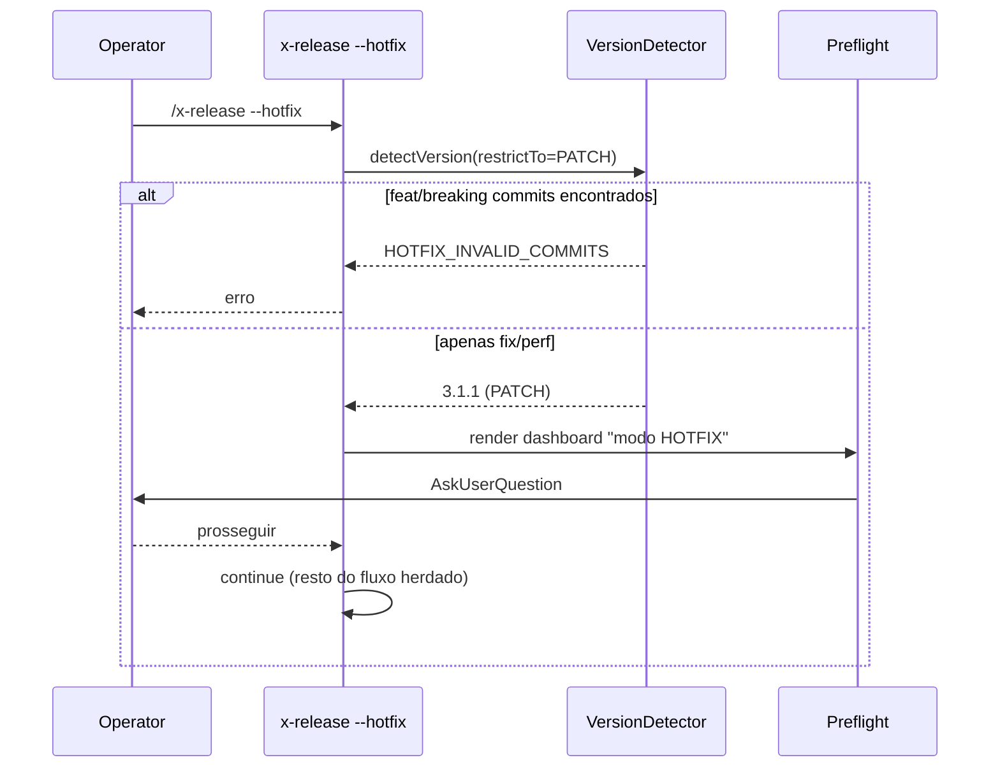

# História: Paridade no fluxo de hotfix

**ID:** story-0039-0014
**Chave Jira:** —
**Status:** Concluída

## 1. Dependências

| Blocked By | Blocks |
| :--- | :--- |
| story-0039-0001, story-0039-0005, story-0039-0007, story-0039-0008, story-0039-0009, story-0039-0012 | story-0039-0015 |

## 2. Regras Transversais Aplicáveis

| ID | Título |
| :--- | :--- |
| RULE-001 | Source-of-truth: gerador, não output |
| RULE-002 | Conventional Commits para auto-versão |
| RULE-004 | Prompts têm equivalente não-interativo |

## 3. Descrição

Como **release manager fazendo hotfix**, eu quero que `/x-release --hotfix` tenha a mesma UX interativa do release normal (auto-versão restrita a PATCH, prompts, smart resume, pre-flight, summary diagram, telemetria), garantindo consistência operacional entre os dois fluxos.

Hotfix hoje é segundo classe: argumentos posicionais, sem auto-detect, sem prompts. Esta story replica os ganhos das fases 1-3 do épico no caminho `--hotfix`, com adaptações:
- Auto-detect restrito a PATCH (qualquer commit feat/breaking aborta com erro)
- Branch base é `main` (não `develop`)
- Diagrama do SUMMARY adaptado para mostrar hotfix saindo de `main`

### 3.1 Adaptações específicas

- **Auto-version (S01)**: rejeita feat/breaking commits com `HOTFIX_INVALID_COMMITS`; aceita apenas fix/perf
- **Smart Resume (S08)**: detecta state files de hotfix separados (`release-state-hotfix-<X.Y.Z>.json`)
- **Pre-flight (S09)**: dashboard explicita "modo HOTFIX, base=main, bump=PATCH"
- **Summary (S05)**: diagrama mostra ramo `hotfix/X.Y.Z` saindo de `main`
- **Telemetria (S12)**: linhas JSONL incluem campo opcional `releaseType: "hotfix"` (derivado de `hotfix: true` do state file; default `release` quando ausente — schema definido em S12)

### 3.2 Re-uso vs duplicação

- 95% do código das fases base é reaproveitado via injeção de `ReleaseContext` (release vs hotfix)
- Apenas decisões de bump e branching são paramétricas

### 3.3 Fluxo Git Flow do hotfix

- Branch from `main`
- PR to `main` + back-merge to `develop` (já existe; preserva)
- Tag em `main`
- Mesma sequência de pausas e prompts

## 3.5 Entrega de Valor

- **Valor Principal:** hotfix urgente ganha mesma UX guiada do release normal; reduz erros em momentos críticos
- **Métrica de Sucesso:** ≥ 80% dos hotfixes pós-implementação rodados sem `--version` explícito; zero erros de bump (não-PATCH em hotfix)
- **Impacto no Negócio:** confiança operacional em hotfixes (situação alta-pressão)

## 4. Definições de Qualidade Locais

### DoR Local

- [ ] S01, S05, S07, S08, S09, S12 mergeadas
- [ ] Decisão sobre `release-state-hotfix-*.json` separado ratificada
- [ ] Restrição auto-version PATCH-only validada com Tech Lead

### DoD Local

- [x] `--hotfix` herda auto-detect, prompts, smart resume, pre-flight, summary, telemetria
- [x] Auto-detect rejeita feat/breaking com `HOTFIX_INVALID_COMMITS`
- [x] State file separado (não conflita com release normal em curso)
- [x] Diagrama summary mostra ramo de hotfix
- [x] Telemetria com `releaseType: "hotfix"`
- [x] Smoke valida fluxo completo de hotfix interativo

## 5. Contratos de Dados

### 5.1 Input (CLI)

| Campo | Tipo | M/O | Validações | Exemplo |
| :--- | :--- | :--- | :--- | :--- |
| `--hotfix` | flag | M | obrigatório para o fluxo | `--hotfix` |
| `--version` (override) | String | O | apenas PATCH bumps válidos (ex.: 3.1.0 → 3.1.1, NÃO 3.1.0 → 3.2.0) | `--version 3.1.1` |

### 5.2 State file separado

- Path: `plans/release-state-hotfix-<X.Y.Z>.json`
- Schema: idêntico ao v2 (S02), usando o campo existente `hotfix: true` como indicador do fluxo (não introduz campo redundante `releaseType`)

### 5.3 SUMMARY diagram (hotfix variant)

```
main:     v3.1.0 ──── v3.1.1 ──
                          ↑
                     (PR #N merged)
                          │
hotfix:           hotfix/3.1.1
                          │   ↓ back-merge
develop:  ──────────●─────●─────
                  3.2.0-SNAPSHOT
```

### 5.4 Error Codes

| Exit | Code | Condição |
| :--- | :--- | :--- |
| 1 | `HOTFIX_INVALID_COMMITS` | feat ou breaking commits desde última tag |
| 1 | `HOTFIX_VERSION_NOT_PATCH` | `--version` override que não é PATCH bump |

## 6. Diagramas

### 6.1 Fluxo hotfix com auto-detect



## 7. Critérios de Aceite (Gherkin)

```gherkin
Cenario: Auto-detect com feat commits no hotfix (degenerate)
  DADO --hotfix e há commit feat desde última tag
  QUANDO eu rodo /x-release --hotfix
  ENTÃO exit 1 com HOTFIX_INVALID_COMMITS

Cenario: Auto-detect com apenas fix commits (happy path)
  DADO --hotfix e 2 commits fix desde v3.1.0
  QUANDO eu rodo /x-release --hotfix
  ENTÃO targetVersion=3.1.1, bumpType=patch
  E pre-flight dashboard mostra "modo HOTFIX, base=main"

Cenario: --version override inválido em hotfix (error)
  QUANDO /x-release --hotfix --version 3.2.0
  ENTÃO exit 1 com HOTFIX_VERSION_NOT_PATCH

Cenario: State file separado (boundary)
  DADO release normal v3.2.0 em curso (state file existe)
  QUANDO inicio /x-release --hotfix --version 3.1.1
  ENTÃO um SEGUNDO state file release-state-hotfix-3.1.1.json é criado
  E não há conflito com state file da release normal

Cenario: SUMMARY mostra ramo de hotfix (boundary)
  DADO hotfix v3.1.1 completo
  QUANDO Phase 13 SUMMARY executa
  ENTÃO diagrama mostra "hotfix/3.1.1" saindo de "main"

Cenario: Telemetria com releaseType (boundary)
  DADO hotfix em curso
  QUANDO fase grava linha JSONL
  ENTÃO releaseType="hotfix" está presente
```

### 7.1 TPP Ordering

Degenerate (feat em hotfix) → happy → error (override não-PATCH) → boundary (state separado, SUMMARY, telemetria).

### 7.2 Mandatory Categories

- [x] Degenerate: feat em hotfix
- [x] Happy path: PATCH-only
- [x] Error: HOTFIX_VERSION_NOT_PATCH
- [x] Boundary: state separado, SUMMARY adaptado, telemetria com releaseType

## 8. Tasks

### TASK-0039-0014-001: `HotfixContext` + injeção paramétrica

- **Layer:** Domain
- **Test Type:** Unit
- **Size:** M
- **Dependencies:** —
- **Branch:** `feat/task-0039-0014-001-hotfix-context`
- **Testability:** Domain + UnitTest
- **Files:**
  - `java/src/main/java/dev/iadev/release/HotfixContext.java`
  - `java/src/test/java/dev/iadev/release/HotfixContextTest.java`
- **Acceptance Criteria:**
  - [x] `ReleaseContext.hotfix()` factory
  - [x] `restrictBumpTo` configurável (PATCH para hotfix)
  - [x] `baseBranch` parametrizável (`main` para hotfix)

### TASK-0039-0014-002: Adaptar VersionDetector + SmartResume + Preflight + Summary + Telemetry

- **Layer:** Application
- **Test Type:** Integration
- **Size:** L
- **Dependencies:** TASK-0039-0014-001
- **Branch:** `feat/task-0039-0014-002-hotfix-adaptations`
- **Testability:** UseCase + AT
- **Files:**
  - `java/src/main/java/dev/iadev/release/VersionDetector.java` (param)
  - `java/src/main/java/dev/iadev/release/resume/StateFileDetector.java` (param)
  - `java/src/main/java/dev/iadev/release/preflight/PreflightDashboardRenderer.java` (param)
  - `java/src/main/java/dev/iadev/release/summary/SummaryRenderer.java` (param)
  - `java/src/main/java/dev/iadev/release/telemetry/TelemetryWriter.java` (param)
- **Acceptance Criteria:**
  - [x] Cada componente aceita `ReleaseContext`
  - [x] Comportamentos hotfix/release são distintos e testados

### TASK-0039-0014-003: SKILL.md — seções hotfix

- **Layer:** Doc
- **Test Type:** Verification
- **Size:** M
- **Dependencies:** TASK-0039-0014-002
- **Branch:** `feat/task-0039-0014-003-skill-hotfix`
- **Testability:** Config + VerificationTest
- **Files:**
  - `java/src/main/resources/targets/claude/skills/core/x-release/SKILL.md`
- **Acceptance Criteria:**
  - [x] Seção "Hotfix Flow" documenta diferenças
  - [x] Erros HOTFIX_* no catalog

### TASK-0039-0014-004: Smoke — hotfix interativo end-to-end

- **Layer:** Test
- **Test Type:** Smoke
- **Size:** M
- **Dependencies:** TASK-0039-0014-002
- **Branch:** `feat/task-0039-0014-004-smoke-hotfix`
- **Testability:** Migration + Smoke
- **Files:**
  - `java/src/test/java/dev/iadev/smoke/HotfixInteractiveSmokeTest.java`
- **Acceptance Criteria:**
  - [x] Fixture: tag v3.1.0 + 2 fix commits → hotfix v3.1.1 simulado completo
  - [x] State separado, summary correto, telemetria com releaseType
