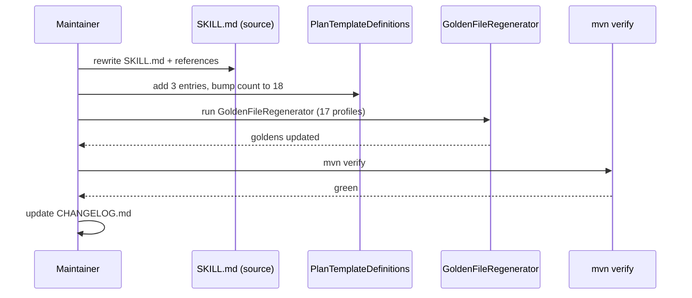

# História: Documentação + golden regeneration final

**ID:** story-0039-0015
**Chave Jira:** —
**Status:** Concluida

## 1. Dependências

| Blocked By | Blocks |
| :--- | :--- |
| story-0039-0001..story-0039-0014 | — |

## 2. Regras Transversais Aplicáveis

| ID | Título |
| :--- | :--- |
| RULE-001 | Source-of-truth: gerador, não output |
| RULE-008 | Golden regen consolidado |

## 3. Descrição

Como **release manager** e **maintainer da skill**, eu quero que após todas as 14 stories técnicas estarem mergeadas, o `SKILL.md` da `x-release` seja reescrito refletindo todos os defaults novos (auto-version, prompts, smart resume, telemetria, summary), todas as references criadas/atualizadas, golden files dos 17 profiles regeneradas em uma única operação consolidada, e o CHANGELOG do projeto atualizado.

Esta story é a "consolidação final" do épico. Centralizar a regeneração de goldens aqui (RULE-008) evita churn em cada story técnica. Inclui também:
- Novo walkthrough end-to-end em `references/interactive-flow-walkthrough.md`
- Atualização do `CHANGELOG.md` do projeto com entry `[Unreleased]`
- Adicionar `_TEMPLATE-EPIC.md`, `_TEMPLATE-STORY.md`, `_TEMPLATE-IMPLEMENTATION-MAP.md` ao `PlanTemplateDefinitions` (pendência identificada durante criação deste épico — sem isso, futuros `/x-story-epic-full` falham)

### 3.1 Reescrita do SKILL.md

- Triggers atualizados: `<version>` opcional, novos flags
- Parameters: tabela completa com auto-detect default
- Workflow: Step 0.5 (Smart Resume), Step 1.5 (Pre-flight), Phase 13 (SUMMARY), telemetria como cross-cutting
- Error catalog consolidado de todas as stories

### 3.2 Walkthrough end-to-end

- Doc novo `references/interactive-flow-walkthrough.md`
- Sessão exemplo passo-a-passo: invocação, prompts, respostas, output final
- Cobre fluxos release normal e hotfix

### 3.3 Templates de épico/story/map em `PlanTemplateDefinitions`

- Adicionar 3 templates ao mapa em `PlanTemplateDefinitions.java`
- Bumpar `TEMPLATE_COUNT` de 15 para 18
- Adicionar mandatory sections para cada
- Goldens dos 17 profiles passam a incluir os 3 novos templates em `.claude/templates/`

### 3.4 Golden regeneration

- Rodar `mvn process-resources` + `GoldenFileRegenerator` UMA vez ao final
- 17 profiles regenerados; commits separados se necessário (1 por profile ou 1 commit consolidado)
- Verificação: `mvn verify` verde em todos os 17

### 3.5 CHANGELOG do projeto

- Adicionar `[Unreleased]` com:
  - **Added**: EPIC-0039 — todas as 15 features
  - **Changed**: state file schema v1 → v2 (breaking)
  - **Removed**: comportamento STATE_CONFLICT (substituído por smart resume em modo interativo)

## 3.5 Entrega de Valor

- **Valor Principal:** consolidação coerente; SKILL.md vira fonte única; goldens consistentes; CHANGELOG narra mudança
- **Métrica de Sucesso:** `mvn verify` verde nos 17 profiles; SKILL.md cobre 100% dos novos features sem TODOs; CHANGELOG entry aprovado em PR review
- **Impacto no Negócio:** versão 4.0.0 (breaking schema) pode ser cortada sem retrabalho

## 4. Definições de Qualidade Locais

### DoR Local

- [ ] S01..S14 mergeadas
- [ ] Decisão sobre `TEMPLATE_COUNT = 18` ratificada
- [ ] Lista exata de mandatory sections para os 3 templates novos validada

### DoD Local

- [ ] SKILL.md reescrito refletindo 100% das mudanças
- [ ] `references/interactive-flow-walkthrough.md` criado
- [ ] `PlanTemplateDefinitions` atualizado (`TEMPLATE_COUNT=18`, 3 entries novas)
- [ ] Goldens dos 17 profiles regenerados, byte-for-byte equal
- [ ] `mvn verify` verde nos 17 profiles
- [ ] CHANGELOG.md `[Unreleased]` populado
- [ ] Smoke + integration tests existentes passam sem ajustes adicionais

## 5. Contratos de Dados

### 5.1 Templates novos em `PlanTemplateDefinitions`

```java
map.put("_TEMPLATE-EPIC.md", List.of(
    "Visão Geral", "Anexos e Referências",
    "Definições de Qualidade Globais",
    "Regras de Negócio Transversais",
    "Índice de Histórias"));

map.put("_TEMPLATE-STORY.md", List.of(
    "Dependências", "Regras Transversais Aplicáveis",
    "Descrição", "Entrega de Valor",
    "Definições de Qualidade Locais",
    "Contratos de Dados", "Diagramas",
    "Critérios de Aceite", "Tasks"));

map.put("_TEMPLATE-IMPLEMENTATION-MAP.md", List.of(
    "Matriz de Dependências", "Fases de Implementação",
    "Caminho Crítico", "Grafo de Dependências",
    "Resumo por Fase", "Detalhamento por Fase",
    "Observações Estratégicas"));
```

### 5.2 CHANGELOG entry

```markdown
## [Unreleased]

### Added
- EPIC-0039: x-release interactive flow with auto-versioning, smart resume, observability
  - Auto-detect next version from Conventional Commits (S01)
  - Interactive prompts at every halt point (S07)
  - Smart resume of orphaned state files (S08)
  - Pre-flight dashboard before branching (S09)
  - Operational commands: --status, --abort (S10)
  - Handoff to /x-pr-fix-comments (S11)
  - Per-phase telemetry in plans/release-metrics.jsonl (S12)
  - Interactive dry-run for onboarding (S13)
  - Hotfix parity with release flow (S14)
  - Phase SUMMARY with Git Flow diagram (S05)
  - GitHub Release auto-creation with confirmation (S06)
  - Pre-commit integrity checks in VALIDATE-DEEP (S03)
  - Parallel VALIDATE-DEEP (≥40% wall-clock reduction) (S04)
- 3 new plan templates: _TEMPLATE-EPIC.md, _TEMPLATE-STORY.md, _TEMPLATE-IMPLEMENTATION-MAP.md (S15)

### Changed
- State file schema: v1 → v2 (breaking) — adds nextActions, waitingFor, phaseDurations, lastPromptAnsweredAt, githubReleaseUrl

### Removed
- STATE_CONFLICT abort in interactive mode (replaced by Smart Resume prompt)
```

### 5.3 Error Codes

| Exit | Code | Condição |
| :--- | :--- | :--- |
| — | — | Story de doc/regen — sem novos error codes |

## 6. Diagramas

### 6.1 Pipeline de finalização



## 7. Critérios de Aceite (Gherkin)

```gherkin
Cenario: SKILL.md reflete todos os 15 features (degenerate check)
  DADO SKILL.md final
  QUANDO eu busco menções a "auto-detect", "smart resume", "telemetry", "Phase 13"
  ENTÃO todas estão presentes

Cenario: 17 goldens regenerados (happy path)
  DADO mudanças mergeadas em SKILL.md e PlanTemplateDefinitions
  QUANDO rodo GoldenFileRegenerator
  ENTÃO 17 profiles têm SKILL.md atualizado e 3 templates novos em .claude/templates/

Cenario: mvn verify verde (acceptance)
  DADO goldens regenerados
  QUANDO rodo mvn verify
  ENTÃO todos os testes passam (incluindo PipelineSmokeTest e GoldenFileCoverageTest)

Cenario: CHANGELOG narra mudanças (boundary)
  DADO [Unreleased] populado
  QUANDO faço PR
  ENTÃO entries Added/Changed/Removed cobrem todas as 15 stories e o breaking change

Cenario: Walkthrough doc cobre release E hotfix (boundary)
  DADO interactive-flow-walkthrough.md
  QUANDO leio
  ENTÃO ambos fluxos têm sessão exemplo passo-a-passo
```

### 7.1 TPP Ordering

Degenerate (busca por features no SKILL.md) → happy (regen) → acceptance (CI) → boundary (CHANGELOG, walkthrough completo).

### 7.2 Mandatory Categories

- [x] Degenerate: SKILL.md menciona features
- [x] Happy path: regen de goldens
- [x] Error: implícito (CI verde valida ausência de regressão)
- [x] Boundary: CHANGELOG cobertura, walkthrough completo

## 8. Tasks

### TASK-0039-0015-001: Reescrever SKILL.md fonte

- **Layer:** Doc
- **Test Type:** Verification
- **Size:** L
- **Dependencies:** —
- **Branch:** `feat/task-0039-0015-001-skill-rewrite`
- **Testability:** Config + VerificationTest
- **Files:**
  - `java/src/main/resources/targets/claude/skills/core/x-release/SKILL.md`
- **Acceptance Criteria:**
  - [x] Reflete 100% dos defaults novos
  - [x] Sem TODOs, sem placeholders

### TASK-0039-0015-002: Criar `interactive-flow-walkthrough.md`

- **Layer:** Doc
- **Test Type:** Verification
- **Size:** M
- **Dependencies:** TASK-0039-0015-001
- **Branch:** `feat/task-0039-0015-002-walkthrough`
- **Testability:** Config + VerificationTest
- **Files:**
  - `java/src/main/resources/targets/claude/skills/core/x-release/references/interactive-flow-walkthrough.md`
- **Acceptance Criteria:**
  - [x] Sessão exemplo release normal end-to-end
  - [x] Sessão exemplo hotfix end-to-end

### TASK-0039-0015-003: `PlanTemplateDefinitions` — adicionar 3 templates

- **Layer:** Application
- **Test Type:** Unit
- **Size:** S
- **Dependencies:** —
- **Branch:** `feat/task-0039-0015-003-plan-template-defs`
- **Testability:** Domain + UnitTest
- **Files:**
  - `java/src/main/java/dev/iadev/application/assembler/PlanTemplateDefinitions.java`
  - `java/src/test/java/dev/iadev/application/assembler/PlanTemplateDefinitionsTest.java` (atualizar)
- **Acceptance Criteria:**
  - [x] `TEMPLATE_COUNT = 18`
  - [x] 3 entries com mandatory sections corretas

### TASK-0039-0015-004: Regenerar goldens dos 17 profiles

- **Layer:** Test
- **Test Type:** Verification
- **Size:** M
- **Dependencies:** TASK-0039-0015-001, TASK-0039-0015-003
- **Branch:** `feat/task-0039-0015-004-golden-regen`
- **Testability:** Config + VerificationTest
- **Files:**
  - `java/src/test/resources/golden/**/*` (regenerated)
- **Acceptance Criteria:**
  - [x] `GoldenFileRegenerator` rodado
  - [x] `mvn verify` verde
  - [x] Diff revisado para garantir mudanças apenas onde esperado

### TASK-0039-0015-005: CHANGELOG `[Unreleased]`

- **Layer:** Doc
- **Test Type:** Verification
- **Size:** S
- **Dependencies:** —
- **Branch:** `feat/task-0039-0015-005-changelog`
- **Testability:** Config + VerificationTest
- **Files:**
  - `CHANGELOG.md`
- **Acceptance Criteria:**
  - [x] Entries Added/Changed/Removed cobrindo 15 stories + breaking change
  - [x] Formato Keep a Changelog mantido

### TASK-0039-0015-006: Smoke final — release simulada com goldens novos

- **Layer:** Test
- **Test Type:** Smoke
- **Size:** S
- **Dependencies:** TASK-0039-0015-004
- **Branch:** `feat/task-0039-0015-006-smoke-final`
- **Testability:** Migration + Smoke
- **Files:**
  - `java/src/test/java/dev/iadev/smoke/Epic0039FinalSmokeTest.java`
- **Acceptance Criteria:**
  - [x] Geração dummy de skill `x-release` num profile produz output esperado byte-for-byte
