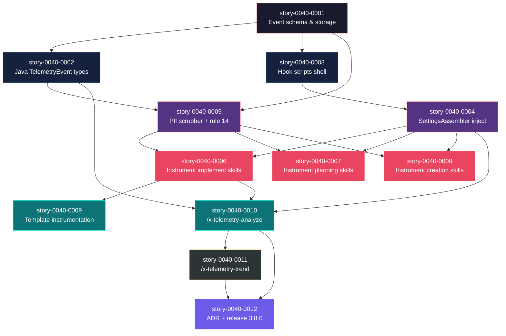
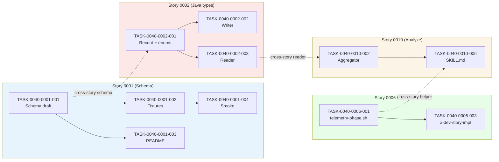

# Mapa de Implementação — EPIC-0040 Telemetria de Execução de Skills

**Gerado a partir das dependências BlockedBy/Blocks de cada história do epic-0040.**

---

## 1. Matriz de Dependências

| Story | Título | Chave Jira | Blocked By | Blocks | Status |
| :--- | :--- | :--- | :--- | :--- | :--- |
| story-0040-0001 | Event schema & storage spec | — | — | 0002, 0003, 0005 | Concluida |
| story-0040-0002 | Java domain: TelemetryEvent types | — | 0001 | 0005, 0010 | Pendente |
| story-0040-0003 | Telemetry hook scripts | — | 0001 | 0004 | Pendente |
| story-0040-0004 | SettingsAssembler: injeta hooks | — | 0003 | 0006, 0007, 0008, 0010 | Concluida |
| story-0040-0005 | PII scrubbing & privacy rule | — | 0001, 0002 | 0006, 0007, 0008 | Pendente |
| story-0040-0006 | Instrumentar skills de implementação | — | 0004, 0005 | 0009, 0010 | Pendente |
| story-0040-0007 | Instrumentar skills de planejamento | — | 0004, 0005 | — | Pendente |
| story-0040-0008 | Instrumentar skills de criação | — | 0004, 0005 | — | Pendente |
| story-0040-0009 | Template de instrumentação leve | — | 0006 | — | Pendente |
| story-0040-0010 | Skill /x-telemetry-analyze | — | 0002, 0004, 0006 | 0011, 0012 | Pendente |
| story-0040-0011 | Skill /x-telemetry-trend | — | 0010 | 0012 | Pendente |
| story-0040-0012 | Documentação, ADR e release 3.8.0 | — | 0010, 0011 | — | Pendente |

> **Valores de Status:** `Pendente` (padrão) · `Em Andamento` · `Concluída` · `Falha` · `Bloqueada` · `Parcial`

> **Nota:** Dependência implícita: stories 0007 e 0008 também poderiam beneficiar do helper de markers criado em 0006, mas são intencionalmente declaradas independentes para permitir paralelização na Fase 3 (o helper `telemetry-phase.sh` é criado em 0006 mas as stories 0007/0008 têm suas próprias tasks de extensão do helper — `subagent-*` e `mcp-*`).

---

## 2. Fases de Implementação

> As histórias são agrupadas em fases. Dentro de cada fase, as histórias podem ser implementadas **em paralelo**. Uma fase só pode iniciar quando todas as dependências das fases anteriores estiverem concluídas.

```
╔══════════════════════════════════════════════════════════════════════════╗
║               FASE 0 — Foundation Root (1 story)                         ║
║                                                                          ║
║   ┌──────────────────────────────────────────────────────────────┐       ║
║   │  story-0040-0001  Event schema & storage spec                │       ║
║   └──────────────────────────────────┬───────────────────────────┘       ║
╚══════════════════════════════════════╪═══════════════════════════════════╝
                                       │
                                       ▼
╔══════════════════════════════════════════════════════════════════════════╗
║           FASE 1 — Core Types + Hook Scripts (paralelo, 2 stories)       ║
║                                                                          ║
║   ┌─────────────┐                              ┌─────────────┐           ║
║   │  0040-0002  │  Java domain                 │  0040-0003  │ Hook sh   ║
║   │ TelemetryEv │                              │ 5 hooks NDJ │           ║
║   └──────┬──────┘                              └──────┬──────┘           ║
╚══════════╪═════════════════════════════════════════════╪═════════════════╝
           │                                             │
           ▼                                             ▼
╔══════════════════════════════════════════════════════════════════════════╗
║              FASE 2 — Integration Layer (paralelo, 2 stories)            ║
║                                                                          ║
║   ┌─────────────┐                              ┌─────────────┐           ║
║   │  0040-0005  │ PII scrubber + rule 14       │  0040-0004  │ Settings  ║
║   │ privacy     │                              │ Assembler   │ inject    ║
║   └──────┬──────┘                              └──────┬──────┘           ║
╚══════════╪═════════════════════════════════════════════╪═════════════════╝
           │                                             │
           └──────────────┬──────────────────────────────┘
                          ▼
╔══════════════════════════════════════════════════════════════════════════╗
║            FASE 3 — In-Skill Instrumentation (paralelo, 3 stories)       ║
║                                                                          ║
║   ┌─────────────┐    ┌─────────────┐    ┌─────────────┐                 ║
║   │  0040-0006  │    │  0040-0007  │    │  0040-0008  │                 ║
║   │ Implement   │    │ Planning    │    │ Creation    │                 ║
║   │ skills ⭐   │    │ skills      │    │ skills      │                 ║
║   └──────┬──────┘    └─────────────┘    └─────────────┘                 ║
╚══════════╪═══════════════════════════════════════════════════════════════╝
           │
           ▼
╔══════════════════════════════════════════════════════════════════════════╗
║            FASE 4 — Analysis Skill + Template (paralelo, 2 stories)      ║
║                                                                          ║
║   ┌─────────────┐                              ┌─────────────┐           ║
║   │  0040-0009  │ Lightweight                  │  0040-0010  │ /x-       ║
║   │ template    │ instrumentation              │ telemetry-  │ analyze   ║
║   │             │                              │ analyze ⭐  │           ║
║   └─────────────┘                              └──────┬──────┘           ║
╚══════════════════════════════════════════════════════╪═══════════════════╝
                                                       │
                                                       ▼
╔══════════════════════════════════════════════════════════════════════════╗
║                  FASE 5 — Trend Skill (1 story)                          ║
║                                                                          ║
║   ┌──────────────────────────────────────────────────────────┐           ║
║   │  story-0040-0011  /x-telemetry-trend (cross-epic P95)    │           ║
║   └──────────────────────────┬───────────────────────────────┘           ║
╚══════════════════════════════╪═══════════════════════════════════════════╝
                               │
                               ▼
╔══════════════════════════════════════════════════════════════════════════╗
║              FASE 6 — Documentation & Release (1 story)                  ║
║                                                                          ║
║   ┌──────────────────────────────────────────────────────────┐           ║
║   │  story-0040-0012  ADR-0004 + CHANGELOG + release 3.8.0   │           ║
║   └──────────────────────────────────────────────────────────┘           ║
╚══════════════════════════════════════════════════════════════════════════╝
```

---

## 3. Caminho Crítico

> O caminho crítico (a sequência mais longa de dependências) determina o tempo mínimo de implementação do projeto.

```
0001 ──→ 0002 ──→ 0005 ──→ 0006 ──→ 0010 ──→ 0011 ──→ 0012
 F0       F1       F2       F3       F4       F5       F6
```

**7 fases no caminho crítico, 7 histórias na cadeia mais longa (0001 → 0002 → 0005 → 0006 → 0010 → 0011 → 0012).**

A cadeia crítica passa por: schema (0001) → tipos Java (0002) → scrubber (0005) → instrumentação de skills de implementação (0006) → skill de análise (0010) → skill de tendências (0011) → release (0012). Qualquer atraso em uma destas histórias atrasa o release proporcionalmente. A fase 2 (scrubber + settings) tem caminho alternativo via 0003→0004, mas 0005 é a ponte obrigatória para a fase 3.

---

## 4. Grafo de Dependências (Mermaid)



---

## 5. Resumo por Fase

| Fase | Histórias | Camada | Paralelismo | Pré-requisito |
| :--- | :--- | :--- | :--- | :--- |
| 0 | 0001 | Foundation (contrato) | 1 (serial) | — |
| 1 | 0002, 0003 | Foundation (tipos + shell) | 2 paralelas | Fase 0 concluída |
| 2 | 0004, 0005 | Integration (assembler + scrubber) | 2 paralelas | Fase 1 concluída |
| 3 | 0006, 0007, 0008 | Core + Extensions (instrumentação) | 3 paralelas | Fase 2 concluída |
| 4 | 0009, 0010 | Compositions (template + análise) | 2 paralelas | Fase 3 concluída (0006) |
| 5 | 0011 | Compositions (cross-epic trends) | 1 | Fase 4 concluída (0010) |
| 6 | 0012 | Cross-cutting (docs + release) | 1 | Fase 5 concluída (0011) |

**Total: 12 histórias em 7 fases.**

> **Nota:** Paralelismo máximo é 3 (Fase 3). Sequencial no caminho crítico após Fase 3. O uso de worktrees é recomendado (não-normativo) nas fases 1, 2 e 3 para evitar contenção de arquivos entre desenvolvedores em paralelo.

---

## 6. Detalhamento por Fase

### Fase 0 — Foundation Root

| Story | Escopo Principal | Artefatos Chave |
| :--- | :--- | :--- |
| 0040-0001 | JSON Schema + layout de storage + documentação | `_TEMPLATE-TELEMETRY-EVENT.json`, fixtures em `src/test/resources/fixtures/telemetry/`, `.gitignore` update |

**Entregas da Fase 0:**
- Contrato imutável de telemetria publicado
- 5 fixtures (3 válidas + 2 inválidas) para testes
- `.gitignore` com entrada para `.claude/telemetry/index.json`

### Fase 1 — Core Types + Hook Scripts

| Story | Escopo Principal | Artefatos Chave |
| :--- | :--- | :--- |
| 0040-0002 | Java records + writer + reader + integração com ExecutionState | `dev.iadev.telemetry.{TelemetryEvent,EventType,EventStatus,TelemetryWriter,TelemetryReader}` |
| 0040-0003 | 6 scripts shell (emit + 5 hooks) + lib compartilhada | `targets/claude/hooks/telemetry-{emit,lib,session,pretool,posttool,subagent,stop}.sh` |

**Entregas da Fase 1:**
- Pacote Java `dev.iadev.telemetry` com ≥ 95% cobertura
- 7 scripts shell shellcheck-clean com bats tests
- `ExecutionState.telemetryPath` opt-in com backward compatibility

### Fase 2 — Integration Layer

| Story | Escopo Principal | Artefatos Chave |
| :--- | :--- | :--- |
| 0040-0004 | SettingsAssembler + HooksAssembler + ProjectConfig flag | `SettingsAssembler.java`, `HooksAssembler.java`, golden `settings.json` |
| 0040-0005 | TelemetryScrubber + rule 14 + PiiAudit + fuzz tests | `TelemetryScrubber.java`, `MetadataWhitelist.java`, `PiiAudit.java`, rule `14-telemetry-privacy.md` |

**Entregas da Fase 2:**
- `mvn process-resources` gera `.claude/settings.json` com 5 hooks de telemetria
- Scrubber Java aprova fuzz de 100 strings sensíveis com 0 falsos negativos
- Rule 14 publicada

### Fase 3 — In-Skill Instrumentation

| Story | Escopo Principal | Artefatos Chave |
| :--- | :--- | :--- |
| 0040-0006 | 4 skills de implementação instrumentadas + helper `telemetry-phase.sh` + lint | `telemetry-phase.sh`, SKILL.md de `x-dev-{epic,story}-implement`, `x-dev-implement`, `x-task-plan`, `TelemetryMarkerLint.java` |
| 0040-0007 | 5 skills de planejamento + extensão `subagent-*` do helper | SKILL.md de `x-{epic,story}-plan`, `x-dev-architecture-plan`, `x-test-plan`, `x-story-map` |
| 0040-0008 | 5 skills de criação + extensão `mcp-*` do helper | SKILL.md de `x-story-epic`, `x-story-create`, `x-story-epic-full`, `x-jira-create-{epic,stories}` |

**Entregas da Fase 3:**
- 14 skills instrumentadas cobrindo implementação, planejamento e criação
- Helper unificado com sub-comandos `start|end|subagent-start|subagent-end|mcp-start|mcp-end`
- CI lint detectando `phase.start` duplicados
- Rule 13 atualizada com seção "Telemetry Markers"

### Fase 4 — Analysis Skill + Template

| Story | Escopo Principal | Artefatos Chave |
| :--- | :--- | :--- |
| 0040-0009 | Seção Telemetry no `_TEMPLATE-SKILL.md` + CLAUDE.md link | `_TEMPLATE-SKILL.md`, CLAUDE.md |
| 0040-0010 | Skill `/x-telemetry-analyze` + CLI + 3 renderers (MD/JSON/CSV) | `x-telemetry-analyze/SKILL.md`, `TelemetryAnalyzeCli`, `TelemetryAggregator`, `MarkdownReportRenderer`, `_TEMPLATE-TELEMETRY-REPORT.md` |

**Entregas da Fase 4:**
- Template para skills futuras com seção Telemetry opcional
- Skill `/x-telemetry-analyze` consumindo NDJSON e produzindo relatório, JSON e CSV
- Performance verificada: 10k eventos em < 5s

### Fase 5 — Trend Skill

| Story | Escopo Principal | Artefatos Chave |
| :--- | :--- | :--- |
| 0040-0011 | Skill `/x-telemetry-trend` + detector de regressão + index builder | `x-telemetry-trend/SKILL.md`, `TelemetryTrendCli`, `RegressionDetector`, `TelemetryIndexBuilder`, `SlowestSkillsAggregator` |

**Entregas da Fase 5:**
- Detecção automática de regressões P95 > threshold
- Índice global gerado/atualizado em `.claude/telemetry/index.json`
- Top-10 skills mais lentas e top-10 regressões

### Fase 6 — Documentation & Release

| Story | Escopo Principal | Artefatos Chave |
| :--- | :--- | :--- |
| 0040-0012 | ADR-0004 + CLAUDE.md + CHANGELOG + release 3.8.0 via Git Flow | `docs/adr/ADR-0004-telemetry-architecture.md`, CLAUDE.md, `.claude/README.md`, CHANGELOG.md, tag `v3.8.0` |

**Entregas da Fase 6:**
- ADR documentando a arquitetura de telemetria
- Release 3.8.0 publicado no `main` com tag
- `develop` bumped para `3.9.0-SNAPSHOT`

---

## 7. Observações Estratégicas

### Gargalo Principal

**story-0040-0005 (PII scrubbing & privacy rule)** é o gargalo estratégico: bloqueia as 3 histórias da Fase 3 (0006, 0007, 0008). Atraso em 0005 congela toda a camada de instrumentação. A recomendação é alocar o desenvolvedor mais experiente em segurança aqui e completá-la antes de 0004 (mesmo ambas estando na Fase 2, 0005 tem mais downstream).

Secundário: **story-0040-0001** (schema) é o root obrigatório — não há paralelização antes dela. Mesmo sendo "apenas documentação", ela bloqueia tudo.

### Histórias Folha (sem dependentes)

- story-0040-0007 (Instrumentar skills de planejamento)
- story-0040-0008 (Instrumentar skills de criação)
- story-0040-0009 (Template de instrumentação leve)
- story-0040-0012 (release — folha final)

0007 e 0008 podem absorver atrasos sem impacto no caminho crítico; são candidatas a paralelismo puro na Fase 3.

### Otimização de Tempo

- **Paralelismo máximo na Fase 3**: 3 desenvolvedores podem trabalhar simultaneamente em 0006, 0007, 0008 usando worktrees.
- **Fase 1 e 2 têm paralelismo 2**: aproveitar para separar responsabilidades (Java dev em 0002/0005, DevOps em 0003/0004).
- **Storytime estimado**: foundation (0001-0003) ~2 dias; integration (0004-0005) ~2 dias; instrumentation (0006-0008) ~3 dias em paralelo; analysis (0009-0010) ~2 dias; trend (0011) ~1 dia; release (0012) ~1 dia. Total: ~11 dias com paralelização; ~18 dias serializado.

### Dependências Cruzadas

- **story-0040-0010** depende de 3 ramos diferentes: 0002 (tipos Java, Fase 1), 0004 (settings, Fase 2), 0006 (instrumentação, Fase 3). É um ponto de convergência natural — todas as Layer 0-2 têm que estar prontas antes de começar.
- **story-0040-0012** depende de 0010 E 0011: qualquer delay em trend puxa o release.

### Marco de Validação Arquitetural

**story-0040-0006 (Instrumentar skills de implementação)** é o marco: valida ponta-a-ponta (a) que hooks passivos coexistem com phase markers, (b) que o scrubber não distorce dados semânticos, (c) que o pipeline de assemblers funciona com novos arquivos shell, (d) que o storage canônico escala com múltiplas skills concorrentes. Se 0006 passa, o resto é aplicação do padrão estabelecido.

---

## 8. Dependências entre Tasks (Cross-Story)

> Esta seção é gerada automaticamente quando as histórias contêm tasks formais com IDs `TASK-XXXX-YYYY-NNN`.

### 8.1 Dependências Cross-Story entre Tasks

| Task | Depends On | Story Source | Story Target | Tipo |
| :--- | :--- | :--- | :--- | :--- |
| TASK-0040-0002-001 | TASK-0040-0001-001 | story-0040-0002 | story-0040-0001 | schema |
| TASK-0040-0003-001 | TASK-0040-0001-001 | story-0040-0003 | story-0040-0001 | schema |
| TASK-0040-0004-002 | TASK-0040-0003-005 | story-0040-0004 | story-0040-0003 | data (arquivos shell copiados) |
| TASK-0040-0005-002 | TASK-0040-0002-001 | story-0040-0005 | story-0040-0002 | interface (TelemetryEvent) |
| TASK-0040-0006-002..005 | TASK-0040-0004-003 | story-0040-0006 | story-0040-0004 | config (hooks ativos) |
| TASK-0040-0007-002..005 | TASK-0040-0006-001 | story-0040-0007 | story-0040-0006 | interface (telemetry-phase.sh) |
| TASK-0040-0008-001 | TASK-0040-0007-001 | story-0040-0008 | story-0040-0007 | interface (helper extensão) |
| TASK-0040-0010-002 | TASK-0040-0002-003 | story-0040-0010 | story-0040-0002 | interface (TelemetryReader) |
| TASK-0040-0011-002 | TASK-0040-0010-002 | story-0040-0011 | story-0040-0010 | data (agregados compartilhados) |
| TASK-0040-0012-004 | TASK-0040-0010-006, TASK-0040-0011-005 | story-0040-0012 | stories 0010, 0011 | config (features prontas) |

> **Validação RULE-012:** Todas as dependências cross-story de tasks respeitam as dependências entre stories declaradas nas seções 1 de cada story. Nenhuma task cross-story viola a DAG.

### 8.2 Ordem de Merge (Topological Sort)

| Ordem | Task ID | Story | Parallelizável Com | Fase |
| :--- | :--- | :--- | :--- | :--- |
| 1 | TASK-0040-0001-001 | 0001 | — | 0 |
| 2 | TASK-0040-0001-002 | 0001 | TASK-0040-0001-003 | 0 |
| 3 | TASK-0040-0001-003 | 0001 | TASK-0040-0001-002 | 0 |
| 4 | TASK-0040-0001-004 | 0001 | — | 0 |
| 5 | TASK-0040-0002-001, TASK-0040-0003-001 | 0002, 0003 | entre si | 1 |
| 6..9 | TASK-0040-0002-002..005 | 0002 | TASK-0040-0003-* | 1 |
| 10..15 | TASK-0040-0003-002..006 | 0003 | TASK-0040-0002-* | 1 |
| 16..20 | TASK-0040-0004-001..005 | 0004 | TASK-0040-0005-* | 2 |
| 21..26 | TASK-0040-0005-001..006 | 0005 | TASK-0040-0004-* | 2 |
| 27..33 | TASK-0040-0006-001..007 | 0006 | TASK-0040-0007-*, TASK-0040-0008-* | 3 |
| 34..38 | TASK-0040-0007-001..005 | 0007 | TASK-0040-0006-*, TASK-0040-0008-* | 3 |
| 39..43 | TASK-0040-0008-001..005 | 0008 | TASK-0040-0006-*, TASK-0040-0007-* | 3 |
| 44..46 | TASK-0040-0009-001..003 | 0009 | TASK-0040-0010-* | 4 |
| 47..54 | TASK-0040-0010-001..008 | 0010 | TASK-0040-0009-* | 4 |
| 55..60 | TASK-0040-0011-001..006 | 0011 | — | 5 |
| 61..67 | TASK-0040-0012-001..007 | 0012 | — | 6 |

**Total: 67 tasks em 7 fases de execução.**

### 8.3 Grafo de Dependências entre Tasks (Mermaid)


