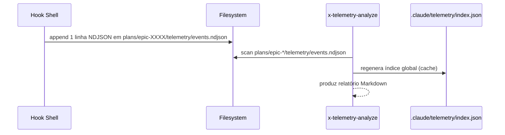

# História: Event Schema & Storage Spec

**ID:** story-0040-0001
**Chave Jira:** —
**Status:** Pendente

## 1. Dependências

| Blocked By | Blocks |
| :--- | :--- |
| — | story-0040-0002, story-0040-0003, story-0040-0005 |

## 2. Regras Transversais Aplicáveis

| ID | Título |
| :--- | :--- |
| RULE-001 | Event Schema Versioning |
| RULE-002 | NDJSON Append-Only |
| RULE-007 | Storage Layout Imutável |
| RULE-008 | Source of Truth: Resources |

## 3. Descrição

Como **mantenedor do ia-dev-environment**, eu quero um contrato formal (JSON Schema) e um layout de storage documentados para eventos de telemetria, garantindo que captura, persistência e análise compartilhem a mesma fonte da verdade.

Esta é a story de fundação (Layer 0): sem o schema e o layout, nem os hooks shell (story-0040-0003) nem os tipos Java (story-0040-0002) podem ser implementados de forma consistente. O schema usa `schemaVersion` SemVer para permitir evolução backward-compatible. O layout separa evidência per-epic (commitada) de índice global (cache gitignored).

### 3.1 Schema de Evento

- Formato: JSON Schema Draft 2020-12
- Arquivo: `java/src/main/resources/shared/templates/_TEMPLATE-TELEMETRY-EVENT.json`
- Campos obrigatórios: `schemaVersion`, `eventId`, `timestamp`, `sessionId`, `type`
- Campos opcionais (nullable): `epicId`, `storyId`, `taskId`, `skill`, `phase`, `tool`, `durationMs`, `status`, `failureReason`, `metadata`
- Tipos de evento (enum): `skill.start`, `skill.end`, `phase.start`, `phase.end`, `tool.call`, `tool.result`, `session.start`, `session.end`, `subagent.start`, `subagent.end`, `error`

### 3.2 Layout de Storage

- Canônico per-epic: `plans/epic-XXXX/telemetry/events.ndjson` (append-only, commitado)
- Opcional per-session: `plans/epic-XXXX/telemetry/sessions/{sessionId}.ndjson`
- Índice global: `.claude/telemetry/index.json` (gitignored — entrada adicionada em `.gitignore`)
- `.gitignore` atualizado para excluir `.claude/telemetry/index.json` e permitir `plans/epic-*/telemetry/`

### 3.3 Documentação de Contrato

- README curto em `java/src/main/resources/shared/templates/_TEMPLATE-TELEMETRY-EVENT.README.md` explicando campos, enums e exemplos
- Pelo menos 3 amostras válidas (`session.start`, `skill.end`, `tool.call` com `error`) versionadas em `java/src/test/resources/fixtures/telemetry/`

## 3.5 Entrega de Valor

- **Valor Principal:** Contrato imutável de telemetria publicado como JSON Schema versionado; destrava implementação das stories 0002, 0003 e 0005 sem risco de divergência.
- **Métrica de Sucesso:** Schema valida 100% das amostras-fixtures via `ajv` (ou validador Jackson equivalente); zero ambiguidade em campos obrigatórios/opcionais.
- **Impacto no Negócio:** Reduz custo de futuras mudanças de telemetria (evolução aditiva via `schemaVersion`) e garante auditoria dos artefatos gerados.

## 4. Definições de Qualidade Locais

### DoR Local (Definition of Ready)

- [ ] Plano arquitetural aprovado
- [ ] Decisão sobre storage (per-epic + global index) confirmada com o usuário
- [ ] Convenção de naming de arquivos (NDJSON) revisada

### DoD Local (Definition of Done)

- [ ] `_TEMPLATE-TELEMETRY-EVENT.json` válido (Draft 2020-12) commitado
- [ ] README de contrato commitado com 3 exemplos canônicos
- [ ] Fixtures em `src/test/resources/fixtures/telemetry/` commitadas
- [ ] `.gitignore` atualizado para excluir `.claude/telemetry/index.json`
- [ ] Pelo menos 1 teste automatizado de validação de schema (JSON Schema validator contra fixtures)
- [ ] Smoke test: amostra gerada via `jq` valida contra o schema

### Global Definition of Done (DoD)

> Copiar do Épico. Mantido aqui para referência rápida durante code review.

- **Cobertura:** ≥ 95% Line, ≥ 90% Branch
- **Testes Automatizados:** Unit + validação de schema
- **Relatório de Cobertura:** JaCoCo XML
- **Documentação:** README de contrato + ADR-0004 (referência)
- **Persistência:** N/A (esta story não grava runtime)
- **Performance:** Validação de schema < 10ms por evento

## 5. Contratos de Dados (Data Contract)

### 5.1 Event (NDJSON, uma linha por evento)

| Campo | Tipo | M/O | Validações | Exemplo |
| :--- | :--- | :--- | :--- | :--- |
| `schemaVersion` | `String` (SemVer) | M | Regex `^\d+\.\d+\.\d+$` | `"1.0.0"` |
| `eventId` | `UUID` | M | UUIDv4 | `"a3b2..."` |
| `timestamp` | `String` (ISO-8601 UTC) | M | `YYYY-MM-DDTHH:mm:ss.sssZ` | `"2026-04-13T12:34:56.789Z"` |
| `sessionId` | `String` | M | Max 128 chars | `"claude-sess-abc123"` |
| `epicId` | `String` | O | Regex `^EPIC-\d{4}$` ou `"unknown"` | `"EPIC-0040"` |
| `storyId` | `String` | O | Regex `^story-\d{4}-\d{4}$` | `"story-0040-0001"` |
| `taskId` | `String` | O | Regex `^TASK-\d{4}-\d{4}-\d{3}$` | `"TASK-0040-0001-001"` |
| `type` | `String` (enum) | M | Ver lista em 3.1 | `"tool.call"` |
| `skill` | `String` | O | Kebab-case, max 64 chars | `"x-dev-story-implement"` |
| `phase` | `String` | O | Formato livre max 64 chars | `"Phase-2-Implementation"` |
| `tool` | `String` | O | Nome canônico da tool Claude Code | `"Bash"` |
| `durationMs` | `Integer` | O | ≥ 0 | `12345` |
| `status` | `String` (enum) | O | `ok\|failed\|skipped` | `"ok"` |
| `failureReason` | `String` | O | Max 256 chars; scrubbed | `"timeout"` |
| `metadata` | `Object` | O | Whitelist de chaves (ver RULE-003) | `{"retryCount": 0}` |

### 5.2 Index (JSON)

| Campo | Tipo | Sempre presente | Descrição |
| :--- | :--- | :--- | :--- |
| `schemaVersion` | `String` | Sim | Versão do formato do índice |
| `generatedAt` | `String` (ISO-8601) | Sim | Momento da última geração |
| `epics` | `Array<EpicEntry>` | Sim | Lista de épicos conhecidos |
| `epics[].id` | `String` | Sim | ID do épico (ex.: `EPIC-0040`) |
| `epics[].path` | `String` | Sim | Path relativo ao `events.ndjson` |
| `epics[].firstSeen` | `String` | Sim | Timestamp do primeiro evento |
| `epics[].lastSeen` | `String` | Sim | Timestamp do último evento |
| `epics[].eventCount` | `Integer` | Sim | Total de linhas NDJSON |

### 5.3 Error Codes Mapeados

> N/A — story de schema/documentação não expõe endpoint HTTP.

## 6. Diagramas

### 6.1 Fluxo de Storage



## 7. Critérios de Aceite (Gherkin)

```gherkin
Cenario: Schema vazio é rejeitado (degenerate)
  DADO o JSON Schema _TEMPLATE-TELEMETRY-EVENT.json publicado
  QUANDO validamos o objeto JSON vazio {}
  ENTÃO o validador retorna erro citando campos obrigatórios ausentes
  E lista schemaVersion, eventId, timestamp, sessionId, type

Cenario: Evento session.start mínimo válido (happy path)
  DADO o JSON Schema publicado
  QUANDO validamos a fixture session-start-minimal.json com schemaVersion=1.0.0, eventId, timestamp, sessionId e type=session.start
  ENTÃO o validador retorna sucesso
  E nenhum campo opcional é exigido

Cenario: Evento com type inválido é rejeitado (error path)
  DADO o JSON Schema publicado
  QUANDO validamos evento com type="foo.bar"
  ENTÃO o validador retorna erro no campo type
  E a mensagem lista os valores permitidos do enum

Cenario: Evento com durationMs negativo é rejeitado (boundary at-min-1)
  DADO o JSON Schema publicado
  QUANDO validamos evento com durationMs=-1
  ENTÃO o validador retorna erro de mínimo no campo durationMs

Cenario: Evento com durationMs zero é aceito (boundary at-min)
  DADO o JSON Schema publicado
  QUANDO validamos evento com durationMs=0
  ENTÃO o validador retorna sucesso

Cenario: Evento com metadata fora da whitelist é rejeitado (boundary past-max)
  DADO o JSON Schema publicado e a whitelist de chaves de metadata definida em RULE-003
  QUANDO validamos evento cuja metadata contém chave "awsSecretKey"
  ENTÃO o validador retorna erro citando chave não permitida
```

### 7.1 Scenario Ordering (TPP)
Ordem acima: degenerate (`{}`) → unconditional (mínimo válido) → conditions (type inválido) → edge cases (boundary -1/0/past-max).

### 7.2 Mandatory Scenario Categories
- [x] Degenerate cases (objeto vazio)
- [x] Happy path (mínimo válido)
- [x] Error paths (type inválido, metadata fora da whitelist)
- [x] Boundary values (durationMs -1/0)

### 7.3 TDD Implementation Notes
- **Double-Loop TDD**: O primeiro cenário Gherkin (`{}` rejeitado) vira o acceptance test; ele falha até o schema existir.
- Unit tests: TPP parte de schema vazio → schema com apenas required → enums → regex → bounds.

## 8. Tasks

### TASK-0040-0001-001: Draft JSON Schema com required e enums

- **Layer:** Config
- **Test Type:** Verification
- **Size:** M
- **Dependencies:** —
- **Branch:** `feature/task-0040-0001-001-schema-draft`
- **Testability:** Config + VerificationTest
- **Files:**
  - `java/src/main/resources/shared/templates/_TEMPLATE-TELEMETRY-EVENT.json`
  - `java/src/test/java/dev/iadev/telemetry/schema/TelemetryEventSchemaTest.java`
- **Acceptance Criteria:**
  - [ ] Schema é Draft 2020-12 válido (validator não aponta erros sintáticos)
  - [ ] Todos os 5 campos obrigatórios estão em `required`
  - [ ] Enum de `type` contém os 11 valores canônicos

### TASK-0040-0001-002: Fixtures de eventos válidos e inválidos

- **Layer:** Test
- **Test Type:** Verification
- **Size:** S
- **Dependencies:** TASK-0040-0001-001
- **Branch:** `feature/task-0040-0001-002-fixtures`
- **Testability:** Config + VerificationTest
- **Files:**
  - `java/src/test/resources/fixtures/telemetry/session-start-minimal.json`
  - `java/src/test/resources/fixtures/telemetry/skill-end-with-duration.json`
  - `java/src/test/resources/fixtures/telemetry/tool-call-failed.json`
  - `java/src/test/resources/fixtures/telemetry/invalid-type.json`
  - `java/src/test/resources/fixtures/telemetry/negative-duration.json`
- **Acceptance Criteria:**
  - [ ] 3 fixtures válidas cobrindo `session.start`, `skill.end`, `tool.call` com `status=failed`
  - [ ] 2 fixtures inválidas para os casos de erro/boundary
  - [ ] Teste parametrizado itera todas as fixtures

### TASK-0040-0001-003: Documentar contrato e layout em README

- **Layer:** Doc
- **Test Type:** Verification
- **Size:** S
- **Dependencies:** TASK-0040-0001-001
- **Branch:** `feature/task-0040-0001-003-readme`
- **Testability:** Config + VerificationTest
- **Files:**
  - `java/src/main/resources/shared/templates/_TEMPLATE-TELEMETRY-EVENT.README.md`
  - `.gitignore`
- **Acceptance Criteria:**
  - [ ] README explica cada campo do schema e os 3 exemplos
  - [ ] Seção "Storage Layout" cita os 2 paths canônicos e a política de gitignore
  - [ ] `.gitignore` inclui `.claude/telemetry/index.json`

### TASK-0040-0001-004: Smoke test end-to-end de validação

- **Layer:** Test
- **Test Type:** Smoke
- **Size:** S
- **Dependencies:** TASK-0040-0001-001, TASK-0040-0001-002
- **Branch:** `feature/task-0040-0001-004-smoke`
- **Testability:** Config + VerificationTest (schema é "código")
- **Files:**
  - `java/src/test/java/dev/iadev/telemetry/schema/SchemaSmokeTest.java`
- **Acceptance Criteria:**
  - [ ] Teste gera um evento via `jq` ou builder inline e valida contra o schema
  - [ ] Duração do teste < 2s
