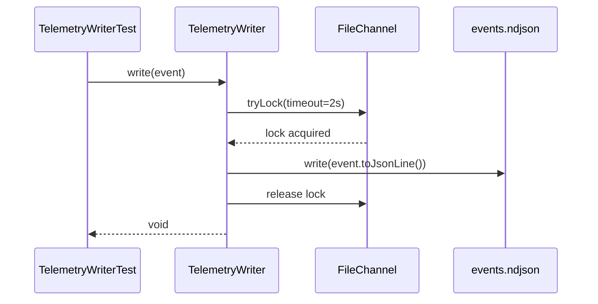

# História: Java Domain — TelemetryEvent Types

**ID:** story-0040-0002
**Chave Jira:** —
**Status:** Pendente

## 1. Dependências

| Blocked By | Blocks |
| :--- | :--- |
| story-0040-0001 | story-0040-0005, story-0040-0010 |

## 2. Regras Transversais Aplicáveis

| ID | Título |
| :--- | :--- |
| RULE-001 | Event Schema Versioning |
| RULE-002 | NDJSON Append-Only |
| RULE-003 | Zero PII |
| RULE-008 | Source of Truth: Resources |

## 3. Descrição

Como **desenvolvedor do ia-dev-environment**, eu quero tipos Java (record + enums + writer) para serializar/deserializar eventos de telemetria com validação, garantindo que a skill `/x-telemetry-analyze` e o futuro `TelemetryScrubber` compartilhem o mesmo modelo imutável.

Esta story implementa a camada de domínio Java (Layer 1 — core). A partir daqui, qualquer consumidor Java lê NDJSON com garantias de tipo. O `TelemetryWriter` é opt-in (hooks shell escrevem direto; Java é usado apenas pela skill de análise e por testes).

### 3.1 Pacote e Tipos

- Pacote novo: `dev.iadev.telemetry`
- `TelemetryEvent` — Java record imutável, 100% campos do schema (story-0040-0001)
- `EventType` — enum dos 11 tipos canônicos
- `EventStatus` — enum: `OK`, `FAILED`, `SKIPPED`
- `TelemetryWriter` — escritor NDJSON append-only thread-safe
- `TelemetryReader` — leitor streaming (iterator) para NDJSON grande
- `TelemetryIndex` — record do índice global

### 3.2 Integração com ExecutionState

- `ExecutionState` ganha campo opcional `telemetryPath` (String — path relativo ao `events.ndjson`)
- Jackson (de)serialization mantém backward compatibility (RULE-001): campo ausente em JSONs antigos não quebra leitura

### 3.3 Constraints de Código

- Todos os tipos imutáveis (records)
- Nenhum `null` em campos obrigatórios (fail-fast no construtor canônico)
- `TelemetryWriter` usa `FileChannel.tryLock()` para segurança entre processos concorrentes
- Zero dependência externa além de Jackson (já no classpath)

## 3.5 Entrega de Valor

- **Valor Principal:** Modelo Java type-safe disponível; desbloqueia `/x-telemetry-analyze` (story-0040-0010) e `TelemetryScrubber` (story-0040-0005) sem reimplementação de parser.
- **Métrica de Sucesso:** Cobertura ≥ 95% line, ≥ 90% branch no pacote `dev.iadev.telemetry`; zero NPE em fuzz de 10k eventos.
- **Impacto no Negócio:** Qualquer skill Java futura pode ler telemetria sem ambiguidade; reduz risco de bugs de parsing em análises.

## 4. Definições de Qualidade Locais

### DoR Local (Definition of Ready)

- [ ] Schema da story-0040-0001 publicado e validado
- [ ] Decisão sobre Jackson (vs. Gson) confirmada — Jackson é o default do projeto
- [ ] Fixtures de telemetria disponíveis (`src/test/resources/fixtures/telemetry/`)

### DoD Local (Definition of Done)

- [ ] Record `TelemetryEvent` criado com todos os campos do schema
- [ ] Enums `EventType`, `EventStatus` criados
- [ ] `TelemetryWriter` escreve NDJSON append-only thread-safe (testado)
- [ ] `TelemetryReader` itera eventos sem carregar tudo em memória
- [ ] `ExecutionState.telemetryPath` adicionado com retrocompatibilidade
- [ ] Cobertura ≥ 95% line, ≥ 90% branch
- [ ] Pelo menos 1 teste de concorrência (2 threads escrevendo no mesmo arquivo)
- [ ] Smoke test: 1000 eventos → ler via Reader → contar equivale a 1000

### Global Definition of Done (DoD)

- **Cobertura:** ≥ 95% Line, ≥ 90% Branch
- **Testes Automatizados:** Unit + property-based (jqwik) + concurrency
- **Relatório de Cobertura:** JaCoCo
- **Documentação:** Javadoc em todos os tipos públicos
- **Persistência:** Append-only; lock via FileChannel
- **Performance:** Write p99 < 5ms por evento

## 5. Contratos de Dados (Data Contract)

### 5.1 Record TelemetryEvent

| Campo | Tipo | M/O | Validações | Exemplo |
| :--- | :--- | :--- | :--- | :--- |
| `schemaVersion` | `String` | M | SemVer regex | `"1.0.0"` |
| `eventId` | `UUID` | M | non-null | `UUID.randomUUID()` |
| `timestamp` | `Instant` | M | non-null UTC | `Instant.now()` |
| `sessionId` | `String` | M | non-blank, max 128 | `"claude-sess-..."` |
| `epicId` | `String` | O | null ou regex | `"EPIC-0040"` |
| `storyId` | `String` | O | null ou regex | `"story-0040-0001"` |
| `taskId` | `String` | O | null ou regex | `"TASK-0040-0001-001"` |
| `type` | `EventType` | M | non-null | `EventType.TOOL_CALL` |
| `skill` | `String` | O | null ou kebab-case | `"x-dev-story-implement"` |
| `phase` | `String` | O | null ou max 64 | `"Phase-2-Implementation"` |
| `tool` | `String` | O | null ou whitelist | `"Bash"` |
| `durationMs` | `Long` | O | null ou ≥ 0 | `12345L` |
| `status` | `EventStatus` | O | null ou enum | `EventStatus.OK` |
| `failureReason` | `String` | O | null ou max 256 | `"timeout"` |
| `metadata` | `Map<String,Object>` | O | chaves na whitelist | `Map.of("retryCount",0)` |

### 5.2 API Pública

| Classe | Método | Retorno | Descrição |
| :--- | :--- | :--- | :--- |
| `TelemetryWriter` | `write(TelemetryEvent)` | `void` | Serializa e anexa 1 linha no arquivo |
| `TelemetryWriter` | `close()` | `void` | Libera FileChannel |
| `TelemetryReader` | `stream()` | `Stream<TelemetryEvent>` | Iterador lazy; fecha via try-with-resources |
| `TelemetryReader` | `count()` | `long` | Conta linhas sem deserializar valores |
| `TelemetryEvent` | `toJsonLine()` | `String` | NDJSON válido terminado em `\n` |

### 5.3 Error Codes

| Situação | Exceção | Mensagem |
| :--- | :--- | :--- |
| `schemaVersion` nulo | `IllegalArgumentException` | `"schemaVersion is required"` |
| `timestamp` nulo | `IllegalArgumentException` | `"timestamp is required"` |
| `type` nulo | `IllegalArgumentException` | `"type is required"` |
| Arquivo inacessível | `UncheckedIOException` | propaga `IOException` |
| Lock não obtido em 2s | `TelemetryWriteTimeoutException` | `"Could not acquire file lock in 2s"` |

## 6. Diagramas

### 6.1 Estrutura de Classes



## 7. Critérios de Aceite (Gherkin)

```gherkin
Cenario: Construtor rejeita evento sem timestamp (degenerate)
  DADO o record TelemetryEvent
  QUANDO construímos um evento com timestamp=null
  ENTÃO IllegalArgumentException é lançada
  E a mensagem contém "timestamp is required"

Cenario: Writer escreve 1 evento válido (happy path)
  DADO um TelemetryWriter apontando para um tmp file
  QUANDO escrevemos 1 TelemetryEvent do tipo session.start
  ENTÃO o arquivo contém 1 linha NDJSON
  E a linha parseia de volta para um evento equivalente (round-trip)

Cenario: Writer rejeita dois locks concorrentes (error path)
  DADO 2 writers apontando ao mesmo arquivo
  QUANDO ambos tentam escrever simultaneamente (lock timeout 2s)
  ENTÃO o primeiro obtém o lock e escreve com sucesso
  E o segundo aguarda e escreve em seguida sem corromper dados
  E o arquivo final tem exatamente 2 linhas

Cenario: Reader conta 0 eventos em arquivo vazio (boundary at-min)
  DADO um events.ndjson vazio
  QUANDO invocamos reader.count()
  ENTÃO retorna 0

Cenario: Reader itera 1000 eventos sem carregar tudo em memória (boundary at-max)
  DADO um events.ndjson com 1000 linhas válidas
  QUANDO iteramos via reader.stream()
  ENTÃO todos os 1000 eventos são retornados em ordem
  E pico de heap aumenta menos que 10MB (validado via jmx)

Cenario: Reader ignora linha malformada sem abortar (error path)
  DADO um events.ndjson com 3 linhas válidas e 1 linha inválida no meio
  QUANDO iteramos via reader.stream(skipInvalid=true)
  ENTÃO 3 eventos são retornados
  E 1 warning é logado via SLF4J
```

### 7.1 Scenario Ordering (TPP)
Degenerate (null) → happy (1 evento) → conditions (concorrência) → boundaries (0/1000) → error path (linha inválida).

### 7.2 Mandatory Scenario Categories
- [x] Degenerate (null timestamp)
- [x] Happy path (1 evento)
- [x] Error paths (lock, linha inválida)
- [x] Boundary (0 e 1000 eventos)

### 7.3 TDD Implementation Notes
- Acceptance test: escrever e ler 1 evento round-trip.
- Unit tests TPP: construtor vazio → required fields → enums → writer single-thread → writer concorrente → reader streaming.

## 8. Tasks

### TASK-0040-0002-001: Record TelemetryEvent + enums

- **Layer:** Domain
- **Test Type:** Unit
- **Size:** M
- **Dependencies:** —
- **Branch:** `feat/task-0040-0002-001-event-record`
- **Testability:** Domain + UnitTest
- **Files:**
  - `java/src/main/java/dev/iadev/telemetry/TelemetryEvent.java`
  - `java/src/main/java/dev/iadev/telemetry/EventType.java`
  - `java/src/main/java/dev/iadev/telemetry/EventStatus.java`
  - `java/src/test/java/dev/iadev/telemetry/TelemetryEventTest.java`
- **Acceptance Criteria:**
  - [ ] Record rejeita null em campos obrigatórios
  - [ ] `toJsonLine()` produz NDJSON válido contra schema da story-0040-0001
  - [ ] Cobertura do record ≥ 95% line

### TASK-0040-0002-002: TelemetryWriter append-only com FileChannel lock

- **Layer:** Adapter
- **Test Type:** Integration
- **Size:** M
- **Dependencies:** TASK-0040-0002-001
- **Branch:** `feat/task-0040-0002-002-writer`
- **Testability:** Port + Adapter + IT
- **Files:**
  - `java/src/main/java/dev/iadev/telemetry/TelemetryWriter.java`
  - `java/src/main/java/dev/iadev/telemetry/TelemetryWriteTimeoutException.java`
  - `java/src/test/java/dev/iadev/telemetry/TelemetryWriterIT.java`
- **Acceptance Criteria:**
  - [ ] Writer escreve 1 linha por evento
  - [ ] Teste concorrente com 2 threads produz 2 linhas válidas
  - [ ] Lock timeout levanta `TelemetryWriteTimeoutException`

### TASK-0040-0002-003: TelemetryReader streaming + skipInvalid

- **Layer:** Adapter
- **Test Type:** Integration
- **Size:** M
- **Dependencies:** TASK-0040-0002-001
- **Branch:** `feat/task-0040-0002-003-reader`
- **Testability:** Port + Adapter + IT
- **Files:**
  - `java/src/main/java/dev/iadev/telemetry/TelemetryReader.java`
  - `java/src/test/java/dev/iadev/telemetry/TelemetryReaderIT.java`
- **Acceptance Criteria:**
  - [ ] Reader itera lazy (não carrega tudo em memória)
  - [ ] `count()` funciona em arquivo vazio (retorna 0)
  - [ ] `skipInvalid=true` ignora linhas corrompidas e loga warning

### TASK-0040-0002-004: ExecutionState.telemetryPath opt-in

- **Layer:** Domain
- **Test Type:** Unit
- **Size:** S
- **Dependencies:** TASK-0040-0002-001
- **Branch:** `feat/task-0040-0002-004-execstate-integration`
- **Testability:** Domain + UnitTest
- **Files:**
  - `java/src/main/java/dev/iadev/checkpoint/ExecutionState.java`
  - `java/src/test/java/dev/iadev/checkpoint/ExecutionStateBackwardCompatTest.java`
- **Acceptance Criteria:**
  - [ ] Campo `telemetryPath` (Optional<String>) adicionado
  - [ ] Teste carrega JSON v1 sem o campo e não quebra
  - [ ] Teste carrega JSON v2 com o campo e popula corretamente

### TASK-0040-0002-005: Smoke 1000 eventos round-trip

- **Layer:** Test
- **Test Type:** Smoke
- **Size:** S
- **Dependencies:** TASK-0040-0002-002, TASK-0040-0002-003
- **Branch:** `feat/task-0040-0002-005-smoke`
- **Testability:** Migration + Smoke
- **Files:**
  - `java/src/test/java/dev/iadev/telemetry/TelemetrySmokeTest.java`
- **Acceptance Criteria:**
  - [ ] 1000 eventos escritos e lidos de volta produzem contagem idêntica
  - [ ] Duração total < 2s
