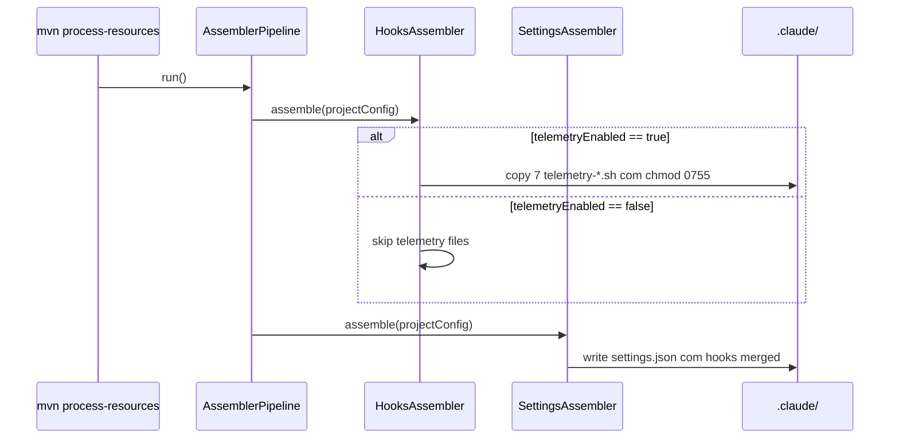

# História: SettingsAssembler — Inject Telemetry Hooks

**ID:** story-0040-0004
**Chave Jira:** —
**Status:** Pendente

## 1. Dependências

| Blocked By | Blocks |
| :--- | :--- |
| story-0040-0003 | story-0040-0006, story-0040-0007, story-0040-0008, story-0040-0010 |

## 2. Regras Transversais Aplicáveis

| ID | Título |
| :--- | :--- |
| RULE-004 | Hook Fail-Open |
| RULE-006 | Feature Flag Opt-Out |
| RULE-008 | Source of Truth: Resources |

## 3. Descrição

Como **usuário do ia-dev-environment**, eu quero que `mvn process-resources` gere automaticamente um `.claude/settings.json` com os 5 hooks de telemetria registrados, garantindo ativação sem edição manual.

Esta story conecta os scripts shell (story-0040-0003) ao pipeline de geração do projeto. `SettingsAssembler` ganha entries para os novos eventos (`SessionStart`, `PreToolUse`, `PostToolUse`, `SubagentStop`, `Stop`) e `HooksAssembler` copia os scripts com permissões 0755. Feature flag `telemetry.enabled` adicionada ao `ProjectConfig` controla a inclusão dos hooks.

### 3.1 Alterações em SettingsAssembler

- Adicionar 5 entries ao mapa de hooks em `.claude/settings.json`:
  - `SessionStart` → `$CLAUDE_PROJECT_DIR/.claude/hooks/telemetry-session.sh`, timeout 5
  - `PreToolUse` (matcher `*`) → `telemetry-pretool.sh`, timeout 5
  - `PostToolUse` (matcher `*`) → `telemetry-posttool.sh`, timeout 5
  - `SubagentStop` → `telemetry-subagent.sh`, timeout 5
  - `Stop` → `telemetry-stop.sh`, timeout 5
- Não sobrescrever hooks pré-existentes (ex: `post-compile-check.sh` em `PostToolUse` deve permanecer — usar array de hooks do mesmo evento)
- Respeitar `projectConfig.telemetryEnabled == false` (pular toda a injeção)

### 3.2 Alterações em HooksAssembler

- Copiar os 7 arquivos (`telemetry-emit`, `-lib`, `-session`, `-pretool`, `-posttool`, `-subagent`, `-stop`) para `.claude/hooks/`
- Aplicar `chmod 0755`

### 3.3 Alterações em ProjectConfig

- Novo campo `telemetryEnabled` (boolean, default `true`)
- Documentado em `docs/configuration/project-config.md`

### 3.4 Golden Tests

- Regenerar `src/test/resources/golden/claude/settings.json` via `GoldenFileRegenerator`
- Adicionar teste `SettingsAssemblerTelemetryTest` que valida:
  - Com `telemetryEnabled=true`: settings contém os 5 hooks de telemetria
  - Com `telemetryEnabled=false`: settings NÃO contém nenhum hook `telemetry-*`

## 3.5 Entrega de Valor

- **Valor Principal:** Ativação automática de telemetria após `mvn process-resources`; zero configuração manual para novos usuários.
- **Métrica de Sucesso:** Golden test de settings.json passa com 100% fidelity; coexistência com hooks pré-existentes (`post-compile-check.sh`) validada.
- **Impacto no Negócio:** Rollout consistente em todos os projetos gerados; reduz suporte por "telemetria não funciona".

## 4. Definições de Qualidade Locais

### DoR Local (Definition of Ready)

- [ ] Story-0040-0003 concluída (scripts existem e são testáveis)
- [ ] `SettingsAssembler` atual lido e compreendido (padrão de inserção)
- [ ] `ProjectConfig` atual revisado

### DoD Local (Definition of Done)

- [ ] `SettingsAssembler` injeta 5 hooks quando `telemetryEnabled=true`
- [ ] Coexistência com `post-compile-check.sh` no `PostToolUse` validada (ambos rodam)
- [ ] `HooksAssembler` copia 7 arquivos com chmod 0755
- [ ] `ProjectConfig.telemetryEnabled` com default `true` e testes
- [ ] Golden file regenerado e commitado
- [ ] `SettingsAssemblerTelemetryTest` com cobertura ≥ 95%
- [ ] Smoke test: executar `mvn process-resources` em projeto-teste → `.claude/settings.json` contém todos os hooks

### Global Definition of Done (DoD)

- **Cobertura:** ≥ 95% Line, ≥ 90% Branch
- **Testes Automatizados:** Unit + golden file regeneration
- **Relatório de Cobertura:** JaCoCo
- **Documentação:** `docs/configuration/project-config.md` atualizado
- **Persistência:** N/A (gera arquivo idempotentemente)
- **Performance:** `mvn process-resources` não aumenta > 500ms

## 5. Contratos de Dados (Data Contract)

### 5.1 Estrutura em .claude/settings.json (hooks)

```json
{
  "hooks": {
    "SessionStart": [
      {
        "hooks": [
          {"type": "command", "command": "$CLAUDE_PROJECT_DIR/.claude/hooks/telemetry-session.sh", "timeout": 5}
        ]
      }
    ],
    "PreToolUse": [
      {
        "matcher": "*",
        "hooks": [
          {"type": "command", "command": "$CLAUDE_PROJECT_DIR/.claude/hooks/telemetry-pretool.sh", "timeout": 5}
        ]
      }
    ],
    "PostToolUse": [
      {
        "matcher": "Write|Edit",
        "hooks": [
          {"type": "command", "command": "$CLAUDE_PROJECT_DIR/.claude/hooks/post-compile-check.sh", "timeout": 60}
        ]
      },
      {
        "matcher": "*",
        "hooks": [
          {"type": "command", "command": "$CLAUDE_PROJECT_DIR/.claude/hooks/telemetry-posttool.sh", "timeout": 5}
        ]
      }
    ],
    "SubagentStop": [
      {"hooks": [{"type": "command", "command": "$CLAUDE_PROJECT_DIR/.claude/hooks/telemetry-subagent.sh", "timeout": 5}]}
    ],
    "Stop": [
      {"hooks": [{"type": "command", "command": "$CLAUDE_PROJECT_DIR/.claude/hooks/telemetry-stop.sh", "timeout": 5}]}
    ]
  }
}
```

### 5.2 ProjectConfig addendum

| Campo | Tipo | Default | Descrição |
| :--- | :--- | :--- | :--- |
| `telemetryEnabled` | `boolean` | `true` | Se `true`, `SettingsAssembler` injeta hooks de telemetria |

### 5.3 Error Codes

| Situação | Comportamento |
| :--- | :--- |
| `telemetryEnabled=false` | Assemblers pulam silenciosamente |
| Arquivo de hook ausente ao copiar | `AssemblerException` com path do arquivo |
| `chmod` falha | Log warning + continua |

## 6. Diagramas

### 6.1 Pipeline de Geração



## 7. Critérios de Aceite (Gherkin)

```gherkin
Cenario: Telemetria desativada não injeta hooks (degenerate)
  DADO ProjectConfig com telemetryEnabled=false
  QUANDO SettingsAssembler.assemble() é executado
  ENTÃO .claude/settings.json NÃO contém nenhum hook telemetry-*
  E .claude/hooks/ NÃO contém arquivos telemetry-*.sh

Cenario: Telemetria ativa injeta 5 hooks (happy path)
  DADO ProjectConfig com telemetryEnabled=true
  QUANDO SettingsAssembler.assemble() e HooksAssembler.assemble() são executados
  ENTÃO .claude/settings.json contém hooks em SessionStart, PreToolUse, PostToolUse, SubagentStop, Stop
  E .claude/hooks/ contém 7 arquivos telemetry-*.sh com permissão 0755

Cenario: Coexistência com post-compile-check.sh (happy path)
  DADO projeto Java-Maven com post-compile-check.sh ativo
  QUANDO SettingsAssembler gera com telemetryEnabled=true
  ENTÃO PostToolUse contém 2 entries: uma com matcher="Write|Edit" (post-compile) e outra com matcher="*" (telemetry-posttool)

Cenario: Golden test de settings.json passa (error path)
  DADO golden file src/test/resources/golden/claude/settings.json atualizado
  QUANDO GoldenFileRegenerator compara gerado vs golden
  ENTÃO os 2 arquivos são idênticos byte-a-byte

Cenario: Hook shell ausente aborta com mensagem (error path)
  DADO o arquivo telemetry-emit.sh deletado em targets/claude/hooks/
  QUANDO HooksAssembler.assemble() é executado
  ENTÃO AssemblerException é lançada com mensagem citando o path faltante

Cenario: Regeneração idempotente (boundary)
  DADO .claude/settings.json já gerado com telemetria
  QUANDO SettingsAssembler.assemble() é executado novamente
  ENTÃO o arquivo resultante é byte-idêntico ao anterior
```

### 7.1 Scenario Ordering (TPP)
Degenerate (disabled) → happy (enabled) → conditions (coexistence) → error (missing file) → boundary (idempotency).

### 7.2 Mandatory Scenario Categories
- [x] Degenerate (telemetryEnabled=false)
- [x] Happy path (enabled)
- [x] Error paths (missing file, golden mismatch)
- [x] Boundary (idempotency)

### 7.3 TDD Implementation Notes
- Acceptance test: `mvn process-resources` em projeto-teste → validar settings.json.
- Unit tests TPP: config vazio → flag false → flag true → merge com hooks existentes.

## 8. Tasks

### TASK-0040-0004-001: ProjectConfig.telemetryEnabled + testes

- **Layer:** Domain
- **Test Type:** Unit
- **Size:** S
- **Dependencies:** —
- **Branch:** `feat/task-0040-0004-001-project-config`
- **Testability:** Domain + UnitTest
- **Files:**
  - `java/src/main/java/dev/iadev/config/ProjectConfig.java`
  - `java/src/test/java/dev/iadev/config/ProjectConfigTest.java`
- **Acceptance Criteria:**
  - [ ] Campo default `true`
  - [ ] Roundtrip YAML/JSON preserva o valor

### TASK-0040-0004-002: HooksAssembler copia telemetry-*.sh com chmod

- **Layer:** Application
- **Test Type:** Integration
- **Size:** M
- **Dependencies:** TASK-0040-0004-001
- **Branch:** `feat/task-0040-0004-002-hooks-assembler`
- **Testability:** UseCase + AT
- **Files:**
  - `java/src/main/java/dev/iadev/application/assembler/HooksAssembler.java`
  - `java/src/test/java/dev/iadev/application/assembler/HooksAssemblerTelemetryIT.java`
- **Acceptance Criteria:**
  - [ ] 7 arquivos copiados quando `telemetryEnabled=true`
  - [ ] Permissões 0755 aplicadas em Unix
  - [ ] Zero arquivos copiados quando `telemetryEnabled=false`

### TASK-0040-0004-003: SettingsAssembler merge de hooks

- **Layer:** Application
- **Test Type:** Unit
- **Size:** L
- **Dependencies:** TASK-0040-0004-001
- **Branch:** `feat/task-0040-0004-003-settings-merge`
- **Testability:** UseCase + AT
- **Files:**
  - `java/src/main/java/dev/iadev/application/assembler/SettingsAssembler.java`
  - `java/src/test/java/dev/iadev/application/assembler/SettingsAssemblerTelemetryTest.java`
- **Acceptance Criteria:**
  - [ ] 5 eventos de hook injetados com matcher correto
  - [ ] Coexistência com `post-compile-check.sh` preservada (2 entries no PostToolUse)
  - [ ] Cobertura ≥ 95% line

### TASK-0040-0004-004: Regenerar golden settings.json

- **Layer:** Test
- **Test Type:** Verification
- **Size:** S
- **Dependencies:** TASK-0040-0004-003
- **Branch:** `feat/task-0040-0004-004-golden-regen`
- **Testability:** Config + VerificationTest
- **Files:**
  - `java/src/test/resources/golden/claude/settings.json`
  - `java/src/test/java/dev/iadev/golden/SettingsGoldenTest.java`
- **Acceptance Criteria:**
  - [ ] Golden file atualizado via `GoldenFileRegenerator`
  - [ ] Teste de comparação passa byte-a-byte

### TASK-0040-0004-005: Doc ProjectConfig + Smoke `mvn process-resources`

- **Layer:** Doc
- **Test Type:** Smoke
- **Size:** S
- **Dependencies:** TASK-0040-0004-002, TASK-0040-0004-003
- **Branch:** `feat/task-0040-0004-005-docs-smoke`
- **Testability:** Migration + Smoke
- **Files:**
  - `docs/configuration/project-config.md`
  - `java/src/test/java/dev/iadev/application/assembler/ProcessResourcesSmokeIT.java`
- **Acceptance Criteria:**
  - [ ] Doc explica `telemetryEnabled` com default e exemplos
  - [ ] Smoke test rodando em sandbox-dir reproduz pipeline completa em < 10s
