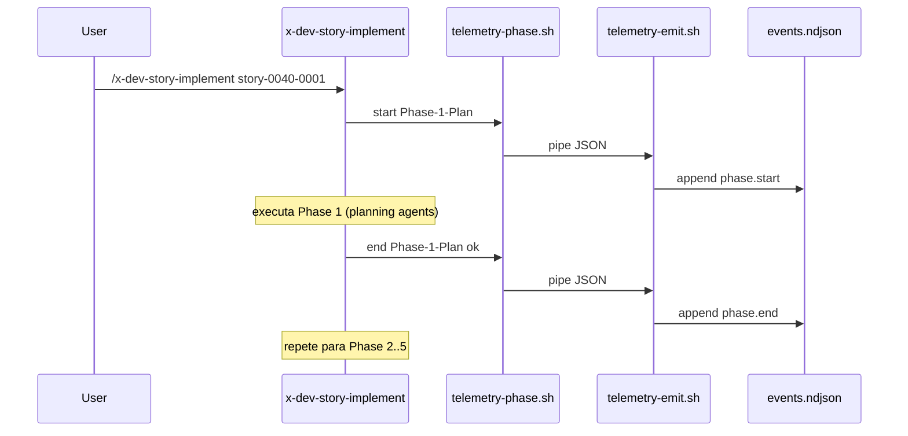

# História: Instrumentar Skills de Implementação

**ID:** story-0040-0006
**Chave Jira:** —
**Status:** Pendente

## 1. Dependências

| Blocked By | Blocks |
| :--- | :--- |
| story-0040-0004, story-0040-0005 | story-0040-0009, story-0040-0010 |

## 2. Regras Transversais Aplicáveis

| ID | Título |
| :--- | :--- |
| RULE-002 | NDJSON Append-Only |
| RULE-003 | Zero PII |
| RULE-005 | Context Resolution Order |
| RULE-006 | Feature Flag Opt-Out |
| RULE-008 | Source of Truth: Resources |

## 3. Descrição

Como **usuário do Claude Code no ia-dev-environment**, eu quero que as skills de implementação críticas (`x-dev-epic-implement`, `x-dev-story-implement`, `x-dev-implement`, `x-task-plan`) emitam marcadores semânticos `phase.start`/`phase.end` em cada fase numerada, permitindo análise de gargalo por fase (ex: "Phase 2 de implementação consome 70% do tempo").

Esta é a story crítica (Layer 1 Core) do épico: captura hooks já existe (story-0040-0003), mas **fase** é um conceito semântico que só a skill conhece. Sem esses marcadores, o analista vê apenas chamadas de tool sem contexto de qual etapa do workflow elas pertencem. As 4 skills juntas cobrem todo o fluxo de implementação (épico → story → task → TDD cycle).

### 3.1 Padrão de Instrumentação

Em cada fase numerada da skill (ex: Phase 1, Phase 2, ...), adicionar 2 chamadas Bash:

**Início da fase:**
```bash
Bash command: echo '{"schemaVersion":"1.0.0","eventId":"'$(uuidgen)'","timestamp":"'$(date -u +%FT%T.%3NZ)'","sessionId":"'"$CLAUDE_SESSION_ID"'","type":"phase.start","skill":"x-dev-story-implement","phase":"Phase-2-Implementation"}' | $CLAUDE_PROJECT_DIR/.claude/hooks/telemetry-emit.sh
```

**Fim da fase:**
```bash
Bash command: echo '{"schemaVersion":"1.0.0","eventId":"'$(uuidgen)'","timestamp":"'$(date -u +%FT%T.%3NZ)'","sessionId":"'"$CLAUDE_SESSION_ID"'","type":"phase.end","skill":"x-dev-story-implement","phase":"Phase-2-Implementation","status":"ok"}' | $CLAUDE_PROJECT_DIR/.claude/hooks/telemetry-emit.sh
```

Refatoração: criar helper `.claude/hooks/telemetry-phase.sh` que encapsula o JSON building:
```bash
$CLAUDE_PROJECT_DIR/.claude/hooks/telemetry-phase.sh start "x-dev-story-implement" "Phase-2-Implementation"
$CLAUDE_PROJECT_DIR/.claude/hooks/telemetry-phase.sh end   "x-dev-story-implement" "Phase-2-Implementation" ok
```

### 3.2 Skills a Instrumentar

| Skill | Fases a marcar |
| :--- | :--- |
| `x-dev-epic-implement` | Phase 1 (Validation), Phase 2 (Planning Completeness), Phase 3 (Story Execution Loop), Phase 4 (Cleanup & Report) |
| `x-dev-story-implement` | Phase 1 (Plan), Phase 2 (Implement), Phase 3 (Review), Phase 4 (Remediate), Phase 5 (PR) |
| `x-dev-implement` | TDD cycle Red → Green → Refactor (3 marcadores por ciclo) |
| `x-task-plan` | Phase 1 (Context Gathering), Phase 2 (Task Breakdown), Phase 3 (Validation) |

### 3.3 Rule 13 Update

Adicionar seção "Telemetry Markers" em `13-skill-invocation-protocol.md` documentando:
- Quando usar `phase.start`/`phase.end` (fases numeradas)
- Quando delegar para captura passiva (hooks)
- Contrato do helper `telemetry-phase.sh`

### 3.4 Validação em Skill

Cada skill que emite phase markers DEVE:
- Ter um teste acceptance que execute a skill ponta-a-ponta e valide que NDJSON resultante tem exatamente N pares `phase.start`/`phase.end` (onde N é o número de fases)
- Não emitir markers duplicados (`phase.start` consecutivos da mesma fase)
- Emitir `phase.end` com `status=failed` se a fase aborta

## 3.5 Entrega de Valor

- **Valor Principal:** Análise "qual fase do workflow é mais custosa" fica possível para as 4 skills mais usadas; destrava diagnóstico de gargalos (ex: "Phase 3 Review consome 50% do tempo do épico").
- **Métrica de Sucesso:** Execução de `/x-dev-story-implement` em story-0040-0001 produz NDJSON com 10 markers (5 `phase.start` + 5 `phase.end`) sem duplicação.
- **Impacto no Negócio:** Permite decisões direcionadas sobre quais skills otimizar primeiro (priorizando as fases top-3 mais lentas).

## 4. Definições de Qualidade Locais

### DoR Local (Definition of Ready)

- [ ] Helper `telemetry-emit.sh` disponível (story-0040-0003)
- [ ] `SettingsAssembler` injeta hooks (story-0040-0004)
- [ ] Scrubber ativo (story-0040-0005)
- [ ] Lista de fases por skill aprovada

### DoD Local (Definition of Done)

- [ ] Helper `telemetry-phase.sh` criado e testado
- [ ] SKILL.md das 4 skills atualizada com markers em cada fase
- [ ] Rule 13 com seção "Telemetry Markers" publicada
- [ ] Teste acceptance por skill: fluxo real gera NDJSON com N pares balanceados
- [ ] Zero duplicação de `phase.start` detectada via CI lint

### Global Definition of Done (DoD)

- **Cobertura:** N/A (skills são markdown); testes de marker ≥ 95%
- **Testes Automatizados:** Acceptance via `SkillInvocationIT` que parseia NDJSON pós-execução
- **Relatório de Cobertura:** N/A
- **Documentação:** Rule 13 + Helper README
- **Persistência:** N/A
- **Performance:** Overhead por marker < 50ms

## 5. Contratos de Dados (Data Contract)

### 5.1 Helper telemetry-phase.sh (CLI contract)

| Argumento | Tipo | Descrição |
| :--- | :--- | :--- |
| `$1` | `start\|end` | Tipo do evento |
| `$2` | `String` | Nome da skill (kebab-case) |
| `$3` | `String` | Nome da fase (max 64 chars) |
| `$4` | `ok\|failed\|skipped` (apenas end) | Status final |

Emite evento `phase.start` ou `phase.end` via pipe para `telemetry-emit.sh`.

### 5.2 SKILL.md annotation standard

Marcador visual inserido em cada fase:
```markdown
## Phase 2 — Implementation

<!-- TELEMETRY: phase.start -->
Bash command: `$CLAUDE_PROJECT_DIR/.claude/hooks/telemetry-phase.sh start x-dev-story-implement Phase-2-Implementation`

... conteúdo original da fase ...

<!-- TELEMETRY: phase.end -->
Bash command: `$CLAUDE_PROJECT_DIR/.claude/hooks/telemetry-phase.sh end x-dev-story-implement Phase-2-Implementation ok`
```

### 5.3 Error Codes

| Situação | Comportamento |
| :--- | :--- |
| Helper ausente | Fail-open (skill continua sem telemetria) |
| Args inválidos | Helper retorna exit 0 + stderr warn |
| Duplicação `phase.start` | CI lint aborta com mensagem (detecta no code review) |

## 6. Diagramas

### 6.1 Fluxo de Marker em x-dev-story-implement



## 7. Critérios de Aceite (Gherkin)

```gherkin
Cenario: Skill sem fases emite 0 markers (degenerate)
  DADO uma skill mock com zero fases numeradas
  QUANDO executamos a skill
  ENTÃO events.ndjson não contém nenhum evento type=phase.*

Cenario: x-dev-story-implement emite 5 pares balanceados (happy path)
  DADO hooks ativos e scrubber ativo
  QUANDO executamos /x-dev-story-implement com dry-run
  ENTÃO events.ndjson contém exatamente 5 eventos type=phase.start
  E exatamente 5 eventos type=phase.end
  E para cada phase.start existe um phase.end correspondente pela mesma phase

Cenario: Fase que aborta emite phase.end status=failed (error path)
  DADO /x-dev-story-implement executando Phase 3
  QUANDO Phase 3 aborta por erro
  ENTÃO events.ndjson tem 1 phase.end com phase=Phase-3-Review e status=failed

Cenario: Helper ausente não aborta a skill (error path)
  DADO .claude/hooks/telemetry-phase.sh removido
  QUANDO executamos /x-dev-story-implement
  ENTÃO a skill completa com exit 0
  E warnings aparecem em stderr

Cenario: Duplicação phase.start detectada pelo lint (boundary)
  DADO uma SKILL.md com 2 markers phase.start consecutivos do mesmo phase
  QUANDO CI lint valida
  ENTÃO o build falha com mensagem citando o arquivo e a fase

Cenario: Todas as 4 skills instrumentadas (boundary at-max)
  DADO as skills x-dev-epic-implement, x-dev-story-implement, x-dev-implement, x-task-plan
  QUANDO CI scan busca padrão "telemetry-phase.sh start" em cada SKILL.md
  ENTÃO todas as 4 têm ≥ 1 ocorrência
  E o número de occurrences bate com a contagem de fases numeradas
```

### 7.1 Scenario Ordering (TPP)
Degenerate (0 fases) → happy (5 pares) → error (fase falha) → error (helper ausente) → boundary (lint + cobertura).

### 7.2 Mandatory Scenario Categories
- [x] Degenerate (0 fases)
- [x] Happy path (5 pares)
- [x] Error paths (fase falha, helper ausente)
- [x] Boundary (lint duplicate, cobertura 4/4)

### 7.3 TDD Implementation Notes
- Acceptance outer loop: 1 skill real executando dry-run → valida NDJSON.
- Inner loop TPP: helper args vazios → 1 marker → par start+end → múltiplos pares → fase com falha.

## 8. Tasks

### TASK-0040-0006-001: Helper telemetry-phase.sh

- **Layer:** Adapter
- **Test Type:** Integration
- **Size:** S
- **Dependencies:** —
- **Branch:** `feature/task-0040-0006-001-phase-helper`
- **Testability:** Port + Adapter + IT
- **Files:**
  - `java/src/main/resources/targets/claude/hooks/telemetry-phase.sh`
  - `java/src/test/resources/hooks/test-phase-helper.bats`
- **Acceptance Criteria:**
  - [ ] CLI aceita 3 ou 4 args conforme start/end
  - [ ] Emite evento válido contra schema
  - [ ] Fail-open se `telemetry-emit.sh` ausente

### TASK-0040-0006-002: Instrumentar x-dev-epic-implement

- **Layer:** Config
- **Test Type:** Acceptance
- **Size:** M
- **Dependencies:** TASK-0040-0006-001
- **Branch:** `feature/task-0040-0006-002-epic-implement-markers`
- **Testability:** UseCase + AT
- **Files:**
  - `java/src/main/resources/targets/claude/skills/core/x-dev-epic-implement/SKILL.md`
  - `java/src/test/java/dev/iadev/skills/XDevEpicImplementMarkersIT.java`
- **Acceptance Criteria:**
  - [ ] 4 pares phase.start/phase.end em cada fase numerada
  - [ ] Sem duplicação detectada pelo lint
  - [ ] Teste IT parseia SKILL.md e conta markers

### TASK-0040-0006-003: Instrumentar x-dev-story-implement

- **Layer:** Config
- **Test Type:** Acceptance
- **Size:** M
- **Dependencies:** TASK-0040-0006-001
- **Branch:** `feature/task-0040-0006-003-story-implement-markers`
- **Testability:** UseCase + AT
- **Files:**
  - `java/src/main/resources/targets/claude/skills/core/x-dev-story-implement/SKILL.md`
  - `java/src/test/java/dev/iadev/skills/XDevStoryImplementMarkersIT.java`
- **Acceptance Criteria:**
  - [ ] 5 pares phase.start/phase.end
  - [ ] Teste IT conta markers

### TASK-0040-0006-004: Instrumentar x-dev-implement (TDD cycle)

- **Layer:** Config
- **Test Type:** Acceptance
- **Size:** M
- **Dependencies:** TASK-0040-0006-001
- **Branch:** `feature/task-0040-0006-004-dev-implement-markers`
- **Testability:** UseCase + AT
- **Files:**
  - `java/src/main/resources/targets/claude/skills/core/x-dev-implement/SKILL.md`
  - `java/src/test/java/dev/iadev/skills/XDevImplementMarkersIT.java`
- **Acceptance Criteria:**
  - [ ] 3 pares por ciclo TDD (Red/Green/Refactor)
  - [ ] Teste parseia e conta markers

### TASK-0040-0006-005: Instrumentar x-task-plan

- **Layer:** Config
- **Test Type:** Acceptance
- **Size:** S
- **Dependencies:** TASK-0040-0006-001
- **Branch:** `feature/task-0040-0006-005-task-plan-markers`
- **Testability:** UseCase + AT
- **Files:**
  - `java/src/main/resources/targets/claude/skills/core/x-task-plan/SKILL.md`
  - `java/src/test/java/dev/iadev/skills/XTaskPlanMarkersIT.java`
- **Acceptance Criteria:**
  - [ ] 3 pares (Context/Breakdown/Validation)
  - [ ] Teste IT valida

### TASK-0040-0006-006: Rule 13 Update + CI lint duplicate detector

- **Layer:** Doc
- **Test Type:** Verification
- **Size:** M
- **Dependencies:** TASK-0040-0006-002, TASK-0040-0006-003, TASK-0040-0006-004, TASK-0040-0006-005
- **Branch:** `feature/task-0040-0006-006-rule-lint`
- **Testability:** Config + VerificationTest
- **Files:**
  - `java/src/main/resources/targets/claude/rules/13-skill-invocation-protocol.md`
  - `java/src/main/java/dev/iadev/ci/TelemetryMarkerLint.java`
  - `java/src/test/java/dev/iadev/ci/TelemetryMarkerLintTest.java`
- **Acceptance Criteria:**
  - [ ] Rule 13 com seção "Telemetry Markers" completa
  - [ ] Lint detecta `phase.start` consecutivos
  - [ ] CI step rodando o lint

### TASK-0040-0006-007: Smoke end-to-end com dry-run real

- **Layer:** Test
- **Test Type:** Smoke
- **Size:** M
- **Dependencies:** TASK-0040-0006-002, TASK-0040-0006-003
- **Branch:** `feature/task-0040-0006-007-smoke`
- **Testability:** Migration + Smoke
- **Files:**
  - `java/src/test/java/dev/iadev/skills/ImplementationSkillsSmokeIT.java`
- **Acceptance Criteria:**
  - [ ] Invoca skill em sandbox e valida NDJSON
  - [ ] Cobre todas as 4 skills em uma única run
