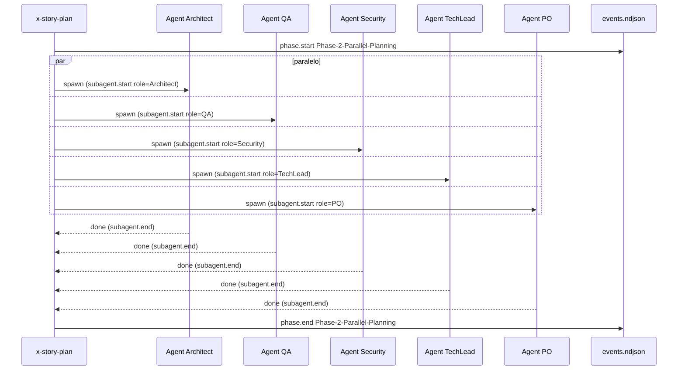

# História: Instrumentar Skills de Planejamento

**ID:** story-0040-0007
**Chave Jira:** —
**Status:** Concluída

## 1. Dependências

| Blocked By | Blocks |
| :--- | :--- |
| story-0040-0004, story-0040-0005 | — |

## 2. Regras Transversais Aplicáveis

| ID | Título |
| :--- | :--- |
| RULE-002 | NDJSON Append-Only |
| RULE-003 | Zero PII |
| RULE-005 | Context Resolution Order |
| RULE-008 | Source of Truth: Resources |

## 3. Descrição

Como **usuário do Claude Code no ia-dev-environment**, eu quero que as skills de planejamento (`x-epic-plan`, `x-story-plan`, `x-dev-architecture-plan`, `x-test-plan`, `x-story-map`) emitam marcadores de fase e de agente paralelo, permitindo análise do custo de planejamento (que pode consumir 20-30% do tempo de um épico).

As skills de planejamento lançam múltiplos agentes em paralelo (ex: `x-story-plan` lança Architect + QA + Security + Tech Lead + PO). Cada agente deve ser instrumentado como `subagent.start`/`subagent.end` para análise de paralelização.

### 3.1 Skills a Instrumentar

| Skill | Fases + agentes paralelos |
| :--- | :--- |
| `x-epic-plan` | Phase 1 (Discovery), Phase 2 (Story Orchestration Loop), Phase 3 (Consolidation) |
| `x-story-plan` | Phase 1 (Context), Phase 2 (5 agentes paralelos: Architect/QA/Security/TechLead/PO), Phase 3 (Consolidation), Phase 4 (DoR Validation) |
| `x-dev-architecture-plan` | Phase 1 (KP Read), Phase 2 (Component Diagram), Phase 3 (Sequence Diagrams), Phase 4 (ADR Mini) |
| `x-test-plan` | Phase 1 (KP Read), Phase 2 (Acceptance Tests Outer Loop), Phase 3 (Unit Tests TPP), Phase 4 (Report) |
| `x-story-map` | Phase 1 (DAG Build), Phase 2 (Phase Computation), Phase 3 (Critical Path), Phase 4 (Mermaid) |

### 3.2 Padrão de Instrumentação Específico

Adicional ao padrão da story-0040-0006, agentes paralelos emitem markers `subagent.start`/`subagent.end` com metadata do papel:

```bash
$CLAUDE_PROJECT_DIR/.claude/hooks/telemetry-phase.sh subagent-start x-story-plan Architect
$CLAUDE_PROJECT_DIR/.claude/hooks/telemetry-phase.sh subagent-end   x-story-plan Architect ok
```

Helper estendido para aceitar sub-comandos `subagent-start|subagent-end`.

## 3.5 Entrega de Valor

- **Valor Principal:** Visibilidade da eficácia de paralelização: quanto tempo real o usuário ganha ao lançar 5 agentes em paralelo vs. sequencial.
- **Métrica de Sucesso:** Relatório `/x-telemetry-analyze` mostra `subagent.*` events agrupados por skill, com overlap temporal calculado (tempo total vs. tempo-máximo-do-agente-mais-lento).
- **Impacto no Negócio:** Identifica agentes consistentemente lentos que bloqueiam o paralelismo (ex: Security review sempre atrasa 2x os outros).

## 4. Definições de Qualidade Locais

### DoR Local (Definition of Ready)

- [ ] Helper `telemetry-phase.sh` com sub-comandos subagent-* (story-0040-0006)
- [ ] Lista de fases e agentes por skill aprovada

### DoD Local (Definition of Done)

- [ ] 5 skills com markers em cada fase numerada
- [ ] Agentes paralelos instrumentados em `x-story-plan` (5 agentes)
- [ ] Agentes paralelos instrumentados em `x-epic-plan` (loop de stories)
- [ ] Teste IT conta `subagent.*` events em cada skill
- [ ] Rule 13 com nota sobre subagent markers

### Global Definition of Done (DoD)

- **Cobertura:** N/A (markdown); testes ≥ 95%
- **Testes Automatizados:** Acceptance via `SkillInvocationIT`
- **Documentação:** Rule 13 atualizada
- **Persistência:** N/A
- **Performance:** Overhead por marker < 50ms

## 5. Contratos de Dados (Data Contract)

### 5.1 Helper extensão

| Subcomando | Args | Evento emitido |
| :--- | :--- | :--- |
| `subagent-start` | skill, role | `subagent.start` com `metadata.role` |
| `subagent-end` | skill, role, status | `subagent.end` com `metadata.role` e `status` |

### 5.2 Evento subagent exemplo

```json
{"schemaVersion":"1.0.0","eventId":"...","timestamp":"...","sessionId":"...","type":"subagent.start","skill":"x-story-plan","metadata":{"role":"Architect"}}
```

### 5.3 Error Codes
Mesmo da story-0040-0006 (fail-open).

## 6. Diagramas

### 6.1 x-story-plan com 5 agentes paralelos



## 7. Critérios de Aceite (Gherkin)

```gherkin
Cenario: Skill sem agentes paralelos emite apenas phase markers (degenerate)
  DADO skill x-test-plan executando
  QUANDO completa as 4 fases
  ENTÃO events.ndjson tem 4 pares phase.* e 0 eventos subagent.*

Cenario: x-story-plan emite 5 pares subagent (happy path)
  DADO /x-story-plan com 5 agentes paralelos
  QUANDO execução completa
  ENTÃO events.ndjson tem 5 eventos subagent.start + 5 subagent.end
  E metadata.role contém cada um dos 5 papéis uma vez

Cenario: Agente que falha emite subagent.end status=failed (error path)
  DADO agent Security lançando erro
  QUANDO subagent-end é chamado
  ENTÃO evento tem status=failed

Cenario: Overlap temporal é detectável (happy path / analysis-ready)
  DADO os 5 eventos subagent.start do x-story-plan
  QUANDO ordenamos por timestamp
  ENTÃO os 5 timestamps estão dentro de uma janela < 500ms (paralelismo real)

Cenario: Todas as 5 skills instrumentadas (boundary at-max)
  DADO lint scan em 5 SKILL.md
  QUANDO conta markers
  ENTÃO cada skill tem ≥ 1 phase.start

Cenario: Sub-comando inválido no helper falha gracefully (boundary past-max)
  DADO telemetry-phase.sh invocado com subcomando "banana"
  QUANDO executamos
  ENTÃO exit 0 + stderr warn
  E nenhum evento é escrito
```

### 7.1 Scenario Ordering (TPP)
Degenerate → happy → error → analysis-ready → boundary lint → boundary helper.

### 7.2 Mandatory Scenario Categories
- [x] Degenerate (sem subagent)
- [x] Happy path (5 agentes)
- [x] Error paths (agent falha, sub-comando inválido)
- [x] Boundary (lint 5/5, overlap temporal)

### 7.3 TDD Implementation Notes
- Acceptance: rodar `/x-story-plan` em fixture → esperar 5 subagent pares.
- Inner loop TPP: helper sub-comando inexistente → 1 subagent → 5 paralelos.

## 8. Tasks

### TASK-0040-0007-001: Estender telemetry-phase.sh com subagent-*

- **Layer:** Adapter
- **Test Type:** Integration
- **Size:** S
- **Dependencies:** —
- **Branch:** `feature/task-0040-0007-001-subagent-helper`
- **Testability:** Port + Adapter + IT
- **Files:**
  - `java/src/main/resources/targets/claude/hooks/telemetry-phase.sh`
  - `java/src/test/resources/hooks/test-subagent-helper.bats`
- **Acceptance Criteria:**
  - [ ] Sub-comandos `subagent-start` e `subagent-end` funcionam
  - [ ] Metadata `role` preservada no evento

### TASK-0040-0007-002: Instrumentar x-epic-plan

- **Layer:** Config
- **Test Type:** Acceptance
- **Size:** M
- **Dependencies:** TASK-0040-0007-001
- **Branch:** `feature/task-0040-0007-002-epic-plan`
- **Testability:** UseCase + AT
- **Files:**
  - `java/src/main/resources/targets/claude/skills/core/x-epic-plan/SKILL.md`
  - `java/src/test/java/dev/iadev/skills/XEpicPlanMarkersIT.java`
- **Acceptance Criteria:**
  - [ ] 3 pares de phase + N subagents (loop de stories)

### TASK-0040-0007-003: Instrumentar x-story-plan

- **Layer:** Config
- **Test Type:** Acceptance
- **Size:** M
- **Dependencies:** TASK-0040-0007-001
- **Branch:** `feature/task-0040-0007-003-story-plan`
- **Testability:** UseCase + AT
- **Files:**
  - `java/src/main/resources/targets/claude/skills/core/x-story-plan/SKILL.md`
  - `java/src/test/java/dev/iadev/skills/XStoryPlanMarkersIT.java`
- **Acceptance Criteria:**
  - [ ] 4 pares phase + 5 subagents paralelos
  - [ ] 5 roles distintos

### TASK-0040-0007-004: Instrumentar x-dev-architecture-plan e x-test-plan

- **Layer:** Config
- **Test Type:** Acceptance
- **Size:** M
- **Dependencies:** TASK-0040-0007-001
- **Branch:** `feature/task-0040-0007-004-arch-test-plan`
- **Testability:** UseCase + AT
- **Files:**
  - `java/src/main/resources/targets/claude/skills/core/x-dev-architecture-plan/SKILL.md`
  - `java/src/main/resources/targets/claude/skills/core/x-test-plan/SKILL.md`
  - `java/src/test/java/dev/iadev/skills/PlanningSkillsMarkersIT.java`
- **Acceptance Criteria:**
  - [ ] Cada skill tem 4 pares phase
  - [ ] Subagents marcados onde aplicável

### TASK-0040-0007-005: Instrumentar x-story-map + smoke 5 skills

- **Layer:** Config
- **Test Type:** Smoke
- **Size:** M
- **Dependencies:** TASK-0040-0007-002, TASK-0040-0007-003, TASK-0040-0007-004
- **Branch:** `feature/task-0040-0007-005-story-map-smoke`
- **Testability:** Migration + Smoke
- **Files:**
  - `java/src/main/resources/targets/claude/skills/core/x-story-map/SKILL.md`
  - `java/src/test/java/dev/iadev/skills/PlanningSmokeIT.java`
- **Acceptance Criteria:**
  - [ ] x-story-map tem 4 pares phase
  - [ ] Smoke run executa as 5 skills e valida NDJSON
