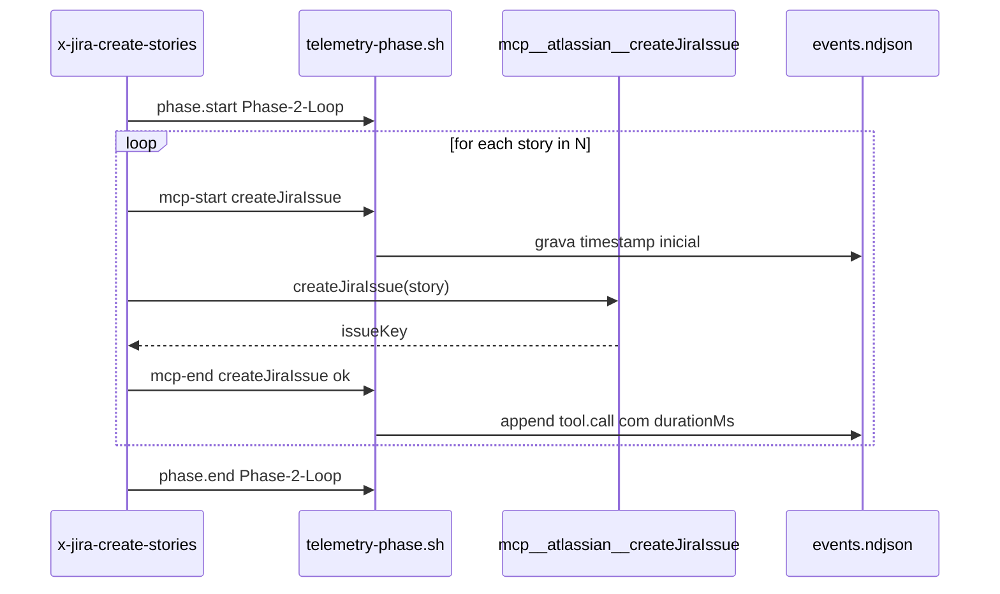

# História: Instrumentar Skills de Criação (Epic/Story/Jira)

**ID:** story-0040-0008
**Chave Jira:** —
**Status:** Pendente

## 1. Dependências

| Blocked By | Blocks |
| :--- | :--- |
| story-0040-0004, story-0040-0005 | — |

## 2. Regras Transversais Aplicáveis

| ID | Título |
| :--- | :--- |
| RULE-002 | NDJSON Append-Only |
| RULE-003 | Zero PII |
| RULE-008 | Source of Truth: Resources |

## 3. Descrição

Como **usuário do Claude Code**, eu quero que as skills de criação de artefatos (`x-story-epic`, `x-story-create`, `x-story-epic-full`, `x-jira-create-epic`, `x-jira-create-stories`) emitam marcadores de fase e instrumentem chamadas MCP Atlassian como `tool.call`, permitindo análise do tempo gasto em geração de artefatos e em chamadas remotas.

As skills de criação costumam fazer N chamadas ao Jira (uma por story). Cada chamada MCP é uma latência externa que pode dominar o tempo total. Instrumentar como `tool.call` separado permite agregar "tempo Jira vs. tempo local".

### 3.1 Skills a Instrumentar

| Skill | Fases |
| :--- | :--- |
| `x-story-epic` | Phase 1 (Spec Analysis), Phase 2 (Rules Extraction), Phase 3 (Story Index), Phase 4 (Epic Generation) |
| `x-story-create` | Phase 1 (Context Gathering), Phase 2 (Generation Loop por story), Phase 3 (Validation) |
| `x-story-epic-full` | Phase 1 (Analysis), Phase 1.5 (Jira Decision), Phase 2 (Epic), Phase 3 (Stories), Phase 4 (Map), Phase 4.5 (Jira Links), Phase 5 (Report) |
| `x-jira-create-epic` | Phase 1 (Read Markdown), Phase 2 (MCP Call), Phase 3 (Sync Back) |
| `x-jira-create-stories` | Phase 1 (Read Markdowns), Phase 2 (Loop MCP Calls), Phase 3 (Dependency Links) |

### 3.2 Instrumentação MCP

Cada chamada MCP Atlassian (`createJiraIssue`, `createIssueLink`, etc.) é envolvida em:

```bash
$CLAUDE_PROJECT_DIR/.claude/hooks/telemetry-phase.sh mcp-start x-jira-create-stories createJiraIssue
# executa mcp__atlassian__createJiraIssue
$CLAUDE_PROJECT_DIR/.claude/hooks/telemetry-phase.sh mcp-end   x-jira-create-stories createJiraIssue ok
```

Emite eventos `tool.call` com `tool="mcp__atlassian__createJiraIssue"` e `metadata.mcpMethod` preservado.

**Nota:** O hook passivo `PostToolUse` já captura chamadas MCP automaticamente. Os markers explícitos adicionam contexto semântico (skill + phase) que o hook passivo não consegue inferir de forma confiável.

## 3.5 Entrega de Valor

- **Valor Principal:** Análise "quanto tempo esta sessão gastou esperando o Jira" fica disponível; útil para decidir sobre caching ou batch API.
- **Métrica de Sucesso:** Relatório `/x-telemetry-analyze --by-tool` mostra linha dedicada para `mcp__atlassian__*` com contagem e duração P50/P95.
- **Impacto no Negócio:** Justifica investimentos em otimizações (batch Jira, cache local) com dados concretos.

## 4. Definições de Qualidade Locais

### DoR Local (Definition of Ready)

- [ ] Helper com sub-comandos mcp-start/mcp-end (extensão da story-0040-0007)
- [ ] Lista de fases por skill aprovada

### DoD Local (Definition of Done)

- [ ] 5 skills com markers em cada fase
- [ ] Chamadas MCP em `x-jira-create-*` envolvidas em mcp-start/end
- [ ] Teste IT valida que `tool.call` com MCP prefix aparece no NDJSON
- [ ] Degrade gracioso se MCP indisponível (skill não quebra)

### Global Definition of Done (DoD)

- **Cobertura:** N/A (markdown); testes ≥ 95%
- **Testes Automatizados:** Acceptance IT
- **Documentação:** Rule 13 nota sobre MCP instrumentation
- **Persistência:** N/A
- **Performance:** Overhead < 50ms

## 5. Contratos de Dados (Data Contract)

### 5.1 Helper sub-comandos adicionais

| Subcomando | Args | Evento |
| :--- | :--- | :--- |
| `mcp-start` | skill, mcpMethod | `tool.call` parcial (inicia timer em `$TMPDIR`) |
| `mcp-end` | skill, mcpMethod, status | `tool.call` com durationMs calculada |

### 5.2 Evento MCP exemplo

```json
{"schemaVersion":"1.0.0","eventId":"...","timestamp":"...","sessionId":"...","type":"tool.call","skill":"x-jira-create-stories","tool":"mcp__atlassian__createJiraIssue","durationMs":842,"status":"ok","metadata":{"mcpMethod":"createJiraIssue"}}
```

### 5.3 Error Codes

| Situação | Comportamento |
| :--- | :--- |
| MCP falha | `status=failed`, `failureReason` contém código (scrubbed) |
| Helper ausente | Fail-open |
| Timer perdido | Evento emitido sem `durationMs` (null) |

## 6. Diagramas

### 6.1 x-jira-create-stories com loop MCP



## 7. Critérios de Aceite (Gherkin)

```gherkin
Cenario: Skill de criação sem MCP emite apenas phase markers (degenerate)
  DADO /x-story-epic sem integração Jira
  QUANDO execução completa
  ENTÃO events.ndjson tem 4 pares phase.* e 0 tool.call com mcp__atlassian__*

Cenario: x-jira-create-stories emite N tool.call MCP (happy path)
  DADO 3 stories markdown e integração Jira ativa
  QUANDO executamos /x-jira-create-stories
  ENTÃO events.ndjson tem ≥ 3 tool.call com tool começando com "mcp__atlassian__createJiraIssue"
  E cada um tem durationMs > 0

Cenario: MCP falha preserva status=failed (error path)
  DADO MCP retorna 401
  QUANDO mcp-end é chamado
  ENTÃO evento tem status=failed
  E failureReason não contém tokens (scrubbed)

Cenario: Latência MCP agregável por skill (analysis-ready)
  DADO 10 eventos tool.call MCP capturados
  QUANDO somamos durationMs
  ENTÃO o total é finito (sem overflow) e consistente com o tempo real

Cenario: Todas as 5 skills instrumentadas (boundary at-max)
  DADO lint scan em 5 SKILL.md
  QUANDO conta markers
  ENTÃO cada skill tem ≥ 1 phase.start
```

### 7.1 Scenario Ordering (TPP)
Degenerate → happy → error → analysis-ready → boundary.

### 7.2 Mandatory Scenario Categories
- [x] Degenerate (sem MCP)
- [x] Happy path (3 MCP calls)
- [x] Error paths (MCP 401)
- [x] Boundary (lint 5/5, agregação)

### 7.3 TDD Implementation Notes
- Acceptance: mock MCP server retornando 3 respostas → validar NDJSON.
- Inner loop TPP: sem helper → 1 MCP → 3 MCP → failure → 5 skills.

## 8. Tasks

### TASK-0040-0008-001: Estender telemetry-phase.sh com mcp-*

- **Layer:** Adapter
- **Test Type:** Integration
- **Size:** S
- **Dependencies:** —
- **Branch:** `feat/task-0040-0008-001-mcp-helper`
- **Testability:** Port + Adapter + IT
- **Files:**
  - `java/src/main/resources/targets/claude/hooks/telemetry-phase.sh`
  - `java/src/test/resources/hooks/test-mcp-helper.bats`
- **Acceptance Criteria:**
  - [ ] Sub-comandos mcp-start/mcp-end funcionam
  - [ ] Timer via `$TMPDIR/claude-telemetry/mcp-$method.start`
  - [ ] durationMs calculada corretamente

### TASK-0040-0008-002: Instrumentar x-story-epic e x-story-create

- **Layer:** Config
- **Test Type:** Acceptance
- **Size:** M
- **Dependencies:** TASK-0040-0008-001
- **Branch:** `feat/task-0040-0008-002-epic-create`
- **Testability:** UseCase + AT
- **Files:**
  - `java/src/main/resources/targets/claude/skills/core/x-story-epic/SKILL.md`
  - `java/src/main/resources/targets/claude/skills/core/x-story-create/SKILL.md`
  - `java/src/test/java/dev/iadev/skills/CreationSkillsMarkersIT.java`
- **Acceptance Criteria:**
  - [ ] Cada skill com pelo menos 3 pares phase.*

### TASK-0040-0008-003: Instrumentar x-story-epic-full

- **Layer:** Config
- **Test Type:** Acceptance
- **Size:** M
- **Dependencies:** TASK-0040-0008-001
- **Branch:** `feat/task-0040-0008-003-epic-full`
- **Testability:** UseCase + AT
- **Files:**
  - `java/src/main/resources/targets/claude/skills/core/x-story-epic-full/SKILL.md`
  - `java/src/test/java/dev/iadev/skills/XStoryEpicFullMarkersIT.java`
- **Acceptance Criteria:**
  - [ ] 7 pares phase (Phase 1, 1.5, 2, 3, 4, 4.5, 5)
  - [ ] Phases 1.5 e 4.5 marcadas quando Jira ativo

### TASK-0040-0008-004: Instrumentar x-jira-create-* com MCP markers

- **Layer:** Config
- **Test Type:** Acceptance
- **Size:** M
- **Dependencies:** TASK-0040-0008-001
- **Branch:** `feat/task-0040-0008-004-jira-create`
- **Testability:** UseCase + AT
- **Files:**
  - `java/src/main/resources/targets/claude/skills/core/x-jira-create-epic/SKILL.md`
  - `java/src/main/resources/targets/claude/skills/core/x-jira-create-stories/SKILL.md`
  - `java/src/test/java/dev/iadev/skills/XJiraCreateMarkersIT.java`
- **Acceptance Criteria:**
  - [ ] Cada chamada MCP envolvida em mcp-start/mcp-end
  - [ ] N chamadas → N `tool.call` com MCP prefix

### TASK-0040-0008-005: Smoke 5 skills + aggregation test

- **Layer:** Test
- **Test Type:** Smoke
- **Size:** M
- **Dependencies:** TASK-0040-0008-002, TASK-0040-0008-003, TASK-0040-0008-004
- **Branch:** `feat/task-0040-0008-005-smoke`
- **Testability:** Migration + Smoke
- **Files:**
  - `java/src/test/java/dev/iadev/skills/CreationSkillsSmokeIT.java`
- **Acceptance Criteria:**
  - [ ] Smoke run cobre 5 skills
  - [ ] Agregação por `tool` mostra MCP calls separadas
