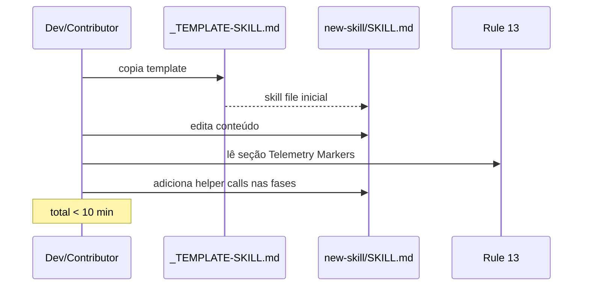

# História: Template de Instrumentação Leve para Skills Futuras

**ID:** story-0040-0009
**Chave Jira:** —
**Status:** Concluída

## 1. Dependências

| Blocked By | Blocks |
| :--- | :--- |
| story-0040-0006 | — |

## 2. Regras Transversais Aplicáveis

| ID | Título |
| :--- | :--- |
| RULE-008 | Source of Truth: Resources |

## 3. Descrição

Como **autor de nova skill**, eu quero uma seção padronizada opcional "Telemetry" em `_TEMPLATE-SKILL.md` com 2-3 linhas plug-and-play, reduzindo o custo de instrumentar novas skills de ~30 minutos (edição manual + testes) para ~3 minutos (copy-paste + ajuste de nome).

Esta story finaliza a Layer 2 Extensions e entrega apenas documentação + template, sem código novo. A ideia é que o padrão estabelecido nas stories 0006/0007/0008 seja reprodutível por qualquer contribuidor sem precisar reler essas stories.

### 3.1 Alterações em `_TEMPLATE-SKILL.md`

Nova seção opcional perto do fim:

```markdown
## Telemetry (Optional)

If this skill has numbered phases, emit phase markers via the shared helper.
Insert at the start AND end of each phase:

\```bash
$CLAUDE_PROJECT_DIR/.claude/hooks/telemetry-phase.sh start <skill-name> <phase-name>
\```

For parallel subagents, use `subagent-start` / `subagent-end`.
For MCP calls, use `mcp-start` / `mcp-end`.

Reference: `.claude/rules/13-skill-invocation-protocol.md` (section "Telemetry Markers").
```

### 3.2 Alterações em CLAUDE.md

- Link para a nova seção no template
- Nota breve: "Skill nova? Ver template Telemetry section"

### 3.3 Exemplo Canônico

Linkar `x-dev-story-implement` como exemplo canônico (referência visual).

## 3.5 Entrega de Valor

- **Valor Principal:** Redução do custo marginal de instrumentação de skills futuras; reduz risco de drift (skills novas sem telemetria).
- **Métrica de Sucesso:** Uma skill nova criada por contribuidor que não participou do épico consegue ser instrumentada em < 10 min (medido em onboarding de novo dev).
- **Impacto no Negócio:** Mantém cobertura de telemetria perto de 100% mesmo com crescimento do catálogo de skills (evita regressão).

## 4. Definições de Qualidade Locais

### DoR Local (Definition of Ready)

- [ ] Story-0040-0006 concluída (padrão estabelecido)
- [ ] `x-dev-story-implement` como exemplo visível

### DoD Local (Definition of Done)

- [ ] `_TEMPLATE-SKILL.md` com seção opcional
- [ ] CLAUDE.md atualizado
- [ ] Teste verificando que template contém a seção
- [ ] Smoke: criar skill fictícia usando o template, instrumentar, validar markers em < 10 min

### Global Definition of Done (DoD)

- **Cobertura:** N/A (doc)
- **Testes Automatizados:** Verification test de template
- **Documentação:** Template + CLAUDE.md
- **Persistência:** N/A
- **Performance:** N/A

## 5. Contratos de Dados (Data Contract)

### 5.1 Template structure

| Seção | Obrigatória? | Conteúdo |
| :--- | :--- | :--- |
| `## Telemetry (Optional)` | Não (opcional na skill real; obrigatória no template) | Bloco de código de referência |

### 5.2 Verificação automatizada

Teste lê `_TEMPLATE-SKILL.md` e procura por:
- Regex `## Telemetry \(Optional\)`
- String `telemetry-phase.sh`
- Reference ao rule 13

### 5.3 Error Codes
N/A.

## 6. Diagramas

### 6.1 Fluxo de Autor de Nova Skill



## 7. Critérios de Aceite (Gherkin)

```gherkin
Cenario: Template sem seção Telemetry é inválido (degenerate)
  DADO _TEMPLATE-SKILL.md sem a seção "Telemetry (Optional)"
  QUANDO teste verificador roda
  ENTÃO falha com mensagem citando seção ausente

Cenario: Template com seção completa passa (happy path)
  DADO _TEMPLATE-SKILL.md com a seção Telemetry incluindo helper e rule 13 reference
  QUANDO teste verificador roda
  ENTÃO passa

Cenario: CLAUDE.md linka para a seção (happy path)
  DADO CLAUDE.md root
  QUANDO verifica presença do link para seção Telemetry
  ENTÃO passa

Cenario: Onboarding de nova skill (smoke boundary)
  DADO novo contribuidor sem contexto prévio
  QUANDO copia o template e segue as instruções
  ENTÃO a skill fictícia resultante tem pelo menos 1 par phase.start/phase.end funcional
  E o tempo total medido é < 10 min (aferido em simulação)
```

### 7.1 Scenario Ordering (TPP)
Degenerate (sem seção) → happy (presente) → conditions (CLAUDE.md link) → boundary (smoke de onboarding).

### 7.2 Mandatory Scenario Categories
- [x] Degenerate (sem seção)
- [x] Happy path (seção presente)
- [x] Error paths (seção ausente = falha)
- [x] Boundary (tempo de onboarding)

### 7.3 TDD Implementation Notes
- Acceptance outer loop: teste de template estrutural.
- Inner loop: string absent → string present → link present.

## 8. Tasks

### TASK-0040-0009-001: Adicionar seção Telemetry ao _TEMPLATE-SKILL.md

- **Layer:** Doc
- **Test Type:** Verification
- **Size:** S
- **Dependencies:** —
- **Branch:** `feature/task-0040-0009-001-template-update`
- **Testability:** Config + VerificationTest
- **Files:**
  - `java/src/main/resources/targets/claude/skills/_TEMPLATE-SKILL.md`
  - `java/src/test/java/dev/iadev/skills/TemplateStructureTest.java`
- **Acceptance Criteria:**
  - [ ] Seção "## Telemetry (Optional)" presente
  - [ ] Bloco de código com 3 exemplos (start, subagent, mcp)
  - [ ] Link para rule 13

### TASK-0040-0009-002: Atualizar CLAUDE.md com link e nota

- **Layer:** Doc
- **Test Type:** Verification
- **Size:** S
- **Dependencies:** TASK-0040-0009-001
- **Branch:** `feature/task-0040-0009-002-claude-md`
- **Testability:** Config + VerificationTest
- **Files:**
  - `java/src/main/resources/targets/claude/CLAUDE.md`
  - `java/src/test/java/dev/iadev/meta/ClaudeMdStructureTest.java`
- **Acceptance Criteria:**
  - [ ] CLAUDE.md tem linha ou nota apontando para a seção Telemetry
  - [ ] Teste verifica presença do link

### TASK-0040-0009-003: Smoke onboarding simulado

- **Layer:** Test
- **Test Type:** Smoke
- **Size:** S
- **Dependencies:** TASK-0040-0009-001, TASK-0040-0009-002
- **Branch:** `feature/task-0040-0009-003-onboarding-smoke`
- **Testability:** Migration + Smoke
- **Files:**
  - `java/src/test/java/dev/iadev/skills/OnboardingSmokeIT.java`
- **Acceptance Criteria:**
  - [ ] Teste cria skill fictícia do template e valida que instrumentar é trivial
  - [ ] Tempo total de execução < 30s
