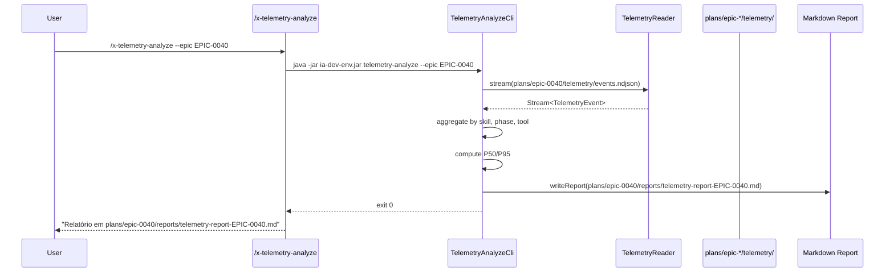

# História: Skill `/x-telemetry-analyze`

**ID:** story-0040-0010
**Chave Jira:** —
**Status:** Concluída

## 1. Dependências

| Blocked By | Blocks |
| :--- | :--- |
| story-0040-0002, story-0040-0004, story-0040-0006 | story-0040-0011, story-0040-0012 |

## 2. Regras Transversais Aplicáveis

| ID | Título |
| :--- | :--- |
| RULE-001 | Event Schema Versioning |
| RULE-002 | NDJSON Append-Only |
| RULE-007 | Storage Layout Imutável |
| RULE-008 | Source of Truth: Resources |

## 3. Descrição

Como **usuário do Claude Code**, eu quero uma skill `/x-telemetry-analyze` que consome eventos NDJSON e produz um relatório Markdown com tabela-resumo, diagrama Mermaid Gantt e breakdown por tool para um ou mais épicos, com opção de export JSON/CSV para ferramentas externas.

Esta é a story de entrega (Layer 3 — composição). Combina os artefatos das Layers 0-2 em um produto consumível. O relatório é gravado em `plans/epic-XXXX/reports/telemetry-report-EPIC-XXXX.md` e segue um template dedicado.

### 3.1 Modos de Operação

| Argumento | Comportamento |
| :--- | :--- |
| `--epic EPIC-XXXX` | Relatório para um único épico (tabelas + Gantt) |
| `--epics EPIC-XXXX,EPIC-YYYY` | Comparação lado-a-lado de N épicos |
| `--by-tool` | Agrupa por tool (Bash/Write/Edit/Skill/Agent) |
| `--export json --out path` | Gera JSON estruturado |
| `--export csv --out path` | Gera CSV tabular |
| `--since YYYY-MM-DD` | Filtra eventos desde uma data (opcional) |

### 3.2 Estrutura do Relatório

1. **Header**: épico(s), período analisado, contagem total de eventos
2. **Resumo geral**: duração total, skills top-5 por tempo, fases top-5 por tempo
3. **Tabela por skill**: invocações, duração total, média, P50, P95
4. **Tabela por fase**: mesmo formato, agrupado por `skill + phase`
5. **Breakdown por tool**: invocações e duração por tool name (Bash, Write, Edit, Skill, Agent, MCPs)
6. **Mermaid Gantt**: timeline das fases (até 50 fases para manter legível)
7. **Observações**: outliers, gaps, falhas

### 3.3 Novo Template

`_TEMPLATE-TELEMETRY-REPORT.md` em `java/src/main/resources/shared/templates/` com todas as seções acima.

### 3.4 Implementação

- Skill escrita em Markdown (SKILL.md)
- Delega processamento para CLI Java `dev.iadev.telemetry.cli.TelemetryAnalyzeCli` (main class)
- CLI invoca `TelemetryReader` (story-0040-0002) e agrega via streams Java
- Agregações: `Collectors.groupingBy(skill + phase, summarizingLong(durationMs))`
- P50/P95 via `TDigest` (biblioteca `t-digest` já no classpath? Se não, usar QuickSelect simples)

## 3.5 Entrega de Valor

- **Valor Principal:** Decisões baseadas em dados sobre otimização de skills; relatório on-demand em < 5s para qualquer épico.
- **Métrica de Sucesso:** `/x-telemetry-analyze --epic EPIC-0040` produz relatório válido em < 5s para NDJSON de 10k linhas; P95 latência medida < 3s.
- **Impacto no Negócio:** Primeira ferramenta de observabilidade interna do ia-dev-environment; base para decisões de roadmap de performance.

## 4. Definições de Qualidade Locais

### DoR Local (Definition of Ready)

- [ ] `TelemetryReader` disponível (story-0040-0002)
- [ ] Hooks gerando NDJSON real (story-0040-0004/0006)
- [ ] Fixture de épico com ≥ 1000 eventos para testes

### DoD Local (Definition of Done)

- [ ] Skill `/x-telemetry-analyze` em `targets/claude/skills/core/x-telemetry-analyze/`
- [ ] CLI `TelemetryAnalyzeCli` com todos os flags
- [ ] Template `_TEMPLATE-TELEMETRY-REPORT.md` publicado
- [ ] Export JSON e CSV produzem arquivos válidos
- [ ] Mermaid Gantt renderiza corretamente (validado via `mermaid-cli` em CI)
- [ ] Performance: 10k eventos em < 5s
- [ ] Cobertura ≥ 95% line no CLI Java

### Global Definition of Done (DoD)

- **Cobertura:** ≥ 95% Line, ≥ 90% Branch
- **Testes Automatizados:** Unit + acceptance (fixture 10k) + mermaid render
- **Relatório de Cobertura:** JaCoCo
- **Documentação:** SKILL.md + help text
- **Persistência:** Relatório em `reports/`; exports em `--out`
- **Performance:** 10k eventos < 5s; 100k eventos < 30s

## 5. Contratos de Dados (Data Contract)

### 5.1 Export JSON (schema)

| Campo | Tipo | Descrição |
| :--- | :--- | :--- |
| `generatedAt` | `String` (ISO-8601) | Momento de geração |
| `epics` | `Array<String>` | IDs dos épicos analisados |
| `totals.events` | `Integer` | Total de eventos |
| `totals.durationMs` | `Long` | Duração somada |
| `skills` | `Array<SkillStat>` | Agregado por skill |
| `skills[].name` | `String` | Nome da skill |
| `skills[].invocations` | `Integer` | Quantas vezes rodou |
| `skills[].totalMs` | `Long` | Tempo total |
| `skills[].p50Ms` | `Long` | Mediana |
| `skills[].p95Ms` | `Long` | P95 |
| `phases` | `Array<PhaseStat>` | Mesmo formato para phases |
| `tools` | `Array<ToolStat>` | Mesmo formato para tools |

### 5.2 Export CSV (colunas)

```
type,name,invocations,totalMs,avgMs,p50Ms,p95Ms,epicIds
skill,x-dev-story-implement,5,123456,24691,20000,45000,"EPIC-0040"
phase,x-dev-story-implement/Phase-2-Implementation,5,87654,17530,15000,32000,"EPIC-0040"
tool,Bash,423,56789,134,100,250,"EPIC-0040"
```

### 5.3 Error Codes

| Situação | Exit Code | Mensagem |
| :--- | :--- | :--- |
| Épico não encontrado | 2 | `"Epic <ID> has no telemetry data at <path>"` |
| NDJSON corrompido | 3 | `"Could not parse line N in <file>: <reason>"` |
| Arg `--export` sem `--out` | 4 | `"--export requires --out <path>"` |
| Sucesso | 0 | — |

## 6. Diagramas

### 6.1 Fluxo de Análise



## 7. Critérios de Aceite (Gherkin)

```gherkin
Cenario: Épico sem telemetria retorna erro claro (degenerate)
  DADO um épico EPIC-9999 sem events.ndjson
  QUANDO executamos /x-telemetry-analyze --epic EPIC-9999
  ENTÃO exit code 2
  E mensagem contém "has no telemetry data"

Cenario: Relatório de épico com 10 eventos (happy path)
  DADO fixture de EPIC-0040 com 10 eventos válidos
  QUANDO executamos /x-telemetry-analyze --epic EPIC-0040
  ENTÃO plans/epic-0040/reports/telemetry-report-EPIC-0040.md é criado
  E contém seções "Resumo geral", "Por skill", "Por fase", "Por tool", "Gantt", "Observações"
  E tempo total de execução < 5s

Cenario: Comparação cross-epic (happy path)
  DADO fixtures de EPIC-0040 e EPIC-0039 com eventos
  QUANDO executamos /x-telemetry-analyze --epics EPIC-0040,EPIC-0039
  ENTÃO relatório tem tabela lado-a-lado com colunas por épico
  E Gantt cobre ambos

Cenario: Export JSON válido (happy path)
  DADO fixture com eventos
  QUANDO executamos --export json --out /tmp/out.json
  ENTÃO arquivo é JSON válido contra o schema 5.1
  E soma de invocações bate com contagem de eventos do tipo skill.end

Cenario: Export CSV parseável (happy path)
  DADO fixture com eventos
  QUANDO executamos --export csv --out /tmp/out.csv
  ENTÃO arquivo é CSV com header correto
  E cada linha tem 8 colunas

Cenario: NDJSON com linha corrompida ignora e continua (error path)
  DADO fixture com 99 linhas válidas e 1 corrompida
  QUANDO executamos análise
  ENTÃO relatório reporta 99 eventos
  E mensagem WARN no stderr cita a linha inválida

Cenario: 10k eventos em < 5s (boundary at-max)
  DADO fixture com exatamente 10000 eventos
  QUANDO executamos análise
  ENTÃO tempo total < 5s (medido via System.nanoTime)

Cenario: --export sem --out aborta (boundary past-max)
  DADO args --export json (sem --out)
  QUANDO CLI valida
  ENTÃO exit code 4 com mensagem sobre flag faltante
```

### 7.1 Scenario Ordering (TPP)
Degenerate (sem dados) → happy (10 events) → conditions (cross-epic) → happy exports → error (NDJSON inválido) → boundaries (10k, flag).

### 7.2 Mandatory Scenario Categories
- [x] Degenerate (sem dados)
- [x] Happy path (relatório, cross-epic, exports)
- [x] Error paths (NDJSON corrompido, flag inválido)
- [x] Boundary (10k eventos, flag combinação)

### 7.3 TDD Implementation Notes
- Acceptance outer loop: fixture 10 eventos → relatório renderizado.
- Inner loop TPP: 0 eventos → 1 → 10 → 10k; apenas skill → skill+phase → skill+phase+tool.

## 8. Tasks

### TASK-0040-0010-001: CLI stub + args parsing

- **Layer:** Adapter
- **Test Type:** Unit
- **Size:** M
- **Dependencies:** —
- **Branch:** `feature/task-0040-0010-001-cli-args`
- **Testability:** Endpoint + APITest
- **Files:**
  - `java/src/main/java/dev/iadev/telemetry/cli/TelemetryAnalyzeCli.java`
  - `java/src/test/java/dev/iadev/telemetry/cli/TelemetryAnalyzeCliArgsTest.java`
- **Acceptance Criteria:**
  - [ ] Picocli parser para todos os flags
  - [ ] `--export` sem `--out` falha com exit 4
  - [ ] `--help` documenta todos os flags

### TASK-0040-0010-002: Agregador por skill/phase/tool

- **Layer:** Domain
- **Test Type:** Unit
- **Size:** M
- **Dependencies:** TASK-0040-0010-001
- **Branch:** `feature/task-0040-0010-002-aggregator`
- **Testability:** Domain + UnitTest
- **Files:**
  - `java/src/main/java/dev/iadev/telemetry/TelemetryAggregator.java`
  - `java/src/main/java/dev/iadev/telemetry/SkillStat.java`
  - `java/src/test/java/dev/iadev/telemetry/TelemetryAggregatorTest.java`
- **Acceptance Criteria:**
  - [ ] Agrega por skill, phase (skill+phase), tool
  - [ ] Computa invocações, total, média, P50, P95
  - [ ] Cobertura ≥ 95% line

### TASK-0040-0010-003: Template telemetry-report + renderer Markdown

- **Layer:** Adapter
- **Test Type:** Unit
- **Size:** M
- **Dependencies:** TASK-0040-0010-002
- **Branch:** `feature/task-0040-0010-003-md-renderer`
- **Testability:** Port + Adapter + IT
- **Files:**
  - `java/src/main/resources/shared/templates/_TEMPLATE-TELEMETRY-REPORT.md`
  - `java/src/main/java/dev/iadev/telemetry/render/MarkdownReportRenderer.java`
  - `java/src/test/java/dev/iadev/telemetry/render/MarkdownReportRendererTest.java`
- **Acceptance Criteria:**
  - [ ] Template com todas as 7 seções
  - [ ] Renderer gera Markdown válido
  - [ ] Mermaid Gantt válido (sintaxe)

### TASK-0040-0010-004: Exporters JSON e CSV

- **Layer:** Adapter
- **Test Type:** Unit
- **Size:** M
- **Dependencies:** TASK-0040-0010-002
- **Branch:** `feature/task-0040-0010-004-exporters`
- **Testability:** Port + Adapter + IT
- **Files:**
  - `java/src/main/java/dev/iadev/telemetry/export/JsonExporter.java`
  - `java/src/main/java/dev/iadev/telemetry/export/CsvExporter.java`
  - `java/src/test/java/dev/iadev/telemetry/export/ExportersTest.java`
- **Acceptance Criteria:**
  - [ ] JSON válido contra schema 5.1
  - [ ] CSV com header correto e escaping adequado

### TASK-0040-0010-005: Cross-epic aggregation

- **Layer:** Domain
- **Test Type:** Unit
- **Size:** M
- **Dependencies:** TASK-0040-0010-002
- **Branch:** `feature/task-0040-0010-005-cross-epic`
- **Testability:** Domain + UnitTest
- **Files:**
  - `java/src/main/java/dev/iadev/telemetry/CrossEpicAggregator.java`
  - `java/src/test/java/dev/iadev/telemetry/CrossEpicAggregatorTest.java`
- **Acceptance Criteria:**
  - [ ] Combina N épicos em tabela lado-a-lado
  - [ ] Preserva ordem dos épicos no argumento

### TASK-0040-0010-006: SKILL.md `/x-telemetry-analyze`

- **Layer:** Config
- **Test Type:** Acceptance
- **Size:** S
- **Dependencies:** TASK-0040-0010-001, TASK-0040-0010-003
- **Branch:** `feature/task-0040-0010-006-skill-md`
- **Testability:** UseCase + AT
- **Files:**
  - `java/src/main/resources/targets/claude/skills/core/x-telemetry-analyze/SKILL.md`
  - `java/src/test/java/dev/iadev/skills/XTelemetryAnalyzeIT.java`
- **Acceptance Criteria:**
  - [ ] SKILL.md documenta todos os args
  - [ ] Acceptance IT invoca skill em fixture e valida output

### TASK-0040-0010-007: Performance benchmark 10k eventos

- **Layer:** Test
- **Test Type:** Performance
- **Size:** S
- **Dependencies:** TASK-0040-0010-006
- **Branch:** `feature/task-0040-0010-007-perf`
- **Testability:** Migration + Smoke (perf benchmark)
- **Files:**
  - `java/src/test/java/dev/iadev/telemetry/TelemetryAnalyzePerfIT.java`
  - `java/src/test/resources/fixtures/telemetry/epic-10k-events.ndjson`
- **Acceptance Criteria:**
  - [ ] Fixture com 10000 eventos
  - [ ] Execução completa < 5s (P95)
  - [ ] Benchmark publicado em `plans/epic-0040/reports/`

### TASK-0040-0010-008: Smoke ponta-a-ponta

- **Layer:** Test
- **Test Type:** Smoke
- **Size:** S
- **Dependencies:** TASK-0040-0010-006
- **Branch:** `feature/task-0040-0010-008-smoke`
- **Testability:** Migration + Smoke
- **Files:**
  - `java/src/test/java/dev/iadev/telemetry/TelemetryAnalyzeSmokeIT.java`
- **Acceptance Criteria:**
  - [ ] Fluxo completo: gerar NDJSON → rodar skill → relatório + export CSV + export JSON
  - [ ] Todos os outputs válidos
