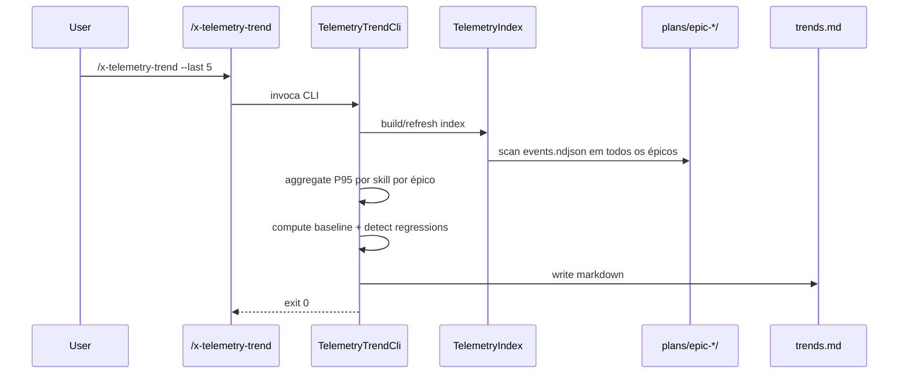

# História: Skill `/x-telemetry-trend` (Cross-Epic Trends)

**ID:** story-0040-0011
**Chave Jira:** —
**Status:** Concluída

## 1. Dependências

| Blocked By | Blocks |
| :--- | :--- |
| story-0040-0010 | story-0040-0012 |

## 2. Regras Transversais Aplicáveis

| ID | Título |
| :--- | :--- |
| RULE-002 | NDJSON Append-Only |
| RULE-007 | Storage Layout Imutável |
| RULE-008 | Source of Truth: Resources |

## 3. Descrição

Como **mantenedor do ia-dev-environment**, eu quero uma skill `/x-telemetry-trend` que detecta regressões de performance (P95 da skill X subiu > threshold% nos últimos N épicos) e lista top-10 skills mais lentas, permitindo priorização de otimizações com base em série histórica.

Single-responsibility separada de `/x-telemetry-analyze`: aqui o foco é detecção de tendências e alertas, não relatório detalhado. Consome o índice global `.claude/telemetry/index.json` (gerado on-demand) e agrega N épicos recentes.

### 3.1 Modos de Operação

| Argumento | Comportamento |
| :--- | :--- |
| `--last N` | Considera os últimos N épicos (default 5) |
| `--threshold-pct P` | Alerta regressões ≥ P% vs. baseline móvel (default 20) |
| `--baseline mean\|median` | Função de baseline (default median) |
| `--format md\|json` | Output (default md) |
| `--out path` | Destino; default stdout. Só grava em arquivo quando `--out` é fornecido explicitamente (conforme RULE-007) |

### 3.2 Algoritmo

1. Construir índice global varrendo `plans/epic-*/telemetry/events.ndjson`
2. Para cada skill, agregar P95 por épico
3. Para cada skill, calcular baseline móvel (média ou mediana) excluindo o épico mais recente
4. Comparar P95 do último épico vs. baseline
5. Se delta ≥ threshold% → regressão detectada
6. Rankear skills por P95 absoluto (top-10 mais lentas) e por delta (top-10 regressões)

### 3.3 Formato do Output (Markdown)

1. Header com escopo (N épicos, threshold)
2. Tabela "Top-10 regressões": skill, baseline, atual, delta%, épicos analisados
3. Tabela "Top-10 skills mais lentas": skill, P95 médio, top-3 skills usage
4. Observações: interpretação automática (ex: "3 skills tiveram regressão ≥ 20% em EPIC-0039 — investigar").

## 3.5 Entrega de Valor

- **Valor Principal:** Alerta de regressão proativo sem intervenção manual; acelera detecção de degradações.
- **Métrica de Sucesso:** Em fixture sintética com 1 skill regressiva injetada (P95 subindo 30% no último épico), o detector identifica corretamente.
- **Impacto no Negócio:** Base para futuros alertas automatizados (ex: fail CI se regressão > 50% em skill crítica).

## 4. Definições de Qualidade Locais

### DoR Local (Definition of Ready)

- [ ] `/x-telemetry-analyze` disponível (story-0040-0010)
- [ ] `TelemetryAggregator` reutilizável (pacote `dev.iadev.telemetry`)
- [ ] Fixtures de N épicos sintéticos

### DoD Local (Definition of Done)

- [ ] Skill `/x-telemetry-trend` em `targets/claude/skills/core/`
- [ ] CLI `TelemetryTrendCli`
- [ ] Detector de regressão com baseline mean/median
- [ ] Top-10 tables renderizadas corretamente
- [ ] Cobertura ≥ 95% no pacote novo
- [ ] Teste com fixture regressiva sintética

### Global Definition of Done (DoD)

- **Cobertura:** ≥ 95% Line, ≥ 90% Branch
- **Testes Automatizados:** Unit + acceptance com fixtures
- **Relatório de Cobertura:** JaCoCo
- **Documentação:** SKILL.md + help text
- **Persistência:** Output em stdout por default; grava em arquivo apenas com `--out path` explícito (RULE-007)
- **Performance:** 5 épicos × 10k eventos cada < 10s

## 5. Contratos de Dados (Data Contract)

### 5.1 Índice Global (`.claude/telemetry/index.json`)

Usado como input. Schema definido na story-0040-0001 (seção 5.2).

### 5.2 Output JSON (para `--format json`)

| Campo | Tipo | Descrição |
| :--- | :--- | :--- |
| `generatedAt` | `String` (ISO-8601) | Momento |
| `epicsAnalyzed` | `Array<String>` | IDs dos épicos |
| `thresholdPct` | `Double` | Threshold aplicado |
| `baseline` | `String` | "mean" ou "median" |
| `regressions` | `Array<Regression>` | Skills regressivas |
| `regressions[].skill` | `String` | Nome |
| `regressions[].baselineP95Ms` | `Long` | P95 baseline |
| `regressions[].currentP95Ms` | `Long` | P95 atual |
| `regressions[].deltaPct` | `Double` | Variação |
| `slowest` | `Array<SlowSkill>` | Top-10 skills mais lentas |

### 5.3 Error Codes

| Situação | Exit Code | Mensagem |
| :--- | :--- | :--- |
| Menos de 2 épicos com dados | 5 | `"Need at least 2 epics for trend analysis, found N"` |
| Threshold negativo | 6 | `"--threshold-pct must be ≥ 0"` |

## 6. Diagramas

### 6.1 Fluxo



## 7. Critérios de Aceite (Gherkin)

```gherkin
Cenario: Menos de 2 épicos aborta (degenerate)
  DADO apenas EPIC-0040 com dados
  QUANDO executamos /x-telemetry-trend --last 5
  ENTÃO exit code 5 com mensagem "Need at least 2 epics"

Cenario: Fixture com regressão sintética detecta (happy path)
  DADO 5 épicos sintéticos onde skill foo tem P95 1000ms nos primeiros 4 e 1400ms no último
  QUANDO executamos /x-telemetry-trend --last 5 --threshold-pct 20
  ENTÃO relatório lista skill foo como regressão
  E deltaPct ≈ 40%

Cenario: Sem regressão ≥ threshold retorna lista vazia (happy path)
  DADO 5 épicos com P95 estável
  QUANDO executamos --threshold-pct 20
  ENTÃO tabela "Top-10 regressões" está vazia ou contém "Nenhuma regressão detectada"

Cenario: Top-10 slowest ordenado corretamente (happy path)
  DADO 3 épicos com skills foo(P95=500), bar(P95=1500), baz(P95=800)
  QUANDO executamos --last 3
  ENTÃO top-10 slowest tem ordem: bar, baz, foo

Cenario: Threshold negativo aborta (error path)
  QUANDO executamos --threshold-pct -10
  ENTÃO exit code 6

Cenario: 5 épicos × 10k eventos em < 10s (boundary at-max)
  DADO fixture pesada
  QUANDO executamos --last 5
  ENTÃO tempo total < 10s

Cenario: Baseline median estável contra outlier (boundary)
  DADO 5 épicos com P95=[100, 100, 100, 5000, 110]
  QUANDO executamos --baseline median --threshold-pct 20
  ENTÃO baseline é 100 e delta do último (110) é 10% — não detecta como regressão
  E o outlier 5000 não polui o baseline
```

### 7.1 Scenario Ordering (TPP)
Degenerate (< 2 épicos) → happy (regressão sintética) → happy (sem regressão) → ordering → error (threshold inválido) → boundary (perf, outlier).

### 7.2 Mandatory Scenario Categories
- [x] Degenerate (dados insuficientes)
- [x] Happy path (detecção, ordenação, sem regressão)
- [x] Error paths (threshold inválido)
- [x] Boundary (perf, outlier median)

### 7.3 TDD Implementation Notes
- Acceptance: 5 épicos sintéticos controlados → detecta regressão conhecida.
- Inner loop TPP: 1 épico → 2 épicos sem regressão → 2 épicos com regressão → N épicos → outlier.

## 8. Tasks

### TASK-0040-0011-001: CLI args + validações

- **Layer:** Adapter
- **Test Type:** Unit
- **Size:** S
- **Dependencies:** —
- **Branch:** `feature/task-0040-0011-001-cli`
- **Testability:** Endpoint + APITest
- **Files:**
  - `java/src/main/java/dev/iadev/telemetry/cli/TelemetryTrendCli.java`
  - `java/src/test/java/dev/iadev/telemetry/cli/TelemetryTrendCliArgsTest.java`
- **Acceptance Criteria:**
  - [ ] Picocli parser
  - [ ] Threshold < 0 → exit 6
  - [ ] `--baseline mean|median` validado

### TASK-0040-0011-002: TelemetryIndex builder

- **Layer:** Adapter
- **Test Type:** Integration
- **Size:** M
- **Dependencies:** TASK-0040-0011-001
- **Branch:** `feature/task-0040-0011-002-index`
- **Testability:** Port + Adapter + IT
- **Files:**
  - `java/src/main/java/dev/iadev/telemetry/TelemetryIndexBuilder.java`
  - `java/src/test/java/dev/iadev/telemetry/TelemetryIndexBuilderIT.java`
- **Acceptance Criteria:**
  - [ ] Varre `plans/epic-*/telemetry/events.ndjson`
  - [ ] Produz `.claude/telemetry/index.json` cacheado
  - [ ] Invalidação por mtime do NDJSON

### TASK-0040-0011-003: Detector de regressão com baseline

- **Layer:** Domain
- **Test Type:** Unit
- **Size:** M
- **Dependencies:** TASK-0040-0011-001
- **Branch:** `feature/task-0040-0011-003-detector`
- **Testability:** Domain + UnitTest
- **Files:**
  - `java/src/main/java/dev/iadev/telemetry/RegressionDetector.java`
  - `java/src/test/java/dev/iadev/telemetry/RegressionDetectorTest.java`
- **Acceptance Criteria:**
  - [ ] Suporta baseline `mean` e `median`
  - [ ] Retorna lista ordenada por deltaPct desc
  - [ ] Cobertura ≥ 95% line

### TASK-0040-0011-004: Top-10 slowest aggregator + renderer

- **Layer:** Domain + Adapter
- **Test Type:** Unit
- **Size:** M
- **Dependencies:** TASK-0040-0011-002
- **Branch:** `feature/task-0040-0011-004-slowest-render`
- **Testability:** Domain + UnitTest
- **Files:**
  - `java/src/main/java/dev/iadev/telemetry/SlowestSkillsAggregator.java`
  - `java/src/main/java/dev/iadev/telemetry/render/TrendMarkdownRenderer.java`
  - `java/src/test/java/dev/iadev/telemetry/SlowestSkillsAggregatorTest.java`
- **Acceptance Criteria:**
  - [ ] Ordena por P95 absoluto desc
  - [ ] Renderer produz Markdown válido

### TASK-0040-0011-005: SKILL.md + acceptance IT

- **Layer:** Config
- **Test Type:** Acceptance
- **Size:** S
- **Dependencies:** TASK-0040-0011-003, TASK-0040-0011-004
- **Branch:** `feature/task-0040-0011-005-skill`
- **Testability:** UseCase + AT
- **Files:**
  - `java/src/main/resources/targets/claude/skills/core/x-telemetry-trend/SKILL.md`
  - `java/src/test/java/dev/iadev/skills/XTelemetryTrendIT.java`
- **Acceptance Criteria:**
  - [ ] SKILL.md documenta args e exemplos
  - [ ] Acceptance IT usa fixtures sintéticas

### TASK-0040-0011-006: Smoke performance 5×10k

- **Layer:** Test
- **Test Type:** Performance
- **Size:** S
- **Dependencies:** TASK-0040-0011-005
- **Branch:** `feature/task-0040-0011-006-smoke-perf`
- **Testability:** Migration + Smoke
- **Files:**
  - `java/src/test/java/dev/iadev/telemetry/TelemetryTrendPerfIT.java`
- **Acceptance Criteria:**
  - [ ] 5 épicos × 10k eventos < 10s
  - [ ] Resultado correto contra expectativa calculada manualmente
