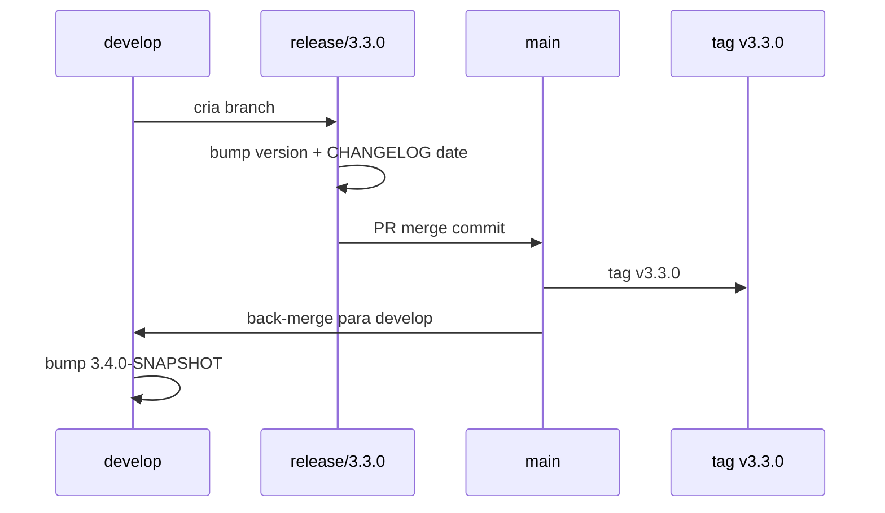

# História: Documentação, ADR e Release 3.3.0

**ID:** story-0040-0012
**Chave Jira:** —
**Status:** Pendente

## 1. Dependências

| Blocked By | Blocks |
| :--- | :--- |
| story-0040-0010, story-0040-0011 | — |

## 2. Regras Transversais Aplicáveis

| ID | Título |
| :--- | :--- |
| RULE-008 | Source of Truth: Resources |

## 3. Descrição

Como **mantenedor**, eu quero documentação consolidada (ADR-0004, CLAUDE.md, `.claude/README.md`, CHANGELOG) e um release `3.3.0` via release branch seguindo Git Flow (Rule 09), publicando o épico como feature MINOR no `main`.

Esta story fecha o épico. ADR-0004 documenta a arquitetura de telemetria (captura híbrida, storage per-epic, scrubbing). CLAUDE.md root e `.claude/README.md` ganham seção "Telemetria" com visão executiva e instruções de uso. CHANGELOG.md recebe entrada sob `[3.3.0] - YYYY-MM-DD` com seções Added/Changed.

### 3.1 ADR-0004

- Path: `docs/adr/ADR-0004-telemetry-architecture.md`
- Estrutura: Context → Decision → Consequences → Alternatives Considered
- Referências às stories 0001-0011

### 3.2 CLAUDE.md + .claude/README.md

- Seção "Telemetria" com ~200 palavras
- Links para ADR-0004, rule 14, skills `/x-telemetry-analyze`, `/x-telemetry-trend`
- Exemplo de uso básico

### 3.3 CHANGELOG.md

```markdown
## [3.3.0] - 2026-MM-DD

### Added
- Telemetry capture via hooks (SessionStart, PreToolUse, PostToolUse, SubagentStop, Stop)
- Java domain types under `dev.iadev.telemetry` (TelemetryEvent, Writer, Reader, Scrubber)
- New skills `/x-telemetry-analyze` and `/x-telemetry-trend`
- Rule 14 — Telemetry Privacy
- Phase markers in implementation, planning, and creation skills (x-dev-epic-implement, x-dev-story-implement, x-dev-implement, x-task-plan, x-epic-plan, x-story-plan, x-dev-architecture-plan, x-test-plan, x-story-map, x-story-epic, x-story-create, x-story-epic-full, x-jira-create-*)
- Storage layout: `plans/epic-*/telemetry/events.ndjson` + `.claude/telemetry/index.json`

### Changed
- `ExecutionState` ganhou campo opcional `telemetryPath`
- `_TEMPLATE-SKILL.md` ganhou seção opcional "Telemetry"
- `ProjectConfig` ganhou campo `telemetryEnabled` (default `true`)
```

### 3.4 Release via Git Flow

1. Criar branch `release/3.3.0` a partir de `develop` quando todas as stories estiverem merged
2. Bump version `3.2.0-SNAPSHOT` → `3.3.0` em `pom.xml` + `CLAUDE.md` root se aplicável
3. Atualizar CHANGELOG com a data real
4. PR `release/3.3.0` → `main` (merge commit, não squash)
5. Tag `v3.3.0` no `main`
6. Back-merge `release/3.3.0` → `develop` (merge commit)
7. Bump `develop` para `3.4.0-SNAPSHOT`

## 3.5 Entrega de Valor

- **Valor Principal:** Release 3.3.0 publicado com feature completa; usuários externos recebem telemetria sem configuração manual.
- **Métrica de Sucesso:** Tag `v3.3.0` no `main`; CHANGELOG atualizado; ADR-0004 linkado de CLAUDE.md.
- **Impacto no Negócio:** Marco de lançamento público; permite aferir adoção via telemetria dos próprios projetos gerados.

## 4. Definições de Qualidade Locais

### DoR Local (Definition of Ready)

- [ ] Stories 0010 e 0011 merged em `develop`
- [ ] Todos os testes verdes em `develop`
- [ ] Coverage gate passando em `develop`

### DoD Local (Definition of Done)

- [ ] ADR-0004 publicada e linkada
- [ ] CLAUDE.md + .claude/README.md atualizados
- [ ] CHANGELOG.md atualizado com data real do release
- [ ] `pom.xml` bumped para `3.3.0`
- [ ] Tag `v3.3.0` no `main`
- [ ] Back-merge em `develop` concluído com bump `3.4.0-SNAPSHOT`
- [ ] Release notes publicadas no GitHub Releases
- [ ] Smoke test contra release candidate (baixar jar, rodar em sandbox)

### Global Definition of Done (DoD)

- **Cobertura:** N/A (documentação)
- **Testes Automatizados:** Smoke do release artifact
- **Relatório de Cobertura:** Consolidado em `plans/epic-0040/reports/`
- **Documentação:** ADR + CLAUDE.md + README + CHANGELOG
- **Persistência:** N/A
- **Performance:** N/A

## 5. Contratos de Dados (Data Contract)

### 5.1 ADR-0004 Structure

| Seção | Conteúdo |
| :--- | :--- |
| Status | `Accepted` após merge do release |
| Context | Problema + estado atual |
| Decision | Arquitetura escolhida (híbrida) |
| Consequences | Prós, contras, custos de manutenção |
| Alternatives Considered | OpenTelemetry SDK, somente hooks, somente in-skill |

### 5.2 Release Checklist (Rule 08)

| Item | Validação |
| :--- | :--- |
| Todos os testes passando | CI green em release branch |
| Coverage ≥ 95/90 | JaCoCo report |
| CHANGELOG atualizado | Entry `[3.3.0]` existe |
| Versão bumped | `pom.xml` tem `3.3.0` |
| Sem TODO/FIXME em novo código | Grep retorna vazio |
| Security scan clean | OWASP check |
| Rollback documentado | ADR seção Consequences |

### 5.3 Error Codes
N/A.

## 6. Diagramas

### 6.1 Git Flow do Release



## 7. Critérios de Aceite (Gherkin)

```gherkin
Cenario: ADR-0004 ausente bloqueia o release (degenerate)
  DADO release branch criada sem ADR-0004
  QUANDO checklist de release é verificado
  ENTÃO falha com mensagem "ADR-0004 missing"

Cenario: Release flow completo (happy path)
  DADO develop com todas as stories 0001-0011 merged
  QUANDO executamos release/3.3.0 flow
  ENTÃO tag v3.3.0 existe no main
  E develop tem version 3.4.0-SNAPSHOT
  E CHANGELOG tem entrada [3.3.0] com data real

Cenario: CLAUDE.md sem seção Telemetria bloqueia (error path)
  DADO CLAUDE.md root sem a seção
  QUANDO CI lint roda
  ENTÃO falha com mensagem citando seção ausente

Cenario: CHANGELOG sem entrada 3.3.0 bloqueia (error path)
  DADO CHANGELOG sem entrada [3.3.0]
  QUANDO release script valida
  ENTÃO aborta com exit code 1

Cenario: Smoke do jar release (boundary)
  DADO jar 3.3.0 empacotado
  QUANDO rodamos em sandbox temporária com mvn process-resources
  ENTÃO .claude/ gerado contém hooks telemetry-*
  E /x-telemetry-analyze --help funciona
```

### 7.1 Scenario Ordering (TPP)
Degenerate (ADR missing) → happy (release completo) → error (docs missing) → boundary (smoke jar).

### 7.2 Mandatory Scenario Categories
- [x] Degenerate (ADR ausente)
- [x] Happy path (release completo)
- [x] Error paths (CLAUDE.md, CHANGELOG)
- [x] Boundary (smoke jar real)

### 7.3 TDD Implementation Notes
- Acceptance outer loop: release dry-run em fork/sandbox.
- Inner loop: cada item do checklist vira teste isolado.

## 8. Tasks

### TASK-0040-0012-001: ADR-0004-telemetry-architecture.md

- **Layer:** Doc
- **Test Type:** Verification
- **Size:** M
- **Dependencies:** —
- **Branch:** `feat/task-0040-0012-001-adr`
- **Testability:** Config + VerificationTest
- **Files:**
  - `docs/adr/ADR-0004-telemetry-architecture.md`
  - `docs/adr/README.md`
  - `java/src/test/java/dev/iadev/docs/AdrIndexTest.java`
- **Acceptance Criteria:**
  - [ ] ADR tem as 4 seções obrigatórias
  - [ ] Index ADR atualizado

### TASK-0040-0012-002: CLAUDE.md + .claude/README.md — seção Telemetria

- **Layer:** Doc
- **Test Type:** Verification
- **Size:** S
- **Dependencies:** TASK-0040-0012-001
- **Branch:** `feat/task-0040-0012-002-claude-readme`
- **Testability:** Config + VerificationTest
- **Files:**
  - `java/src/main/resources/targets/claude/CLAUDE.md`
  - `java/src/main/resources/targets/claude/README.md` (gerado)
  - `java/src/test/java/dev/iadev/docs/ClaudeMdTelemetrySectionTest.java`
- **Acceptance Criteria:**
  - [ ] Seção "Telemetria" em CLAUDE.md com link para ADR
  - [ ] `.claude/README.md` (gerado) também contém a seção

### TASK-0040-0012-003: CHANGELOG.md entry 3.3.0

- **Layer:** Doc
- **Test Type:** Verification
- **Size:** S
- **Dependencies:** —
- **Branch:** `feat/task-0040-0012-003-changelog`
- **Testability:** Config + VerificationTest
- **Files:**
  - `CHANGELOG.md`
  - `java/src/test/java/dev/iadev/docs/ChangelogTest.java`
- **Acceptance Criteria:**
  - [ ] Entry `[3.3.0]` com Added e Changed
  - [ ] Todas as 12 stories mencionadas ou resumidas

### TASK-0040-0012-004: Release branch + version bump

- **Layer:** Config
- **Test Type:** Verification
- **Size:** S
- **Dependencies:** TASK-0040-0012-001, TASK-0040-0012-002, TASK-0040-0012-003
- **Branch:** `release/3.3.0`
- **Testability:** Config + VerificationTest
- **Files:**
  - `pom.xml`
  - `CHANGELOG.md` (set date)
- **Acceptance Criteria:**
  - [ ] `pom.xml` version = `3.3.0`
  - [ ] CHANGELOG tem data real de release

### TASK-0040-0012-005: Merge to main + tag v3.3.0

- **Layer:** Config
- **Test Type:** Verification
- **Size:** S
- **Dependencies:** TASK-0040-0012-004
- **Branch:** `release/3.3.0` → `main`
- **Testability:** Config + VerificationTest
- **Files:** — (git operations)
- **Acceptance Criteria:**
  - [ ] PR merged com merge commit (não squash)
  - [ ] Tag `v3.3.0` criada no `main`
  - [ ] GitHub Release publicado com release notes

### TASK-0040-0012-006: Back-merge para develop + bump SNAPSHOT

- **Layer:** Config
- **Test Type:** Verification
- **Size:** S
- **Dependencies:** TASK-0040-0012-005
- **Branch:** `release/3.3.0` → `develop`
- **Testability:** Config + VerificationTest
- **Files:**
  - `pom.xml` (bump para 3.4.0-SNAPSHOT)
- **Acceptance Criteria:**
  - [ ] `develop` tem version `3.4.0-SNAPSHOT`
  - [ ] Histórico mostra merge commit

### TASK-0040-0012-007: Smoke do release artifact

- **Layer:** Test
- **Test Type:** Smoke
- **Size:** S
- **Dependencies:** TASK-0040-0012-005
- **Branch:** `feat/task-0040-0012-007-smoke`
- **Testability:** Migration + Smoke
- **Files:**
  - `java/src/test/java/dev/iadev/release/ReleaseSmokeIT.java`
- **Acceptance Criteria:**
  - [ ] Download do jar da tag, roda `mvn process-resources` em sandbox
  - [ ] `.claude/` gerado contém telemetry-*.sh e hooks corretos
  - [ ] `/x-telemetry-analyze --help` retorna 0
