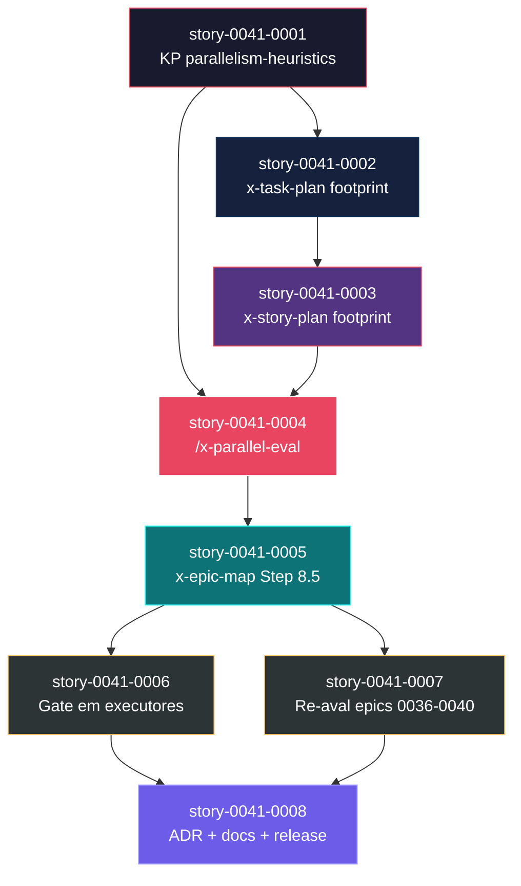

# Mapa de Implementação — EPIC-0041 File-Conflict-Aware Parallelism Analysis

**Gerado a partir das dependências BlockedBy/Blocks de cada história do epic-0041.**

---

## 1. Matriz de Dependências

| Story | Título | Chave Jira | Blocked By | Blocks | Status |
| :--- | :--- | :--- | :--- | :--- | :--- |
| story-0041-0001 | KP `parallelism-heuristics` | — | — | story-0041-0002, story-0041-0004 | Pendente |
| story-0041-0002 | `x-task-plan`: emitir File Footprint | — | story-0041-0001 | story-0041-0003 | Pendente |
| story-0041-0003 | `x-story-plan`: agregar Story File Footprint | — | story-0041-0002 | story-0041-0004 | Concluída |
| story-0041-0004 | Skill `/x-parallel-eval` (Java + SKILL.md) | — | story-0041-0001, story-0041-0003 | story-0041-0005 | Pendente |
| story-0041-0005 | `x-epic-map`: Step 8.5 invoca `/x-parallel-eval` | — | story-0041-0004 | story-0041-0006, story-0041-0007 | Pendente |
| story-0041-0006 | Gate em `x-dev-epic-implement` e `x-dev-story-implement` | — | story-0041-0005 | story-0041-0008 | Pendente |
| story-0041-0007 | Re-avaliação retroativa dos epics 0036–0040 | — | story-0041-0005 | story-0041-0008 | Pendente |
| story-0041-0008 | ADR-0005 + CLAUDE.md + CHANGELOG + release | — | story-0041-0006, story-0041-0007 | — | Pendente |

> **Valores de Status:** `Pendente` (padrão) · `Em Andamento` · `Concluída` · `Falha` · `Bloqueada` · `Parcial`

> **Nota:** A coluna `Blocks` registra apenas dependências **diretas**. O fechamento transitivo é refletido no grafo (Seção 4) e no caminho crítico (Seção 3).

---

## 2. Fases de Implementação

> As histórias são agrupadas em fases. Dentro de cada fase, as histórias podem ser implementadas **em paralelo**. Uma fase só pode iniciar quando todas as dependências das fases anteriores estiverem concluídas.

```
╔══════════════════════════════════════════════════════════════════════════╗
║                FASE 0 — Fundação Conceitual                              ║
║   ┌───────────────────────────────────────┐                              ║
║   │  story-0041-0001  KP heurísticas      │                              ║
║   └────────────────────┬──────────────────┘                              ║
╚════════════════════════╪═════════════════════════════════════════════════╝
                         ▼
╔══════════════════════════════════════════════════════════════════════════╗
║                FASE 1 — Footprint na Task                                ║
║   ┌───────────────────────────────────────┐                              ║
║   │  story-0041-0002  x-task-plan         │                              ║
║   └────────────────────┬──────────────────┘                              ║
╚════════════════════════╪═════════════════════════════════════════════════╝
                         ▼
╔══════════════════════════════════════════════════════════════════════════╗
║                FASE 2 — Footprint na Story                               ║
║   ┌───────────────────────────────────────┐                              ║
║   │  story-0041-0003  x-story-plan        │                              ║
║   └────────────────────┬──────────────────┘                              ║
╚════════════════════════╪═════════════════════════════════════════════════╝
                         ▼
╔══════════════════════════════════════════════════════════════════════════╗
║                FASE 3 — Skill /x-parallel-eval                           ║
║   ┌───────────────────────────────────────┐                              ║
║   │  story-0041-0004  parallel-eval       │                              ║
║   └────────────────────┬──────────────────┘                              ║
╚════════════════════════╪═════════════════════════════════════════════════╝
                         ▼
╔══════════════════════════════════════════════════════════════════════════╗
║                FASE 4 — Integração no Map                                ║
║   ┌───────────────────────────────────────┐                              ║
║   │  story-0041-0005  x-epic-map Step 8.5 │                              ║
║   └────────────────────┬──────────────────┘                              ║
╚════════════════════════╪═════════════════════════════════════════════════╝
                         ▼
╔══════════════════════════════════════════════════════════════════════════╗
║                FASE 5 — Gate + Migração (paralelo)                       ║
║   ┌────────────────────────┐    ┌────────────────────────────┐           ║
║   │  story-0041-0006       │    │  story-0041-0007           │           ║
║   │  Gate em executores    │    │  Re-aval epics 0036–0040   │           ║
║   └───────────┬────────────┘    └─────────────┬──────────────┘           ║
╚═══════════════╪═══════════════════════════════╪══════════════════════════╝
                │                               │
                └───────────────┬───────────────┘
                                ▼
╔══════════════════════════════════════════════════════════════════════════╗
║                FASE 6 — Documentação e Release                           ║
║   ┌───────────────────────────────────────────────────────────┐          ║
║   │  story-0041-0008  ADR-0005 + CLAUDE.md + CHANGELOG + rel  │          ║
║   └───────────────────────────────────────────────────────────┘          ║
╚══════════════════════════════════════════════════════════════════════════╝
```

---

## 3. Caminho Crítico

```
story-0041-0001 → story-0041-0002 → story-0041-0003 → story-0041-0004
              → story-0041-0005 → story-0041-0006 → story-0041-0008
   Fase 0          Fase 1            Fase 2            Fase 3
   Fase 4          Fase 5            Fase 6
```

**7 fases no caminho crítico, 7 histórias na cadeia mais longa (0001 → 0002 → 0003 → 0004 → 0005 → 0006 → 0008).**

A cadeia via `story-0041-0007` tem o mesmo comprimento (7 fases), passando por 0007 em vez de 0006 na Fase 5 — Fase 5 é o único ponto de paralelismo do épico, e ambas as histórias dessa fase precisam concluir antes de 0008. Qualquer atraso em 0001..0005 ou 0008 desliza a entrega final dia-a-dia; atrasos em 0006 ou 0007 só impactam se ultrapassarem o tempo da paralela.

---

## 4. Grafo de Dependências (Mermaid)



---

## 5. Resumo por Fase

| Fase | Histórias | Camada | Paralelismo | Pré-requisito |
| :--- | :--- | :--- | :--- | :--- |
| 0 | story-0041-0001 | Knowledge Pack (fundação conceitual) | 1 | — |
| 1 | story-0041-0002 | Skill de planejamento (task) | 1 | Fase 0 concluída |
| 2 | story-0041-0003 | Skill de planejamento (story) | 1 | Fase 1 concluída |
| 3 | story-0041-0004 | Skill de avaliação (Java + SKILL.md) | 1 | Fases 0 e 2 concluídas |
| 4 | story-0041-0005 | Integração no map | 1 | Fase 3 concluída |
| 5 | story-0041-0006, story-0041-0007 | Execução + Migração retroativa | 2 paralelas | Fase 4 concluída |
| 6 | story-0041-0008 | Documentação + Release | 1 | Fase 5 concluída |

**Total: 8 histórias em 7 fases.**

> **Nota:** Apenas a Fase 5 admite paralelismo (2 histórias). As demais fases são lineares por dependência estrutural — cada artefato consome o anterior. Esse é, ele próprio, um caso onde o produto deste épico (`/x-parallel-eval`) teria pouco impacto: a topologia já é predominantemente serial.

---

## 6. Detalhamento por Fase

### Fase 0 — Fundação Conceitual

| Story | Escopo Principal | Artefatos Chave |
| :--- | :--- | :--- |
| story-0041-0001 | Knowledge Pack `parallelism-heuristics` com catálogo de hotspots, categorias de conflito (RULE-003) e política de degradação (RULE-005) | `java/src/main/resources/targets/claude/skills/knowledge-packs/parallelism-heuristics/SKILL.md` |

**Entregas da Fase 0:**

- KP referenciável por todas as skills downstream
- Catálogo formal de hotspots conhecidos (`SettingsAssembler.java`, golden files, `CLAUDE.md`, etc.)
- Definição canônica do schema do bloco File Footprint

### Fase 1 — Footprint na Task

| Story | Escopo Principal | Artefatos Chave |
| :--- | :--- | :--- |
| story-0041-0002 | Estende `x-task-plan` para emitir seção `## File Footprint` com sub-seções `write:`/`read:`/`regen:` | SKILL.md atualizado, golden tests do output |

**Entregas da Fase 1:**

- Task plans gerados a partir desta release contêm File Footprint estruturado
- Parser regex-based para extrair footprint de task plans

### Fase 2 — Footprint na Story

| Story | Escopo Principal | Artefatos Chave |
| :--- | :--- | :--- |
| story-0041-0003 | Estende `x-story-plan` para agregar `## Story File Footprint` (união dos footprints das tasks) | SKILL.md atualizado, golden tests, lógica de agregação |

**Entregas da Fase 2:**

- Story plans expõem footprint consolidado, evitando re-parse de N task plans

### Fase 3 — Skill /x-parallel-eval

| Story | Escopo Principal | Artefatos Chave |
| :--- | :--- | :--- |
| story-0041-0004 | Skill standalone com `--scope=epic\|story\|task`, detector de colisão, matriz determinística | `dev.iadev.parallelism.*` (Java), `skills/core/.../x-parallel-eval/SKILL.md`, integration tests com fixtures de epics reais |

**Entregas da Fase 3:**

- Skill invocável standalone para análise ad-hoc
- Matriz de colisão determinística (golden-testável)
- Performance < 3s para épico de 15 stories

### Fase 4 — Integração no Map

| Story | Escopo Principal | Artefatos Chave |
| :--- | :--- | :--- |
| story-0041-0005 | Adiciona Step 8.5 ao `x-epic-map` que invoca `/x-parallel-eval` e anota seção "Restrições de Paralelismo" | SKILL.md atualizado, golden test do map com seção 8.5 |

**Entregas da Fase 4:**

- Implementation Maps regenerados ganham seção 8.5 automaticamente
- Pares serializados visíveis na fase de planejamento (não só em runtime)

### Fase 5 — Gate + Migração (paralelo)

| Story | Escopo Principal | Artefatos Chave |
| :--- | :--- | :--- |
| story-0041-0006 | Gate em `x-dev-epic-implement` e `x-dev-story-implement` que rebaixa paralelismo para serial em caso de colisão (RULE-005) | SKILL.md de ambas atualizados, integration tests do degrade-with-warning |
| story-0041-0007 | Re-roda `/x-parallel-eval` nos epics 0036–0040 e gera patches `.diff` para revisão humana | `plans/epic-0041/migrations/epic-XXXX.diff` (5 arquivos), README de migração |

**Entregas da Fase 5:**

- Execução paralela protegida por gate em runtime
- Migração retroativa documentada e revisável (sem auto-apply)

### Fase 6 — Documentação e Release

| Story | Escopo Principal | Artefatos Chave |
| :--- | :--- | :--- |
| story-0041-0008 | ADR-0005 (decisão arquitetural), atualização do CLAUDE.md, CHANGELOG, release minor via Git Flow | `adr/ADR-0005-*.md`, `CLAUDE.md`, `CHANGELOG.md`, tag de release |

**Entregas da Fase 6:**

- Decisão arquitetural registrada
- Release publicada (Git Flow: `release/X.Y.0` → `main` + back-merge para `develop`)

---

## 7. Observações Estratégicas

### Gargalo Principal

**story-0041-0005** é o gargalo central: bloqueia diretamente 0006 e 0007 (toda a Fase 5) e indiretamente 0008 (Fase 6). Sua entrega correta é o que destrava paralelismo no resto do épico. Investir tempo extra em fixtures e golden tests aqui evita retrabalho em 3 stories downstream.

Em segundo plano, **story-0041-0001** é o gargalo *transitivo*: tudo no épico depende dele (direta ou indiretamente). Erros conceituais no KP cascatearão para todas as skills.

### Histórias Folha (sem dependentes)

- **story-0041-0008** — única folha do grafo. Pode absorver atrasos sem impactar dependentes (não há), mas atrasos nele atrasam a *release* do épico.

### Otimização de Tempo

- Paralelismo máximo: **2 histórias simultâneas (Fase 5)**. O resto é serial puro.
- **story-0041-0001** pode (e deve) começar imediatamente — único ponto de partida.
- **Pré-cunhar fixtures de teste** para 0004 enquanto 0001/0002/0003 estão em execução pode encurtar a Fase 3.
- Não há ganho de equipe extra antes da Fase 5 — adicionar pessoas a uma fase serial não a acelera (anti-padrão Brooks).

### Dependências Cruzadas

- **story-0041-0004** é ponto de convergência: depende de 0001 (Fase 0) **e** 0003 (Fase 2), ramos diferentes do DAG. 0001 fica "esperando" durante Fases 1 e 2; sua entrega não destranca nada antes de 0004.
- **story-0041-0008** converge 0006 e 0007 — a Fase 5 só "fecha" quando ambas concluem.

### Marco de Validação Arquitetural

**story-0041-0004** (`/x-parallel-eval`) é o checkpoint arquitetural natural. Ela valida:

- Schema do File Footprint funciona end-to-end (parser → detector → matriz)
- Performance NFR (< 3s para 15 stories)
- Determinismo de output (golden tests)
- Backward compat (RULE-006: footprint ausente vira warning, não erro)

Antes de prosseguir para Fase 4 (integração no map), `/x-parallel-eval` deve ser exercitado contra fixtures dos épicos 0036–0040 — se a saída não for utilizável aqui, o resto do épico não deveria avançar.

---

## 8. Dependências entre Tasks (Cross-Story)

> **Análise diferida.** As 8 histórias contêm IDs formais de tasks (`TASK-0041-YYYY-NNN`) na Section 8, mas a extração + validação RULE-012 + topological sort cross-story exige leitura completa de todos os arquivos e está fora do escopo desta geração inicial. A topologia story-level (Seções 1–7) é suficiente para `/x-epic-implement EPIC-0041 --sequential` (modo recomendado dada a quase-linearidade do DAG).
>
> Para gerar Section 8 completa posteriormente, re-invoque `/x-epic-map 0041` após (a) confirmar que todas as tasks declaram `depends on:` explícitos e (b) ter o KP `parallelism-heuristics` (story-0041-0001) implementado para validar conflitos a nível de footprint de arquivo.
