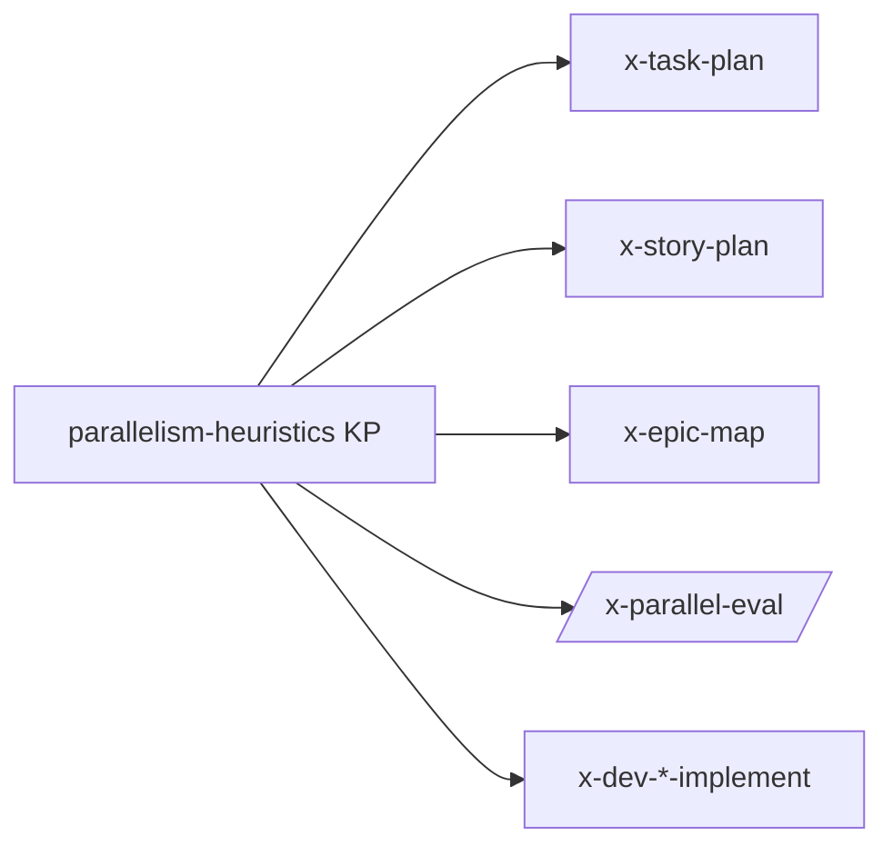

# História: Knowledge Pack `parallelism-heuristics`

**ID:** story-0041-0001
**Chave Jira:** —
**Status:** Pendente

## 1. Dependências

| Blocked By | Blocks |
| :--- | :--- |
| — | story-0041-0002, story-0041-0003, story-0041-0004 |

## 2. Regras Transversais Aplicáveis

| ID | Título |
| :--- | :--- |
| RULE-001 | File Footprint Estruturado |
| RULE-002 | Granularidade por Arquivo |
| RULE-003 | Categorias de Conflito |
| RULE-004 | Hotspots Conhecidos |
| RULE-007 | Source of Truth: Resources |

## 3. Descrição

Como **autor das skills de planejamento e execução**, eu quero um knowledge pack único contendo todas as heurísticas de detecção de colisão de arquivos, para que as 5 skills downstream (`x-task-plan`, `x-story-plan`, `x-epic-map`, `/x-parallel-eval`, `x-dev-*-implement`) compartilhem a mesma fonte da verdade e evoluam de forma consistente.

Esta é a story de fundação (Layer 0). Sem o KP, cada skill replicaria suas próprias regras e a manutenção divergiria. O KP cataloga: (a) as 3 categorias de conflito (hard, regen, soft), (b) o formato canônico do bloco File Footprint, (c) a lista inicial de hotspots conhecidos extraída do histórico de conflitos do repositório, (d) a política de degrade-with-warning.

### 3.1 Estrutura do KP

- Path: `java/src/main/resources/targets/claude/skills/knowledge-packs/parallelism-heuristics/SKILL.md`
- Frontmatter: `user-invocable: false`, `description` curta
- Seções obrigatórias: Footprint Format, Conflict Categories, Hotspot Catalog, Degradation Policy, Examples

### 3.2 Hotspot Catalog (lista inicial)

- `java/src/main/java/dev/iadev/application/assembler/SettingsAssembler.java`
- `java/src/main/java/dev/iadev/application/assembler/HooksAssembler.java`
- `java/src/main/java/dev/iadev/application/assembler/SkillsAssembler.java`
- `CLAUDE.md`
- `.gitignore`
- `CHANGELOG.md`
- `pom.xml`
- `java/src/test/resources/golden/**`
- `.claude/templates/**` (regen-only; quem edita aqui está violando RULE-007)

## 3.5 Entrega de Valor

- **Valor Principal:** Catálogo formal de heurísticas de colisão consumível por 5 skills downstream — destrava todas elas sem risco de divergência.
- **Métrica de Sucesso:** 100% das stories 0041-0002..0006 referenciam o KP via "Knowledge Pack References" no SKILL.md.
- **Impacto no Negócio:** Reduz custo de manutenção de regras de colisão (uma única edição propaga); torna a evolução do catálogo de hotspots auditável.

## 4. Definições de Qualidade Locais

### DoR Local

- [ ] Lista inicial de hotspots validada com `git log --pretty=format: --name-only | sort | uniq -c | sort -rn | head -30`
- [ ] Formato do bloco File Footprint validado contra exemplos de tasks reais
- [ ] Política de degradação (RULE-005) confirmada

### DoD Local

- [ ] `parallelism-heuristics/SKILL.md` commitado com todas as 5 seções
- [ ] Pelo menos 3 exemplos canônicos de footprint (task simples, task com regen, story com agregação)
- [ ] Hotspot catalog cita ≥ 9 paths reais
- [ ] `mvn process-resources` copia o KP para `.claude/skills/knowledge-packs/`
- [ ] Golden test do conteúdo do KP

## 5. Contratos de Dados

### 5.1 Formato canônico do bloco File Footprint

```markdown
## File Footprint

### write:
- path/to/file1.java
- path/to/file2.md

### read:
- path/to/contextual.java

### regen:
- src/test/resources/golden/**
```

### 5.2 Categorias de Conflito (RULE-003)

| Categoria | Detecção | Resolução |
| :--- | :--- | :--- |
| Hard | overlap em `write:` ↔ `write:` | Serializar |
| Regen | overlap em `write:` ↔ `regen:` ou `regen:` ↔ `regen:` | Serializar |
| Soft | overlap apenas em `read:` | Ignorar |

## 6. Diagramas

### 6.1 Fluxo de Consumo do KP



## 7. Critérios de Aceite (Gherkin)

```gherkin
Cenario: KP existe no source of truth (degenerate)
  DADO o repositório no HEAD da branch desta story
  QUANDO listamos arquivos em targets/claude/skills/knowledge-packs/
  ENTÃO existe um diretório parallelism-heuristics/ com SKILL.md

Cenario: KP define formato canônico do File Footprint (happy path)
  DADO o SKILL.md do KP
  QUANDO buscamos a seção "Footprint Format"
  ENTÃO ela contém um bloco de exemplo com sub-seções write:, read: e regen:
  E o exemplo é Markdown válido

Cenario: KP cataloga as 3 categorias de conflito
  DADO o SKILL.md do KP
  QUANDO buscamos a seção "Conflict Categories"
  ENTÃO ela enumera as categorias hard, regen e soft
  E para cada categoria existe uma regra de resolução

Cenario: Hotspot catalog inclui assemblers críticos (boundary)
  DADO o SKILL.md do KP
  QUANDO buscamos a seção "Hotspot Catalog"
  ENTÃO a lista inclui SettingsAssembler.java, HooksAssembler.java e CLAUDE.md
```

### 7.1 Scenario Ordering (TPP)
degenerate (existência do arquivo) → unconditional (formato) → conditions (3 categorias) → boundary (hotspots críticos).

### 7.2 Mandatory Scenario Categories
- [x] Degenerate (arquivo existe)
- [x] Happy path (formato definido)
- [x] Error/condition coverage (3 categorias enumeradas)
- [x] Boundary (hotspots conhecidos presentes)

## 8. Tasks

### TASK-0041-0001-001: Estruturar SKILL.md do KP com 5 seções

- **Layer:** Doc
- **Test Type:** Verification
- **Size:** M
- **Dependencies:** —
- **Branch:** `feature/task-0041-0001-001-kp-skeleton`
- **Files:**
  - `java/src/main/resources/targets/claude/skills/knowledge-packs/parallelism-heuristics/SKILL.md`
- **Acceptance Criteria:**
  - [ ] Frontmatter com `user-invocable: false`
  - [ ] 5 seções: Footprint Format, Conflict Categories, Hotspot Catalog, Degradation Policy, Examples
  - [ ] Pelo menos 3 exemplos canônicos de footprint

### TASK-0041-0001-002: Golden test do KP

- **Layer:** Test
- **Test Type:** Verification
- **Size:** S
- **Dependencies:** TASK-0041-0001-001
- **Branch:** `feature/task-0041-0001-002-kp-golden`
- **Files:**
  - `java/src/test/resources/golden/parallelism-heuristics/SKILL.md`
  - `java/src/test/java/dev/iadev/parallelism/KnowledgePackGoldenTest.java`
- **Acceptance Criteria:**
  - [ ] Golden file espelha o output gerado em `.claude/skills/knowledge-packs/parallelism-heuristics/SKILL.md`
  - [ ] Teste passa em `mvn verify`

## File Footprint

### write:
- `java/src/main/resources/targets/claude/skills/knowledge-packs/parallelism-heuristics/SKILL.md`
- `java/src/test/resources/golden/parallelism-heuristics/SKILL.md`
- `java/src/test/java/dev/iadev/parallelism/KnowledgePackGoldenTest.java`

### read:
- `java/src/main/resources/targets/claude/skills/knowledge-packs/story-planning/SKILL.md`

### regen:
- `.claude/skills/knowledge-packs/parallelism-heuristics/SKILL.md`
