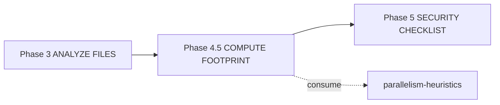

# História: `x-task-plan` emite seção File Footprint

**ID:** story-0041-0002
**Chave Jira:** —
**Status:** Pendente

## 1. Dependências

| Blocked By | Blocks |
| :--- | :--- |
| story-0041-0001 | story-0041-0003, story-0041-0004 |

## 2. Regras Transversais Aplicáveis

| ID | Título |
| :--- | :--- |
| RULE-001 | File Footprint Estruturado |
| RULE-002 | Granularidade por Arquivo |
| RULE-006 | Backward Compatibility |
| RULE-007 | Source of Truth: Resources |

## 3. Descrição

Como **executor de `/x-task-plan`**, eu quero que cada task plan gerado contenha uma seção `## File Footprint` estruturada (sub-seções `write:`, `read:`, `regen:`), para que `/x-parallel-eval` possa consumir paths de forma determinística sem heurística textual.

Hoje task plans listam arquivos em prosa dentro de "Affected files". A skill `x-task-plan` é estendida para emitir, ao final do plan, o bloco canônico definido no KP `parallelism-heuristics`. A inferência de footprint é derivada da seção `**Files:**` da task na story original, complementada por regras: tasks que tocam `pom.xml` ou `**/SKILL.md` adicionam `regen:` em paths de golden correspondentes.

### 3.1 Mudanças no SKILL.md

- Nova Phase 4.5 "Compute File Footprint" entre "ANALYZE FILES" e "SECURITY CHECKLIST"
- Output do plan ganha seção `## File Footprint` antes de `## Definition of Done`
- Knowledge Pack Reference para `parallelism-heuristics`

### 3.2 Regras de inferência

- Cada path da task vai para `write:` por padrão
- Se path termina em `pom.xml`, `SKILL.md`, ou está sob `targets/claude/`, adicionar `regen:` correspondente em `.claude/**` ou `src/test/resources/golden/**`
- Paths citados em "Dependencies → reads" da task vão para `read:`

## 3.5 Entrega de Valor

- **Valor Principal:** Cada task plan passa a expor footprint estruturado consumível por máquina; pré-requisito para `/x-parallel-eval`.
- **Métrica de Sucesso:** Re-geração com `--force` de todos os task plans existentes em epics 0036-0040 produz blocos File Footprint válidos (parser não falha em nenhum).
- **Impacto no Negócio:** Início da cadeia de dados que evita conflitos de merge em paralelismo.

## 4. Definições de Qualidade Locais

### DoR Local

- [ ] KP `parallelism-heuristics` mergeado (story-0041-0001)
- [ ] Decisão sobre regras de inferência de `regen:` confirmada

### DoD Local

- [ ] `x-task-plan/SKILL.md` atualizado com Phase 4.5
- [ ] Knowledge Pack Reference adicionada
- [ ] Pelo menos 3 task plans regenerados com `--force` validados visualmente
- [ ] Unit test do parser de footprint contra 5 fixtures (válidos + inválidos)

## 5. Contratos de Dados

### 5.1 Output da Phase 4.5

```markdown
## File Footprint

### write:
- <path1>
- <path2>

### read:
- <path3>

### regen:
- <path4>
```

Sub-seções vazias DEVEM ser omitidas. Paths DEVEM ser ordenados alfabeticamente para determinismo (RULE-008).

## 6. Diagramas

### 6.1 Pipeline Atualizado



## 7. Critérios de Aceite (Gherkin)

```gherkin
Cenario: Task simples gera footprint apenas com write (degenerate)
  DADO uma task com Files: [src/Foo.java]
  QUANDO executamos /x-task-plan
  ENTÃO o plan contém ## File Footprint
  E ### write: lista src/Foo.java
  E ### read: e ### regen: estão ausentes

Cenario: Task que toca SKILL.md adiciona regen do golden (happy path)
  DADO uma task com Files: [targets/claude/skills/x-foo/SKILL.md]
  QUANDO executamos /x-task-plan
  ENTÃO ### write: lista o SKILL.md original
  E ### regen: lista .claude/skills/x-foo/SKILL.md

Cenario: Paths ordenados alfabeticamente (boundary, determinismo RULE-008)
  DADO uma task com Files: [b.java, a.java, c.java]
  QUANDO executamos /x-task-plan duas vezes
  ENTÃO ambos plans produzem ### write: na ordem [a.java, b.java, c.java]
  E o diff entre as duas execuções é vazio

Cenario: Plan legacy sem footprint não quebra parser (RULE-006)
  DADO um task plan gerado antes desta release (sem ## File Footprint)
  QUANDO o parser tenta extrair o footprint
  ENTÃO retorna footprint vazio com warning "footprint ausente"
  E não lança exceção
```

### 7.1 Scenario Ordering (TPP)
degenerate (apenas write) → unconditional (regra de regen) → boundary (ordenação) → backward compat (legacy).

### 7.2 Mandatory Scenario Categories
- [x] Degenerate
- [x] Happy path
- [x] Boundary (determinismo)
- [x] Backward compatibility

## 8. Tasks

### TASK-0041-0002-001: Adicionar Phase 4.5 ao SKILL.md de x-task-plan

- **Layer:** Doc
- **Test Type:** Verification
- **Size:** S
- **Dependencies:** —
- **Branch:** `feature/task-0041-0002-001-skill-update`
- **Files:**
  - `java/src/main/resources/targets/claude/skills/core/plan/x-task-plan/SKILL.md`
- **Acceptance Criteria:**
  - [ ] Phase 4.5 documentada com regras de inferência
  - [ ] Knowledge Pack Reference para `parallelism-heuristics` adicionada

### TASK-0041-0002-002: Implementar parser de File Footprint em Java

- **Layer:** Domain
- **Test Type:** Unit
- **Size:** M
- **Dependencies:** TASK-0041-0002-001
- **Branch:** `feature/task-0041-0002-002-parser`
- **Files:**
  - `java/src/main/java/dev/iadev/parallelism/FileFootprint.java`
  - `java/src/main/java/dev/iadev/parallelism/FileFootprintParser.java`
  - `java/src/test/java/dev/iadev/parallelism/FileFootprintParserTest.java`
  - `java/src/test/resources/fixtures/parallelism/footprint-empty.md`
  - `java/src/test/resources/fixtures/parallelism/footprint-simple.md`
  - `java/src/test/resources/fixtures/parallelism/footprint-full.md`
  - `java/src/test/resources/fixtures/parallelism/footprint-legacy.md`
- **Acceptance Criteria:**
  - [ ] Record `FileFootprint(Set<String> writes, Set<String> reads, Set<String> regens)`
  - [ ] Parser tolerante a sub-seções ausentes
  - [ ] Plan legacy (sem bloco) retorna footprint vazio + warning
  - [ ] ≥ 95% cobertura de linhas

### TASK-0041-0002-003: Regenerar task plans piloto com --force

- **Layer:** Doc
- **Test Type:** Smoke
- **Size:** S
- **Dependencies:** TASK-0041-0002-002
- **Branch:** `feature/task-0041-0002-003-pilot-regen`
- **Files:**
  - `plans/epic-0040/plans/task-plan-0040-0001-001.md` (regenerated)
  - `plans/epic-0040/plans/task-plan-0040-0002-001.md` (regenerated)
- **Acceptance Criteria:**
  - [ ] 2 task plans regenerados contêm ## File Footprint válido
  - [ ] Parser extrai footprint sem warnings

## File Footprint

### write:
- `java/src/main/resources/targets/claude/skills/core/plan/x-task-plan/SKILL.md`
- `java/src/main/java/dev/iadev/parallelism/FileFootprint.java`
- `java/src/main/java/dev/iadev/parallelism/FileFootprintParser.java`
- `java/src/test/java/dev/iadev/parallelism/FileFootprintParserTest.java`
- `java/src/test/resources/fixtures/parallelism/**`
- `plans/epic-0040/plans/task-plan-0040-0001-001.md`
- `plans/epic-0040/plans/task-plan-0040-0002-001.md`

### read:
- `java/src/main/resources/targets/claude/skills/knowledge-packs/parallelism-heuristics/SKILL.md`

### regen:
- `.claude/skills/x-task-plan/SKILL.md`
