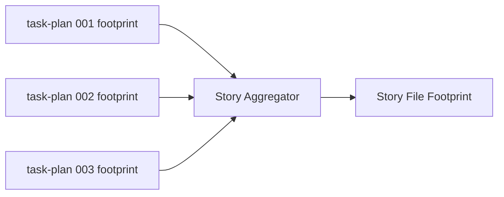

# História: `x-story-plan` agrega Story File Footprint

**ID:** story-0041-0003
**Chave Jira:** —
**Status:** Pendente

## 1. Dependências

| Blocked By | Blocks |
| :--- | :--- |
| story-0041-0002 | story-0041-0004 |

## 2. Regras Transversais Aplicáveis

| ID | Título |
| :--- | :--- |
| RULE-001 | File Footprint Estruturado |
| RULE-006 | Backward Compatibility |
| RULE-007 | Source of Truth: Resources |
| RULE-008 | Output Determinístico |

## 3. Descrição

Como **executor de `/x-story-plan`**, eu quero que cada story plan consolide os File Footprints de todas as suas tasks num único bloco `## Story File Footprint`, para que `/x-parallel-eval --scope=story` possa comparar pares de stories sem precisar abrir N task plans.

A agregação é union-set por sub-seção (`write` ⋃ write, `read` ⋃ read, `regen` ⋃ regen). Paths duplicados são deduplicados. Se uma task tem footprint vazio (legacy), a story emite warning e marca a sub-seção com `# WARNING: incomplete (N tasks sem footprint)`.

### 3.1 Mudanças no SKILL.md

- Nova Phase 6 "Aggregate File Footprint" entre "ANALYZE TASKS" e "WRITE PLAN"
- Output ganha seção `## Story File Footprint` no final do plan
- Knowledge Pack Reference para `parallelism-heuristics`

## 3.5 Entrega de Valor

- **Valor Principal:** Story plans expõem footprint agregado — input direto para análise de paralelismo entre stories.
- **Métrica de Sucesso:** Re-gerar story plans dos epics 0036–0040 produz blocos válidos sem warnings críticos.
- **Impacto no Negócio:** Permite análise rápida no nível de story sem custo de parsing N tasks.

## 4. Definições de Qualidade Locais

### DoR Local
- [ ] story-0041-0002 mergeada (task plans já emitem footprint)
- [ ] Comportamento de agregação (union-set + warning para legacy) confirmado

### DoD Local
- [ ] `x-story-plan/SKILL.md` atualizado com Phase 6
- [ ] Pelo menos 2 story plans piloto regenerados
- [ ] Unit test do agregador (3 tasks → 1 footprint consolidado)
- [ ] Teste de warning para tasks legacy

## 5. Contratos de Dados

### 5.1 Output da Phase 6

```markdown
## Story File Footprint

> Aggregated from 3 task footprints. 0 warnings.

### write:
- <path1>
- <path2>

### read:
- <path3>

### regen:
- <path4>
```

Se houver warnings, header passa a `> Aggregated from 3 task footprints. 1 warning: TASK-XXXX-YYYY-NNN sem footprint (legacy).`

## 6. Diagramas

### 6.1 Agregação



## 7. Critérios de Aceite (Gherkin)

```gherkin
Cenario: Story sem tasks ainda emite seção de footprint vazia (degenerate)
  DADO uma story com 0 task plans gerados
  QUANDO executamos /x-story-plan
  ENTÃO o output contém ## Story File Footprint
  E a seção é emitida sem paths agregados
  E emite warning "no task plans found" no header da seção

Cenario: Story com 3 tasks consolida footprints (happy path)
  DADO 3 task plans com footprints disjuntos
  QUANDO executamos /x-story-plan
  ENTÃO ## Story File Footprint contém união dos 3 sets
  E paths duplicados são deduplicados
  E paths são ordenados alfabeticamente

Cenario: Task legacy sem footprint dispara warning (RULE-006)
  DADO uma story com 3 tasks: 2 com footprint, 1 legacy
  QUANDO executamos /x-story-plan
  ENTÃO o header da seção cita "1 warning"
  E o nome da task legacy aparece no warning
  E a agregação prossegue para as 2 tasks válidas

Cenario: Determinismo (RULE-008)
  DADO os mesmos task plans
  QUANDO executamos /x-story-plan duas vezes
  ENTÃO os dois outputs são byte-identical
```

### 7.1 Scenario Ordering (TPP)
degenerate → happy path → warning legacy → determinismo.

### 7.2 Mandatory Scenario Categories
- [x] Degenerate
- [x] Happy path
- [x] Backward compatibility (legacy warning)
- [x] Boundary (determinismo)

## 8. Tasks

### TASK-0041-0003-001: Adicionar Phase 6 ao SKILL.md de x-story-plan

- **Layer:** Doc
- **Test Type:** Verification
- **Size:** S
- **Dependencies:** —
- **Branch:** `feature/task-0041-0003-001-skill-update`
- **Files:**
  - `java/src/main/resources/targets/claude/skills/core/plan/x-story-plan/SKILL.md`
- **Acceptance Criteria:**
  - [ ] Phase 6 documentada com regra de union-set
  - [ ] Knowledge Pack Reference para `parallelism-heuristics`

### TASK-0041-0003-002: Implementar agregador de footprints

- **Layer:** Domain
- **Test Type:** Unit
- **Size:** M
- **Dependencies:** TASK-0041-0003-001
- **Branch:** `feature/task-0041-0003-002-aggregator`
- **Files:**
  - `java/src/main/java/dev/iadev/parallelism/StoryFootprintAggregator.java`
  - `java/src/test/java/dev/iadev/parallelism/StoryFootprintAggregatorTest.java`
- **Acceptance Criteria:**
  - [ ] Agregador retorna `FileFootprint` consolidado + lista de warnings
  - [ ] Dedup determinística (TreeSet)
  - [ ] ≥ 95% cobertura

### TASK-0041-0003-003: Regenerar 2 story plans piloto

- **Layer:** Doc
- **Test Type:** Smoke
- **Size:** S
- **Dependencies:** TASK-0041-0003-002
- **Branch:** `feature/task-0041-0003-003-pilot-regen`
- **Files:**
  - `plans/epic-0040/plans/plan-story-0040-0001.md` (regenerated)
  - `plans/epic-0040/plans/plan-story-0040-0002.md` (regenerated)
- **Acceptance Criteria:**
  - [ ] 2 story plans contêm ## Story File Footprint válido
  - [ ] Header cita 0 warnings (após story-0041-0002 ter regenerado as tasks correspondentes)

## File Footprint

### write:
- `java/src/main/resources/targets/claude/skills/core/plan/x-story-plan/SKILL.md`
- `java/src/main/java/dev/iadev/parallelism/StoryFootprintAggregator.java`
- `java/src/test/java/dev/iadev/parallelism/StoryFootprintAggregatorTest.java`
- `plans/epic-0040/plans/plan-story-0040-0001.md`
- `plans/epic-0040/plans/plan-story-0040-0002.md`

### read:
- `java/src/main/java/dev/iadev/parallelism/FileFootprint.java`
- `java/src/main/java/dev/iadev/parallelism/FileFootprintParser.java`
- `java/src/main/resources/targets/claude/skills/knowledge-packs/parallelism-heuristics/SKILL.md`

### regen:
- `.claude/skills/x-story-plan/SKILL.md`
