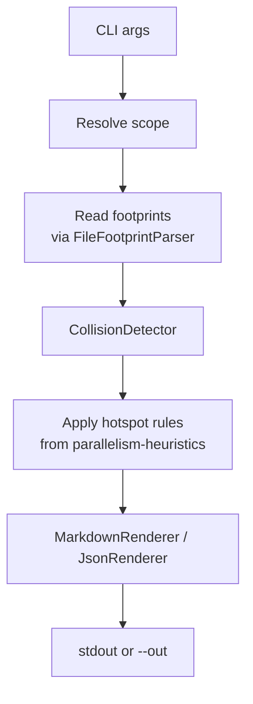

# História: Skill `/x-parallel-eval` (standalone)

**ID:** story-0041-0004
**Chave Jira:** —
**Status:** Pendente

## 1. Dependências

| Blocked By | Blocks |
| :--- | :--- |
| story-0041-0001, story-0041-0003 | story-0041-0005 |

## 2. Regras Transversais Aplicáveis

| ID | Título |
| :--- | :--- |
| RULE-001 | File Footprint Estruturado |
| RULE-003 | Categorias de Conflito |
| RULE-004 | Hotspots Conhecidos |
| RULE-005 | Degrade with Warning |
| RULE-006 | Backward Compatibility |
| RULE-008 | Output Determinístico |

## 3. Descrição

Como **operador do `ia-dev-environment`**, eu quero uma skill standalone `/x-parallel-eval` que receba um escopo (epic, par de stories, par de tasks) e produza uma **matriz de colisão** + **recomendação de reagrupamento**, para que eu possa avaliar o risco de conflito de merge antes de disparar execução paralela e antes de aprovar um Implementation Map.

A skill é cascata: lê footprints já emitidos por `x-task-plan` e `x-story-plan`, computa overlaps por categoria (hard/regen/soft) usando heurísticas do KP `parallelism-heuristics`, e produz output em Markdown com tabela de colisões + grupos serializados sugeridos.

### 3.1 Interface CLI

```
/x-parallel-eval --scope=epic --epic plans/epic-0041
/x-parallel-eval --scope=story --a story-0041-0002 --b story-0041-0003
/x-parallel-eval --scope=task --a TASK-0041-0002-001 --b TASK-0041-0003-001
/x-parallel-eval --scope=epic --epic plans/epic-0041 --out reports/parallelism.md
```

### 3.2 Output canônico

```markdown
# Parallelism Evaluation — EPIC-0041

**Scope:** epic | **Items analyzed:** 8 | **Conflicts:** 2 hard, 1 regen, 0 soft

## Collision Matrix
| A | B | Category | Shared paths |
| :--- | :--- | :--- | :--- |
| story-0041-0002 | story-0041-0003 | hard | java/.../FooBar.java |

## Recommended Serialization Groups
- **Group 1 (serialize):** story-0041-0002 → story-0041-0003 (hard conflict on FooBar.java)
- **Group 2 (parallel):** story-0041-0006, story-0041-0007 (no conflicts)

## Hotspot Touches
- `SettingsAssembler.java` touched by: story-0041-0002 (write), story-0041-0006 (write)
```

### 3.3 Comportamento por scope

- `--scope=epic`: lê `implementation-map-XXXX.md` para identificar fases atuais; analisa pares dentro de cada fase; reporta colisões e sugere serialização **dentro da fase**.
- `--scope=story|task`: análise binária; retorna OK/CONFLICT com paths compartilhados.

## 3.5 Entrega de Valor

- **Valor Principal:** Skill standalone que detecta e reporta conflitos potenciais antes da execução; usável manualmente e como dependência de outras skills.
- **Métrica de Sucesso:** Detecta os 2 conflitos conhecidos do epic-0040 (stories 0006/0007/0008 todas tocando `telemetry-phase.sh` extensions) com 0 falsos positivos em soft conflicts.
- **Impacto no Negócio:** Base para gates automáticos em `x-dev-*-implement` e Step 8.5 de `x-epic-map`.

## 4. Definições de Qualidade Locais

### DoR Local
- [ ] story-0041-0003 mergeada (story footprints disponíveis)
- [ ] Formato de output canônico aprovado
- [ ] Exit codes definidos: 0 = no conflict, 1 = warnings, 2 = conflicts detected

### DoD Local
- [ ] `x-parallel-eval/SKILL.md` commitado
- [ ] CLI Java `ParallelEvalCli` implementado
- [ ] `CollisionDetector` implementado com cobertura ≥ 95%
- [ ] Integration test com fixture do epic-0040
- [ ] Performance: análise de 15 stories < 3s

## 5. Contratos de Dados

### 5.1 Input

| Argumento | Obrigatório | Descrição |
| :--- | :--- | :--- |
| `--scope` | Sim | `epic`, `story`, `task` |
| `--epic` | Se scope=epic | Path do diretório do épico |
| `--a` / `--b` | Se scope=story\|task | IDs comparados |
| `--out` | Não | Path de saída do relatório |
| `--format` | Não | `markdown` (default), `json` |

### 5.2 Exit Codes

| Code | Significado |
| :--- | :--- |
| 0 | No conflicts |
| 1 | Warnings only (footprints incompletos / legacy) |
| 2 | Hard or regen conflicts detected |

## 6. Diagramas

### 6.1 Pipeline da Skill



## 7. Critérios de Aceite (Gherkin)

```gherkin
Cenario: Epic sem colisões retorna exit 0 (degenerate)
  DADO um épico com 2 stories que tocam arquivos disjuntos
  QUANDO executamos /x-parallel-eval --scope=epic --epic plans/epic-X
  ENTÃO o exit code é 0
  E o relatório lista "Conflicts: 0 hard, 0 regen"

Cenario: Hard conflict entre 2 stories da mesma fase (happy path)
  DADO 2 stories da Fase 1 que escrevem em SettingsAssembler.java
  QUANDO executamos /x-parallel-eval --scope=epic
  ENTÃO o exit code é 2
  E a Collision Matrix lista o par com Category=hard
  E Recommended Serialization Groups sugere serializar o par

Cenario: Regen conflict é detectado (boundary)
  DADO story A com write em targets/.../SKILL.md e story B com regen em .claude/.../SKILL.md (mesmo path lógico)
  QUANDO executamos /x-parallel-eval
  ENTÃO Category é regen
  E paths são listados na Collision Matrix

Cenario: Soft overlap em read não gera conflito (ignorar)
  DADO 2 stories que apenas leem o mesmo arquivo
  QUANDO executamos /x-parallel-eval
  ENTÃO exit code é 0
  E nenhum conflict aparece na matriz

Cenario: Story sem footprint dispara warning (RULE-006)
  DADO uma story com plan legacy sem ## Story File Footprint
  QUANDO executamos /x-parallel-eval
  ENTÃO exit code é 1
  E o relatório lista warning "footprint missing for story-X"

Cenario: Hotspot conhecido força serialização (RULE-004)
  DADO 2 stories que tocam pom.xml
  QUANDO executamos /x-parallel-eval
  ENTÃO Category=hard mesmo se o footprint reportar paths diferentes em outros lugares
  E o motivo lista "hotspot: pom.xml"

Cenario: Output determinístico (RULE-008)
  DADO o mesmo input
  QUANDO executamos /x-parallel-eval duas vezes
  ENTÃO os outputs são byte-identical
```

### 7.1 Scenario Ordering (TPP)
degenerate → happy path → boundary (regen) → soft → backward compat → hotspot → determinismo.

### 7.2 Mandatory Scenario Categories
- [x] Degenerate, Happy path, Boundary, Backward compat, Hotspot rules, Determinismo

## 8. Tasks

### TASK-0041-0004-001: Domain — CollisionDetector + Conflict types

- **Layer:** Domain
- **Test Type:** Unit
- **Size:** M
- **Dependencies:** —
- **Branch:** `feature/task-0041-0004-001-detector`
- **Files:**
  - `java/src/main/java/dev/iadev/parallelism/Collision.java`
  - `java/src/main/java/dev/iadev/parallelism/CollisionCategory.java`
  - `java/src/main/java/dev/iadev/parallelism/CollisionDetector.java`
  - `java/src/main/java/dev/iadev/parallelism/HotspotCatalog.java`
  - `java/src/test/java/dev/iadev/parallelism/CollisionDetectorTest.java`
- **Acceptance Criteria:**
  - [ ] Detecta hard, regen, soft separadamente
  - [ ] Aplica hotspots como override
  - [ ] ≥ 95% cobertura

### TASK-0041-0004-002: Application — ParallelismEvaluator (orquestração)

- **Layer:** Application
- **Test Type:** Unit
- **Size:** M
- **Dependencies:** TASK-0041-0004-001
- **Branch:** `feature/task-0041-0004-002-evaluator`
- **Files:**
  - `java/src/main/java/dev/iadev/parallelism/ParallelismEvaluator.java`
  - `java/src/test/java/dev/iadev/parallelism/ParallelismEvaluatorTest.java`
- **Acceptance Criteria:**
  - [ ] Resolve scope (epic/story/task) e carrega footprints
  - [ ] Computa serialization groups
  - [ ] Trata footprint ausente como warning, não erro

### TASK-0041-0004-003: Adapter inbound — CLI + renderers

- **Layer:** Adapter (inbound)
- **Test Type:** Integration
- **Size:** M
- **Dependencies:** TASK-0041-0004-002
- **Branch:** `feature/task-0041-0004-003-cli`
- **Files:**
  - `java/src/main/java/dev/iadev/parallelism/cli/ParallelEvalCli.java`
  - `java/src/main/java/dev/iadev/parallelism/cli/MarkdownRenderer.java`
  - `java/src/main/java/dev/iadev/parallelism/cli/JsonRenderer.java`
  - `java/src/test/java/dev/iadev/parallelism/cli/ParallelEvalCliIT.java`
  - `java/src/test/resources/fixtures/parallelism/epic-0040-mock/**`
- **Acceptance Criteria:**
  - [ ] picocli command com 5 flags
  - [ ] Exit codes 0/1/2 mapeados corretamente
  - [ ] Renderer Markdown produz output canônico
  - [ ] IT roda em fixture do epic-0040 e detecta colisões esperadas

### TASK-0041-0004-004: SKILL.md de /x-parallel-eval

- **Layer:** Doc
- **Test Type:** Verification
- **Size:** S
- **Dependencies:** TASK-0041-0004-003
- **Branch:** `feature/task-0041-0004-004-skill-md`
- **Files:**
  - `java/src/main/resources/targets/claude/skills/core/plan/x-parallel-eval/SKILL.md`
  - `java/src/test/resources/golden/x-parallel-eval/SKILL.md`
- **Acceptance Criteria:**
  - [ ] Frontmatter `user-invocable: true`, `argument-hint: "--scope=epic|story|task ..."`
  - [ ] Workflow documenta as 3 fases
  - [ ] Knowledge Pack Reference para `parallelism-heuristics`
  - [ ] Golden test passa

### TASK-0041-0004-005: Performance benchmark

- **Layer:** Test
- **Test Type:** Performance
- **Size:** S
- **Dependencies:** TASK-0041-0004-003
- **Branch:** `feature/task-0041-0004-005-perf`
- **Files:**
  - `java/src/test/java/dev/iadev/parallelism/ParallelEvalPerformanceTest.java`
- **Acceptance Criteria:**
  - [ ] Análise de 15 stories sintéticas < 3s
  - [ ] Test marcado com `@Tag("performance")`

## File Footprint

### write:
- `java/src/main/java/dev/iadev/parallelism/Collision.java`
- `java/src/main/java/dev/iadev/parallelism/CollisionCategory.java`
- `java/src/main/java/dev/iadev/parallelism/CollisionDetector.java`
- `java/src/main/java/dev/iadev/parallelism/HotspotCatalog.java`
- `java/src/main/java/dev/iadev/parallelism/ParallelismEvaluator.java`
- `java/src/main/java/dev/iadev/parallelism/cli/ParallelEvalCli.java`
- `java/src/main/java/dev/iadev/parallelism/cli/MarkdownRenderer.java`
- `java/src/main/java/dev/iadev/parallelism/cli/JsonRenderer.java`
- `java/src/main/resources/targets/claude/skills/core/plan/x-parallel-eval/SKILL.md`
- `java/src/test/java/dev/iadev/parallelism/**`
- `java/src/test/resources/fixtures/parallelism/epic-0040-mock/**`
- `java/src/test/resources/golden/x-parallel-eval/SKILL.md`

### read:
- `java/src/main/java/dev/iadev/parallelism/FileFootprint.java`
- `java/src/main/java/dev/iadev/parallelism/FileFootprintParser.java`
- `java/src/main/java/dev/iadev/parallelism/StoryFootprintAggregator.java`
- `java/src/main/resources/targets/claude/skills/knowledge-packs/parallelism-heuristics/SKILL.md`

### regen:
- `.claude/skills/x-parallel-eval/SKILL.md`
