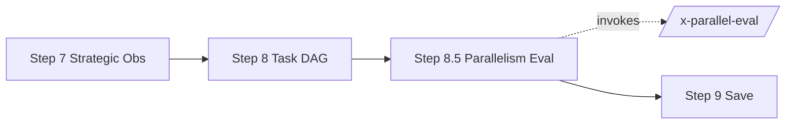

# História: `x-epic-map` integra `/x-parallel-eval` (Step 8.5)

**ID:** story-0041-0005
**Chave Jira:** —
**Status:** Concluída

## 1. Dependências

| Blocked By | Blocks |
| :--- | :--- |
| story-0041-0004 | story-0041-0006, story-0041-0007 |

## 2. Regras Transversais Aplicáveis

| ID | Título |
| :--- | :--- |
| RULE-005 | Degrade with Warning |
| RULE-006 | Backward Compatibility |
| RULE-008 | Output Determinístico |

## 3. Descrição

Como **executor de `/x-epic-map`**, eu quero que o map gerado contenha uma seção `## 8.5 Restrições de Paralelismo` produzida invocando `/x-parallel-eval --scope=epic`, para que reviewers e skills downstream vejam diretamente quais pares de stories da mesma fase precisam ser serializados e por quê.

A invocação acontece após o Step 8 (task-level dependency graph) e antes do Step 9 (save). Se a skill `/x-parallel-eval` não estiver disponível ou retornar exit code ≥ 1, o Step 8.5 emite a seção com aviso "análise pulada" mas NÃO bloqueia a geração do map (RULE-006).

### 3.1 Mudanças no SKILL.md

- Novo Step 8.5 "Parallelism Conflict Analysis" entre Step 8 e Step 9
- Workflow comentário documentando fail-open behavior
- Output do map ganha seção 8.5 com matriz de colisão e grupos serializados

### 3.2 Atualizar template

- `_TEMPLATE-IMPLEMENTATION-MAP.md` ganha placeholder para seção 8.5

## 3.5 Entrega de Valor

- **Valor Principal:** Implementation Maps passam a documentar restrições de paralelismo automaticamente; reviewers veem o risco no momento da aprovação.
- **Métrica de Sucesso:** Re-rodar `x-epic-map` em epic-0040 produz map que mantém todas as fases atuais + nova seção 8.5 com 0 conflitos detectados.
- **Impacto no Negócio:** Documenta o "porquê" da serialização forçada, evitando que reviewers re-introduzam paralelismo perigoso ao editar o map manualmente.

## 4. Definições de Qualidade Locais

### DoR Local
- [ ] story-0041-0004 mergeada
- [ ] Template `_TEMPLATE-IMPLEMENTATION-MAP.md` revisado para inserção do placeholder

### DoD Local
- [ ] `x-epic-map/SKILL.md` com Step 8.5 documentado
- [ ] Template atualizado
- [ ] Integration test: re-gerar map de fixture epic-0040-mock e validar seção 8.5
- [ ] Fail-open testado (skill ausente → seção emite aviso, map continua)

## 5. Contratos de Dados

### 5.1 Output da seção 8.5

```markdown
## 8.5 Restrições de Paralelismo

> Análise gerada por /x-parallel-eval em <timestamp omitido para determinismo>.

**Conflitos detectados:** 2 hard, 1 regen, 0 soft

### 8.5.1 Pares Serializados Dentro da Fase

| Fase | A | B | Categoria | Motivo |
| :--- | :--- | :--- | :--- | :--- |

### 8.5.2 Recomendação de Reagrupamento

Fase 3 originalmente: [story-X, story-Y, story-Z] paralelas
Após análise: [story-X || (story-Y → story-Z)]
```

## 6. Diagramas

### 6.1 Pipeline Atualizado



## 7. Critérios de Aceite (Gherkin)

```gherkin
Cenario: Map sem colisões mantém paralelismo (degenerate)
  DADO um épico cujas stories paralelas não compartilham arquivos write
  QUANDO executamos /x-epic-map
  ENTÃO seção 8.5 é gerada com "Conflitos detectados: 0"
  E nenhuma story é movida para outro grupo

Cenario: Map com hard conflict serializa stories (happy path)
  DADO 2 stories da Fase 2 que escrevem em SettingsAssembler.java
  QUANDO executamos /x-epic-map
  ENTÃO seção 8.5.1 lista o par
  E seção 8.5.2 mostra reagrupamento serializando os 2

Cenario: /x-parallel-eval ausente não bloqueia map (RULE-006, fail-open)
  DADO ambiente sem /x-parallel-eval registrada
  QUANDO executamos /x-epic-map
  ENTÃO seção 8.5 contém "análise pulada — /x-parallel-eval não disponível"
  E o map é salvo com sucesso

Cenario: Output determinístico (RULE-008)
  DADO o mesmo épico
  QUANDO executamos /x-epic-map duas vezes
  ENTÃO seções 8.5 são byte-identical exceto pelo timestamp comentário
```

### 7.1 Scenario Ordering (TPP)
degenerate → happy path → fail-open → determinismo.

### 7.2 Mandatory Scenario Categories
- [x] Degenerate, Happy path, Backward compat (fail-open), Determinismo

## 8. Tasks

### TASK-0041-0005-001: Atualizar SKILL.md de x-epic-map com Step 8.5

- **Layer:** Doc
- **Test Type:** Verification
- **Size:** S
- **Dependencies:** —
- **Branch:** `feature/task-0041-0005-001-skill-update`
- **Files:**
  - `java/src/main/resources/targets/claude/skills/core/plan/x-epic-map/SKILL.md`
- **Acceptance Criteria:**
  - [ ] Step 8.5 documentado com fail-open behavior
  - [ ] Knowledge Pack Reference para `parallelism-heuristics`

### TASK-0041-0005-002: Atualizar template _TEMPLATE-IMPLEMENTATION-MAP.md

- **Layer:** Doc
- **Test Type:** Verification
- **Size:** S
- **Dependencies:** TASK-0041-0005-001
- **Branch:** `feature/task-0041-0005-002-template`
- **Files:**
  - `java/src/main/resources/shared/templates/_TEMPLATE-IMPLEMENTATION-MAP.md`
- **Acceptance Criteria:**
  - [ ] Placeholder de seção 8.5 inserido
  - [ ] Comentário explica fail-open

### TASK-0041-0005-003: Integration test contra fixture epic-0040-mock

- **Layer:** Test
- **Test Type:** Integration
- **Size:** M
- **Dependencies:** TASK-0041-0005-002
- **Branch:** `feature/task-0041-0005-003-it`
- **Files:**
  - `java/src/test/java/dev/iadev/parallelism/EpicMapStep85IT.java`
- **Acceptance Criteria:**
  - [ ] Roda /x-epic-map em fixture com colisão sintética
  - [ ] Valida seção 8.5 contém o par esperado
  - [ ] Valida fail-open quando skill ausente

## File Footprint

### write:
- `java/src/main/resources/targets/claude/skills/core/plan/x-epic-map/SKILL.md`
- `java/src/main/resources/shared/templates/_TEMPLATE-IMPLEMENTATION-MAP.md`
- `java/src/test/java/dev/iadev/parallelism/EpicMapStep85IT.java`

### read:
- `java/src/main/resources/targets/claude/skills/core/plan/x-parallel-eval/SKILL.md`
- `java/src/main/java/dev/iadev/parallelism/cli/ParallelEvalCli.java`

### regen:
- `.claude/skills/x-epic-map/SKILL.md`
- `.claude/templates/_TEMPLATE-IMPLEMENTATION-MAP.md`
