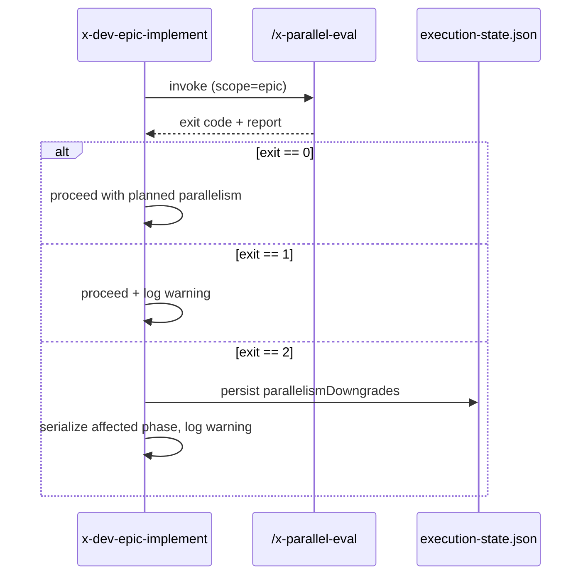

# História: Gate em `x-dev-epic-implement` e `x-dev-story-implement`

**ID:** story-0041-0006
**Chave Jira:** —
**Status:** Concluida

## 1. Dependências

| Blocked By | Blocks |
| :--- | :--- |
| story-0041-0005 | story-0041-0008 |

## 2. Regras Transversais Aplicáveis

| ID | Título |
| :--- | :--- |
| RULE-005 | Degrade with Warning |
| RULE-006 | Backward Compatibility |
| RULE-007 | Source of Truth: Resources |

## 3. Descrição

Como **executor de `x-dev-epic-implement`**, eu quero que antes de disparar worktrees em paralelo a skill execute `/x-parallel-eval --scope=epic` e, em caso de colisão hard ou regen, **rebaixe automaticamente o paralelismo para serial dentro da fase afetada**, exibindo um aviso explicativo. A execução NÃO aborta — degrada e segue.

O mesmo gate é adicionado a `x-dev-story-implement` antes de paralelizar tasks via `/x-parallel-eval --scope=task`.

### 3.1 Comportamento

| Situação | Ação |
| :--- | :--- |
| Exit 0 (no conflicts) | Procede com paralelismo planejado |
| Exit 1 (warnings — footprint ausente) | Procede com paralelismo + log de aviso "footprint incompleto, risco residual" |
| Exit 2 (hard/regen conflicts) | Rebaixa fase afetada para serial; log de aviso visível com tabela de pares |

### 3.2 Mudanças nos SKILL.md

- `x-dev-epic-implement`: nova Phase 0.5 "Parallelism Pre-Flight" entre Phase 0 (validate) e Phase 1 (load map)
- `x-dev-story-implement`: nova Phase 1.5 antes de paralelizar tasks
- Ambas chamam `/x-parallel-eval` via subprocess shell

## 3.5 Entrega de Valor

- **Valor Principal:** Conflitos de merge causados por paralelismo incorreto deixam de acontecer em runtime — gate detecta antes de bifurcar worktrees.
- **Métrica de Sucesso:** 0 incidentes de merge conflict reportados pela equipe em épicos executados após esta release (medido manualmente nas próximas 4 semanas pós-deploy).
- **Impacto no Negócio:** Reduz retrabalho de resolução de conflitos; protege execução paralela como caminho seguro.

## 4. Definições de Qualidade Locais

### DoR Local
- [ ] story-0041-0005 mergeada
- [ ] Política degrade-with-warning confirmada (vs. abort)

### DoD Local
- [x] `x-dev-epic-implement/SKILL.md` com Phase 0.5
- [x] `x-dev-story-implement/SKILL.md` com Phase 1.5
- [x] Integration test simulando colisão e validando que a fase é rebaixada
- [x] Aviso de degradação aparece no execution-state.json (campo `parallelismDowngrades`)

## 5. Contratos de Dados

### 5.1 Output do gate (logs)

```
[parallelism-gate] /x-parallel-eval --scope=epic --epic plans/epic-XXXX exit=2
[parallelism-gate] WARNING: 1 hard conflict detected. Phase 3 downgraded from parallel to serial.
[parallelism-gate] Affected pair: story-XXXX-0006 ↔ story-XXXX-0007 (shared write: SettingsAssembler.java)
[parallelism-gate] Continuing execution with adjusted plan.
```

### 5.2 Persistência em execution-state.json

```json
{
  "parallelismDowngrades": [
    {
      "phase": 3,
      "originalGroup": ["story-XXXX-0006", "story-XXXX-0007", "story-XXXX-0008"],
      "adjustedSequence": [["story-XXXX-0008"], ["story-XXXX-0006"], ["story-XXXX-0007"]],
      "reason": "hard conflict on SettingsAssembler.java",
      "evaluatedAt": "..."
    }
  ]
}
```

## 6. Diagramas

### 6.1 Fluxo do Gate



## 7. Critérios de Aceite (Gherkin)

```gherkin
Cenario: Sem colisões procede normal (degenerate)
  DADO um épico cujo /x-parallel-eval retorna exit 0
  QUANDO executamos /x-dev-epic-implement
  ENTÃO o paralelismo planejado é mantido
  E nenhum aviso de degradação aparece

Cenario: Hard conflict rebaixa fase para serial (happy path)
  DADO um épico cujo Step 8.5 reporta hard conflict entre 2 stories da Fase 3
  QUANDO executamos /x-dev-epic-implement
  ENTÃO a Fase 3 é executada serialmente
  E execution-state.json contém parallelismDowngrades com motivo
  E aviso visível é logado

Cenario: Warnings (footprint legacy) procedem com aviso (RULE-006)
  DADO um épico com 1 story sem File Footprint
  QUANDO executamos /x-dev-epic-implement
  ENTÃO paralelismo é mantido
  E log avisa "risco residual: footprint incompleto"

Cenario: /x-parallel-eval ausente não bloqueia (fail-open)
  DADO ambiente sem /x-parallel-eval registrada
  QUANDO executamos /x-dev-epic-implement
  ENTÃO log avisa "gate de paralelismo pulado"
  E execução prossegue normalmente

Cenario: x-dev-story-implement aplica gate em tasks (boundary)
  DADO uma story cujas 2 tasks da Fase 1 escrevem no mesmo arquivo
  QUANDO executamos /x-dev-story-implement
  ENTÃO as 2 tasks são serializadas
  E execution-state da story persiste o downgrade
```

### 7.1 Scenario Ordering (TPP)
degenerate → happy path (downgrade) → warning (legacy) → fail-open → boundary (story scope).

### 7.2 Mandatory Scenario Categories
- [x] Degenerate, Happy path, Backward compat, Fail-open, Boundary

## 8. Tasks

### TASK-0041-0006-001: Phase 0.5 em x-dev-epic-implement

- **Layer:** Doc
- **Test Type:** Verification
- **Size:** S
- **Dependencies:** —
- **Branch:** `feature/task-0041-0006-001-epic-impl-phase`
- **Files:**
  - `java/src/main/resources/targets/claude/skills/core/dev/x-epic-implement/SKILL.md`
- **Acceptance Criteria:**
  - [ ] Phase 0.5 documentada com tabela de exit codes → ações
  - [ ] Pseudocode shell de invocação documentado

### TASK-0041-0006-002: Phase 1.5 em x-dev-story-implement

- **Layer:** Doc
- **Test Type:** Verification
- **Size:** S
- **Dependencies:** —
- **Branch:** `feature/task-0041-0006-002-story-impl-phase`
- **Files:**
  - `java/src/main/resources/targets/claude/skills/core/dev/x-story-implement/SKILL.md`
- **Acceptance Criteria:**
  - [ ] Phase 1.5 documentada análoga à Phase 0.5

### TASK-0041-0006-003: Estender ExecutionState com parallelismDowngrades

- **Layer:** Domain
- **Test Type:** Unit
- **Size:** M
- **Dependencies:** TASK-0041-0006-001
- **Branch:** `feature/task-0041-0006-003-execution-state`
- **Files:**
  - `java/src/main/java/dev/iadev/checkpoint/ExecutionState.java`
  - `java/src/main/java/dev/iadev/checkpoint/ParallelismDowngrade.java`
  - `java/src/test/java/dev/iadev/checkpoint/ExecutionStateTest.java`
- **Acceptance Criteria:**
  - [ ] Novo campo opcional `parallelismDowngrades: List<ParallelismDowngrade>`
  - [ ] Backward compat: ExecutionState antigo (sem o campo) ainda parseia
  - [ ] ≥ 95% cobertura

### TASK-0041-0006-004: Integration test do gate

- **Layer:** Test
- **Test Type:** Integration
- **Size:** M
- **Dependencies:** TASK-0041-0006-003
- **Branch:** `feature/task-0041-0006-004-gate-it`
- **Files:**
  - `java/src/test/java/dev/iadev/parallelism/EpicImplementGateIT.java`
  - `java/src/test/java/dev/iadev/parallelism/StoryImplementGateIT.java`
- **Acceptance Criteria:**
  - [ ] Cenário com hard conflict valida downgrade persistido
  - [ ] Cenário fail-open valida log e continuidade
  - [ ] Cenário sem conflito valida ausência de downgrade

## File Footprint

### write:
- `java/src/main/resources/targets/claude/skills/core/dev/x-epic-implement/SKILL.md`
- `java/src/main/resources/targets/claude/skills/core/dev/x-story-implement/SKILL.md`
- `java/src/main/java/dev/iadev/checkpoint/ExecutionState.java`
- `java/src/main/java/dev/iadev/checkpoint/ParallelismDowngrade.java`
- `java/src/test/java/dev/iadev/checkpoint/ExecutionStateTest.java`
- `java/src/test/java/dev/iadev/parallelism/EpicImplementGateIT.java`
- `java/src/test/java/dev/iadev/parallelism/StoryImplementGateIT.java`

### read:
- `java/src/main/java/dev/iadev/parallelism/cli/ParallelEvalCli.java`
- `java/src/main/resources/targets/claude/skills/core/plan/x-parallel-eval/SKILL.md`

### regen:
- `.claude/skills/x-dev-epic-implement/SKILL.md`
- `.claude/skills/x-dev-story-implement/SKILL.md`
