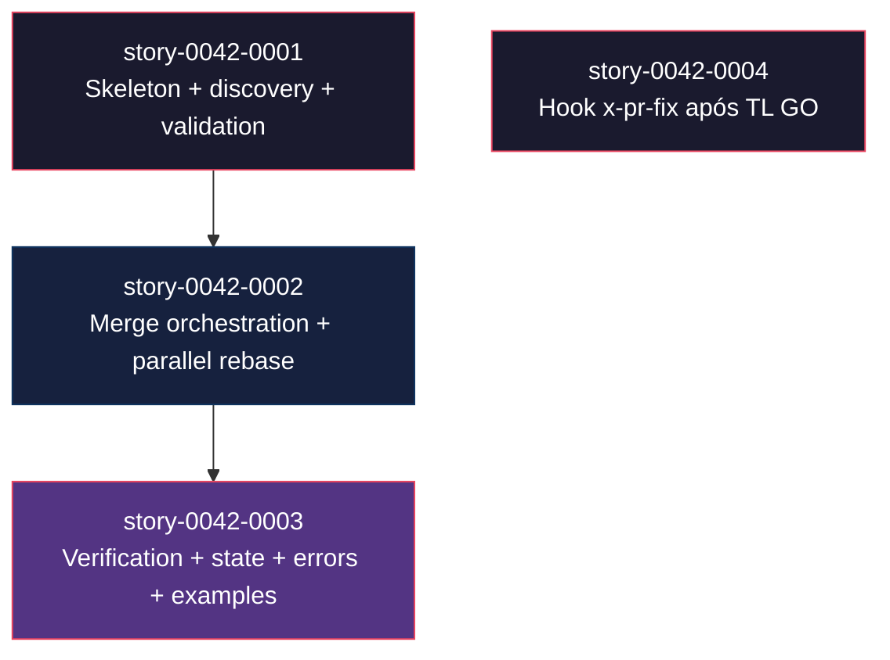
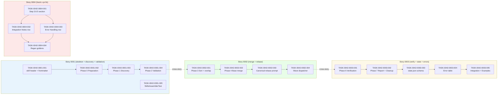

# Mapa de Implementação — EPIC-0042 (Merge-Train Automation + Auto PR-Fix Hook)

**Gerado a partir das dependências BlockedBy/Blocks de cada história do epic-0042.**

---

## 1. Matriz de Dependências

| Story | Título | Chave Jira | Blocked By | Blocks | Status |
| :--- | :--- | :--- | :--- | :--- | :--- |
| [story-0042-0001](./story-0042-0001.md) | Skill `x-pr-merge-train` — skeleton + discovery + validation | — | — | story-0042-0002, story-0042-0003 | Concluída |
| [story-0042-0002](./story-0042-0002.md) | Merge orchestration + parallel rebase subagents | — | story-0042-0001 | story-0042-0003 | Concluída |
| [story-0042-0003](./story-0042-0003.md) | Verification + state.json + error handling + examples | — | story-0042-0002 | — | Concluída |
| [story-0042-0004](./story-0042-0004.md) | Hook `x-pr-fix` após TL GO em `x-story-implement` | — | — | — | Concluída |

> **Valores de Status:** `Pendente` (padrão) · `Em Andamento` · `Concluída` · `Falha` · `Bloqueada` · `Parcial`

> **Nota:** story-0042-0004 é independente das demais (toca apenas `x-story-implement/SKILL.md`), permitindo execução paralela com story-0042-0001.

---

## 2. Fases de Implementação

> As histórias são agrupadas em fases. Dentro de cada fase, as histórias podem ser implementadas **em paralelo**. Uma fase só pode iniciar quando todas as dependências das fases anteriores estiverem concluídas.

```
╔══════════════════════════════════════════════════════════════════════════╗
║                   FASE 0 — Fundação + Hook Independente (paralelo)      ║
║                                                                         ║
║   ┌────────────────────┐              ┌────────────────────┐            ║
║   │  story-0042-0001   │              │  story-0042-0004   │            ║
║   │  skeleton + disc.  │              │  hook x-pr-fix 3.6.5│           ║
║   │  + validation      │              │  em x-story-impl.  │            ║
║   └────────┬───────────┘              └────────────────────┘            ║
╚════════════╪════════════════════════════════════════════════════════════╝
             │
             ▼
╔══════════════════════════════════════════════════════════════════════════╗
║                   FASE 1 — Merge + Rebase Paralelo                      ║
║                                                                         ║
║   ┌─────────────────────────────────────────────────────────────┐       ║
║   │  story-0042-0002  Phases 3–5: sort/overlap + base merge     │       ║
║   │                   + canonical rebase prompt + dispatcher    │       ║
║   │  (← story-0042-0001)                                        │       ║
║   └────────────────────────────┬────────────────────────────────┘       ║
╚════════════════════════════════╪════════════════════════════════════════╝
                                 │
                                 ▼
╔══════════════════════════════════════════════════════════════════════════╗
║                   FASE 2 — Verification, State, Error, Examples         ║
║                                                                         ║
║   ┌─────────────────────────────────────────────────────────────┐       ║
║   │  story-0042-0003  Phases 6–7: verification + report +       │       ║
║   │                   cleanup; state.json schema; error table;  │       ║
║   │                   integration + examples                    │       ║
║   │  (← story-0042-0002)                                        │       ║
║   └─────────────────────────────────────────────────────────────┘       ║
╚══════════════════════════════════════════════════════════════════════════╝
```

---

## 3. Caminho Crítico

> O caminho crítico (a sequência mais longa de dependências) determina o tempo mínimo de implementação do projeto.

```
story-0042-0001 ──→ story-0042-0002 ──→ story-0042-0003

(story-0042-0004 é paralela ao caminho crítico; entra na Fase 0 e termina cedo)
   Fase 0              Fase 1               Fase 2
```

**3 fases no caminho crítico, 3 histórias na cadeia mais longa (0001 → 0002 → 0003).**

Atrasos em story-0042-0001 ou 0042-0002 afetam diretamente o tempo total do épico porque 0042-0003 depende de ambos. story-0042-0004 pode absorver atrasos sem impacto no caminho crítico (é "folha" no grafo de dependências).

---

## 4. Grafo de Dependências (Mermaid)



---

## 5. Resumo por Fase

| Fase | Histórias | Camada | Paralelismo | Pré-requisito |
| :--- | :--- | :--- | :--- | :--- |
| 0 | story-0042-0001, story-0042-0004 | Skill documentation (core/pr + core/dev) | 2 paralelas | — |
| 1 | story-0042-0002 | Skill documentation (core/pr) | 1 | Fase 0 (apenas 0001) concluída |
| 2 | story-0042-0003 | Skill documentation (core/pr) + helpers opcionais | 1 | Fase 1 concluída |

**Total: 4 histórias em 3 fases.**

> **Nota:** A Fase 0 é paralela em 2 ramos; o ramo de 0042-0004 termina antes e não influencia a Fase 1. A Fase 1 e 2 são seriais porque cada uma estende o mesmo SKILL.md da story anterior (conflitos inevitáveis em paralelismo).

---

## 6. Detalhamento por Fase

### Fase 0 — Fundação + Hook Independente

| Story | Escopo Principal | Artefatos Chave |
| :--- | :--- | :--- |
| story-0042-0001 | Skill skeleton + discovery + validation (Phases 0–2) | `core/pr/x-pr-merge-train/SKILL.md` (parcial); `SkillsAssemblerTest.listCoreSkills_includesMergeTrain` |
| story-0042-0004 | Step 3.6.5 em x-story-implement + Integration Notes + Error Handling | Diff em `core/dev/x-story-implement/SKILL.md` |

**Entregas da Fase 0:**

- Skill `x-pr-merge-train` descobrível (presente em `.claude/skills/`)
- Lista de PRs validada determinísticamente com 6 códigos VETO documentados
- Hook automático `x-pr-fix` em `x-story-implement` após TL=GO operacional (fluxo 3.6 → 3.6.5 → 3.7)

### Fase 1 — Merge + Rebase Paralelo

| Story | Escopo Principal | Artefatos Chave |
| :--- | :--- | :--- |
| story-0042-0002 | Phases 3 (sort/overlap), 4 (base merge), 5 (parallel rebase subagents) | `core/pr/x-pr-merge-train/SKILL.md` (Phases 3–5); prompt canônico embutindo `README.md:810-818` byte-a-byte |

**Entregas da Fase 1:**

- Merge sequencial da base via `gh pr merge --squash --auto`
- Workers paralelos de rebase/regen/push via SUBAGENT-GENERAL (siblings em UMA mensagem)
- Precheck de overlap neutering paralelismo quando apropriado
- Goldens resolvidos com `--ours` + regen; código aborta com `CODE_CONFLICT_NEEDS_HUMAN`

### Fase 2 — Verification, State, Error, Examples

| Story | Escopo Principal | Artefatos Chave |
| :--- | :--- | :--- |
| story-0042-0003 | Phases 6 (verification), 7 (report+cleanup); state.json schema; error table; integration; examples | `core/pr/x-pr-merge-train/SKILL.md` (Phases 6–7 + seções finais); exemplos executáveis |

**Entregas da Fase 2:**

- Trains resumíveis via `--resume` com state.json atomicamente escrito
- Verificação final de `develop` (git fetch + mvn compile + mvn test)
- Report.md auditável em `plans/merge-train/<id>/report.md`
- 11+ códigos de erro documentados com remediação acionável
- Worktree preservado em falha; cleanup automático em sucesso

---

## 7. Observações Estratégicas

### Gargalo Principal

**story-0042-0002** é o maior gargalo: bloqueia 0042-0003 e contém o prompt canônico do subagent de rebase (o artefato crítico do épico). A RULE-005 (verbatim regen block) é frágil — qualquer deriva do `README.md:810-818` quebra o determinismo. Investir tempo em revisão humana do prompt nesta story paga-se em todas as execuções futuras do train.

### Histórias Folha (sem dependentes)

- **story-0042-0003** (fim do caminho crítico do ramo principal) — não bloqueia nenhuma outra
- **story-0042-0004** (hook em x-story-implement) — totalmente independente, não bloqueia nem é bloqueada

Ambas podem absorver atrasos sem impactar outras frentes. story-0042-0004 é a candidata ideal para paralelizar com story-0042-0001 na Fase 0.

### Otimização de Tempo

- **Máximo paralelismo:** Fase 0 com 2 stories em paralelo (0001 + 0004). Alocar dois executores independentes.
- **Começar imediatamente:** story-0042-0001 (fundação do train) e story-0042-0004 (hook). Sem dependências externas além do merge do PR deste épico em `develop`.
- **Alocação de equipes:** um executor focado no eixo `x-pr-merge-train` (0001 → 0002 → 0003) sequencial; um segundo executor entrega 0042-0004 em paralelo.

### Dependências Cruzadas

Não há dependências cruzadas entre 0042-0004 e o eixo principal — o hook em `x-story-implement` não depende da skill `x-pr-merge-train` para funcionar. Em runtime, o operador pode usar o hook sem jamais invocar `x-pr-merge-train`, e vice-versa. Essa independência é uma propriedade deliberada: cada artefato entrega valor isoladamente.

### Marco de Validação Arquitetural

**story-0042-0001** serve como checkpoint arquitetural. Valida:

- Taxonomia `core/pr/` correta para a skill (ADR-0003)
- Frontmatter com `allowed-tools` incluindo `Skill` e `Agent` (pré-requisito para Rule 13 Pattern 1 e 2)
- Descoberta via `SkillsAssemblerTest` funcionando
- Padrão de invocação INLINE-SKILL para `x-git-worktree` validado
- Phase 0 (detect-context) funcional — pré-requisito para Rule 14 §3 (non-nesting)

Se qualquer uma dessas premissas falhar em 0042-0001, revisitar o design antes de expandir escopo com 0042-0002.

---

## 8. Dependências entre Tasks (Cross-Story)

> Esta seção é gerada automaticamente quando as histórias contêm tasks formais com IDs `TASK-XXXX-YYYY-NNN`. Todas as quatro histórias do epic-0042 declaram tasks formais, portanto esta seção se aplica.

### 8.1 Dependências Cross-Story entre Tasks

| Task | Depends On | Story Source | Story Target | Tipo |
| :--- | :--- | :--- | :--- | :--- |
| TASK-0042-0002-001 | TASK-0042-0001-004 | story-0042-0002 | story-0042-0001 | config (Phase 3 precisa de Phase 2 validada) |
| TASK-0042-0003-001 | TASK-0042-0002-004 | story-0042-0003 | story-0042-0002 | config (Phase 6 precisa de Phase 5 Dispatcher) |

> **Validação RULE-012:** Dependências cross-story são consistentes com as dependências BlockedBy/Blocks declaradas em §1. Nenhum erro ou warning.

### 8.2 Ordem de Merge (Topological Sort)

| Ordem | Task ID | Story | Parallelizável Com | Fase |
| :--- | :--- | :--- | :--- | :--- |
| 1 | TASK-0042-0001-001 | 0042-0001 | TASK-0042-0001-005, TASK-0042-0004-001 | 0 |
| 1 | TASK-0042-0001-005 | 0042-0001 | TASK-0042-0001-001, TASK-0042-0004-001 | 0 |
| 1 | TASK-0042-0004-001 | 0042-0004 | TASK-0042-0001-001, TASK-0042-0001-005 | 0 |
| 2 | TASK-0042-0001-002 | 0042-0001 | TASK-0042-0004-002, TASK-0042-0004-003 | 0 |
| 2 | TASK-0042-0004-002 | 0042-0004 | TASK-0042-0001-002, TASK-0042-0004-003 | 0 |
| 2 | TASK-0042-0004-003 | 0042-0004 | TASK-0042-0001-002, TASK-0042-0004-002 | 0 |
| 3 | TASK-0042-0001-003 | 0042-0001 | — | 0 |
| 4 | TASK-0042-0001-004 | 0042-0001 | TASK-0042-0004-004 | 0 |
| 4 | TASK-0042-0004-004 | 0042-0004 | TASK-0042-0001-004 | 0 |
| 5 | TASK-0042-0002-001 | 0042-0002 | — | 1 |
| 6 | TASK-0042-0002-002 | 0042-0002 | — | 1 |
| 7 | TASK-0042-0002-003 | 0042-0002 | — | 1 |
| 8 | TASK-0042-0002-004 | 0042-0002 | — | 1 |
| 9 | TASK-0042-0003-001 | 0042-0003 | — | 2 |
| 10 | TASK-0042-0003-002 | 0042-0003 | — | 2 |
| 11 | TASK-0042-0003-003 | 0042-0003 | — | 2 |
| 12 | TASK-0042-0003-004 | 0042-0003 | — | 2 |
| 13 | TASK-0042-0003-005 | 0042-0003 | — | 2 |

**Total: 18 tasks em 3 fases de execução.**

### 8.3 Grafo de Dependências entre Tasks (Mermaid)


