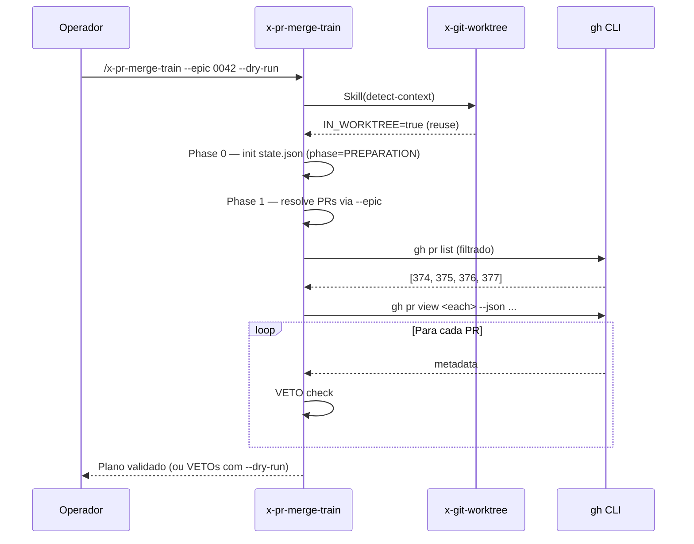

# História: Skill `x-pr-merge-train` — skeleton + discovery + validation

**ID:** story-0042-0001
**Chave Jira:** —
**Status:** Concluída

## 1. Dependências

| Blocked By | Blocks |
| :--- | :--- |
| — | story-0042-0002, story-0042-0003 |

## 2. Regras Transversais Aplicáveis

> Referência às regras definidas no Épico (seção 4).

| ID | Título |
| :--- | :--- |
| RULE-001 | Source-of-Truth Invariant |
| RULE-002 | Rule 13 Invocation Patterns |
| RULE-003 | Rule 14 Worktree Lifecycle |
| RULE-006 | Atomic, Reversible Commits |

## 3. Descrição

Como **engenheiro de plataforma fechando um épico**, eu quero que a nova skill `x-pr-merge-train` seja descobrível, resolva a lista de PRs do train a partir de um de três modos (`--prs`, `--epic`, `--pattern`) e valide cada PR ANTES de iniciar qualquer merge, garantindo que um train nunca começa com input quebrado.

Esta história entrega o esqueleto funcional da skill — frontmatter, Triggers, Parameters, Workflow overview e Phases 0–2 (Preparation, Discovery, Validation). A skill em si é prompt-driven (um `SKILL.md` sob `core/pr/x-pr-merge-train/`). A validação é feita pela `SkillsAssemblerTest.listCoreSkills_includesMergeTrain`, que prova que a skill é descobrível no pipeline de assemblagem de `.claude/skills/`. As fases posteriores (merge, rebase, state, errors) são entregues pelas stories subsequentes — esta story é o walking skeleton.

### 3.1 Estrutura do SKILL.md

- Diretório canônico: `java/src/main/resources/targets/claude/skills/core/pr/x-pr-merge-train/SKILL.md`
- Frontmatter YAML: `name`, `description`, `user-invocable: true`, `allowed-tools: Read, Write, Edit, Bash, Grep, Glob, Skill, Agent` (Agent por causa de SUBAGENT-GENERAL para workers de rebase nas stories seguintes)
- `argument-hint: "[--prs N,M,...] [--epic ID] [--pattern regex] [--max-parallel N] [--dry-run] [--resume]"`
- Seções: Global Output Policy, Purpose, Triggers (`/x-pr-merge-train`), Parameters, Workflow overview, Phase 0 (Preparation), Phase 1 (Discovery), Phase 2 (Validation)

### 3.2 Phase 0 — Preparation

- `x-git-worktree detect-context` via INLINE-SKILL para decidir se cria worktree novo (`TRAIN_OWNS_WORKTREE=true`) ou reutiliza o atual (`TRAIN_OWNS_WORKTREE=false`)
- Inicialização do diretório `plans/merge-train/<train-id>/` com stub de `state.json` (phase=`PREPARATION`)
- `train-id` derivado de `${epic-id}-${timestamp}` ou `manual-${timestamp}` quando em modo `--prs`

### 3.3 Phase 1 — Discovery

Dispatch exclusivo entre três modos (mutuamente exclusivos):

- `--prs 374,375,376`: lista literal; ordenação preservada como declarada
- `--epic 0042`: lê `plans/epic-0042/execution-state.json` no formato v2.0, percorre `stories[storyId].tasks[TASK-ID].prNumber`, coleta apenas tasks com `prNumber` preenchido e ordena de forma determinística por `storyId` ascendente e depois `TASK-ID` ascendente antes de emitir a lista de PRs
- `--pattern "feat/task-0042-"`: enumera via `gh pr list --search` e ordena por `createdAt` ascendente

Ambiguidade (nenhum ou mais de um modo) aborta com `MODE_AMBIGUOUS`.

### 3.4 Phase 2 — Validation

Para cada PR descoberto, invoca `gh pr view <pr> --json state,mergeable,isDraft,reviewDecision,baseRefName,headRefName,statusCheckRollup`. Emite VETO quando:

- `PR_DRAFT`: `isDraft=true`
- `PR_BASE_MISMATCH`: `baseRefName != "develop"`
- `PR_NOT_APPROVED`: `reviewDecision != "APPROVED"`
- `PR_CI_FAILING`: `statusCheckRollup` contém `FAILURE` ou `ERROR`
- `PR_MERGE_CONFLICT`: `mergeable == "CONFLICTING"`
- `PR_CLOSED`: `state != "OPEN"`

Qualquer VETO em modo normal aborta o train antes da Phase 3. Em `--dry-run`, VETOs são reportados mas a skill continua exibindo o plano completo para auditoria.

## 3.5 Entrega de Valor

- **Valor Principal:** Operador pode invocar `/x-pr-merge-train --dry-run --epic 0042` e obter, antes de tocar em qualquer PR, um plano determinístico mostrando ordem, status e validade de cada PR. Trains com input quebrado abortam antes do Phase 4 (merge) — zero corrupção de `develop`.
- **Métrica de Sucesso:** 100% das invocações que contenham ao menos um PR com VETO abortam antes da Phase 4 (fora de `--dry-run`). `SkillsAssemblerTest.listCoreSkills_includesMergeTrain` passa.
- **Impacto no Negócio:** Pré-requisito para que as stories 0002 e 0003 operem sobre uma lista validada. Elimina a classe inteira de falhas em que um train de 4 PRs quebra no 3º por um CI vermelho só descoberto após 2 merges.

## 4. Definições de Qualidade Locais

### DoR Local (Definition of Ready)

- [ ] Epic-0042 merged/aprovado com as 7 Rules vigentes
- [ ] `x-git-worktree detect-context` confirmado funcional (é Operation 5 da skill, entregue por story-0037-0002)
- [ ] Taxonomia `core/pr/` confirmada como destino correto (ADR-0003)

### DoD Local (Definition of Done)

- [ ] `java/src/main/resources/targets/claude/skills/core/pr/x-pr-merge-train/SKILL.md` criado com as seções listadas em 3.1
- [ ] Phases 0–2 escritas e auditáveis por parser de Rule 13 (zero bare-slash em contexto de delegação)
- [ ] `SkillsAssemblerTest.listCoreSkills_includesMergeTrain` verde
- [ ] Golden diffs de `.claude/skills/x-pr-merge-train/SKILL.md` regenerados via `mvn process-resources`
- [ ] Pelo menos 1 teste automatizado (o `SkillsAssemblerTest` mencionado) validando o critério de aceite principal
- [ ] Smoke test passando (`mvn test` verde no pacote `dev.iadev.targets.claude.skills`)

### Global Definition of Done (DoD)

> Copiada do Épico. Mantida aqui para referência rápida durante code review.

- **Cobertura:** ≥ 95% Line, ≥ 90% Branch em helpers Java novos
- **Testes Automatizados:** unit tests; `SkillsAssemblerTest`; golden diff tests
- **Relatório de Cobertura:** JaCoCo
- **Documentação:** SKILL.md da nova skill, entrada em CHANGELOG Unreleased
- **Persistência:** não se aplica (esta story não toca state.json)
- **Performance:** Phase 1+2 completam em < 15s para um train de 10 PRs em conexão normal

## 5. Contratos de Dados (Data Contract)

> Esta história produz uma skill prompt-driven. Os "contratos" são o payload de argumentos CLI e a estrutura do `state.json` inicial.

### 5.1 Argumentos CLI (Inputs)

| Campo | Tipo | M/O | Validações | Exemplo |
| :--- | :--- | :--- | :--- | :--- |
| `--prs` | `String` (lista CSV de inteiros) | O | Inteiros positivos separados por vírgula; mutuamente exclusivo com `--epic` e `--pattern` | `374,375,376` |
| `--epic` | `String` | O | 4 dígitos; mutuamente exclusivo | `0042` |
| `--pattern` | `String` (regex GitHub search) | O | Sintaxe `gh pr list --search`; mutuamente exclusivo | `feat/task-0042-` |
| `--max-parallel` | `Integer` | O | 1 ≤ N ≤ 8; default 3 | `4` |
| `--dry-run` | `Boolean` (flag) | O | — | `--dry-run` |
| `--resume` | `Boolean` (flag) | O | Requer `plans/merge-train/<id>/state.json` existente | `--resume` |

### 5.2 state.json inicial (Output desta Story)

| Campo | Tipo | Sempre presente | Descrição |
| :--- | :--- | :--- | :--- |
| `schemaVersion` | `String` | Sim | Fixo em `"1.0"` nesta release |
| `trainId` | `String` | Sim | `${epic-id}-${timestamp}` ou `manual-${timestamp}` |
| `phase` | `Enum` | Sim | Valores: `PREPARATION`, `DISCOVERY`, `VALIDATION` (até o fim desta story) |
| `worktreeOwnership` | `String` | Sim | `TRAIN_OWNS_WORKTREE` ou `REUSE_PARENT` |
| `prs` | `List<PR>` | Sim | Lista pós-discovery com `number`, `headRefName`, `baseRefName`, `mergeable`, `reviewDecision`, `isDraft`, `state`, `validationStatus` |

### 5.3 Error Codes Mapeados

| Código | Condição | Mensagem (pt-BR) |
| :--- | :--- | :--- |
| `MODE_AMBIGUOUS` | Nenhum ou mais de um de `--prs`/`--epic`/`--pattern` informado | `Informe exatamente um de --prs, --epic ou --pattern.` |
| `EPIC_STATE_MISSING` | `--epic N` informado mas `plans/epic-N/execution-state.json` ausente | `execution-state.json de epic-N não encontrado. Use --prs ou --pattern.` |
| `PR_DRAFT` | PR em draft | `PR #N está em draft.` |
| `PR_BASE_MISMATCH` | PR aponta para base != develop | `PR #N não tem base develop.` |
| `PR_NOT_APPROVED` | PR sem approval | `PR #N não foi aprovado.` |
| `PR_CI_FAILING` | CI vermelha | `PR #N tem CI vermelha.` |
| `PR_MERGE_CONFLICT` | Conflito pré-existente | `PR #N tem conflitos de merge pendentes.` |
| `PR_CLOSED` | state != OPEN | `PR #N não está aberto.` |

### 5.4 Event Schema

> Não se aplica — esta story não emite eventos.

## 6. Diagramas

### 6.1 Fluxo Phase 0 → 2



## 7. Critérios de Aceite (Gherkin)

```gherkin
Cenario: Degenerate - nenhum modo informado
  DADO que o usuario invoca x-pr-merge-train sem --prs, --epic ou --pattern
  QUANDO a Phase 1 Discovery executa
  ENTAO a skill aborta com codigo MODE_AMBIGUOUS
  E a mensagem sugere informar exatamente um dos tres flags

Cenario: Happy path - --prs com 3 PRs abertos, aprovados e mergeable
  DADO 3 PRs #374, #375, #376 abertos, CI green, approved, mergeable, base=develop
  QUANDO a Phase 2 Validation executa
  ENTAO todos sao marcados validationStatus=VALID
  E a skill avanca para Phase 3 (ou reporta plano se --dry-run)

Cenario: Error - um PR em draft
  DADO --prs 374,375,376 onde #376 esta em draft
  QUANDO a Phase 2 Validation executa
  ENTAO VETO e emitido com codigo PR_DRAFT para #376
  E o train aborta antes do Phase 4 (fora de --dry-run)

Cenario: Boundary - --epic cujo execution-state.json nao existe
  DADO plans/epic-0099/execution-state.json ausente
  QUANDO Phase 1 Discovery executa no modo --epic 0099
  ENTAO a skill aborta com codigo EPIC_STATE_MISSING
  E sugere --prs ou --pattern como alternativa
```

### 7.1 Scenario Ordering (TPP)

> Ordem dos cenários: degenerate → happy → error → boundary. Cumpre TPP (transformação mais simples → mais complexa).

### 7.2 Mandatory Scenario Categories

- [x] Degenerate cases (nenhum modo)
- [x] Happy path (3 PRs válidos)
- [x] Error paths (PR em draft)
- [x] Boundary values (epic sem execution-state)

### 7.3 TDD Implementation Notes

- **Double-Loop TDD:** O primeiro cenário Gherkin vira o acceptance test (golden diff do SKILL.md + falha controlada de Phase 1). Os demais guiam unit tests em `SkillsAssemblerTest` e em parsers de argumento.
- O walking skeleton é a própria existência da skill descobrível.

## 8. Tasks

### TASK-0042-0001-001: Criar SKILL.md com frontmatter + Global Output Policy + Purpose + Triggers + Parameters

- **Layer:** Doc
- **Test Type:** Verification
- **Size:** M
- **Dependencies:** —
- **Branch:** `feat/task-0042-0001-001-skill-header`
- **Testability:** Config + VerificationTest
- **Files:**
  - `java/src/main/resources/targets/claude/skills/core/pr/x-pr-merge-train/SKILL.md`
- **Acceptance Criteria:**
  - [ ] Frontmatter YAML com `name`, `description`, `user-invocable: true`, `allowed-tools: Read, Write, Edit, Bash, Grep, Glob, Skill, Agent`
  - [ ] `argument-hint` cobre todos os 6 flags listados em 5.1
  - [ ] Seções Global Output Policy, Purpose, Triggers, Parameters presentes
  - [ ] `grep -n "user-invocable: true" SKILL.md` retorna match

### TASK-0042-0001-002: Adicionar Workflow overview + Phase 0 Preparation

- **Layer:** Doc
- **Test Type:** Verification
- **Size:** M
- **Dependencies:** TASK-0042-0001-001
- **Branch:** `feat/task-0042-0001-002-phase-0`
- **Testability:** Config + VerificationTest
- **Files:**
  - `java/src/main/resources/targets/claude/skills/core/pr/x-pr-merge-train/SKILL.md`
- **Acceptance Criteria:**
  - [ ] Workflow overview enumera Phase 0 → Phase 7 (apenas labels; detalhes nas stories seguintes)
  - [ ] Phase 0 descreve invocação de `x-git-worktree detect-context` via INLINE-SKILL
  - [ ] Phase 0 descreve inicialização de `plans/merge-train/<id>/state.json` com `phase=PREPARATION`
  - [ ] Derivação de `trainId` documentada (`${epic-id}-${timestamp}` ou `manual-${timestamp}`)
  - [ ] Zero bare-slash em contexto de delegação (audit Rule 13 green)

### TASK-0042-0001-003: Adicionar Phase 1 Discovery com os três modos

- **Layer:** Doc
- **Test Type:** Verification
- **Size:** M
- **Dependencies:** TASK-0042-0001-002
- **Branch:** `feat/task-0042-0001-003-phase-1`
- **Testability:** Config + VerificationTest
- **Files:**
  - `java/src/main/resources/targets/claude/skills/core/pr/x-pr-merge-train/SKILL.md`
- **Acceptance Criteria:**
  - [ ] Dispatch `--prs` / `--epic` / `--pattern` documentado como mutuamente exclusivo
  - [ ] Ordenação canônica por modo documentada (preservada / topológica / createdAt ascendente)
  - [ ] Abort com `MODE_AMBIGUOUS` em 0 ou 2+ modos
  - [ ] Abort com `EPIC_STATE_MISSING` quando `--epic` aponta para execution-state inexistente

### TASK-0042-0001-004: Adicionar Phase 2 Validation com 6 VETOs

- **Layer:** Doc
- **Test Type:** Verification
- **Size:** M
- **Dependencies:** TASK-0042-0001-003
- **Branch:** `feat/task-0042-0001-004-phase-2`
- **Testability:** Config + VerificationTest
- **Files:**
  - `java/src/main/resources/targets/claude/skills/core/pr/x-pr-merge-train/SKILL.md`
- **Acceptance Criteria:**
  - [ ] Comando `gh pr view <pr> --json ...` documentado com flags exatas
  - [ ] 6 códigos VETO (`PR_DRAFT`, `PR_BASE_MISMATCH`, `PR_NOT_APPROVED`, `PR_CI_FAILING`, `PR_MERGE_CONFLICT`, `PR_CLOSED`) listados com condição e mensagem
  - [ ] Comportamento VETO em modo normal (abort) vs. `--dry-run` (report-only) documentado
  - [ ] Validação de ordem: Phase 2 não avança para Phase 3 em modo normal se ao menos um PR tem VETO

### TASK-0042-0001-005: Adicionar `SkillsAssemblerTest.listCoreSkills_includesMergeTrain`

- **Layer:** Test
- **Test Type:** Verification
- **Size:** S
- **Dependencies:** —
- **Branch:** `feat/task-0042-0001-005-skills-assembler-test`
- **Testability:** Config + VerificationTest
- **Files:**
  - `java/src/test/java/dev/iadev/targets/claude/skills/SkillsAssemblerTest.java`
- **Acceptance Criteria:**
  - [ ] Novo método `listCoreSkills_includesMergeTrain` asserta presença de `x-pr-merge-train` na lista de skills descobertas
  - [ ] Teste falha em vermelho antes de TASK-0042-0001-001 ser aplicada
  - [ ] Teste passa em verde após o SKILL.md ser criado e `mvn process-resources` executado
