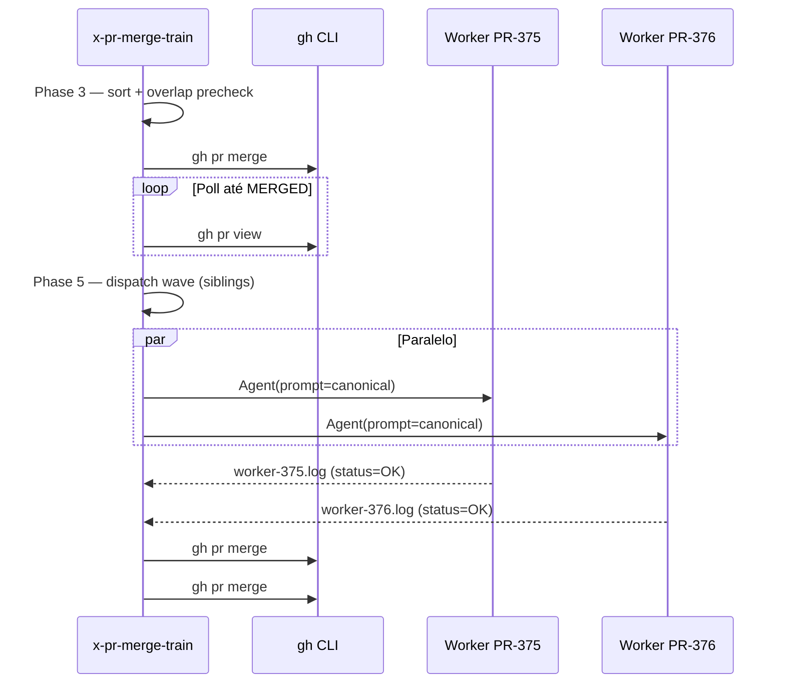

# História: Merge orchestration + parallel rebase subagents

**ID:** story-0042-0002
**Chave Jira:** —
**Status:** Concluída

## 1. Dependências

| Blocked By | Blocks |
| :--- | :--- |
| story-0042-0001 | story-0042-0003 |

## 2. Regras Transversais Aplicáveis

| ID | Título |
| :--- | :--- |
| RULE-001 | Source-of-Truth Invariant |
| RULE-002 | Rule 13 Invocation Patterns |
| RULE-004 | Goldens-Ours-Then-Regen |
| RULE-005 | Goldens Regen Verbatim |
| RULE-006 | Atomic, Reversible Commits |

## 3. Descrição

Como **engenheiro de plataforma fechando um épico**, eu quero que o train faça merge sequencial do PR-base (primeiro PR da lista validada) e depois processe a cauda em ondas paralelas — cada worker rebaseando seu PR sobre `develop` atualizada, regenerando goldens, empurrando com `--force-with-lease` e aguardando `gh pr merge --squash --auto` — para que um train de 4 PRs conclua em minutos em vez de horas.

Esta story entrega as Phases 3, 4 e 5 da skill: Sort + file-overlap precheck (Phase 3), Base PR merge (Phase 4) e Parallel rebase orchestration (Phase 5). O prompt canônico embutido no subagent de rebase é o artefato mais crítico desta história — inclui o bloco de regen de goldens de `README.md:810-818` copiado byte-a-byte (RULE-005) e a lista explícita de "goldens resolvidos com `--ours`, código aborta com `CODE_CONFLICT_NEEDS_HUMAN`" (RULE-004).

### 3.1 Phase 3 — Sort + File-Overlap Precheck

- Reordena a lista validada por `createdAt` ascendente (ou preserva ordem explícita de `--prs`)
- Para cada par `(PR_i, PR_j)`, calcula `gh pr view <pr> --json files --jq '.files[].path'` e verifica interseção
- Se qualquer par tem interseção não-vazia fora de `golden/**`, força `MAX_PARALLEL=1` e registra `NEUTERED_PARALLEL` no state.json (não é erro — apenas telemetria)
- O primeiro PR da lista reordenada é o `BASE_PR`; os demais formam a `TAIL[]`

### 3.2 Phase 4 — Base PR Merge

- `gh pr merge <BASE_PR> --squash --auto --delete-branch` (auto-merge aguarda CI verde)
- Poll com intervalo de 60s via `gh pr view <BASE_PR> --json state,mergeStateStatus` até `state == "MERGED"` ou timeout configurável (default 30min)
- Em timeout, emite `MERGE_POLL_TIMEOUT` e aborta antes da Phase 5
- Em rejeição da proteção de branch (`MERGE_REJECTED_BY_PROTECTION`), aborta imediatamente
- Atualiza `state.json.phase=MERGING_BASE` → `MERGING_BASE_DONE`, `prsMergedOk[]` += `[BASE_PR]`

### 3.3 Phase 5 — Parallel Tail Orchestration

Loop por onda até `TAIL[]` estar vazia:

1. Escolhe até `MAX_PARALLEL` PRs da cabeça da fila (respeitando precheck de overlap da Phase 3)
2. Dispara em UMA mensagem siblings `Agent(subagent_type: "general-purpose", description: "Rebase+regen+push PR #N", prompt: "<CANONICAL_REBASE_PROMPT>")` — um por PR
3. Aguarda todos os subagents retornarem (cada um escreve `plans/merge-train/<id>/worker-<pr>.log`)
4. Consolida resultados: PRs com status `OK` seguem para merge serial (`gh pr merge --squash --auto` + poll); PRs com `CODE_CONFLICT_NEEDS_HUMAN` ou `PUSH_LEASE_REJECTED` abortam o train (o worktree é preservado por RULE-003)
5. Volta ao passo 1 até `TAIL[]` vazia

### 3.4 Canonical Rebase Subagent Prompt

O prompt enviado a cada subagent de rebase DEVE conter (na ordem):

1. Contexto: PR number, branch head, base = `develop`
2. Procedimento:
   - `git fetch origin`
   - `git checkout <head>`
   - `git rebase origin/develop`
   - Em cada conflito:
     - Se o path está em `golden/**` ou `java/src/test/resources/golden/**`: `git checkout --ours <file>` + regen (bloco canônico embutido verbatim)
     - Se não: `git rebase --abort` e retornar `FAILED reason=CODE_CONFLICT_NEEDS_HUMAN file=<file>`
   - `git push --force-with-lease origin <head>` (uma única retentativa após `git fetch + rebase` em caso de rejeição; segunda falha retorna `FAILED reason=PUSH_LEASE_REJECTED`)
3. Retorno estruturado em JSON escrito em `plans/merge-train/<id>/worker-<pr>.log`: `{status: "OK"|"FAILED", reason?: "...", headSha: "..."}`

## 3.5 Entrega de Valor

- **Valor Principal:** Um train de 4 PRs com arquivos disjuntos e `--max-parallel 4` completa em < 1,5× do tempo do rebase+smoke mais lento sozinho. Reescreve horas de trabalho manual em 3–8 minutos de automação.
- **Métrica de Sucesso:** Benchmark de um train real de 4 PRs disjuntos completando em tempo de parede proporcional ao worker mais lento. Para um train com overlap, `NEUTERED_PARALLEL` é registrado no state.json e o train segue serial sem perda.
- **Impacto no Negócio:** Operador recupera 1–2h por fechamento de épico. Remove a maior classe de erro pós-review (conflitos em goldens durante rebase manual).

## 4. Definições de Qualidade Locais

### DoR Local (Definition of Ready)

- [ ] story-0042-0001 mergeada (skill descobrível + Phases 0–2 prontas)
- [ ] `README.md:810-818` inspecionado e confirmado como fonte canônica do bloco de regen de goldens
- [ ] Política de `--force-with-lease` (uma retentativa, sem retry agressivo) confirmada com o usuário

### DoD Local (Definition of Done)

- [ ] Phases 3, 4 e 5 escritas em `SKILL.md`
- [ ] Prompt canônico do subagent de rebase contém o bloco de regen byte-a-byte (diff `grep -A 8 "mvn process-resources"` bate com README)
- [ ] Wave dispatcher explicita siblings `Agent(...)` em UMA mensagem e merge serial após todos retornarem
- [ ] Pre-check de overlap produz `NEUTERED_PARALLEL` no state.json quando detecta interseção fora de goldens
- [ ] Golden diff de `.claude/skills/x-pr-merge-train/SKILL.md` regenerado
- [ ] Pelo menos 1 teste automatizado validando o critério de aceite principal (golden diff que bate com o prompt canônico esperado)

### Global Definition of Done (DoD)

> Copiada do Épico.

- **Cobertura:** ≥ 95% Line, ≥ 90% Branch em helpers Java (se criados — por exemplo parser de overlap)
- **Testes Automatizados:** golden diff tests; se helper Java criado, unit tests TPP
- **Relatório de Cobertura:** JaCoCo
- **Documentação:** Phases 3–5 em SKILL.md, CHANGELOG Unreleased
- **Persistência:** state.json estende com `phase=MERGING_BASE|WAVE_N|MERGING_TAIL_<pr>` e `prsMergedOk[]`
- **Performance:** train de 4 PRs disjuntos em < 1,5× do rebase+smoke mais lento

## 5. Contratos de Dados (Data Contract)

### 5.1 Worker Log (worker-<pr>.log)

| Campo | Tipo | M/O | Validações | Exemplo |
| :--- | :--- | :--- | :--- | :--- |
| `status` | `String` (enum: OK, FAILED) | M | — | `OK` |
| `reason` | `String` | O (M se FAILED) | Um dos códigos definidos em 5.3 | `CODE_CONFLICT_NEEDS_HUMAN` |
| `file` | `String` | O | Path relativo ao repo; só presente em conflitos | `src/main/java/Foo.java` |
| `headSha` | `String` (40 chars hex) | M | — | `a1b2c3...` |
| `durationMs` | `Long` | M | ≥ 0 | `182347` |

### 5.2 state.json incremental (Outputs desta Story)

| Campo | Tipo | Sempre presente | Descrição |
| :--- | :--- | :--- | :--- |
| `phase` | `Enum` | Sim | Novos valores nesta story: `SORTING`, `MERGING_BASE`, `MERGING_BASE_DONE`, `WAVE_N_DISPATCHED`, `WAVE_N_RETURNED`, `MERGING_TAIL_<pr>` |
| `neuteredParallel` | `Boolean` | Sim | `true` se overlap forçou `MAX_PARALLEL=1` |
| `prsMergedOk` | `List<Integer>` | Sim | Incremental, append-only |
| `prsFailed` | `List<{pr, reason}>` | Sim | — |
| `waves` | `List<{index, prs, dispatchedAt, returnedAt}>` | Sim | Histórico por onda |

### 5.3 Error Codes Mapeados

| Código | Condição | Mensagem (pt-BR) |
| :--- | :--- | :--- |
| `NEUTERED_PARALLEL` | Overlap detectado — não é erro, apenas informativo | `Overlap detectado entre PRs; paralelismo rebaixado para 1.` |
| `CODE_CONFLICT_NEEDS_HUMAN` | Conflito em código de produção durante rebase | `Conflito em <file> fora de goldens. Resolver manualmente.` |
| `PUSH_LEASE_REJECTED` | `git push --force-with-lease` rejeitado após retentativa | `Remote moveu novamente após rebase; train aborta.` |
| `GOLDENS_REGEN_FAILED` | `mvn process-resources` retorna exit != 0 | `Regen de goldens falhou. Ver stdout do worker.` |
| `MERGE_REJECTED_BY_PROTECTION` | Política de branch impede merge | `Proteção de branch rejeitou merge do PR #N.` |
| `MERGE_POLL_TIMEOUT` | Timeout aguardando `state=MERGED` | `PR #N não entrou em MERGED dentro do timeout configurado.` |

### 5.4 Event Schema

> Não se aplica.

## 6. Diagramas

### 6.1 Fluxo Phase 3 → 5



## 7. Critérios de Aceite (Gherkin)

```gherkin
Cenario: Degenerate - train com 1 PR apenas (so base)
  DADO --prs 374 (unico PR na lista)
  QUANDO Phase 4 merge executa
  ENTAO PR #374 e merged como base
  E a Phase 5 loop nao executa porque TAIL[] esta vazia
  E state.json registra phase=COMPLETED ao fim da Phase 7

Cenario: Happy path - 3 PRs sem overlap, max-parallel=3
  DADO 3 PRs com arquivos disjuntos (listados em gh pr view --json files) e --max-parallel 3
  QUANDO Phase 5 dispatcher executa a primeira onda
  ENTAO 3 Agent(...) subagent calls sao emitidos em UMA mensagem (siblings)
  E apos todos retornarem status=OK, merges serial ocorrem em sequencia
  E state.json lista prsMergedOk=[base, #375, #376, #377]

Cenario: Error - conflito em arquivo de codigo (nao-golden)
  DADO rebase de #375 conflita em src/main/java/Foo.java
  QUANDO subagent executa git rebase
  ENTAO subagent roda git rebase --abort
  E retorna worker-375.log com status=FAILED reason=CODE_CONFLICT_NEEDS_HUMAN
  E train aborta preservando worktree para diagnostico (RULE-003)

Cenario: Boundary - max-parallel=5 com overlap em 2 PRs
  DADO 4 PRs onde (#A, #B) tocam java/src/main/java/Bar.java
  E --max-parallel 5 e passado
  QUANDO Phase 3 file-overlap precheck executa
  ENTAO MAX_PARALLEL efetivo e forcado para 1
  E state.json registra neuteredParallel=true
  E Phase 5 dispara 1 Agent por vez (serial sob dispatcher paralelo)
```

### 7.1 Scenario Ordering (TPP)

Degenerate (1 PR) → Happy (3 disjuntos) → Error (conflito code) → Boundary (overlap force-serial).

### 7.2 Mandatory Scenario Categories

- [x] Degenerate cases
- [x] Happy path
- [x] Error paths
- [x] Boundary values

### 7.3 TDD Implementation Notes

- Acceptance test: golden diff do SKILL.md após cada task + assert textual do prompt canônico contra `README.md:810-818` via `diff <(sed -n '810,818p' README.md) <(sed -n '<phase-5>,<phase-5+8>p' SKILL.md)`
- Unit tests (se helper Java criado para overlap precheck): TPP simples → colecionado.

## 8. Tasks

### TASK-0042-0002-001: Adicionar Phase 3 Sort + file-overlap precheck

- **Layer:** Doc
- **Test Type:** Verification
- **Size:** S
- **Dependencies:** story-0042-0001 (todas as tasks mergeadas)
- **Branch:** `feat/task-0042-0002-001-phase-3`
- **Testability:** Config + VerificationTest
- **Files:**
  - `java/src/main/resources/targets/claude/skills/core/pr/x-pr-merge-train/SKILL.md`
- **Acceptance Criteria:**
  - [ ] Phase 3 escrita com lógica de sort explícita e pre-check de overlap
  - [ ] Descrição do uso de `gh pr view --json files` para extrair paths
  - [ ] Política: overlap fora de `golden/**` força `MAX_PARALLEL=1` e loga `NEUTERED_PARALLEL` (não é erro)
  - [ ] Golden diff regenerado

### TASK-0042-0002-002: Adicionar Phase 4 Base PR Merge

- **Layer:** Doc
- **Test Type:** Verification
- **Size:** M
- **Dependencies:** TASK-0042-0002-001
- **Branch:** `feat/task-0042-0002-002-phase-4`
- **Testability:** Config + VerificationTest
- **Files:**
  - `java/src/main/resources/targets/claude/skills/core/pr/x-pr-merge-train/SKILL.md`
- **Acceptance Criteria:**
  - [ ] Comando `gh pr merge <BASE_PR> --squash --auto --delete-branch` documentado
  - [ ] Loop de poll com intervalo 60s e timeout configurável (default 30min)
  - [ ] Erros `MERGE_POLL_TIMEOUT` e `MERGE_REJECTED_BY_PROTECTION` documentados
  - [ ] Atualização de state.json documentada (`phase` e `prsMergedOk[]`)

### TASK-0042-0002-003: Adicionar Phase 5 canonical rebase-subagent prompt (embed README.md:810-818 verbatim)

- **Layer:** Doc
- **Test Type:** Verification
- **Size:** L
- **Dependencies:** TASK-0042-0002-002
- **Branch:** `feat/task-0042-0002-003-canonical-prompt`
- **Testability:** Config + VerificationTest
- **Files:**
  - `java/src/main/resources/targets/claude/skills/core/pr/x-pr-merge-train/SKILL.md`
- **Acceptance Criteria:**
  - [ ] Prompt canônico do subagent completo em SKILL.md
  - [ ] Bloco de regen de goldens embutido byte-a-byte (diff contra `README.md:810-818` retorna 0 linhas)
  - [ ] RULE-004 explicitada: goldens → `--ours` + regen; código → `--abort` + `CODE_CONFLICT_NEEDS_HUMAN`
  - [ ] Schema do `worker-<pr>.log` documentado conforme 5.1
  - [ ] Política de `--force-with-lease` (1 retentativa após fetch+rebase; segunda falha retorna `PUSH_LEASE_REJECTED`) documentada

### TASK-0042-0002-004: Adicionar Phase 5 wave dispatcher (siblings Agent + merge serial após)

- **Layer:** Doc
- **Test Type:** Verification
- **Size:** M
- **Dependencies:** TASK-0042-0002-003
- **Branch:** `feat/task-0042-0002-004-wave-dispatcher`
- **Testability:** Config + VerificationTest
- **Files:**
  - `java/src/main/resources/targets/claude/skills/core/pr/x-pr-merge-train/SKILL.md`
- **Acceptance Criteria:**
  - [ ] Loop de ondas documentado com `MAX_PARALLEL` e esvaziamento de `TAIL[]`
  - [ ] Siblings `Agent(...)` em UMA mensagem explícito (Rule 13 Pattern 2)
  - [ ] Merge serial após todos subagents retornarem, com poll por PR
  - [ ] state.json incremental (`waves[]`, `phase=WAVE_N_DISPATCHED|RETURNED`) documentado
  - [ ] Zero bare-slash em contexto de delegação (audit Rule 13 green)
