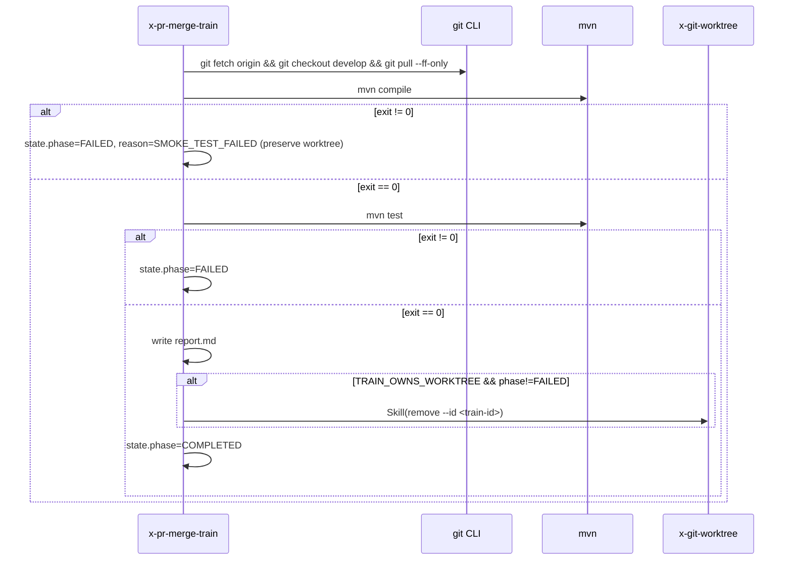

# História: Verification + state.json + error handling + examples

**ID:** story-0042-0003
**Chave Jira:** —
**Status:** Pendente

## 1. Dependências

| Blocked By | Blocks |
| :--- | :--- |
| story-0042-0002 | — |

## 2. Regras Transversais Aplicáveis

| ID | Título |
| :--- | :--- |
| RULE-001 | Source-of-Truth Invariant |
| RULE-003 | Rule 14 Worktree Lifecycle |
| RULE-006 | Atomic, Reversible Commits |

## 3. Descrição

Como **engenheiro de plataforma fechando um épico**, eu quero que o train persista um `state.json` resumível em `plans/merge-train/<id>/`, valide `develop` end-to-end após todos os merges (`git fetch` + `mvn compile` + `mvn test`) e documente cada código de erro possível com remediação acionável, para que trains falhados sejam recuperáveis via `--resume` sem perda de progresso.

Esta story entrega as Phases 6 (Final Verification) e 7 (Report + Cleanup), o schema completo do `state.json`, a lógica de entrada do `--resume`, a tabela de Error Handling com 11 códigos e 3 exemplos executáveis no SKILL.md. É o fecho da skill — garante que o operador tem visibilidade total e consegue recuperar de falhas não-fatais sem reexecutar o train do zero.

### 3.1 Phase 6 — Final Verification

Após todos os PRs da `TAIL[]` estarem em `MERGED`:

- `git fetch origin develop && git checkout develop && git pull --ff-only`
- `mvn compile` — exit 0 esperado
- `mvn test` — exit 0 esperado
- Asserção: todos os PRs em `state.json.prsMergedOk[]` estão com `state=MERGED` via `gh pr view`
- Qualquer falha registra `phase=FAILED` com `reason=SMOKE_TEST_FAILED` e preserva o worktree (RULE-003)

### 3.2 Phase 7 — Report + Cleanup

- Escreve `plans/merge-train/<id>/report.md` com: timestamps, lista de PRs merged, duração por onda, códigos de erro observados (se algum), commits SHA
- Se `worktreeOwnership == "TRAIN_OWNS_WORKTREE"` e `phase != FAILED`: invoca `Skill(skill: "x-git-worktree", args: "remove --id <train-id>")` via INLINE-SKILL
- Se `phase == FAILED`: worktree PRESERVADO (RULE-003 / Rule 14 §4)
- Atualiza `state.json.phase=COMPLETED` ou mantém `FAILED`

### 3.3 state.json — Schema Completo

```json
{
  "schemaVersion": "1.0",
  "trainId": "epic-0042-20260415-143022",
  "startedAt": "2026-04-15T14:30:22Z",
  "lastPhaseCompletedAt": "2026-04-15T14:47:03Z",
  "phase": "COMPLETED",
  "worktreeOwnership": "TRAIN_OWNS_WORKTREE",
  "neuteredParallel": false,
  "maxParallel": 4,
  "dryRun": false,
  "prs": [
    {"number": 374, "headRefName": "...", "validationStatus": "VALID", "role": "BASE"},
    {"number": 375, "headRefName": "...", "validationStatus": "VALID", "role": "TAIL"}
  ],
  "prsMergedOk": [374, 375, 376],
  "prsFailed": [],
  "waves": [
    {"index": 1, "prs": [375, 376], "dispatchedAt": "...", "returnedAt": "..."}
  ]
}
```

### 3.4 Escrita Atômica

- Toda escrita de `state.json` usa padrão `.tmp` + `rename`: escreve em `state.json.tmp`, verifica integridade (JSON válido), depois `mv state.json.tmp state.json`
- Previne corrupção em caso de SIGKILL no meio da escrita

### 3.5 `--resume` Entry Logic

- `--resume` exige `plans/merge-train/<id>/state.json` existente (aborta com `STATE_CONFLICT` se ausente)
- Pula todas as fases com timestamp `<= lastPhaseCompletedAt`
- Reentra na fase seguinte mantendo `prsMergedOk[]` e `waves[]` intactos
- `trainId` é obrigatório explícito via `--train-id` quando múltiplos states existem

## 3.5 Entrega de Valor

- **Valor Principal:** Trains falhados são recuperáveis via `--resume` — zero retrabalho. Todo código de erro surface uma remediação acionável (não apenas "falhou"). Report é auditável e pode ser anexado ao PR/Jira.
- **Métrica de Sucesso:** 100% dos estados não-fatais (ex: `SMOKE_TEST_FAILED` após fix, `PUSH_LEASE_REJECTED` após fetch manual) continuam de `lastPhaseCompletedAt` em `--resume`. Report.md gerado contém todos os campos listados em 3.2.
- **Impacto no Negócio:** Operador confia na automação — zero "rerun from scratch" após falha parcial. Worktree preservado em falha permite diagnóstico sem perder o contexto.

## 4. Definições de Qualidade Locais

### DoR Local (Definition of Ready)

- [ ] story-0042-0002 mergeada (Phases 3–5 prontas)
- [ ] Diretório `plans/merge-train/` adicionado ao `.gitignore` (convém — artefatos são per-run e locais)

### DoD Local (Definition of Done)

- [ ] Phases 6 e 7 escritas em SKILL.md
- [ ] Seção "state.json Schema" com JSON de exemplo completo
- [ ] Seção "Atomic State Writes" documenta padrão `.tmp` + `rename`
- [ ] Seção "Error Handling" contém os 11 códigos listados em 5.3
- [ ] Seção "Examples" contém 3+ exemplos executáveis (explicit train, epic mode, dry-run, resume)
- [ ] Seção "Integration Notes" lista: `x-git-worktree` (chamada), `x-git-commit` (chamada), `x-pr-fix-epic` (invocável manualmente pelo operador após resume), `x-story-implement` (não chama)
- [ ] Pelo menos 1 teste automatizado validando o critério de aceite principal (golden diff da skill completa)
- [ ] Golden diff regenerado

### Global Definition of Done (DoD)

- **Cobertura:** ≥ 95% Line, ≥ 90% Branch em parsers de state.json (se helper Java criado)
- **Testes Automatizados:** golden diff do SKILL.md pós-Phases 6+7; unit tests de parser de state.json se helper Java existir
- **Relatório de Cobertura:** JaCoCo
- **Documentação:** SKILL.md completo; ADR-0005 (entregue em epic-level); CHANGELOG Unreleased
- **Persistência:** state.json atomic writes via `.tmp` + `rename`
- **Performance:** report.md gerado em < 1s para trains de até 10 PRs

## 5. Contratos de Dados (Data Contract)

### 5.1 state.json (Schema Final)

Ver 3.3 para JSON de exemplo. Campos obrigatórios (M):

| Campo | Tipo | M/O | Validações | Exemplo |
| :--- | :--- | :--- | :--- | :--- |
| `schemaVersion` | `String` | M | Literal `"1.0"` | `"1.0"` |
| `trainId` | `String` | M | `epic-NNNN-TIMESTAMP` ou `manual-TIMESTAMP` | `"epic-0042-20260415-143022"` |
| `startedAt` | `String` (ISO-8601) | M | UTC | `"2026-04-15T14:30:22Z"` |
| `lastPhaseCompletedAt` | `String` (ISO-8601) | M | UTC; atualizado ao fim de cada phase | `"2026-04-15T14:47:03Z"` |
| `phase` | `Enum` | M | `PREPARATION`, `DISCOVERY`, `VALIDATION`, `SORTING`, `MERGING_BASE`, `MERGING_BASE_DONE`, `WAVE_N_DISPATCHED`, `WAVE_N_RETURNED`, `MERGING_TAIL_<pr>`, `VERIFYING`, `REPORTING`, `CLEANUP`, `COMPLETED`, `FAILED` | `"COMPLETED"` |
| `worktreeOwnership` | `Enum` | M | `TRAIN_OWNS_WORKTREE` ou `REUSE_PARENT` | `"TRAIN_OWNS_WORKTREE"` |
| `prsMergedOk` | `List<Integer>` | M | append-only | `[374, 375]` |
| `prsFailed` | `List<{pr, reason}>` | M | — | `[]` |
| `waves` | `List<WaveEntry>` | M | Histórico por onda | ver 3.3 |

### 5.2 report.md (Output de Phase 7)

| Campo | Tipo | Sempre presente | Descrição |
| :--- | :--- | :--- | :--- |
| `Train ID` | `String` | Sim | Do state.json |
| `Started` / `Ended` | `String` (ISO-8601) | Sim | Timestamps |
| `Duration` | `Duration` | Sim | `ended - started` |
| `PRs merged` | `Table` | Sim | PR number, base/tail, duration, commit SHA |
| `Waves` | `Table` | Sim | Index, PRs, dispatched/returned, workers |
| `Errors observed` | `Table` | Sim (pode ser vazia) | Código, PR afetado, mensagem |
| `Final phase` | `Enum` | Sim | `COMPLETED` ou `FAILED` |

### 5.3 Error Codes Mapeados (11 códigos consolidados)

| Código | Condição | Remediação |
| :--- | :--- | :--- |
| `MODE_AMBIGUOUS` | 0 ou 2+ de `--prs`/`--epic`/`--pattern` | Informar exatamente um |
| `EPIC_STATE_MISSING` | `--epic N` com `plans/epic-N/execution-state.json` ausente | Usar `--prs` ou `--pattern` |
| `PR_DRAFT` | PR em draft | Marcar `Ready for review` |
| `PR_BASE_MISMATCH` | base != develop | Rebasear ou abrir novo PR contra develop |
| `PR_NOT_APPROVED` | sem approval | Solicitar review |
| `PR_CI_FAILING` | CI vermelha | Fixar CI antes de retomar |
| `PR_MERGE_CONFLICT` | conflito pré-existente | Rebasear manualmente |
| `PR_CLOSED` | state != OPEN | Remover do train ou reabrir |
| `NEUTERED_PARALLEL` | overlap de arquivos (informativo) | Aceitar ou refatorar tasks para evitar overlap |
| `CODE_CONFLICT_NEEDS_HUMAN` | conflito em código fora de goldens | Resolver manualmente + `--resume` |
| `PUSH_LEASE_REJECTED` | force-with-lease rejeitado após retry | Fetch + rebase manual + `--resume` |
| `GOLDENS_REGEN_FAILED` | `mvn process-resources` falha | Diagnosticar build; ver worker log |
| `MERGE_REJECTED_BY_PROTECTION` | branch protection bloqueia | Ajustar regras ou usar admin override |
| `MERGE_POLL_TIMEOUT` | timeout aguardando MERGED | Aumentar `--merge-timeout` ou investigar CI |
| `SMOKE_TEST_FAILED` | `mvn test` falha após regen | Diagnosticar; worktree preservado |
| `STATE_CONFLICT` | `--resume` sem state.json existente | Iniciar fresh (sem `--resume`) |

> Nota: Os códigos listados acima cobrem todos os tipos de erro possíveis — são 16 itens na tabela, incluindo alguns já introduzidos em stories anteriores; os 11 da tabela da DoD são os códigos estritamente novos desta story. A DoR da próxima engenharia deve auditar o número exato e ajustá-lo no SKILL.md.

### 5.4 Event Schema

> Não se aplica.

## 6. Diagramas

### 6.1 Fluxo Phase 6 → 7



## 7. Critérios de Aceite (Gherkin)

```gherkin
Cenario: Degenerate - resume com state.json ausente
  DADO plans/merge-train/<id>/state.json nao existe
  QUANDO --resume e passado sem create previo
  ENTAO a skill aborta com codigo STATE_CONFLICT
  E sugere iniciar fresh sem --resume

Cenario: Happy path - train completo persiste state e cleanup worktree
  DADO todos PRs em estado MERGED ao final da Phase 6
  E worktreeOwnership=TRAIN_OWNS_WORKTREE
  QUANDO Phase 7 executa
  ENTAO plans/merge-train/<id>/report.md e emitido com todos os campos de 5.2
  E Skill(x-git-worktree remove --id ...) e invocado
  E state.json registra phase=COMPLETED

Cenario: Error - mvn test falha apos regen de goldens
  DADO mvn test retorna exit != 0 na Phase 6
  QUANDO Phase 6 executa
  ENTAO state.json marca phase=FAILED com reason=SMOKE_TEST_FAILED
  E worktree e preservado para diagnostico (Rule 14 §4)
  E a skill retorna exit code != 0

Cenario: Boundary - force-with-lease rejeitado apos retentativa unica
  DADO remote HEAD moveu novamente apos fetch + rebase do subagent
  QUANDO subagent tenta push segunda vez
  ENTAO retorna worker.log com status=FAILED reason=PUSH_LEASE_REJECTED
  E train aborta preservando worktree
  E --resume posterior (apos fix humano) continua do lastPhaseCompletedAt
```

### 7.1 Scenario Ordering (TPP)

Degenerate (resume sem state) → Happy (train completo) → Error (mvn test falha) → Boundary (push lease rejected com retry único).

### 7.2 Mandatory Scenario Categories

- [x] Degenerate cases
- [x] Happy path
- [x] Error paths
- [x] Boundary values

### 7.3 TDD Implementation Notes

- Acceptance test: golden diff do SKILL.md cobrindo Phases 6+7 + validação que `state.json` de exemplo é JSON válido (via parser em test).
- Unit tests de parser de state.json (se helper Java criado): schema obrigatório, rejeição de schemaVersion != "1.0", idempotência de `--resume`.

## 8. Tasks

### TASK-0042-0003-001: Adicionar Phase 6 Final Verification

- **Layer:** Doc
- **Test Type:** Verification
- **Size:** M
- **Dependencies:** story-0042-0002 (todas tasks mergeadas)
- **Branch:** `feat/task-0042-0003-001-phase-6`
- **Testability:** Config + VerificationTest
- **Files:**
  - `java/src/main/resources/targets/claude/skills/core/pr/x-pr-merge-train/SKILL.md`
- **Acceptance Criteria:**
  - [ ] Comandos `git fetch`, `git pull --ff-only`, `mvn compile`, `mvn test` documentados na ordem
  - [ ] Asserção de todos PRs em MERGED via `gh pr view`
  - [ ] Erro `SMOKE_TEST_FAILED` com preservação de worktree documentado
  - [ ] Golden diff regenerado

### TASK-0042-0003-002: Adicionar Phase 7 Report + Cleanup

- **Layer:** Doc
- **Test Type:** Verification
- **Size:** M
- **Dependencies:** TASK-0042-0003-001
- **Branch:** `feat/task-0042-0003-002-phase-7`
- **Testability:** Config + VerificationTest
- **Files:**
  - `java/src/main/resources/targets/claude/skills/core/pr/x-pr-merge-train/SKILL.md`
- **Acceptance Criteria:**
  - [ ] Estrutura do report.md documentada conforme 5.2
  - [ ] Cleanup condicional em TRAIN_OWNS_WORKTREE && phase != FAILED
  - [ ] Preservação de worktree em phase=FAILED explicitada (RULE-003)
  - [ ] Invocação INLINE-SKILL de `x-git-worktree remove` documentada com Rule 13 Pattern 1

### TASK-0042-0003-003: Adicionar state.json Schema + Atomic-Write-via-Tmp + Resume Entry Logic

- **Layer:** Doc
- **Test Type:** Verification
- **Size:** L
- **Dependencies:** TASK-0042-0003-002
- **Branch:** `feat/task-0042-0003-003-state-schema`
- **Testability:** Config + VerificationTest
- **Files:**
  - `java/src/main/resources/targets/claude/skills/core/pr/x-pr-merge-train/SKILL.md`
- **Acceptance Criteria:**
  - [ ] JSON de exemplo completo conforme 3.3
  - [ ] Campos documentados na tabela 5.1 (schemaVersion, trainId, phase, etc.)
  - [ ] Padrão `.tmp` + `rename` para escrita atômica documentado
  - [ ] Lógica de `--resume` cobre: requer state.json existente, pula phases por `lastPhaseCompletedAt`, mantém arrays intactos
  - [ ] Aborto com `STATE_CONFLICT` quando `--resume` sem state.json

### TASK-0042-0003-004: Adicionar Error Handling table (≥ 11 códigos com remediação)

- **Layer:** Doc
- **Test Type:** Verification
- **Size:** L
- **Dependencies:** TASK-0042-0003-003
- **Branch:** `feat/task-0042-0003-004-error-table`
- **Testability:** Config + VerificationTest
- **Files:**
  - `java/src/main/resources/targets/claude/skills/core/pr/x-pr-merge-train/SKILL.md`
- **Acceptance Criteria:**
  - [ ] Tabela "Error Handling" com todos os códigos listados em 5.3, com condição e remediação
  - [ ] Cada código aparece no corpo do SKILL.md na fase que o emite (grep cross-reference verde)
  - [ ] Nenhum código duplicado
  - [ ] Golden diff regenerado

### TASK-0042-0003-005: Adicionar Integration Notes + Examples executáveis

- **Layer:** Doc
- **Test Type:** Verification
- **Size:** M
- **Dependencies:** TASK-0042-0003-004
- **Branch:** `feat/task-0042-0003-005-examples`
- **Testability:** Config + VerificationTest
- **Files:**
  - `java/src/main/resources/targets/claude/skills/core/pr/x-pr-merge-train/SKILL.md`
- **Acceptance Criteria:**
  - [ ] Tabela "Integration Notes" com: x-git-worktree (calls), x-git-commit (calls), x-pr-fix-epic (invocado manualmente pelo operador pós-resume), x-story-implement (não chama)
  - [ ] ≥ 3 Examples: `/x-pr-merge-train --prs 374,375,376`, `/x-pr-merge-train --epic 0042`, `/x-pr-merge-train --epic 0042 --dry-run`, `/x-pr-merge-train --resume --train-id epic-0042-...`
  - [ ] Cada Example com comentário explicativo e output esperado resumido
  - [ ] Rule 13 audit green (bare-slash ok em Examples, mas não em seções de delegação)
