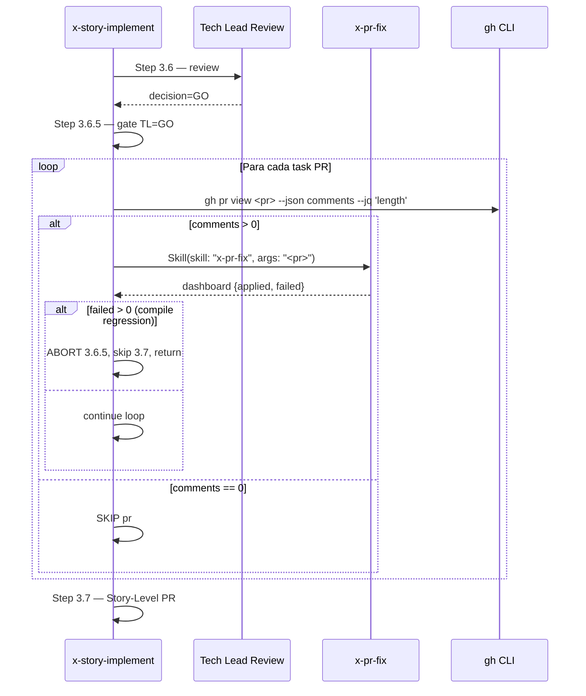

# História: Hook `x-pr-fix` após TL GO em `x-story-implement`

**ID:** story-0042-0004
**Chave Jira:** —
**Status:** Pendente

## 1. Dependências

| Blocked By | Blocks |
| :--- | :--- |
| — | — |

> Esta história é **independente** do eixo 0001→0002→0003. Pode ser executada em paralelo com a story-0042-0001.

## 2. Regras Transversais Aplicáveis

| ID | Título |
| :--- | :--- |
| RULE-001 | Source-of-Truth Invariant |
| RULE-002 | Rule 13 Invocation Patterns |
| RULE-006 | Atomic, Reversible Commits |
| RULE-007 | PR-Fix Hook Is Single-Pass |

## 3. Descrição

Como **desenvolvedor executando `/x-story-implement`**, eu quero que comentários de review não-blocker dos PRs de task sejam aplicados automaticamente após o Tech Lead retornar GO, para que o Step 3.7 (Story-Level PR creation / auto-merge) execute com PRs de task limpos e sem intervenção manual.

Hoje, após o Step 3.6 (Tech Lead Review + Dashboard Update) devolver GO, o operador precisa invocar manualmente `/x-pr-fix <pr>` para cada PR de task com comentários residuais antes de chegar no Step 3.7. Esta story insere um novo Step 3.6.5 que roda exatamente uma vez, gated em TL=GO, varrendo os PRs de task do story e aplicando `x-pr-fix` em cada um via INLINE-SKILL. Qualquer regressão de compilação reportada por `x-pr-fix` (`failed > 0` com razão de compile) aborta o Step 3.6.5 com `PR_FIX_COMPILE_REGRESSION`, pula o Step 3.7 e devolve controle humano (RULE-007: single-pass, sem retry automático).

### 3.1 Localização da Inserção

- Arquivo: `java/src/main/resources/targets/claude/skills/core/dev/x-story-implement/SKILL.md`
- Ponto: entre o fim do atual **Step 3.6 — Tech Lead Review + Dashboard Update** e o início do atual **Step 3.7 — Story-Level PR Auto-Approve Mode Only**
- Sem gate v1/v2: a Phase 3 é explicitamente compartilhada entre os dois schemas (Rule 19 não se aplica aqui)

### 3.2 Step 3.6.5 — Scope

- **Gating:** executa SOMENTE se `tl_review.decision == "GO"`. Em `NO-GO` ou `NEEDS-CHANGES`, pula (fluxo reentra no Step 3.5 para remediação).
- **Discovery:** lista `taskPRs[]` do story a partir do `execution-state.json` da story (ou do epic pai). Para cada PR, checa `gh pr view <pr> --json comments --jq '.comments | length'`.
- **Per-PR loop (serial):** PRs com `comments > 0` recebem `Skill(skill: "x-pr-fix", args: "<pr>")` via INLINE-SKILL. PRs com `comments = 0` são logados como `SKIP` e ignorados.
- **Compile-regression guard:** se qualquer invocação retornar `failed > 0` com razão de compile regression, aborta com código `PR_FIX_COMPILE_REGRESSION`, pula Step 3.7, devolve controle.
- **Idempotência:** o Step 3.6.5 roda EXATAMENTE UMA VEZ por ciclo de story. Uma reentrada no Step 3.5 (NO-GO → fix → novo GO) re-dispara o Step 3.6.5 apenas se o Step 3.6 foi re-executado (primeiro GO retomado).

### 3.3 Comportamento em `x-pr-fix` bem-sucedido

- Cada invocação retorna um dashboard (tabela de comentários + ações). O Step 3.6.5 agrega os dashboards em um log consolidado e segue para o próximo PR.
- PRs que tiveram fixes aplicados recebem novos commits (feitos pelo próprio `x-pr-fix`). O Step 3.7 então vê PRs atualizados com CI idealmente verde (a CI é re-executada pelo push do `x-pr-fix`).

### 3.4 Integration Notes + Error Handling

- Integration Notes do `x-story-implement` ganha nova linha: `x-pr-fix / Invokes (Step 3.6.5, on TL GO) / Per-task PR comment auto-fix after Tech Lead approval`
- Error Handling ganha nova linha: `x-pr-fix returns compile regression / Abort Step 3.6.5 with PR_FIX_COMPILE_REGRESSION; do NOT proceed to Step 3.7`

## 3.5 Entrega de Valor

- **Valor Principal:** Zero invocações manuais de `x-pr-fix` por fechamento de story. Operador recupera o tempo gasto varrendo 3–8 PRs de task procurando comentários não-blocker.
- **Métrica de Sucesso:** 100% das stories com `tl_review.decision == "GO"` e `comments > 0` em ao menos um task PR recebem fixes automaticamente antes do Step 3.7. Zero regressão em stories com `comments = 0` (skip silencioso).
- **Impacto no Negócio:** Remove o último gate manual entre TL approval e conclusão da story. Acopla naturalmente com a skill `x-pr-merge-train` (story-0042-0001/2/3) para fechar o ciclo "PR limpo → train clean → develop atualizada" sem intervenção.

## 4. Definições de Qualidade Locais

### DoR Local (Definition of Ready)

- [ ] `x-pr-fix` SKILL.md confirmado funcional e capaz de retornar um dashboard com contagem `applied/failed`
- [ ] Linha 962–963 de `x-story-implement/SKILL.md` (interface entre Step 3.6 e 3.7) re-validada no worktree atual (pode ter mudado desde o plano)
- [ ] Comando canônico de discovery `gh pr view <pr> --json comments --jq '.comments | length'` testado localmente

### DoD Local (Definition of Done)

- [ ] Seção Step 3.6.5 inserida em `java/src/main/resources/targets/claude/skills/core/dev/x-story-implement/SKILL.md` entre o fim do Step 3.6 e o início do Step 3.7
- [ ] Gating (TL=GO only) documentado no início da seção
- [ ] Discovery via `jq` documentada com comando explícito
- [ ] Per-PR loop com invocação INLINE-SKILL `Skill(skill: "x-pr-fix", args: "<pr>")` — Rule 13 Pattern 1
- [ ] Compile-regression guard com código `PR_FIX_COMPILE_REGRESSION` documentado
- [ ] Nota de idempotência (single-pass por story) documentada
- [ ] Integration Notes e Error Handling tables atualizadas
- [ ] Golden diff de `.claude/skills/x-story-implement/SKILL.md` regenerado — diff contém exclusivamente a região entre Step 3.6 e 3.7 (sanity check)
- [ ] Pelo menos 1 teste automatizado validando o critério de aceite principal (golden diff do SKILL.md cobrindo Step 3.6.5)

### Global Definition of Done (DoD)

- **Cobertura:** não aplicável (nenhum helper Java novo nesta story — apenas diff de SKILL.md)
- **Testes Automatizados:** golden diff do SKILL.md
- **Relatório de Cobertura:** JaCoCo (agregado; sem alteração esperada)
- **Documentação:** diff de `x-story-implement/SKILL.md`; CHANGELOG Unreleased
- **Persistência:** não se aplica
- **Performance:** Step 3.6.5 adiciona no máximo N × (overhead do `x-pr-fix`) onde N = # de task PRs com comments > 0. Tipicamente < 5min por story.

## 5. Contratos de Dados (Data Contract)

> Esta story não introduz novos contratos externos. O contrato relevante é o **dashboard de saída** do `x-pr-fix`, consumido pelo Step 3.6.5.

### 5.1 Dashboard Output (consumido de `x-pr-fix`)

| Campo | Tipo | M/O | Validações | Exemplo |
| :--- | :--- | :--- | :--- | :--- |
| `applied` | `Integer` | M | ≥ 0 | `2` |
| `failed` | `Integer` | M | ≥ 0 | `0` |
| `failures[]` | `List<{path, reason}>` | O (M se failed > 0) | — | `[{path: "Foo.java", reason: "compile regression"}]` |
| `commitSha` | `String` | O (presente se applied > 0) | 40 chars hex | `"a1b2c3..."` |

### 5.2 Abort Output (Step 3.6.5)

| Campo | Tipo | Sempre presente | Descrição |
| :--- | :--- | :--- | :--- |
| `code` | `String` | Sim | `PR_FIX_COMPILE_REGRESSION` |
| `affectedPR` | `Integer` | Sim | PR onde a regressão ocorreu |
| `message` | `String` | Sim | Texto acionável para o operador |

### 5.3 Error Codes Mapeados

| Código | Condição | Mensagem (pt-BR) |
| :--- | :--- | :--- |
| `PR_FIX_COMPILE_REGRESSION` | `x-pr-fix` retornou `failed > 0` com razão compile | `PR #N: fix automatico quebrou compilacao. Step 3.7 abortado. Intervencao manual necessaria.` |

### 5.4 Event Schema

> Não se aplica.

## 6. Diagramas

### 6.1 Fluxo Step 3.6 → 3.6.5 → 3.7



## 7. Critérios de Aceite (Gherkin)

```gherkin
Cenario: Degenerate - nenhum task PR tem comentario
  DADO 4 task PRs todos com comments=0
  E TL review retornou GO
  QUANDO Step 3.6.5 executa
  ENTAO cada PR e logado como SKIP
  E nenhum Skill(x-pr-fix) e invocado
  E Step 3.7 executa na sequencia

Cenario: Happy path - 2 PRs com comentarios nao-blocker
  DADO TL=GO e 2 task PRs com comments > 0
  E os comentarios sao suggestions/nits aplicaveis
  QUANDO Step 3.6.5 executa
  ENTAO Skill(skill: "x-pr-fix", args: "<pr>") e chamado para cada um dos 2 PRs
  E ambos retornam dashboards com applied > 0 e failed = 0
  E commits sao feitos pelos PRs afetados
  E Step 3.7 executa na sequencia

Cenario: Error - compile regression em um PR
  DADO Step 3.6.5 em execucao com 3 PRs
  QUANDO o Skill(x-pr-fix) do segundo PR retorna failed=1 com razao compile regression
  ENTAO Step 3.6.5 aborta com codigo PR_FIX_COMPILE_REGRESSION
  E Step 3.7 nao executa
  E Tech Lead nao e reinvocado (sem loop de retry)
  E controle e devolvido ao operador humano

Cenario: Boundary - TL retorna NO-GO
  DADO TL review = NO-GO em Step 3.6
  QUANDO fluxo avanca apos Step 3.6
  ENTAO Step 3.6.5 e pulado (gating TL=GO)
  E Step 3.5 loop reentra para remediacao manual
  E nenhuma invocacao de x-pr-fix ocorre
```

### 7.1 Scenario Ordering (TPP)

Degenerate (zero comments) → Happy (2 PRs com fixes aplicados) → Error (compile regression) → Boundary (TL=NO-GO).

### 7.2 Mandatory Scenario Categories

- [x] Degenerate cases
- [x] Happy path
- [x] Error paths
- [x] Boundary values

### 7.3 TDD Implementation Notes

- Acceptance test: golden diff do `x-story-implement/SKILL.md` com Step 3.6.5 inserido; assert que o diff é escopado exclusivamente à região entre Step 3.6 e Step 3.7.
- Complementar: audit Rule 13 green (INLINE-SKILL válido, zero bare-slash em delegação).

## 8. Tasks

### TASK-0042-0004-001: Inserir seção Step 3.6.5 em x-story-implement/SKILL.md

- **Layer:** Doc
- **Test Type:** Verification
- **Size:** M
- **Dependencies:** —
- **Branch:** `feat/task-0042-0004-001-step-3-6-5`
- **Testability:** Config + VerificationTest
- **Files:**
  - `java/src/main/resources/targets/claude/skills/core/dev/x-story-implement/SKILL.md`
- **Acceptance Criteria:**
  - [ ] Seção "Step 3.6.5 — Auto-Fix Task PR Comments (post-TL GO)" inserida entre o fim do Step 3.6 e o início do Step 3.7
  - [ ] Gating (TL=GO) documentado como primeira linha acionável
  - [ ] Discovery via `gh pr view <pr> --json comments --jq '.comments | length'` documentada
  - [ ] Per-PR loop com `Skill(skill: "x-pr-fix", args: "<pr>")` — Rule 13 Pattern 1
  - [ ] Compile-regression guard com `PR_FIX_COMPILE_REGRESSION`
  - [ ] Nota explícita de idempotência (single-pass) alinhada com RULE-007
  - [ ] Zero bare-slash em delegação (audit Rule 13 green)

### TASK-0042-0004-002: Adicionar linha em Integration Notes

- **Layer:** Doc
- **Test Type:** Verification
- **Size:** S
- **Dependencies:** TASK-0042-0004-001
- **Branch:** `feat/task-0042-0004-002-integration-notes`
- **Testability:** Config + VerificationTest
- **Files:**
  - `java/src/main/resources/targets/claude/skills/core/dev/x-story-implement/SKILL.md`
- **Acceptance Criteria:**
  - [ ] Nova linha na tabela Integration Notes: `x-pr-fix | Invokes (Step 3.6.5, on TL GO) | Per-task PR comment auto-fix after Tech Lead approval`
  - [ ] Linha inserida em ordem alfabética ou na posição canônica da tabela
  - [ ] Nenhuma outra linha alterada

### TASK-0042-0004-003: Adicionar linha em Error Handling

- **Layer:** Doc
- **Test Type:** Verification
- **Size:** S
- **Dependencies:** TASK-0042-0004-001
- **Branch:** `feat/task-0042-0004-003-error-handling`
- **Testability:** Config + VerificationTest
- **Files:**
  - `java/src/main/resources/targets/claude/skills/core/dev/x-story-implement/SKILL.md`
- **Acceptance Criteria:**
  - [ ] Nova linha na tabela Error Handling: `x-pr-fix returns compile regression | Abort Step 3.6.5 with PR_FIX_COMPILE_REGRESSION; do NOT proceed to Step 3.7`
  - [ ] Linha inserida sem afetar ordem das linhas existentes

### TASK-0042-0004-004: Regenerar goldens e confirmar escopo do diff

- **Layer:** Test
- **Test Type:** Verification
- **Size:** S
- **Dependencies:** TASK-0042-0004-001, TASK-0042-0004-002, TASK-0042-0004-003
- **Branch:** `feat/task-0042-0004-004-regen-goldens`
- **Testability:** Config + VerificationTest
- **Files:**
  - `src/test/resources/golden/claude/skills/x-story-implement/SKILL.md` (regenerado)
- **Acceptance Criteria:**
  - [ ] `mvn process-resources` executado; `.claude/skills/x-story-implement/SKILL.md` atualizado
  - [ ] Golden regenerado via comando canônico (README.md:810-818)
  - [ ] `git diff src/test/resources/golden/claude/skills/x-story-implement/SKILL.md` tem o escopo contido na região entre Step 3.6 e Step 3.7 (além das linhas adicionadas em Integration Notes e Error Handling)
  - [ ] `mvn test -Dtest=*GoldenDiff*` verde
  - [ ] Audit Rule 13 green (bare-slash em contexto de delegação = 0)
