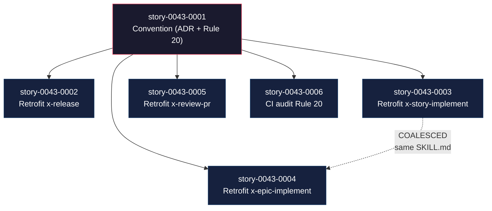
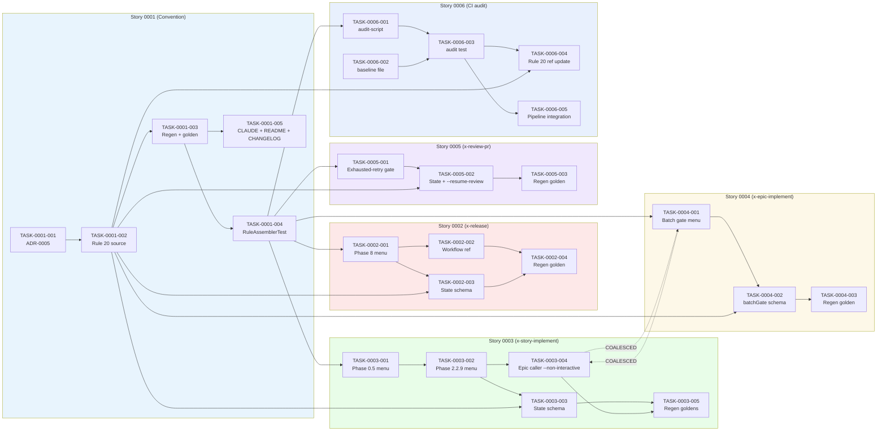

# Mapa de Implementação — EPIC-0043 (Standardize Interactive Gates with Fixed-Option Menus)

**Gerado a partir das dependências BlockedBy/Blocks de cada história do epic-0043.**

---

## 1. Matriz de Dependências

| Story | Título | Chave Jira | Blocked By | Blocks | Status |
| :--- | :--- | :--- | :--- | :--- | :--- |
| [story-0043-0001](./story-0043-0001.md) | Convention — ADR-0005 + Rule 20 | — | — | 0002, 0003, 0004, 0005, 0006 | Concluída |
| [story-0043-0002](./story-0043-0002.md) | Retrofit `x-release` Phase 8 | — | story-0043-0001 | — | Concluída |
| [story-0043-0003](./story-0043-0003.md) | Retrofit `x-story-implement` | — | story-0043-0001 | — | Pendente |
| [story-0043-0004](./story-0043-0004.md) | Retrofit `x-epic-implement` | — | story-0043-0001 | — | Pendente |
| [story-0043-0005](./story-0043-0005.md) | Retrofit `x-review-pr` | — | story-0043-0001 | — | Pendente |
| [story-0043-0006](./story-0043-0006.md) | CI audit Rule 20 | — | story-0043-0001 | — | Pendente |

> **Valores de Status:** `Pendente` (padrão) · `Em Andamento` · `Concluída` · `Falha` · `Bloqueada` · `Parcial`

> **Nota crítica:** `story-0043-0003` (TASK-0043-0003-004) e `story-0043-0004` (TASK-0043-0004-001) mexem no mesmo arquivo `x-epic-implement/SKILL.md`. As tasks foram declaradas como COALESCED (Rule 15). Ao dispatchá-las, ambas precisam estar prontas para um commit atômico único — caso contrário, o golden regen gerará conflito.

---

## 2. Fases de Implementação

> Duas fases. Dentro da Fase 1, 5 stories podem ser implementadas **em paralelo** (com coordenação COALESCED entre 0003/0004 conforme seção §8).

```
╔══════════════════════════════════════════════════════════════════════════╗
║                   FASE 0 — Convenção (bloqueia todas)                   ║
║                                                                         ║
║   ┌──────────────────────────────────────────────┐                      ║
║   │  story-0043-0001                             │                      ║
║   │  ADR-0005 + Rule 20 + glossário + schema     │                      ║
║   └────────────────────┬─────────────────────────┘                      ║
╚════════════════════════╪════════════════════════════════════════════════╝
                         │
                         ▼
╔══════════════════════════════════════════════════════════════════════════╗
║                   FASE 1 — Retrofits Paralelos + Audit                  ║
║                                                                         ║
║   ┌──────────────┐ ┌──────────────┐ ┌──────────────┐ ┌──────────────┐   ║
║   │ story-0002   │ │ story-0003   │ │ story-0004   │ │ story-0005   │   ║
║   │ x-release    │ │ x-story-impl │ │ x-epic-impl  │ │ x-review-pr  │   ║
║   │              │ │ COALESCED ── │ │ ── COALESCED │ │              │   ║
║   └──────────────┘ └──────────────┘ └──────────────┘ └──────────────┘   ║
║                                                                         ║
║                        ┌──────────────┐                                 ║
║                        │ story-0006   │                                 ║
║                        │ CI audit     │                                 ║
║                        │ (--baseline) │                                 ║
║                        └──────────────┘                                 ║
╚══════════════════════════════════════════════════════════════════════════╝
```

---

## 3. Caminho Crítico

> O caminho crítico (sequência mais longa de dependências) determina o tempo mínimo de implementação.

```
story-0043-0001 ──┬──→ story-0043-0002 (x-release)
                  ├──→ story-0043-0003 (x-story-impl)  ┐
                  ├──→ story-0043-0004 (x-epic-impl)   │ COALESCED (0003-004 + 0004-001)
                  ├──→ story-0043-0005 (x-review-pr)   ┘
                  └──→ story-0043-0006 (audit)

Fase 0 (serial)                    Fase 1 (paralela)
```

**2 fases no caminho crítico. Story 0001 é o único gargalo estrutural.**

Atrasos em story-0043-0001 afetam linearmente o tempo total (5 stories esperando). A Fase 1 absorve variabilidade entre as 5 retrofits — desde que 0003/0004 coordenem o commit coalesced, paralelismo é real.

---

## 4. Grafo de Dependências (Mermaid)



---

## 5. Resumo por Fase

| Fase | Histórias | Camada | Paralelismo | Pré-requisito |
| :--- | :--- | :--- | :--- | :--- |
| 0 | story-0043-0001 | Convention (ADR + Rule) | 1 | — |
| 1 | story-0043-0002, 0043-0003, 0043-0004, 0043-0005, 0043-0006 | Skill retrofits + infrastructure (audit) | 5 paralelas (c/ COALESCED entre 0003 e 0004) | Fase 0 concluída |

**Total: 6 histórias em 2 fases.**

> **Nota:** Fase 1 tem 5 paralelas aparentes, mas 0003 e 0004 tocam `x-epic-implement/SKILL.md`; são dispatcháveis em paralelo porém o commit precisa ser atômico (COALESCED). Recomendado: dispatchar como par coalesced ou executar 0003 completa antes de 0004 iniciar tarefa 001.

---

## 6. Detalhamento por Fase

### Fase 0 — Convenção

| Story | Escopo Principal | Artefatos Chave |
| :--- | :--- | :--- |
| story-0043-0001 | ADR-0005 + Rule 20 + glossário AskUserQuestion + schema state file | `adr/ADR-0005-interactive-gates-convention.md`; `java/src/main/resources/targets/claude/rules/20-interactive-gates.md`; `.claude/rules/20-interactive-gates.md`; `RuleAssemblerTest.listRules_includesInteractiveGates` |

**Entregas da Fase 0:**

- Contrato formal publicado: 3 opções canônicas, loop-back, `--non-interactive`, schema state file, audit command
- CLAUDE.md atualizado no bloco "In progress"
- CHANGELOG Unreleased atualizado

### Fase 1 — Retrofits + Audit

| Story | Escopo Principal | Artefatos Chave |
| :--- | :--- | :--- |
| story-0043-0002 | Phase 8 APPROVAL-GATE `x-release` default-on; FIX-PR loop; `--non-interactive`; state schema estendido | Diff em `core/ops/x-release/SKILL.md` + `approval-gate-workflow.md` |
| story-0043-0003 | Phases 0.5 e 2.2.9 default-on com menu; state schema estendido; invocação de `x-epic-implement` passa `--non-interactive` | Diff em `core/dev/x-story-implement/SKILL.md` + `core/dev/x-epic-implement/SKILL.md` (invocação) |
| story-0043-0004 | Batch consolidation gate default-on; FIX-PR via `x-pr-fix-epic`; state schema estendido com `batchGate` | Diff em `core/dev/x-epic-implement/SKILL.md` (batch gate) |
| story-0043-0005 | Exhausted-retry gate novo; state file opt-in; `--resume-review` | Diff em `core/review/x-review-pr/SKILL.md` |
| story-0043-0006 | Script audit + baseline + teste Java wrapper + integração CI | `scripts/audit-interactive-gates.sh`; `audits/interactive-gates-baseline.txt`; `InteractiveGatesAuditTest` |

**Entregas da Fase 1:**

- Todas 4 skills com gate interativo por default (menu estruturado)
- Todas 4 skills com `--non-interactive` para CI/automação
- Todas 4 flags antigas depreciadas com warning
- CI audit (com baseline) verde; ao fim das 4 retrofits, baseline fica vazio e audit vira estrito

---

## 7. Observações Estratégicas

### Gargalo Principal

**story-0043-0001** é gargalo absoluto: bloqueia as 5 demais. O ADR + Rule 20 precisam ter os 3 artefatos (glossário AskUserQuestion, schema state file, audit command) completos para as retrofits não divergirem. Investir tempo em revisão humana da Rule 20 antes de merge evita retrabalho em 4 retrofits paralelas.

### Histórias Folha (sem dependentes)

- **story-0043-0002** (x-release) — retrofit isolado
- **story-0043-0003** (x-story-implement) — COALESCED com 0004
- **story-0043-0004** (x-epic-implement) — COALESCED com 0003
- **story-0043-0005** (x-review-pr) — retrofit isolado
- **story-0043-0006** (CI audit) — infra-structure, isolado

Todas podem absorver atrasos sem impactar outras frentes.

### Otimização de Tempo

- **Máximo paralelismo:** Fase 1 com 5 stories em paralelo; se a equipe conseguir coordenar o commit coalesced 0003+0004, a janela crítica = max(tempo de cada story)
- **Começar imediatamente:** story-0043-0001 (sem dependências externas além da aprovação deste plano)
- **Alocação sugerida:** 1 executor dedicado para story-0043-0001 (Fase 0); após merge, 3 executores em Fase 1 — um para 0002, um coalesced para 0003+0004, um para 0005; story-0043-0006 pode ficar com o mesmo executor de 0001 após Fase 0 fechar

### Dependências Cruzadas

- **0003 ↔ 0004:** ambas tocam `x-epic-implement/SKILL.md`. Coordenação COALESCED (Rule 15) garante commit atômico. Se uma for abandoned, a outra também precisa ser revertida.
- **0006 → 0002..0005:** `audits/interactive-gates-baseline.txt` é esvaziado incrementalmente conforme cada retrofit land. A última retrofit a landar remove a última linha do baseline e transforma o audit em strict-mode.

### Marco de Validação Arquitetural

**story-0043-0001** serve como checkpoint arquitetural. Valida:

- Template ADR compatível com o shape que queremos
- Slot de rule 20 disponível e aceito pelo RuleAssembler
- Glossário de `AskUserQuestion` consumível pelas 4 skills (teste de compatibilidade: header ≤ 12 chars, label 1–5 words, description objetiva)
- Schema state file §5.1 satisfaz as 4 skills sem mudanças skill-specific

Se qualquer uma dessas premissas falhar em 0043-0001, revisitar o design antes de expandir escopo com retrofits.

---

## 8. Dependências entre Tasks (Cross-Story)

> Geradas a partir das `Dependencies` declaradas em cada task-bloco das histórias.

### 8.1 Dependências Cross-Story entre Tasks

| Task | Depends On | Story Source | Story Target | Tipo |
| :--- | :--- | :--- | :--- | :--- |
| TASK-0043-0002-003 | TASK-0043-0001-002 | 0043-0002 | 0043-0001 | REQUIRES_MOCK (Rule 20 §5.1) |
| TASK-0043-0003-003 | TASK-0043-0001-002 | 0043-0003 | 0043-0001 | REQUIRES_MOCK (Rule 20 §5.1) |
| TASK-0043-0003-004 | TASK-0043-0004-001 | 0043-0003 | 0043-0004 | COALESCED (mesmo SKILL.md) |
| TASK-0043-0004-001 | TASK-0043-0003-004 | 0043-0004 | 0043-0003 | COALESCED (mesmo SKILL.md) |
| TASK-0043-0004-002 | TASK-0043-0001-002 | 0043-0004 | 0043-0001 | REQUIRES_MOCK (Rule 20 §5.1) |
| TASK-0043-0004-003 | TASK-0043-0003-004 | 0043-0004 | 0043-0003 | COALESCED regen (único golden) |
| TASK-0043-0005-002 | TASK-0043-0001-002 | 0043-0005 | 0043-0001 | REQUIRES_MOCK (Rule 20 §5.1) |
| TASK-0043-0006-004 | TASK-0043-0001-002 | 0043-0006 | 0043-0001 | CONFIG (atualiza §Audit Command da Rule 20) |

> **Validação:** Dependências cross-story consistentes com os BlockedBy/Blocks declarados em §1. Par COALESCED entre 0003-004 e 0004-001 tem reciprocidade (Rule 15).

### 8.2 Ordem de Merge (Topological Sort)

| Ordem | Task ID | Story | Parallelizável Com | Fase |
| :--- | :--- | :--- | :--- | :--- |
| 1 | TASK-0043-0001-001 | 0001 | — | 0 |
| 2 | TASK-0043-0001-002 | 0001 | — | 0 |
| 3 | TASK-0043-0001-003 | 0001 | TASK-0043-0001-004, TASK-0043-0001-005 | 0 |
| 3 | TASK-0043-0001-004 | 0001 | TASK-0043-0001-003, TASK-0043-0001-005 | 0 |
| 3 | TASK-0043-0001-005 | 0001 | TASK-0043-0001-003, TASK-0043-0001-004 | 0 |
| 4 | TASK-0043-0002-001 | 0002 | TASK-0043-0003-001, TASK-0043-0005-001, TASK-0043-0006-001 | 1 |
| 4 | TASK-0043-0003-001 | 0003 | TASK-0043-0002-001, TASK-0043-0005-001, TASK-0043-0006-001 | 1 |
| 4 | TASK-0043-0005-001 | 0005 | TASK-0043-0002-001, TASK-0043-0003-001, TASK-0043-0006-001 | 1 |
| 4 | TASK-0043-0006-001 | 0006 | TASK-0043-0002-001, TASK-0043-0003-001, TASK-0043-0005-001 | 1 |
| 4 | TASK-0043-0006-002 | 0006 | TASK-0043-0006-001 | 1 |
| 5 | TASK-0043-0002-002 | 0002 | TASK-0043-0002-003, TASK-0043-0003-002 | 1 |
| 5 | TASK-0043-0002-003 | 0002 | TASK-0043-0002-002, TASK-0043-0003-002 | 1 |
| 5 | TASK-0043-0003-002 | 0003 | TASK-0043-0002-002, TASK-0043-0002-003 | 1 |
| 6 | TASK-0043-0003-003 | 0003 | TASK-0043-0004-001, TASK-0043-0005-002, TASK-0043-0006-003 | 1 |
| 6 | TASK-0043-0004-001 | 0004 | — (COALESCED w/ TASK-0043-0003-004) | 1 |
| 6 | TASK-0043-0003-004 | 0003 | — (COALESCED w/ TASK-0043-0004-001) | 1 |
| 6 | TASK-0043-0005-002 | 0005 | TASK-0043-0003-003, TASK-0043-0006-003 | 1 |
| 6 | TASK-0043-0006-003 | 0006 | TASK-0043-0003-003, TASK-0043-0005-002 | 1 |
| 7 | TASK-0043-0004-002 | 0004 | — | 1 |
| 8 | TASK-0043-0002-004 | 0002 | TASK-0043-0004-003, TASK-0043-0005-003, TASK-0043-0006-004 | 1 |
| 8 | TASK-0043-0004-003 | 0004 | TASK-0043-0002-004, TASK-0043-0005-003, TASK-0043-0006-004 | 1 |
| 8 | TASK-0043-0005-003 | 0005 | TASK-0043-0002-004, TASK-0043-0004-003, TASK-0043-0006-004 | 1 |
| 8 | TASK-0043-0006-004 | 0006 | TASK-0043-0002-004, TASK-0043-0004-003, TASK-0043-0005-003 | 1 |
| 9 | TASK-0043-0003-005 | 0003 | TASK-0043-0006-005 | 1 |
| 9 | TASK-0043-0006-005 | 0006 | TASK-0043-0003-005 | 1 |

**Total: 25 tasks em 9 passos de execução dentro de 2 fases.**

### 8.3 Grafo de Dependências entre Tasks (Mermaid)



### 8.4 COALESCED Pair Details (Rule 15)

- **Pair:** TASK-0043-0003-004 ↔ TASK-0043-0004-001
- **Motivo:** ambas mexem em `java/src/main/resources/targets/claude/skills/core/dev/x-epic-implement/SKILL.md`
- **Comportamento esperado:**
  - Ambas dispatcheadas no mesmo wave
  - Commit único via Rule 18: `feat(task-0043-0003-004): pass --non-interactive to x-story-implement + migrate batch gate to menu (coalesced)` + footer `Coalesces-with: TASK-0043-0004-001`
  - Golden regen único executado em TASK-0043-0004-003 (que já depende de ambas)
