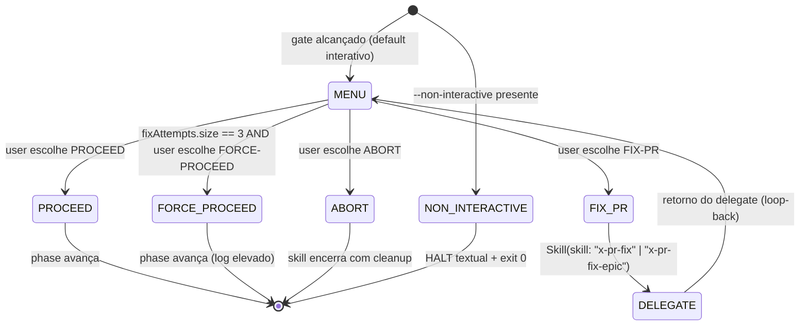

# História: Convention — ADR-0005 + Rule 20 — Interactive Gates

**ID:** story-0043-0001
**Chave Jira:** —
**Status:** Pendente

## 1. Dependências

| Blocked By | Blocks |
| :--- | :--- |
| — | story-0043-0002, story-0043-0003, story-0043-0004, story-0043-0005, story-0043-0006 |

> História fundacional: publica o contrato que as demais retrofits seguem. Deve ser merged antes de qualquer retrofit.

## 2. Regras Transversais Aplicáveis

| ID | Título |
| :--- | :--- |
| RULE-001 | Source-of-Truth Invariant |
| RULE-002 | Fixed-Option Menu Canônico |
| RULE-003 | Default Interactive, Opt-out via `--non-interactive` |
| RULE-004 | FIX-PR Loop-Back Obrigatório |
| RULE-005 | Rule 13 Invocation Patterns |
| RULE-007 | State File Schema Uniforme |
| RULE-008 | Audit Enforcement |

## 3. Descrição

Como **engenheiro operando skills orquestradoras** (x-release, x-story-implement, x-epic-implement, x-review-pr), eu quero uma convenção formal de gates interativos — publicada como ADR e regra de projeto — para que cada gate tenha o MESMO shape (3 opções canônicas, loop-back após fix, state persistente) e eu não precise lembrar comandos de retomada nem convenções diferentes por skill.

Hoje o padrão é misto: `x-release` tem `AskUserQuestion` estruturado apenas sob `--interactive`; `x-story-implement` sob `--manual-task-approval` / `--manual-contract-approval`; `x-epic-implement` sob `--manual-batch-approval`. O default em todos é um HALT textual que descreve próximos passos e exige o operador memorizar flags de retomada. Esta história cria o contrato que elimina essa variabilidade: publica o ADR-0005 (racional, trade-offs, alternativas) e a Rule 20 (regra normativa com audit command), e fica publicamente referenciado em CLAUDE.md para servir de gate de aceitação nas retrofits subsequentes.

### 3.1 ADR-0005 — Interactive Gates Convention

**Arquivo:** `adr/ADR-0005-interactive-gates-convention.md`

Estrutura seguindo template padrão de ADR existente (ver `adr/ADR-0002-skill-delegation-protocol.md`):

- **Status:** Accepted | 2026-04-16 | Eder Celeste Nunes Junior
- **Context:** inventário dos gates existentes, inconsistência atual, custo cognitivo do operador, incidente do release v3.6.0 (PR #392)
- **Decision:** 3 opções canônicas (`PROCEED`, `FIX-PR`, `ABORT`); loop-back após FIX-PR; default interativo + `--non-interactive` para CI; state file schema uniforme; glossário dos labels/headers usados por `AskUserQuestion`
- **Consequences:**
  - Positivas: UX uniforme; eliminação de flags opt-in; auditável por grep
  - Negativas: trabalho de migração dispersado em 4 skills; breaking change para scripts que dependiam do HALT textual (mitigado com `--non-interactive`)
- **Alternatives considered:** menu por-skill (rejeitado — fragmenta); manter HALT + opt-in (rejeitado — custo cognitivo não se paga); 5+ opções (rejeitado — análise mostrou que tudo cabe em PROCEED/FIX-PR/ABORT; `FORCE-PROCEED` emergencial só aparece após 3 fixes consecutivos)
- **References:** Rule 13, Rule 20 (criada nesta story), EPIC-0039 prior art, EPIC-0042 para estilo

### 3.2 Rule 20 — Interactive Gates

**Arquivo source:** `java/src/main/resources/targets/claude/rules/20-interactive-gates.md`
**Arquivo gerado:** `.claude/rules/20-interactive-gates.md` (via `mvn process-resources`)

Segue estilo da Rule 13 (`13-skill-invocation-protocol.md`): sem frontmatter, organizada em **Scope**, **Permitted Patterns (3 opções canônicas com example blocks)**, **Forbidden (HALT textual aberto, flags opt-in antigas)**, **Audit Command** com comando grep executável + resultado esperado (0 matches), **Rationale** citando o incidente do release v3.6.0 + EPIC-0039 prior art.

Seções obrigatórias:

1. **Rule** — statement imperativo de 2 parágrafos
2. **Scope** — quais SKILL.md precisam seguir (orquestradoras com halt interativo; exceções: `x-code-*`, `x-test-*`, `x-git-*`)
3. **Canonical Option Menu** — tabela mostrando header/label/description/next-action das 3 opções
4. **State File Schema** — JSON Schema canônico (referenciado pelas 4 retrofits)
5. **Default Behavior** — menu sempre exibido; `--non-interactive` é opt-out
6. **FIX-PR Loop-Back** — Pattern 1 INLINE-SKILL com `x-pr-fix` / `x-pr-fix-epic`; limite de 3 fixes consecutivos; 4ª opção emergencial `FORCE-PROCEED`
7. **Deprecation of Opt-in Flags** — tabela de mapeamento `--interactive`/`--manual-*` → `--non-interactive`
8. **Forbidden** — bulletlist
9. **Audit Command** — grep executável; `grep -rnE "HALT" java/src/main/resources/targets/claude/skills/core/ --include=SKILL.md` excluindo linhas com `AskUserQuestion` no mesmo bloco; segundo grep para flags depreciadas
10. **Rationale** — 2 parágrafos, cita release v3.6.0

### 3.3 Integração com o projeto

- CLAUDE.md bloco "In progress" ganha linha "EPIC-0043 (Interactive Gates Convention)" enquanto o épico não fecha
- `.claude/rules/README.md` tabela atualizada: linha `| 20 | 20-interactive-gates.md | interactive gates |`
- Nenhuma retrofit de SKILL.md nesta story (escopo só do ADR + rule + docs)

## 3.5 Entrega de Valor

- **Valor Principal:** Contrato único e auditável desbloqueia 4 retrofits paralelas sem coordenação cross-skill; remove de cada retrofit a necessidade de re-inventar shape de menu.
- **Métrica de Sucesso:** ADR + Rule merged e linkados; grep audit documentado e reproduzível; CLAUDE.md atualizado.
- **Impacto no Negócio:** Elimina custo cognitivo do operador (sem mais "qual o comando de retomada mesmo?"); reduz risco de PR com fix manual perdido entre sessões.

## 4. Definições de Qualidade Locais

### DoR Local (Definition of Ready)

- [ ] Próximo slot de rule confirmado em `.claude/rules/` — slot 20 (13 ocupado, 14 ocupado, 15–19 ocupados; 10/11/12 reservados para condicionais)
- [ ] Próximo número de ADR confirmado — ADR-0005 (0001–0004 publicados; não há ADR-0001-hexagonal que contaria como 1 em numeração separada)
- [ ] Template de ADR localizado em `adr/_TEMPLATE-ADR.md`
- [ ] Bloco `## Audit Command` da Rule 13 lido e estilo replicado

### DoD Local (Definition of Done)

- [ ] `adr/ADR-0005-interactive-gates-convention.md` criado, status Accepted, 2026-04-16
- [ ] `java/src/main/resources/targets/claude/rules/20-interactive-gates.md` criado com 10 seções obrigatórias
- [ ] `mvn process-resources` regenera `.claude/rules/20-interactive-gates.md` byte-idêntico
- [ ] `java/src/test/resources/golden/claude/rules/20-interactive-gates.md` criado e golden-diff test verde
- [ ] `RuleAssemblerTest.listRules_includesInteractiveGates` adicionado e verde
- [ ] CLAUDE.md "In progress" atualizado com linha EPIC-0043
- [ ] `.claude/rules/README.md` regenerado com linha slot 20
- [ ] CHANGELOG Unreleased: `### Added - Rule 20 (Interactive Gates Convention) + ADR-0005`
- [ ] Audit command do §Audit Command executável em terminal limpo e retornando 0 matches inicialmente (nenhuma retrofit ainda — a Rule 20 descreve como será enforçada, mas o baseline ainda tem HALT textual; por isso o audit aqui é DOCUMENTADO, não EXECUTADO — a execução real em CI vem na story-0043-0006)

### Global Definition of Done (DoD)

- **Cobertura:** não aplicável (sem helper Java novo além do RuleAssemblerTest)
- **Testes Automatizados:** golden diff de `.claude/rules/20-interactive-gates.md` + `RuleAssemblerTest.listRules_includesInteractiveGates`
- **Relatório de Cobertura:** JaCoCo (agregado; sem alteração material)
- **Documentação:** ADR-0005; Rule 20; CLAUDE.md; CHANGELOG
- **Persistência:** schema canônico documentado em §3.2 da Rule 20; consumido pelas stories subsequentes
- **Performance:** não aplica (apenas documentação)

## 5. Contratos de Dados (Data Contract)

> Esta story não introduz contratos externos. Define o **schema canônico de state file** que será consumido pelas 4 retrofits.

### 5.1 State File Schema (canônico)

| Campo | Tipo | M/O | Validações | Exemplo |
| :--- | :--- | :--- | :--- | :--- |
| `phase` | `String` | M | valor da skill-specific phase machine | `"APPROVAL_PENDING"` |
| `lastPhaseCompletedAt` | `String` (ISO-8601) | M | UTC | `"2026-04-16T14:32:10Z"` |
| `lastGateDecision` | `Enum` | O (presente após 1ª interação) | `PROCEED` \| `FIX_PR` \| `ABORT` \| `FORCE_PROCEED` | `"FIX_PR"` |
| `fixAttempts` | `List<FixAttempt>` | O (vazia se nunca fixou) | ≤ 3 items antes de FORCE-PROCEED aparecer | `[{at: "...", delegateSkill: "x-pr-fix", prNumber: 392, outcome: "applied"}]` |
| `schemaVersion` | `String` | M | literal `"1.0"` | `"1.0"` |

**Sub-objeto `FixAttempt`:**

| Campo | Tipo | M/O | Validações | Exemplo |
| :--- | :--- | :--- | :--- | :--- |
| `at` | `String` (ISO-8601) | M | UTC | `"2026-04-16T14:33:05Z"` |
| `delegateSkill` | `String` | M | `"x-pr-fix"` \| `"x-pr-fix-epic"` | `"x-pr-fix"` |
| `prNumber` | `Integer` | M (para gates de PR único) | > 0 | `392` |
| `outcome` | `Enum` | M | `applied` \| `no_comments` \| `compile_regression` \| `aborted` | `"applied"` |

### 5.2 AskUserQuestion Glossary (canônico)

| Opção canônica | `header` (≤12 chars) | `label` (1–5 words) | `description` |
| :--- | :--- | :--- | :--- |
| PROCEED | `"Proceed"` | `"PR merged, continue (Recommended)"` | `"Retoma phases subsequentes assumindo pré-condições humanas cumpridas (merge, CI verde, aprovação coletada)"` |
| FIX-PR | `"Fix PR"` | `"Run x-pr-fix and retry"` | `"Invoca x-pr-fix no PR atual; ao retornar, reapresenta este menu"` |
| ABORT | `"Abort"` | `"Cancel the operation"` | `"Encerra a skill com cleanup; confirmação dupla para release/epic gates"` |
| FORCE-PROCEED (emergencial) | `"Force"` | `"Force-proceed (skip fix loop)"` | `"Só aparece após 3 FIX-PR consecutivos; pula o loop e avança sob responsabilidade humana (registrado no state file)"` |

### 5.3 Error Codes (introduzidos pela Rule 20)

| Código | Condição | Mensagem (pt-BR) |
| :--- | :--- | :--- |
| `GATE_SCHEMA_INVALID` | state file não satisfaz §5.1 | `"State file inválido para gate em {path}: {campo} ausente ou mal-formado"` |
| `GATE_FIX_LOOP_EXCEEDED` | 3 FIX-PR consecutivos sem resolução | `"Loop de fix excedeu 3 tentativas; apresentando opção FORCE-PROCEED"` |

### 5.4 Event Schema

> Não se aplica.

## 6. Diagramas

### 6.1 Máquina de Decisão do Gate (canônica)



## 7. Critérios de Aceite (Gherkin)

```gherkin
Cenario: Degenerate - Rule 20 publicada sem conteudo proibido
  DADO a Rule 20 foi criada
  QUANDO rodo o audit command documentado em sua secao Audit Command
  ENTAO zero matches para HALT textual em SKILL.md com AskUserQuestion ausente
  E zero matches para uso de --interactive / --manual-* em code paths fora de Triggers/Examples
  NOTA o baseline ainda tem HALT; audit real so vira verde apos retrofits

Cenario: Happy path - ADR e Rule linkados em CLAUDE.md
  DADO ADR-0005 criado e Rule 20 criada
  QUANDO CLAUDE.md e inspecionado
  ENTAO bloco "In progress" contem linha "EPIC-0043 (Interactive Gates Convention)"
  E .claude/rules/README.md contem linha `| 20 | 20-interactive-gates.md | interactive gates |`
  E CHANGELOG Unreleased contem entrada Added da Rule 20 + ADR-0005

Cenario: Error - regerar com Rule 20 ausente
  DADO a Rule 20 source foi removida acidentalmente
  QUANDO executo `mvn process-resources`
  ENTAO RuleAssemblerTest.listRules_includesInteractiveGates falha
  E o build aborta com mensagem explicita apontando ausencia de 20-interactive-gates.md

Cenario: Boundary - schema state file respeitado
  DADO o schema canonico da secao 5.1 publicado em Rule 20
  QUANDO uma retrofit futura persiste state file
  ENTAO os 5 campos obrigatorios (phase, lastPhaseCompletedAt, lastGateDecision, fixAttempts, schemaVersion) sao verificaveis por grep ou jq
  E schemaVersion igual a "1.0"
```

### 7.1 Scenario Ordering (TPP)

Degenerate (audit doc) → Happy (links cruzados) → Error (rule ausente) → Boundary (schema state).

### 7.2 Mandatory Scenario Categories

- [x] Degenerate cases
- [x] Happy path
- [x] Error paths
- [x] Boundary values

### 7.3 TDD Implementation Notes

- Acceptance test: golden diff de `.claude/rules/20-interactive-gates.md` (conteúdo byte-idêntico ao source) + `RuleAssemblerTest.listRules_includesInteractiveGates`.
- Complementar: verificação manual dos 3 links cruzados (CLAUDE.md, README.md das rules, CHANGELOG).

## 8. Tasks

### TASK-0043-0001-001: Criar `adr/ADR-0005-interactive-gates-convention.md`

- **Layer:** Doc
- **Test Type:** Verification
- **Size:** M
- **Dependencies:** —
- **Branch:** `feat/task-0043-0001-001-adr-0005`
- **Testability:** INDEPENDENT
- **Inputs:**
  - Template em `adr/_TEMPLATE-ADR.md`
  - Plano aprovado em `~/.claude/plans/quiet-humming-willow.md`
  - Prior art em `adr/ADR-0002-skill-delegation-protocol.md`
- **Outputs:**
  - Arquivo `adr/ADR-0005-interactive-gates-convention.md` existe (verificação: `test -f adr/ADR-0005-interactive-gates-convention.md`)
  - Arquivo contém seção `## Status` com valor `Accepted` (verificação: `grep -q "^## Status" adr/ADR-0005-*.md && grep -qE "Accepted.*2026-04-16" adr/ADR-0005-*.md`)
- **Acceptance Criteria:**
  - [ ] ADR segue template de `_TEMPLATE-ADR.md` (Status, Context, Decision, Consequences, Alternatives, References)
  - [ ] §Decision descreve 3 opções canônicas + loop-back + default interativo + schema uniforme
  - [ ] §Alternatives documenta 3 opções rejeitadas com rationale
  - [ ] §References linka Rule 13, Rule 20, EPIC-0039, EPIC-0042

### TASK-0043-0001-002: Criar `java/src/main/resources/targets/claude/rules/20-interactive-gates.md`

- **Layer:** Doc (source-of-truth)
- **Test Type:** Verification
- **Size:** L
- **Dependencies:** TASK-0043-0001-001
- **Branch:** `feat/task-0043-0001-002-rule-20`
- **Testability:** INDEPENDENT
- **Inputs:**
  - ADR-0005 (referenciado em §Rationale)
  - Rule 13 (`java/src/main/resources/targets/claude/rules/13-skill-invocation-protocol.md`) como template de estilo
- **Outputs:**
  - Arquivo `java/src/main/resources/targets/claude/rules/20-interactive-gates.md` existe e tem 10 seções obrigatórias (verificação: `grep -cE "^## " java/src/main/resources/targets/claude/rules/20-interactive-gates.md` retorna ≥ 10)
  - Audit Command executável (verificação: `bash -c "$(awk '/^## Audit Command/,/^## Rationale/' java/src/main/resources/targets/claude/rules/20-interactive-gates.md | grep -oE 'grep [^\`]+')"` retorna exit 0 ou 1 sem crash)
- **Acceptance Criteria:**
  - [ ] Seções Rule / Scope / Canonical Option Menu / State File Schema / Default Behavior / FIX-PR Loop-Back / Deprecation of Opt-in Flags / Forbidden / Audit Command / Rationale todas presentes
  - [ ] Canonical Option Menu renderiza tabela das 3+1 opções com header/label/description
  - [ ] State File Schema casa byte-a-byte com §5.1 desta story
  - [ ] Audit Command executa zero-hit em skills não-retrofitadas onde AskUserQuestion já existe (prior art `x-release` Phase 8 sob `--interactive`)

### TASK-0043-0001-003: Regenerar `.claude/rules/20-interactive-gates.md` + golden

- **Layer:** Test
- **Test Type:** Verification
- **Size:** S
- **Dependencies:** TASK-0043-0001-002
- **Branch:** `feat/task-0043-0001-003-regen-rule-20`
- **Testability:** INDEPENDENT
- **Inputs:**
  - Source da Rule 20 (TASK-0043-0001-002)
  - Bloco canônico de regen em `README.md:810-818` (por RULE-001)
- **Outputs:**
  - Arquivo `.claude/rules/20-interactive-gates.md` existe e é byte-idêntico ao source (verificação: `diff -q .claude/rules/20-interactive-gates.md java/src/main/resources/targets/claude/rules/20-interactive-gates.md` retorna 0)
  - Arquivo `java/src/test/resources/golden/claude/rules/20-interactive-gates.md` criado (verificação: `test -f java/src/test/resources/golden/claude/rules/20-interactive-gates.md`)
- **Acceptance Criteria:**
  - [ ] `mvn process-resources` regenera `.claude/rules/20-interactive-gates.md`
  - [ ] Golden regenerado via comando canônico (`README.md:810-818`)
  - [ ] `mvn test -Dtest=*GoldenDiff*` verde

### TASK-0043-0001-004: Adicionar `RuleAssemblerTest.listRules_includesInteractiveGates`

- **Layer:** Test
- **Test Type:** Unit
- **Size:** S
- **Dependencies:** TASK-0043-0001-003
- **Branch:** `feat/task-0043-0001-004-rule-assembler-test`
- **Testability:** INDEPENDENT
- **Inputs:**
  - Existing `RuleAssemblerTest` (localização: `java/src/test/java/**/RuleAssemblerTest.java` — a discovery exata é parte da task)
  - Rule 20 registrada em `java/src/main/resources/targets/claude/rules/`
- **Outputs:**
  - Método de teste `listRules_includesInteractiveGates` criado no mesmo arquivo (verificação: `grep -q "listRules_includesInteractiveGates" java/src/test/java/**/*.java`)
  - `mvn test -Dtest=RuleAssemblerTest` verde (verificação: exit code 0)
- **Acceptance Criteria:**
  - [ ] Teste assere que o assembler lista a Rule 20 com slot 20 e title `20-interactive-gates`
  - [ ] Teste falha com mensagem clara se a Rule 20 desaparecer do source
  - [ ] Naming segue convenção `[method]_[scenario]_[expectedBehavior]` (Rule 05)

### TASK-0043-0001-005: Atualizar CLAUDE.md, `.claude/rules/README.md`, CHANGELOG

- **Layer:** Doc
- **Test Type:** Verification
- **Size:** S
- **Dependencies:** TASK-0043-0001-003
- **Branch:** `feat/task-0043-0001-005-docs-updates`
- **Testability:** INDEPENDENT
- **Inputs:**
  - `CLAUDE.md` (bloco "In progress")
  - `.claude/rules/README.md` (tabela de rules — gerado; ajuste em source sob `java/src/main/resources/targets/claude/rules/README.md`)
  - `CHANGELOG.md` (seção Unreleased)
- **Outputs:**
  - `grep -q "EPIC-0043" CLAUDE.md` retorna 0
  - `grep -q "20-interactive-gates" java/src/main/resources/targets/claude/rules/README.md` retorna 0
  - `grep -qE "Rule 20.*ADR-0005" CHANGELOG.md` retorna 0
- **Acceptance Criteria:**
  - [ ] CLAUDE.md "In progress" contém linha `EPIC-0043 (Interactive Gates Convention) — see plans/epic-0043/`
  - [ ] `.claude/rules/README.md` contém linha `| 20 | 20-interactive-gates.md | interactive gates |` na tabela ordenada
  - [ ] CHANGELOG Unreleased contém `### Added` com `Rule 20 — Interactive Gates Convention (ADR-0005)` e link para ambos
