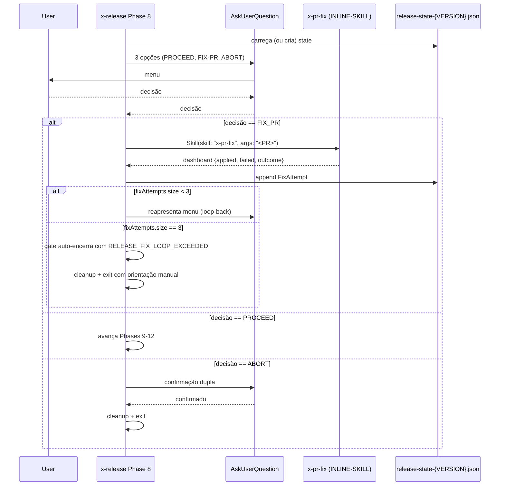

# História: Retrofit `x-release` Phase 8 APPROVAL-GATE

**ID:** story-0043-0002
**Chave Jira:** —
**Status:** Concluída

## 1. Dependências

| Blocked By | Blocks |
| :--- | :--- |
| story-0043-0001 | — |

## 2. Regras Transversais Aplicáveis

| ID | Título |
| :--- | :--- |
| RULE-001 | Source-of-Truth Invariant |
| RULE-002 | Fixed-Option Menu Canônico |
| RULE-003 | Default Interactive, Opt-out via `--non-interactive` |
| RULE-004 | FIX-PR Loop-Back Obrigatório |
| RULE-005 | Rule 13 Invocation Patterns |
| RULE-006 | Atomic, Reversible Commits |
| RULE-007 | State File Schema Uniforme |

## 3. Descrição

Como **operador executando `/x-release`**, eu quero que a Phase 8 APPROVAL-GATE sempre abra um menu estruturado (PROCEED / FIX-PR / ABORT) por default, sem que eu precise lembrar do flag `--interactive`, e que a opção FIX-PR invoque `x-pr-fix` no PR de release automaticamente e me devolva ao mesmo menu — fechando o loop sem me obrigar a sair da skill.

Hoje (v3.6.0, PR #392) a Phase 8 em modo default imprime um HALT textual descrevendo próximos passos e pede re-invocação com `/x-release X.Y.Z --continue-after-merge`. Esta história inverte o default: menu sempre aberto; `--non-interactive` é o único opt-out explícito com semântica do HALT textual atual. O handler da opção FIX-PR invoca `Skill(skill: "x-pr-fix", args: "<PR_NUMBER>")` via Rule 13 Pattern 1 e, ao retornar, reapresenta o mesmo menu. State file `plans/release-state-{VERSION}.json` ganha o campo `fixAttempts[]` e `lastGateDecision` (migração transparente — versões antigas do file sem esses campos são lidas como arrays vazios / `null`).

> **Nota crítica sobre a flag `--interactive` atual:** no source atual de `x-release` a flag `--interactive` NÃO é apenas opt-in para o `AskUserQuestion` da Phase 8 — ela controla um modo **"interactive dry-run"** pareado com `--dry-run` (sem `--dry-run`, `--interactive` aborta com código `INTERACTIVE_REQUIRES_DRYRUN`). Essa é uma semântica distinta e precede EPIC-0043. **Decisão de migração (refinada neste PR):** preservar `--interactive` com sua semântica atual de dry-run (não reaproveitar como flag de gate); a deprecação prevista neste épico aplica-se apenas às flags de gate (`--manual-*`) e a um eventual `--no-prompt` já existente. `--non-interactive` é introduzida como flag nova e dedicada ao opt-out do menu default. A STORY-0043-0002 documenta explicitamente essa separação no SKILL.md para evitar ambiguidade.

### 3.1 Localização da Mudança

- Arquivo primário: `java/src/main/resources/targets/claude/skills/core/ops/x-release/SKILL.md`
- Referência auxiliar: `java/src/main/resources/targets/claude/skills/core/ops/x-release/references/approval-gate-workflow.md`
- Pontos de inserção principais (do arquivo atual):
  - Phase 8 APPROVAL-GATE, bloco de HALT textual (linhas ~1320–1396)
  - Bloco `--interactive` (linhas ~1386–1413)

### 3.2 Comportamento Após Retrofit

- `/x-release 3.7.0` → Phase 8 sempre emite `AskUserQuestion` com 3 opções canônicas (ADR-0005, Rule 20 §Canonical Option Menu)
- `/x-release 3.7.0 --non-interactive` → comportamento idêntico ao HALT textual atual (para CI/automação) — flag nova introduzida por EPIC-0043
- `/x-release 3.7.0 --interactive --dry-run` → comportamento PRESERVADO de interactive-dry-run (pré-EPIC-0043); `--interactive` sozinho continua abortando com `INTERACTIVE_REQUIRES_DRYRUN`
- `/x-release 3.7.0 --continue-after-merge` → mantido (entrypoint para resume pós-merge via automação); semântica passa a ser `PROCEED implícito sem abrir menu`
- FIX-PR escolhido → `Skill(skill: "x-pr-fix", args: "<PR_NUMBER>")`; ao retornar, state file atualizado com novo `FixAttempt`, menu reapresenta
- 3 FIX-PR consecutivos → gate encerra automaticamente com código `RELEASE_FIX_LOOP_EXCEEDED` e orientação textual para retomada manual via `--non-interactive` ou edição do state file (nenhuma 4ª opção é adicionada ao menu — per RULE-002 total permanece 3)

### 3.3 Backward Compatibility

- State files existentes (releases 3.4/3.5/3.6) carregados sem `fixAttempts`/`lastGateDecision` — tratados como `[]` / `null`
- `--continue-after-merge` continua funcional; sua semântica passa a ser `PROCEED implícito sem abrir menu`
- Documentação `approval-gate-workflow.md` ganha diagrama atualizado; seção legada fica como "Historical Behavior (pre-EPIC-0043)"

## 3.5 Entrega de Valor

- **Valor Principal:** Release v3.7+ exige zero memória de comandos de retomada; operador responde menu e skill continua. FIX-PR vira ação de 1 clique em vez de "sair, invocar x-pr-fix, relembrar comando de resume".
- **Métrica de Sucesso:** 100% das invocações `/x-release` abrem menu estruturado por default (verificável por logs + state file `lastGateDecision` presente); zero invocações bem-sucedidas exigem o flag `--interactive` para funcionar como antes.
- **Impacto no Negócio:** Remove o gate manual mais visível (release é executado por humano ~1x/semana). Pré-condição natural para EPIC-0042 merge-train automático (train sabe usar state file uniforme).

## 4. Definições de Qualidade Locais

### DoR Local (Definition of Ready)

- [ ] Rule 20 publicada (STORY-0043-0001 merged)
- [ ] Frontmatter atual de `x-release/SKILL.md` auditado para confirmar `allowed-tools` incluindo `Skill` e `AskUserQuestion` (ajustar no patch se faltar)
- [ ] Schema atual do `release-state-{VERSION}.json` lido e diferenças para §5.1 da Rule 20 mapeadas
- [ ] Linhas aproximadas de Phase 8 no source re-validadas (o código pode ter drift em relação ao research Phase 1)

### DoD Local (Definition of Done)

- [ ] `x-release/SKILL.md` Phase 8 reescrita: menu default; `--non-interactive` documentado como flag nova de opt-out
- [ ] `--interactive` preservado com semântica atual de interactive-dry-run (não mexer); documentação explicita a distinção entre `--interactive` e `--non-interactive`
- [ ] Handler de FIX-PR usa Rule 13 Pattern 1 INLINE-SKILL `Skill(skill: "x-pr-fix", args: "<PR_NUMBER>")`
- [ ] `approval-gate-workflow.md` atualizado com diagrama Mermaid canônico da máquina de decisão (Rule 20 §6.1)
- [ ] State file schema estendido com `lastGateDecision` (sempre presente, `null` antes da 1ª interação) e `fixAttempts[]` (sempre presente, `[]` default); migração silenciosa para files antigos
- [ ] Guard-rail de 3 FIX-PR consecutivos → gate encerra com `RELEASE_FIX_LOOP_EXCEEDED` + orientação manual (nenhuma 4ª opção no menu, per RULE-002)
- [ ] Golden de `.claude/skills/x-release/SKILL.md` regenerado
- [ ] Audit Rule 13 verde (`Skill(...)` válido, zero bare-slash em delegação)
- [ ] Audit Rule 20 (publicado em story-0043-0006) aplicado parcialmente: zero HALT textual em Phase 8 sem `AskUserQuestion` emparelhado no mesmo bloco

### Global Definition of Done (DoD)

- **Cobertura:** não aplicável (nenhum helper Java novo nesta story — apenas diff de SKILL.md + reference)
- **Testes Automatizados:** golden diff do `SKILL.md`; golden diff do `approval-gate-workflow.md`
- **Relatório de Cobertura:** JaCoCo (agregado; sem alteração esperada)
- **Documentação:** diff em `x-release/SKILL.md` + `approval-gate-workflow.md`; CHANGELOG Unreleased
- **Persistência:** `release-state-{VERSION}.json` estendido com fallback para files legados
- **Performance:** não aplica (overhead é o `AskUserQuestion`, idêntico ao existente sob `--interactive`)

## 5. Contratos de Dados (Data Contract)

### 5.1 `release-state-{VERSION}.json` — Schema Estendido

| Campo | Tipo | M/O | Validações | Exemplo |
| :--- | :--- | :--- | :--- | :--- |
| `version` | `String` (SemVer) | M | — | `"3.7.0"` |
| `phase` | `String` | M | phase machine do release | `"APPROVAL_PENDING"` |
| `prUrl` | `String` | O | URL válida | `"https://github.com/.../pull/400"` |
| `prNumber` | `Integer` | O | > 0 | `400` |
| `phasesCompleted` | `List<String>` | M | — | `["DEEP_VALIDATION", "CHANGELOG", "RELEASE_COMMIT"]` |
| `lastPhaseCompletedAt` | `String` (ISO-8601) | M (novo) | UTC | `"2026-04-16T14:32:10Z"` |
| `lastGateDecision` | `Enum \| null` | M (novo) | sempre presente; `null` antes da 1ª interação; depois `PROCEED` \| `FIX_PR` \| `ABORT` | `"FIX_PR"` |
| `fixAttempts` | `List<FixAttempt>` | M (novo) | sempre presente; `[]` default; ≤ 3 items (ao atingir 3, gate encerra com `RELEASE_FIX_LOOP_EXCEEDED`) | ver Rule 20 §5.1 |
| `schemaVersion` | `String` | M (novo) | literal `"1.0"` | `"1.0"` |

### 5.2 Error Codes (introduzidos/estendidos)

| Código | Condição | Mensagem (pt-BR) |
| :--- | :--- | :--- |
| `RELEASE_FIX_LOOP_EXCEEDED` | 3 `FIX_PR` consecutivos sem `PROCEED` intermediário | `"Loop de fix excedeu 3 tentativas no release ${VERSION}; gate encerrado com ABORT automático. Retomar manualmente via --non-interactive ou edição do state file."` |
| `RELEASE_STATE_SCHEMA_LEGACY` | state file sem `schemaVersion` | `"State file ${PATH} sem schemaVersion; assumindo legacy (≤3.6.0); migrando para 1.0 em próxima escrita"` (log warn, não erro) |

### 5.3 Event Schema

> Não se aplica.

## 6. Diagramas

### 6.1 Phase 8 Comportamento Novo



## 7. Critérios de Aceite (Gherkin)

```gherkin
Cenario: Degenerate - invocacao default abre menu
  DADO release v3.7.0 em Phase 8 pela primeira vez
  E /x-release 3.7.0 invocado sem flags
  QUANDO a skill alcanca Phase 8
  ENTAO AskUserQuestion e emitido com 3 opcoes (PROCEED, FIX-PR, ABORT)
  E o texto HALT legado nao aparece em stdout
  E state file tem schemaVersion "1.0" e fixAttempts = []

Cenario: Happy path - PROCEED apos merge manual
  DADO release em Phase 8 com PR #400 aberto
  E operador fez merge manual no GitHub
  QUANDO operador seleciona PROCEED
  ENTAO lastGateDecision = "PROCEED" gravado
  E Phases 9-12 executam na sequencia
  E tag v3.7.0 e criada em main

Cenario: Happy path - FIX-PR com 1 iteracao
  DADO release em Phase 8 com PR #400 com comentarios
  QUANDO operador seleciona FIX-PR
  ENTAO Skill(skill: "x-pr-fix", args: "400") e invocado via INLINE-SKILL
  E ao retornar state file tem fixAttempts com 1 entrada {delegateSkill: "x-pr-fix", prNumber: 400}
  E menu reapresenta automaticamente
  QUANDO operador seleciona PROCEED na segunda rodada
  ENTAO Phases 9-12 executam

Cenario: Boundary - 3 FIX-PR consecutivos encerram o gate com auto-ABORT
  DADO release em Phase 8 e ja ocorreram 2 FIX-PR consecutivos
  QUANDO operador seleciona FIX-PR novamente (3a tentativa)
  ENTAO apos retorno de x-pr-fix o gate encerra automaticamente
  E log RELEASE_FIX_LOOP_EXCEEDED emitido
  E stdout contem orientacao textual para retomada manual via --non-interactive ou edicao do state file
  E menu nao e reapresentado (nenhuma 4a opcao adicionada — RULE-002)

Cenario: Error - --non-interactive mantem comportamento HALT textual
  DADO release em Phase 8 invocado com --non-interactive
  QUANDO Phase 8 executa
  ENTAO nenhum AskUserQuestion e emitido
  E HALT textual legado e impresso com instrucao "/x-release X.Y.Z --continue-after-merge"
  E skill sai com exit 0

Cenario: Boundary - --interactive preserva semantica de interactive-dry-run
  DADO release invocado com --interactive --dry-run
  QUANDO Phase 8 executa
  ENTAO comportamento de interactive-dry-run pre-EPIC-0043 e preservado
  E Phase 8 gate segue o menu default (sem interferencia da flag)
  E documentacao do SKILL.md explicita a separacao entre --interactive (dry-run) e --non-interactive (opt-out de menu)

Cenario: Error - --interactive sozinho (sem --dry-run) mantem comportamento legado
  DADO release invocado com --interactive (sem --dry-run)
  QUANDO skill valida as flags
  ENTAO skill aborta com codigo INTERACTIVE_REQUIRES_DRYRUN (comportamento pre-EPIC-0043 preservado)

Cenario: Boundary - state file legacy (sem schemaVersion) migra silenciosamente
  DADO release-state-3.6.0.json existente sem schemaVersion
  QUANDO /x-release 3.6.0 --continue-after-merge e invocado
  ENTAO log warn RELEASE_STATE_SCHEMA_LEGACY emitido
  E proxima escrita do state file inclui schemaVersion "1.0" e fixAttempts []
  E skill prossegue sem erro
```

### 7.1 Scenario Ordering (TPP)

Degenerate (menu default sem state) → Happy PROCEED → Happy FIX-PR 1x → Boundary 3x → Error `--non-interactive` → Boundary `--interactive --dry-run` → Error `--interactive` sozinho → Boundary legacy state.

### 7.2 Mandatory Scenario Categories

- [x] Degenerate cases
- [x] Happy path
- [x] Error paths
- [x] Boundary values

### 7.3 TDD Implementation Notes

- Acceptance test: golden diff de `x-release/SKILL.md` + `approval-gate-workflow.md`; assert de escopo do diff contido em Phase 8 + bloco `--interactive` legado.
- Complementar: audit Rule 13 + audit Rule 20 (quando story-0043-0006 landar).

## 8. Tasks

### TASK-0043-0002-001: Reescrever Phase 8 APPROVAL-GATE em `x-release/SKILL.md`

- **Layer:** Doc (source-of-truth SKILL.md)
- **Test Type:** Verification (golden diff)
- **Size:** L
- **Dependencies:** —
- **Branch:** `feat/task-0043-0002-001-phase-8-menu`
- **Testability:** INDEPENDENT
- **Inputs:**
  - Rule 20 + ADR-0005 (STORY-0043-0001)
  - Atual `x-release/SKILL.md` Phase 8 (~linhas 1320–1413)
  - Glossário de opções em Rule 20 §5.2
- **Outputs:**
  - Phase 8 contém bloco `AskUserQuestion` visível por `grep -n "AskUserQuestion" java/src/main/resources/targets/claude/skills/core/ops/x-release/SKILL.md` retornando ≥ 1 match na região 1320–1413
  - Bloco `--non-interactive` documentado (verificação: `grep -q "non-interactive" java/src/main/resources/targets/claude/skills/core/ops/x-release/SKILL.md` retorna 0)
  - Handler de FIX-PR usa INLINE-SKILL (verificação: `grep -qE 'Skill\(skill: "x-pr-fix"' java/src/main/resources/targets/claude/skills/core/ops/x-release/SKILL.md`)
- **Acceptance Criteria:**
  - [ ] Menu default usa 3 opções canônicas (headers/labels da Rule 20 §5.2)
  - [ ] `--non-interactive` preserva HALT textual legado para CI (flag NOVA)
  - [ ] `--interactive` preservado com semântica atual de interactive-dry-run; documentação explicita a distinção entre as duas flags
  - [ ] FIX-PR handler: Pattern 1 INLINE-SKILL com args `<PR_NUMBER>`
  - [ ] Loop-back após retorno de `x-pr-fix` documentado
  - [ ] 3 FIX-PR consecutivos → gate encerra com `RELEASE_FIX_LOOP_EXCEEDED` + orientação manual (nenhuma 4ª opção adicionada ao menu, per RULE-002)
  - [ ] Zero bare-slash em delegação (audit Rule 13 green)

### TASK-0043-0002-002: Atualizar `approval-gate-workflow.md`

- **Layer:** Doc
- **Test Type:** Verification
- **Size:** M
- **Dependencies:** TASK-0043-0002-001
- **Branch:** `feat/task-0043-0002-002-workflow-reference`
- **Testability:** INDEPENDENT
- **Inputs:**
  - Atual `approval-gate-workflow.md`
  - Diagrama Rule 20 §6.1
- **Outputs:**
  - Arquivo contém seção `## Historical Behavior (pre-EPIC-0043)` (verificação: `grep -q "Historical Behavior" java/src/main/resources/targets/claude/skills/core/ops/x-release/references/approval-gate-workflow.md`)
  - Arquivo contém diagrama Mermaid com exatamente 3 opções canônicas + branch de auto-ABORT após 3 fixes (verificação: `grep -q "RELEASE_FIX_LOOP_EXCEEDED" java/src/main/resources/targets/claude/skills/core/ops/x-release/references/approval-gate-workflow.md`)
- **Acceptance Criteria:**
  - [ ] Seção principal reescrita para comportamento novo (menu default com 3 opções fixas)
  - [ ] Seção `Historical Behavior (pre-EPIC-0043)` preservada com diagrama antigo para referência
  - [ ] Nota explícita sobre a distinção entre `--interactive` (dry-run, preservado) e `--non-interactive` (opt-out de menu, novo)
  - [ ] Link cruzado para Rule 20 e ADR-0005

### TASK-0043-0002-003: Estender schema do state file + migração silenciosa

- **Layer:** Doc (SKILL.md documenta o schema; a lógica de leitura/escrita é prompt-driven no próprio SKILL.md)
- **Test Type:** Verification
- **Size:** M
- **Dependencies:** TASK-0043-0002-001
- **Branch:** `feat/task-0043-0002-003-state-schema`
- **Testability:** REQUIRES_MOCK of TASK-0043-0001-002 (Rule 20 define o schema canônico)
- **Inputs:**
  - Rule 20 §5.1 (State File Schema)
  - Atual bloco de state-file em `x-release/SKILL.md` (Phase 8 + Resume Detection Phase 0)
- **Outputs:**
  - SKILL.md documenta campos novos `lastGateDecision`, `fixAttempts`, `schemaVersion` (verificação: `grep -q "lastGateDecision" java/src/main/resources/targets/claude/skills/core/ops/x-release/SKILL.md`)
  - Migração silenciosa documentada: log warn `RELEASE_STATE_SCHEMA_LEGACY` + default `fixAttempts = []` (verificação: `grep -q "RELEASE_STATE_SCHEMA_LEGACY" java/src/main/resources/targets/claude/skills/core/ops/x-release/SKILL.md`)
- **Acceptance Criteria:**
  - [ ] Phase 0 Resume Detection documenta leitura tolerante a schema legacy
  - [ ] Phase 8 documenta escrita com campos novos
  - [ ] Exemplo JSON no SKILL.md atualizado com os 3 campos novos

### TASK-0043-0002-004: Regenerar goldens + smoke test

- **Layer:** Test
- **Test Type:** Verification
- **Size:** S
- **Dependencies:** TASK-0043-0002-001, TASK-0043-0002-002, TASK-0043-0002-003
- **Branch:** `feat/task-0043-0002-004-regen-goldens`
- **Testability:** INDEPENDENT
- **Inputs:**
  - Source atualizado (tasks 001–003)
  - Comando canônico de regen em `README.md:810-818`
- **Outputs:**
  - `.claude/skills/x-release/SKILL.md` byte-idêntico ao source (verificação: `diff -q`)
  - Golden atualizado (verificação: `mvn test -Dtest=*GoldenDiff*` verde)
- **Acceptance Criteria:**
  - [ ] `mvn process-resources` executado sem erros
  - [ ] Golden diff test verde
  - [ ] Audit Rule 13 verde
  - [ ] Escopo do diff contido em Phase 8, bloco `--interactive` legado, seções referenciadas
