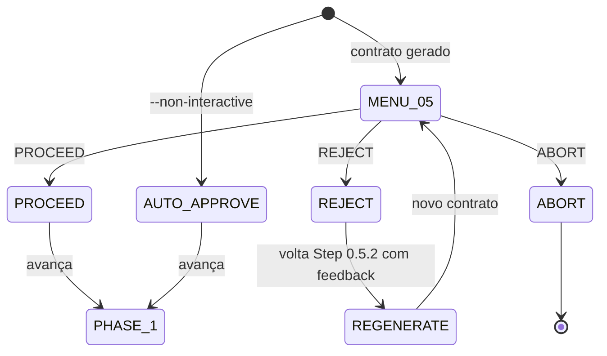
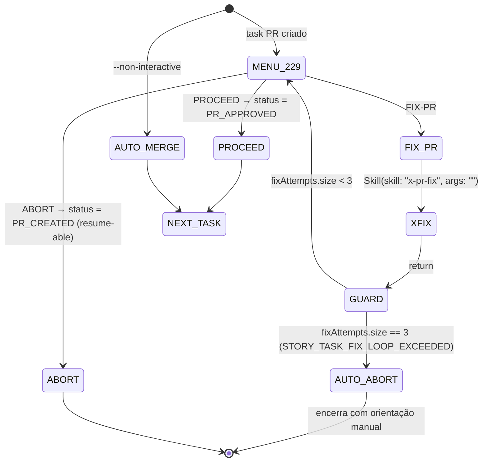

# História: Retrofit `x-story-implement` (Task PR + Contract Gates)

**ID:** story-0043-0003
**Chave Jira:** —
**Status:** Concluída

## 1. Dependências

| Blocked By | Blocks |
| :--- | :--- |
| story-0043-0001 | — |

> Paralela com story-0043-0002, 0043-0004, 0043-0005, 0043-0006 após story-0043-0001 concluir.

## 2. Regras Transversais Aplicáveis

| ID | Título |
| :--- | :--- |
| RULE-001 | Source-of-Truth Invariant |
| RULE-002 | Fixed-Option Menu Canônico |
| RULE-003 | Default Interactive, Opt-out via `--non-interactive` |
| RULE-004 | FIX-PR Loop-Back Obrigatório |
| RULE-005 | Rule 13 Invocation Patterns |
| RULE-006 | Atomic, Reversible Commits |
| RULE-007 | State File Schema Uniforme |

## 3. Descrição

Como **desenvolvedor executando `/x-story-implement`**, eu quero que os 2 gates interativos existentes (Phase 0.5 Contract Approval e Phase 2.2.9 Task PR Approval) sempre abram menu estruturado por default, sem exigir `--manual-contract-approval` / `--manual-task-approval`, e que a opção FIX-PR no gate de task PR invoque `x-pr-fix` sobre o PR da task e retorne ao mesmo menu.

Hoje os dois gates são opt-in via flags dedicadas e, quando não ativados, a skill auto-aprova silenciosamente. Essa auto-aprovação default é adequada para loops de implementação automatizada (ex.: `x-epic-implement` disparando `x-story-implement` em lote), mas empobrece o loop manual — operador perde visibilidade do contrato gerado em 0.5 e não vê o PR da task até ele já estar merged. Esta história inverte o default: menu sempre aberto para execuções humanas; novo flag `--non-interactive` (herdado de EPIC-0043) ativa auto-approve implícito para contextos orquestrados (chamadas feitas por `x-epic-implement` passam `--non-interactive` por padrão via Rule 13 args).

### 3.1 Localização das Mudanças

- Arquivo primário: `java/src/main/resources/targets/claude/skills/core/dev/x-story-implement/SKILL.md`
- Pontos de inserção (do arquivo atual):
  - Phase 0.5 — Contract Approval (~linhas 357–381)
  - Phase 2.2.9 — Task PR Approval (~linhas 804–847)

### 3.2 Comportamento Após Retrofit

**Phase 0.5 — Contract Approval:**
- Default: menu com exatamente 3 opções — PROCEED (aprova, avança Phase 1) / REJECT (retorna para Step 0.5.2 com feedback) / ABORT (encerra)
- O slot 2 usa o label `REJECT` (não `FIX-PR`) porque este gate **não tem PR associado**. Essa variante é **enumerada exaustivamente** na Rule 20 §5.2 (Glossary) como label permitido para o slot de loop-back em gates sem PR. O total de opções permanece 3 (RULE-002). Semanticamente `REJECT` e `FIX-PR` são o mesmo slot: ambos invocam regeneração/correção e reapresentam o menu.
- `--non-interactive` → auto-approve implícito se validação passou (comportamento atual)
- `--manual-contract-approval` depreciado com warning

**Phase 2.2.9 — Task PR Approval:**
- Default: menu com PROCEED (task.status = PR_APPROVED, merge auto) / FIX-PR (invoca `x-pr-fix <PR>`, loop-back) / ABORT (task.status = FAILED, aborta lifecycle)
- Nota: opção `PAUSE` legada (task.status = PR_CREATED, exit) é absorvida por ABORT com variante — ABORT em task PR gate define task.status = PR_CREATED (não FAILED) e persiste estado para resume via `--task TASK-ID`
- `--non-interactive` → auto-merge comportamento atual (usado por orquestração de `x-epic-implement`)
- `--manual-task-approval` depreciado com warning

### 3.3 Backward Compatibility

- `execution-state.json` da story ganha `lastGateDecision` e `fixAttempts[]` por task (key: `tasks[TASK-ID].lastGateDecision` e `tasks[TASK-ID].fixAttempts`)
- Legacy state files (sem campos novos) lidos como `null`/`[]`
- Chamadas de `x-epic-implement` que hoje omitem flags passam a emitir `--non-interactive` explicitamente (ajuste em EPIC-0044 ou nesta story — decidido na implementação)
- `--manual-contract-approval` e `--manual-task-approval` mantidos funcionais com warning por 2 releases

## 3.5 Entrega de Valor

- **Valor Principal:** Developer humano executando `/x-story-implement` manualmente vê contrato gerado e PR da task sem precisar lembrar flags. FIX-PR no task gate vira ação de 1 clique.
- **Métrica de Sucesso:** 100% das invocações sem `--non-interactive` mostram menu em Phase 0.5 e Phase 2.2.9; zero regressão em pipelines orquestrados via `x-epic-implement` (que usam `--non-interactive`).
- **Impacto no Negócio:** Melhora loop de desenvolvimento manual sem degradar automação de epic-level.

## 4. Definições de Qualidade Locais

### DoR Local (Definition of Ready)

- [ ] Rule 20 publicada (STORY-0043-0001 merged)
- [ ] Frontmatter de `x-story-implement/SKILL.md` confirmado com `Skill` + `AskUserQuestion` em `allowed-tools`
- [ ] Caminho de invocação de `x-epic-implement` → `x-story-implement` auditado para entender onde passar `--non-interactive`
- [ ] Linhas aproximadas de Phases 0.5 e 2.2.9 revalidadas no source (drift check)

### DoD Local (Definition of Done)

- [ ] Phase 0.5 reescrita: menu default com PROCEED/REJECT/ABORT
- [ ] Phase 2.2.9 reescrita: menu default com PROCEED/FIX-PR/ABORT
- [ ] Flag `--non-interactive` documentada e herda semântica atual de auto-approve
- [ ] Flags `--manual-contract-approval` e `--manual-task-approval` marcadas DEPRECATED com warning
- [ ] `execution-state.json` estendido com `lastGateDecision` e `fixAttempts` por task
- [ ] Chamada de `x-epic-implement` → `x-story-implement` ajustada (passa `--non-interactive` por padrão)
- [ ] Golden de `.claude/skills/x-story-implement/SKILL.md` regenerado
- [ ] Golden de `.claude/skills/x-epic-implement/SKILL.md` regenerado se houve ajuste na chamada
- [ ] Audit Rule 13 verde; audit Rule 20 parcial verde (Phase 0.5 e 2.2.9 sem HALT textual sem `AskUserQuestion` emparelhado)

### Global Definition of Done (DoD)

- **Cobertura:** não aplicável (diff de SKILL.md + pequeno ajuste no caller de `x-epic-implement`)
- **Testes Automatizados:** golden diff dos 2 SKILL.md afetados
- **Relatório de Cobertura:** JaCoCo (agregado)
- **Documentação:** diff + CHANGELOG Unreleased
- **Persistência:** `execution-state.json` com fallback legacy
- **Performance:** não aplica

## 5. Contratos de Dados (Data Contract)

### 5.1 `execution-state.json` — Schema Estendido (por task)

| Campo | Tipo | M/O | Validações | Exemplo |
| :--- | :--- | :--- | :--- | :--- |
| `tasks[TASK-ID].status` | `Enum` | M | `PR_CREATED` \| `PR_APPROVED` \| `DONE` \| `FAILED` | `"PR_APPROVED"` |
| `tasks[TASK-ID].prNumber` | `Integer` | O | > 0 | `401` |
| `tasks[TASK-ID].prUrl` | `String` | O | URL | `"https://..."` |
| `tasks[TASK-ID].lastGateDecision` | `Enum \| null` | M (novo) | sempre presente; `null` antes da 1ª interação; depois `PROCEED` \| `REJECT` \| `FIX_PR` \| `ABORT` | `"FIX_PR"` |
| `tasks[TASK-ID].fixAttempts` | `List<FixAttempt>` | O (novo, default `[]`) | ≤ 3 | ver Rule 20 §5.1 |

### 5.2 Error Codes

| Código | Condição | Mensagem (pt-BR) |
| :--- | :--- | :--- |
| `STORY_TASK_FIX_LOOP_EXCEEDED` | 3 FIX-PR consecutivos em uma task | `"Loop de fix excedeu 3 tentativas na task ${TASK_ID}; gate encerrado com ABORT automático. Retomar via --task ${TASK_ID} com --non-interactive ou edição manual do state file."` |
| `STORY_STATE_SCHEMA_LEGACY` | state file sem `tasks[*].lastGateDecision` | `"execution-state.json com schema legacy; migrando para 1.0 em próxima escrita"` |

### 5.3 Event Schema

> Não se aplica.

## 6. Diagramas

### 6.1 Phase 0.5 Contract Gate



### 6.2 Phase 2.2.9 Task PR Gate



## 7. Critérios de Aceite (Gherkin)

```gherkin
Cenario: Degenerate - execucao orquestrada com --non-interactive
  DADO /x-story-implement STORY-XXXX-YYYY --non-interactive invocado por x-epic-implement
  QUANDO Phase 0.5 alcancada
  ENTAO nenhum AskUserQuestion e emitido
  E validacao determina auto-approve (comportamento atual preservado)
  QUANDO Phase 2.2.9 alcancada
  ENTAO auto-merge executa sem menu

Cenario: Happy path - contrato aprovado manualmente
  DADO /x-story-implement STORY-XXXX-YYYY sem flags
  QUANDO Phase 0.5 alcanca gate
  ENTAO menu com 3 opcoes (PROCEED, REJECT, ABORT) e exibido
  QUANDO operador seleciona PROCEED
  ENTAO Phase 1 (Architecture Planning) inicia

Cenario: Happy path - task PR com FIX-PR
  DADO Phase 2.2.9 alcancada com task PR #401
  QUANDO operador seleciona FIX-PR
  ENTAO Skill(skill: "x-pr-fix", args: "401") e invocado
  E fixAttempts da task adquire 1 entrada
  E menu reapresenta
  QUANDO operador seleciona PROCEED
  ENTAO task.status = PR_APPROVED e fluxo avanca

Cenario: Error - --manual-task-approval deprecado
  DADO /x-story-implement STORY-XXXX-YYYY --manual-task-approval
  QUANDO skill inicia
  ENTAO warning DEPRECATED_FLAG emitido uma unica vez
  E comportamento identico ao default (menu ativado)

Cenario: Boundary - REJECT em Phase 0.5 volta ao Step 0.5.2
  DADO Phase 0.5 com menu exibido
  QUANDO operador seleciona REJECT
  ENTAO controle retorna para Step 0.5.2 com feedback textual solicitado
  E contrato e regenerado e menu reapresenta

Cenario: Boundary - ABORT em Phase 2.2.9 preserva resume
  DADO Phase 2.2.9 com task PR #401 e menu exibido
  QUANDO operador seleciona ABORT
  ENTAO task.status = PR_CREATED (nao FAILED)
  E state file persistido permitindo resume via --task TASK-XXXX-YYYY-NNN
  E skill encerra
```

### 7.1 Scenario Ordering (TPP)

Degenerate (`--non-interactive`) → Happy contract approve → Happy FIX-PR → Error deprecated flag → Boundary REJECT → Boundary ABORT resume.

### 7.2 Mandatory Scenario Categories

- [x] Degenerate cases
- [x] Happy path
- [x] Error paths
- [x] Boundary values

### 7.3 TDD Implementation Notes

- Acceptance test: golden diff de `x-story-implement/SKILL.md` (regiões Phase 0.5 e 2.2.9) + `x-epic-implement/SKILL.md` (chamadas ajustadas para passar `--non-interactive`).
- Complementar: audit Rule 13; audit Rule 20 parcial.

## 8. Tasks

### TASK-0043-0003-001: Reescrever Phase 0.5 Contract Gate

- **Layer:** Doc (SKILL.md)
- **Test Type:** Verification (golden diff)
- **Size:** M
- **Dependencies:** —
- **Branch:** `feat/task-0043-0003-001-phase-0-5-menu`
- **Testability:** INDEPENDENT
- **Inputs:**
  - Rule 20 §Canonical Option Menu
  - Atual Phase 0.5 (~linhas 357–381)
- **Outputs:**
  - `grep -n "AskUserQuestion" java/src/main/resources/targets/claude/skills/core/dev/x-story-implement/SKILL.md` retorna match em região de Phase 0.5
  - REJECT documentado como variante de loop-back (sem PR)
  - `--manual-contract-approval` marcado DEPRECATED
- **Acceptance Criteria:**
  - [ ] Menu com 3 opções PROCEED/REJECT/ABORT
  - [ ] `--non-interactive` equivalente ao auto-approve atual quando validação passa
  - [ ] `--manual-contract-approval` warning + noop

### TASK-0043-0003-002: Reescrever Phase 2.2.9 Task PR Gate

- **Layer:** Doc (SKILL.md)
- **Test Type:** Verification
- **Size:** M
- **Dependencies:** TASK-0043-0003-001
- **Branch:** `feat/task-0043-0003-002-phase-2-2-9-menu`
- **Testability:** INDEPENDENT
- **Inputs:**
  - Rule 20 §Canonical Option Menu + FIX-PR handler spec
  - Atual Phase 2.2.9 (~linhas 804–847)
- **Outputs:**
  - FIX-PR handler usa INLINE-SKILL `Skill(skill: "x-pr-fix", args: "<PR>")` (verificação: `grep -qE 'Skill\(skill: "x-pr-fix"' java/src/main/resources/targets/claude/skills/core/dev/x-story-implement/SKILL.md`)
  - ABORT semântica: `status = PR_CREATED` + resume-able
  - `--manual-task-approval` marcado DEPRECATED
- **Acceptance Criteria:**
  - [ ] Menu default com 3 opções (PROCEED/FIX-PR/ABORT)
  - [ ] Loop-back após `x-pr-fix` retornar
  - [ ] 3 fixes consecutivos → gate encerra com `STORY_TASK_FIX_LOOP_EXCEEDED` (nenhuma 4ª opção, per RULE-002)
  - [ ] Opção PAUSE legada absorvida por ABORT (estado persistido)

### TASK-0043-0003-003: Estender schema de `execution-state.json`

- **Layer:** Doc
- **Test Type:** Verification
- **Size:** S
- **Dependencies:** TASK-0043-0003-002
- **Branch:** `feat/task-0043-0003-003-state-schema`
- **Testability:** REQUIRES_MOCK of TASK-0043-0001-002 (Rule 20 §5.1)
- **Inputs:**
  - Rule 20 §5.1
  - Atual bloco de schema em `x-story-implement/SKILL.md`
- **Outputs:**
  - `grep -q "lastGateDecision" java/src/main/resources/targets/claude/skills/core/dev/x-story-implement/SKILL.md`
  - `grep -q "STORY_STATE_SCHEMA_LEGACY" java/src/main/resources/targets/claude/skills/core/dev/x-story-implement/SKILL.md`
- **Acceptance Criteria:**
  - [ ] Exemplo JSON de `execution-state.json` atualizado com campos novos
  - [ ] Migração silenciosa documentada

### TASK-0043-0003-004: Ajustar chamada em `x-epic-implement` para passar `--non-interactive`

- **Layer:** Doc (SKILL.md do x-epic-implement)
- **Test Type:** Verification
- **Size:** S
- **Dependencies:** TASK-0043-0003-002
- **Branch:** `feat/task-0043-0003-004-epic-calls-non-interactive`
- **Testability:** COALESCED with TASK-0043-0004-001 (ambas mexem em `x-epic-implement/SKILL.md`; precisam landar juntas para evitar conflito de golden regen)
- **Inputs:**
  - `x-epic-implement/SKILL.md` bloco de invocação de `x-story-implement`
- **Outputs:**
  - Invocação de `x-story-implement` em `x-epic-implement` passa `--non-interactive` (verificação: `grep -qE 'x-story-implement.*--non-interactive' java/src/main/resources/targets/claude/skills/core/dev/x-epic-implement/SKILL.md`)
- **Acceptance Criteria:**
  - [ ] Todas invocações de `x-story-implement` a partir de `x-epic-implement` passam `--non-interactive`
  - [ ] Nota explicativa no SKILL.md do `x-epic-implement` linkando Rule 20

### TASK-0043-0003-005: Regenerar goldens (x-story-implement + x-epic-implement)

- **Layer:** Test
- **Test Type:** Verification
- **Size:** S
- **Dependencies:** TASK-0043-0003-001, TASK-0043-0003-002, TASK-0043-0003-003, TASK-0043-0003-004
- **Branch:** `feat/task-0043-0003-005-regen-goldens`
- **Testability:** INDEPENDENT
- **Inputs:**
  - Sources atualizados
  - Comando canônico de regen (`README.md:810-818`)
- **Outputs:**
  - `.claude/skills/x-story-implement/SKILL.md` byte-idêntico ao source
  - `.claude/skills/x-epic-implement/SKILL.md` byte-idêntico ao source
  - `mvn test -Dtest=*GoldenDiff*` verde
- **Acceptance Criteria:**
  - [ ] Escopo do diff contido em Phase 0.5, Phase 2.2.9 e invocação de `x-story-implement`
  - [ ] Audit Rule 13 green
  - [ ] Audit Rule 20 parcial green
